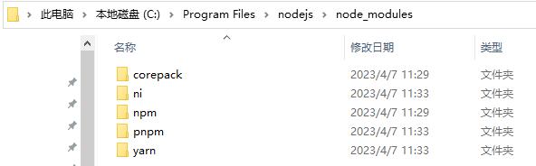
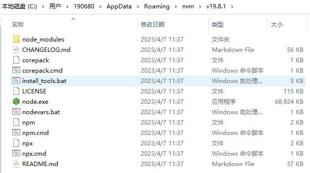

### nvm install 19.8.1 --reinstall-packages-from=current, 我使用这个命令安装新版本的node, 但不能把全局依赖同步过去, 这是什么原因?


`nvm install <version> --reinstall-packages-from=current` 命令会安装指定版本的 Node.js，并尝试将当前使用的 Node.js 版本的全局依赖迁移到新版本。但是，该命令可能会受到以下因素的影响，从而导致全局依赖无法成功迁移：

1. 全局依赖路径不同

在某些情况下，当前使用的 Node.js 版本和要安装的新版本使用的全局依赖路径可能不同，导致无法迁移全局依赖。你可以使用 `npm root -g` 命令找到当前使用的 Node.js 版本的全局依赖路径，然后确保新版本的 Node.js 使用相同的全局依赖路径。

2. 全局依赖版本不兼容

如果你的全局依赖与新版本的 Node.js 不兼容，则可能无法成功迁移全局依赖。在这种情况下，你需要手动更新全局依赖或升级全局依赖以使其与新版本的 Node.js 兼容。

3. 权限问题

在某些情况下，你可能没有足够的权限来迁移全局依赖。请确保你有足够的权限来读取和写入全局依赖路径中的文件。

如果你遇到全局依赖无法成功迁移的问题，可以尝试手动更新全局依赖，或者使用其他工具来自动迁移全局依赖，如 `npm-check-updates` 或 `npm-upgrade`。


> ```
> PS C:\Users\190680\jh_c\base\openai-translator> npm root -g
> C:\Program Files\nodejs\node_modules
> PS C:\Users\190680\jh_c\base\openai-translator> npm list -g
> C:\Program Files\nodejs -> .\
> ├── corepack@0.15.3
> ├── @antfu/ni@0.21.2
> ├── npm@9.5.0
> ├── pnpm@8.1.1
> └── yarn@1.22.19
> ```
>
> 
>
> 但是安装的新版本还是没有同步安装全局依赖
>
> 


### nvm 库中没有相应的命令处理该问题吗

是的，nvm 库提供了一些命令来管理全局依赖的安装和迁移。

当你在使用 nvm 切换到新的 Node.js 版本时，可以使用以下命令将原来版本的全局依赖自动迁移至新版本中：

```
phpCopy code
nvm reinstall-packages <version>
```

其中，`<version>` 是你需要切换到的 Node.js 版本号。执行该命令后，nvm 将自动安装新版本的 Node.js 并将原来版本的全局依赖迁移至新版本中。

你也可以使用以下命令来将原来版本的全局依赖备份到一个文件中：

```
scssCopy code
nvm ls <version> --no-alias --json | jq -r '.[] | select(.path == "/path/to/global/npm/prefix") | .name' > packages.txt
```

其中，`/path/to/global/npm/prefix` 是你原来版本的全局依赖的安装路径，`packages.txt` 是一个文件名，用来保存备份的全局依赖列表。你需要将该路径替换成你自己的全局依赖路径。

然后，你可以在新版本中使用以下命令重新安装这些依赖：

```
Copy code
xargs npm install -g < packages.txt
```

该命令将从 `packages.txt` 文件中读取全局依赖列表，并在新版本中重新安装这些依赖。