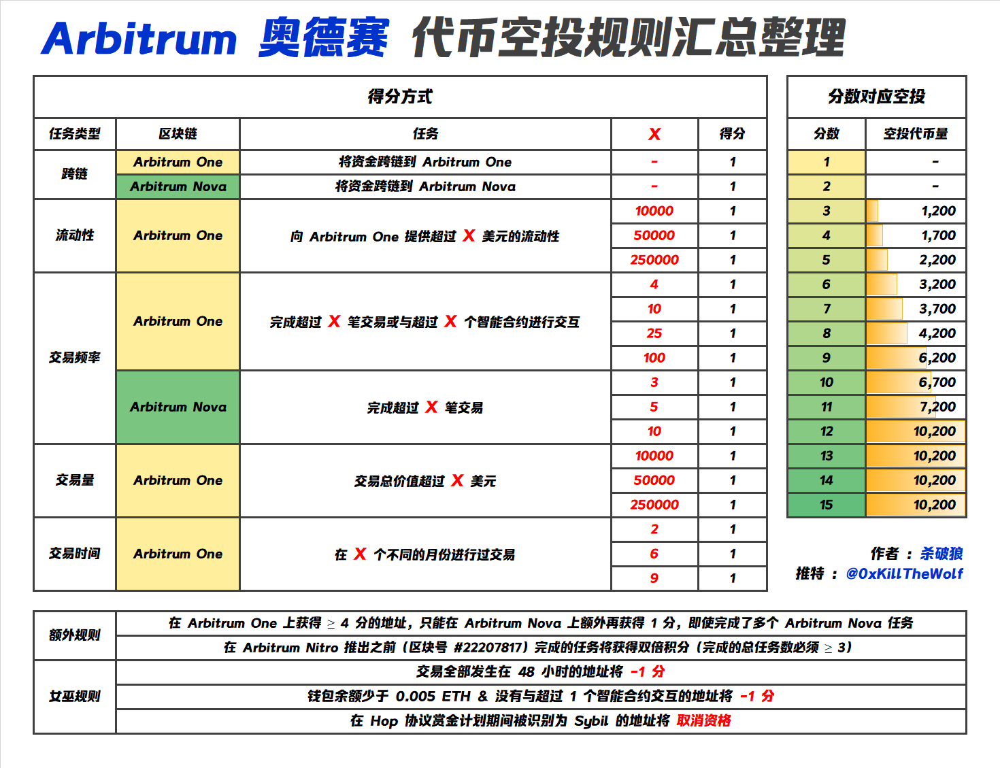

[toc]

### 你是一个加密货币投资者, 我现在是一名初次接触的门外汉, 我希望你教我如何投资

作为加密货币投资者，我很高兴能够为您提供一些有用的建议。这里有一些入门建议：

1. 了解基础知识：在你开始投资之前，建议你先学习一些基础知识，包括加密货币的历史、技术、市场和风险等方面的知识。这些知识将有助于你更好地理解市场的变化和加密货币的未来发展趋势。
2. 研究不同的加密货币：不同的加密货币有不同的特点和用途。因此，在你投资之前，你应该花时间了解不同的加密货币，比较它们的优缺点，并选择适合你的投资策略的货币。
3. 制定投资计划：在你开始投资之前，你需要制定一个清晰的投资计划，包括你的投资目标、投资金额、投资时间、风险承受能力等。这可以帮助你更好地控制你的投资风险和实现你的投资目标。
4. 寻找可靠的交易平台：在你投资之前，你需要找到一个可靠的加密货币交易平台。你需要了解交易平台的安全性、交易费用、交易流程、客户支持等方面的信息，选择最适合你的平台。
5. 分散投资：在你投资之前，你应该考虑将你的资金分散投资到多个加密货币上，这可以帮助你降低投资风险，并在市场变化时保护你的资产。
6. 保持冷静：加密货币市场是一个充满波动的市场，价格可能会在短时间内急剧波动。在你投资之前，你需要明确你的投资策略，并保持冷静，不要受到市场的情绪和短期波动的影响。

希望这些建议能够帮助你入门加密货币投资。记住，投资是有风险的，你需要谨慎对待，并始终保持头脑清醒。

### 什么是 爆仓 合约 杠杆

"爆仓"是指在交易所或其他平台上进行杠杆交易时，当你的头寸损失超过你的保证金时，你的头寸将被强制平仓，从而导致你的损失更大。例如，如果你使用10倍杠杆买入1000美元的比特币，你的初始保证金只需要100美元，但如果比特币价格下跌10%，你的头寸价值将下跌到900美元，这时你的保证金将不足以支撑你的头寸，你的头寸将被强制平仓。这种情况下，你将失去100美元的保证金和900美元的头寸价值，共计1000美元。

"合约"是指一种在交易所或其他平台上交易的衍生品，它们允许交易者以固定的合约规格和价格进行交易，而不需要实际拥有资产。加密货币衍生品合约通常是基于加密货币价格的变化，例如比特币期货或永续合约。

"杠杆"是指交易者可以使用比自己拥有的更多的资金进行交易的一种机制。例如，如果你有100美元的资金，你可以使用10倍杠杆进行交易，这意味着你可以在交易中使用1000美元的资金。这种机制可以增加你的收益，但同时也增加了你的风险，因为如果市场朝着你的不利方向移动，你可能会损失更多的资金。

### 什么是LP L1.L2

"LP"是指"流动性提供者"（Liquidity Providers）的缩写。在加密货币市场上，流动性提供者指的是为交易所或其他平台提供加密货币流动性的个人或机构。流动性提供者通常通过提供买入和卖出价之间的差价（即"买入价-卖出价"）来赚取收益，他们的流动性支撑着市场的交易活动。

"L1"和"L2"通常指的是不同层级的区块链协议。"L1"代表"第一层"，通常指的是最基本的区块链协议，如比特币或以太坊等。而"L2"代表"第二层"，通常指的是建立在第一层之上的协议和技术，如闪电网络或Rollups等。这些协议和技术旨在提高交易速度、降低交易费用和提高可扩展性，以支持更多的交易活动和更广泛的应用场景。

### L0 是什么呢

通常情况下，"L0"这个术语并不是普遍使用的术语。在某些上下文中，"L0"可以被用来描述一个系统、协议或者架构的最基本层级，是所有其他层级都建立在其之上的底层基础。在加密货币领域中，"L0"可能指代区块链技术的最基本层级，即底层的点对点网络和共识机制，如比特币或以太坊区块链的底层协议和架构。

### 参与加密货币的买卖如何实现不亏损

在加密货币的买卖中，实现不亏损是非常困难的，因为加密货币市场非常波动和不稳定，价格的波动性也很高，所以总会有一定的风险存在。不过，以下是一些可以帮助你最大限度降低风险的建议：

1. 建立明确的投资策略和风险管理计划：在投资加密货币之前，需要制定一份清晰的投资策略和风险管理计划，包括目标、预算、入市和离市策略、止损和盈利目标等。并且，你需要时刻保持冷静，遵循自己的投资策略和风险管理计划，不要轻易决策。
2. 学习技术分析和基本面分析：技术分析和基本面分析是两种常用的投资分析方法，可以帮助你了解市场趋势和价格波动的原因，有助于制定投资决策和调整风险管理计划。
3. 分散投资：不要将所有资金都投入到一个加密货币或者一个交易平台中，应该将投资资金分散到不同的加密货币和交易平台中，以分散风险。
4. 注意市场波动和风险控制：加密货币市场非常波动，价格波动幅度很大，因此需要时刻注意市场趋势和价格波动，设定合理的止损和盈利目标，严格执行风险控制策略。

总之，投资加密货币需要谨慎和理性，需要有长期的眼光和耐心，并且需要时刻注意市场风险和波动。

### 如何选择购买哪些加密货币呢

选择购买哪些加密货币是一项需要仔细考虑和评估的任务，以下是一些选择加密货币的建议：

1. 研究加密货币项目：在购买加密货币之前，需要对所选项目进行彻底的研究和分析。你需要了解项目的背景、目标、团队、技术、治理模式、社区等方面的信息，并评估项目的潜力和可行性。
2. 关注市场趋势：需要关注加密货币市场的趋势和变化，并跟踪行业新闻、市场数据和价格变动。这可以帮助你了解市场风险和机会，并制定相应的投资策略。
3. 多元化投资：不要把所有的投资都集中在一个加密货币上，应该将资金分散到多种加密货币中，这有助于分散风险。
4. 注意团队和社区：加密货币项目的团队和社区是非常重要的，需要考虑团队的经验和声誉以及社区的活跃程度和支持度。
5. 注意安全性：选择那些安全性高、稳定性好、具有良好声誉的加密货币项目进行投资，要谨慎避免那些存在安全隐患和不可信的项目。
6. 了解投资风险：在进行加密货币投资时，需要认识到风险并理解风险。应该选择适合自己风险承受能力的投资方案，同时，也需要做好应对风险的准备。

最后，建议在做出任何投资决策之前，先进行充分的研究和分析，谨慎评估投资风险和机会，并选择适合自己的加密货币项目。

### 爆仓中的概念"头寸"是什么

在交易市场中，头寸是指投资者所持有的某种资产或证券的总量。在加密货币交易中，头寸通常指持有多头或空头合约的数量。多头头寸表示投资者购买加密货币的数量，而空头头寸则表示投资者卖出加密货币的数量。

在加密货币杠杆交易中，头寸的重要性非常大，因为头寸的大小和方向决定了交易的盈亏和风险水平。投资者需要根据自己的投资策略和风险承受能力来决定自己的头寸大小和方向。如果投资者头寸过大，市场波动可能会导致爆仓，从而造成重大损失。因此，在进行加密货币交易时，控制头寸的大小和方向是非常重要的。

### 打狗群

“打狗群”一般是指加密货币投资群体中，对某个加密货币或项目进行大规模购买或宣传的行为。由于投资者在大规模买入时会推动市场价格上涨，从而吸引更多的投资者进入，形成所谓的“打狗效应”。

但是，需要注意的是，“打狗群”并不是一种可持续的投资策略。过度的宣传和大规模购买会在短期内提高加密货币价格，但往往会导致泡沫破裂和价格暴跌。因此，投资者应该根据自己的投资策略和市场情况，理性地进行投资决策，避免盲目跟风和参与“打狗群”的行为。

### 钱包安全

> [t](https://twitter.com/KuiGas/status/1645022717782134790)
>
> 丰密钱包被盗
>
> 其中被盗的7.5万个ARB价值12万刀了，心痛到抽搐，这当gas亏掉我得交互多少协议啊。 被盗原因：估计是助记词或者私钥，到目前为止我都没查清楚，所以亏友们务必注意安全，
>
> > **助记词和私钥不要随便复制**，我很小心都中招，以后大额放多签。
> >
> > 冷钱包，我已经有10几个冷钱包了，每个冷钱包放3.3eth。
> >
> > > **多签钱包（Multisignature Wallet）**，也称为多重签名钱包，是一种需要多个密钥进行签名才能完成交易的钱包。通常情况下，多签钱包需要设置一个最小签名数量，只有达到这个数量的签名，交易才能得以执行。
> > >
> > > 多签钱包通常由多个用户或实体共同管理，以提高资金的安全性和保障。例如，一个公司可以将其资产存放在一个多签钱包中，需要至少两名高管同时签署才能完成资金转移。这样，即使一名高管的账户被盗或被黑客攻击，也不会导致资金流失。
> > >
> > > 多签钱包可以应用于各种加密货币交易，包括交易所、钱包、合约等，是一种相对安全的钱包类型，能够为用户提供更高的安全保障。

储存私钥小技巧: 复制私钥时，留一个至三个单词不复制，粘贴后再手动输入。 手动输入的单词输入一至三个替换的**假**单词 (从词库中取出)，自己记好固定的位置，真的分开储存。这样私钥丢了也没事。

[助记词库](https://tested-ocarina-8f8.notion.site/cbd0e9f93f4e44928f9a420af7df7229)

### 加密货币IDO

IDO是Initial **DEX** Offering的缩写，是一种在去中心化交易所（DEX）上进行的**首次代币发行**模式。与传统的IPO（Initial Public Offering）相似，但是IDO更加去中心化和开放。

在IDO中，项目团队会在一个或多个DEX平台上进行代币发行，并与流动性提供者和投资者合作，通过提供代币交易对的流动性和资本来推动代币价格。IDO的主要优势在于去中心化和开放性，投资者可以在早期获得项目代币，并且流动性和价格由市场自由决定。

在参加IDO之前，投资者通常需要通过一些方式获得该DEX平台的代币或通证，这些通证可能会用于投票或参与平台的治理。此外，由于IDO通常在去中心化的平台上进行，因此需要使用相应的钱包和密钥来进行交易和参与。

### deposite

Deposite 一般指的是把资产**存**入某个平台、交易所或钱包等的行为。在加密货币领域中，deposite 通常是指将一种数字货币（如比特币、以太坊等）存入交易所或钱包的操作，以便进行交易或其他操作。对于某些加密货币，例如稳定币，还可以通过将法定货币兑换成数字货币的方式进行充值。一旦充值成功，该数字货币就会显示在用户的账户余额中，可以用于交易或提现等操作。

### 钱包的网络是什么意思, 什么叫跨链

钱包的网络指的是钱包所支持的区块链网络，每个区块链网络都有自己的独立性，包括底层技术和协议，因此钱包需要根据所支持的网络类型进行相应的配置和管理，以保证交易的顺利进行。

跨链是指不同区块链之间的互操作性，使得**资产可以在不同的区块链之间自由流通**，例如将以太坊上的代币转移到比特币网络上，或者将比特币转移到波卡网络上。实现跨链需要特定的技术支持，包括原子交换、中继链、侧链等。跨链技术的发展可以提高区块链网络的互操作性和整体价值，也有助于降低区块链网络之间的壁垒。

### 加密货币跨链是什么

加密货币跨链是指不同区块链之间的连接和通信，让它们能够交换价值和信息。由于每个区块链都有自己的特定协议和算法，因此不同的区块链之间不能直接进行交互和通信。跨链技术可以帮助解决这个问题，使得不同区块链之间可以进行资产和信息的转移和交换。常见的跨链技术包括原子交换（Atomic Swap）、中继链（Relay Chain）、侧链（Sidechain）等。跨链技术对于整个加密货币生态系统的发展和互通性至关重要。

### 跨链需要消耗gas吗, 如果钱包里没有资金能跨吗

跨链交易通常需要消耗一定数量的燃气（gas），这是因为跨链交易需要涉及多个链的交互，需要进行一系列的计算和验证过程。

如果在钱包中没有足够的资金，就无法进行跨链交易。因为在进行跨链交易时，需要支付跨链交易的手续费，如果没有足够的资金来支付手续费，就无法完成跨链交易。

### 如何从交易所转账到钱包

转账从交易所到钱包通常需要以下步骤：

1. 打开您的加密货币钱包，并获得您的接收地址。
2. 在交易所中，找到您想要提取的加密货币，点击“提现”或“提币”选项。
3. 在提款选项中，输入您的接收地址和提款金额。
4. 确认提款细节，包括任何手续费和提款地址。
5. 如果您的提款请求需要经过电子邮件或手机验证，按照提示操作，直到您的提款请求被确认。
6. 等待交易所处理您的提款请求，通常需要几分钟到几个小时不等，具体时间取决于交易所的流量和手续费设置。
7. 一旦提款请求被确认，您将收到交易所发出的电子邮件或短信通知。
8. 检查您的钱包余额，以确保已经收到您的加密货币。

请注意，不同的加密货币交易所和钱包可能会有不同的操作步骤和细节，因此请确保您在进行任何操作之前了解相关的细节和要求。

## 基于杀破狼的图片进行提问

### 区块链 arbtrum one跟arbturm nova 有什么不一样

Arbitrum One 和 Arbitrum Nova 都是 Arbitrum 网络的不同版本，主要区别在于它们的目标用户不同。

Arbitrum One 是一个公共区块链网络，主要面向广大的开发者和用户，可以通过 MetaMask 等钱包进行访问。它使用 Optimistic Rollup 技术来实现高效的扩展性，可以支持高达 2000TPS 的交易处理，同时还具备较低的交易费用和快速的交易确认时间。

Arbitrum Nova 则是针对企业和机构用户的私有区块链解决方案，可以在现有的以太坊网络上进行部署，为用户提供高度可定制化的区块链服务。它也采用了 Optimistic Rollup 技术来实现高效的扩展性，并提供了更加灵活的权限控制和管理机制。

总的来说，Arbitrum One 更适合广大的开发者和用户，而 Arbitrum Nova 则更适合企业和机构用户，提供了更多的定制化和管理选项

### 什么叫流动性

在金融领域，流动性是指资产可以在短时间内以市场价格变现的程度。具有高流动性的资产可以很容易地转换成现金，而低流动性的资产则需要花费更长时间和更高的成本才能变现。在加密货币领域，流动性通常指交易所或其他平台上可用的数字资产的数量和价格变化的频率。高流动性通常意味着有足够的买家和卖家，以及资产的价格在较短时间内变化不大，从而使得交易更加容易和快速。

#### 如何在加密货币向区块链提供流动性

在加密货币领域，为了提供流动性，可以使用一些流动性协议和平台，如Uniswap、PancakeSwap、SushiSwap等**去中心化交易平台（DEX）**。这些平台的基本原理是将各种代币存储在流动性池中，通过算法自动调整交易**价格**和池子的代币比例来实现交易。

对于提供流动性的用户，他们需要将代币存入流动性池中，并获得流动性代币，以便在之后将这些代币取出。在这个过程中，提供者可以获得交易手续费和代币奖励。当用户需要从池子中提取代币时，他们需要支付一定的流动性提供者费用。这样可以在市场上形成动态的交易价格和流动性，为用户提供更好的交易体验。

此外，还有一些**其他的提供流动性的方法**，如借贷平台、稳定币发行平台等。这些平台的基本原理也是类似的，通过将代币质押在平台上，以获取利息或奖励，并提供流动性来满足用户的需求。

### 将各种代币存储在流动性池中有什么作用?

将各种代币存储在流动性池中的主要作用是提供交易对的流动性。流动性池是由两种代币组成的资产池，通常由交易者提供资金，并通过交易所提供的市场交易来实现价格发现。这些资产池通常由算法进行管理，以确保池中的资产保持平衡，并根据需求进行调整。

通过将代币存储在流动性池中，交易者可以快速进行交易，而无需等待市场的购买或出售订单。此外，流动性池还可以通过提供奖励机制，吸引更多的交易者加入，进一步增加流动性。

总之，将各种代币存储在流动性池中可以帮助提高交易对的流动性，从而提高市场效率和交易速度。

### 钱包如何与智能合约进行交互

钱包可以通过与智能合约交互来进行区块链上的转账、存储和管理代币等操作。下面是一些常见的方法：

1. 使用钱包中的智能合约交互功能：有些钱包会内置智能合约交互功能，允许用户直接在钱包中与智能合约进行交互。通常需要输入智能合约地址、函数名称、参数等信息，然后发送交易即可。
2. 使用 Web3.js/Web3.py：Web3.js/Web3.py是以太坊的官方 JavaScript/Python 库，可以用于与以太坊网络进行交互。通过 Web3.js/Web3.py，钱包可以使用以太坊的 JSON-RPC API 调用智能合约的方法。
3. 使用 Etherscan 等区块链浏览器：Etherscan 等区块链浏览器提供了一个便捷的方式来查看智能合约的源代码、交易历史和合约地址等信息。此外，一些区块链浏览器还提供了与智能合约交互的功能，允许用户输入参数并发送交易。
4. 使用 DApp：DApp 是基于区块链技术的去中心化应用程序。通过使用 DApp，用户可以与智能合约进行交互，执行各种操作，例如转账、存储和管理代币等。许多钱包都内置了 DApp 浏览器，使用户能够方便地访问 DApp 并进行交互。

无论使用哪种方法，**钱包与智能合约的交互都需要用户签名交易并支付一定的交易费用**（通常以以太币或代币的形式支付）。

### 从交易所转出加密货币到钱包时, 选择的加密货币种类是不是就决定钱包的网络

选择的**加密货币种类通常与转账时选择的网络相关联**。例如，如果您从以太坊交易所转出以太坊代币（如ERC-20代币），则您需要将这些代币发送到以太坊网络上的钱包地址。类似地，如果您从Binance Smart Chain交易所转出BEP-20代币，则需要将这些代币发送到Binance Smart Chain网络上的钱包地址。因此，您在转账时选择的加密货币种类决定了钱包所在的网络

### K线图中的针代表了什么

在 K 线图中，针（Wick 或 Shadow）代表了价格波动的范围，它连接了蜡烛的实体和蜡烛的上下端。它显示了在一个交易周期内，股票或加密货币的价格所达到的最高点和最低点，同时也反映了价格的波动范围。一般来说，长针表示价格波动大，短针则表示价格波动小。在某些情况下，针可能会比蜡烛实体更长，这表示价格波动非常大，并且市场上出现了强烈的买卖力量。

### https://defillama.com/ 这个网址有什么用

https://defillama.com/ 是一个聚合了多个 DeFi（去中心化金融）项目的数据分析平台。该平台提供了实时的 DeFi 生态系统数据，包括总锁定价值、24小时交易量、借贷利率、流动性挖矿收益率等信息，帮助用户更好地了解和分析 DeFi 市场的动态和趋势。此外，该平台还提供了项目排名、交易所排名、币种排名等功能，方便用户进行数据比较和项目筛选。综上所述，DefiLlama 可以帮助用户更好地了解和分析 DeFi 市场，同时也为 DeFi 项目方提供了更多曝光和机会。

### 加密货币质押是什么意思 TVL 指标

加密货币质押是指将自己的加密货币资产锁定在一个智能合约中，以便为该平台提供流动性或安全性。通常情况下，质押代币将获得平台代币或收益作为奖励。

TVL（Total Value Locked）是一种用于衡量一个去中心化金融（DeFi）平台上总质押价值的指标。TVL包括所有已经被锁定在该平台上的代币价值。TVL的大小通常被视为一个DeFi项目的成功度量标准。