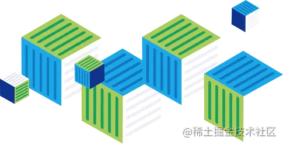
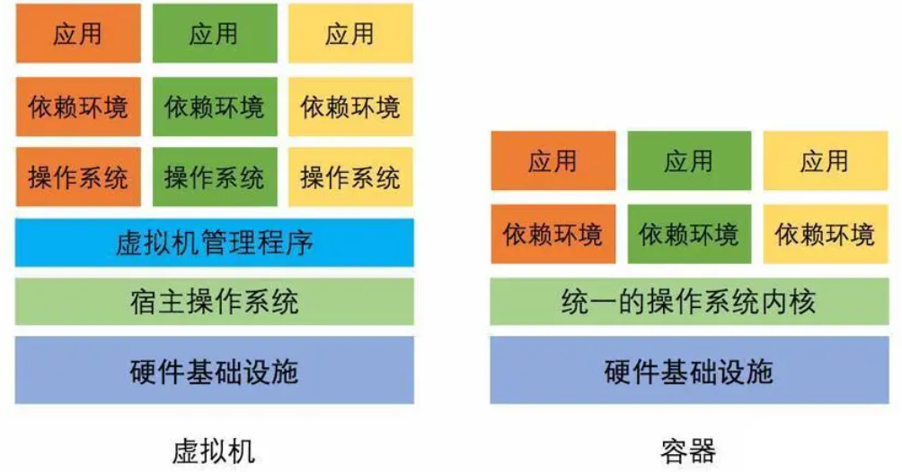

[toc]

# 浅谈虚拟化和容器技术

Docker 是一款以**容器虚拟化**技术为基础的软件

## 虚拟化技术

用简单的语句来阐述虚拟化技术的话，那么可以这么解释：

> 虚拟化技术是一种将**计算机物理资源**进行抽象、转换为**虚拟的计算机资源**提供给程序使用的技术

这里所指的计算机资源，就包括了 CPU 提供的**运算控制资源**，硬盘提供的**数据存储资源**，网卡提供的**网络传输资源**等。

### 为程序跨平台兼容而生

虚拟化这个概念并不是什么新事物了，早在 20 世纪 60 年代，IBM 就用它来描述一套能够抽象硬件资源的实验性系统。

### 将虚拟化应用于资源管理

## 虚拟化的分类

说完虚拟化的起源和应用，我们得说说虚拟化的分类了。

所谓虚拟化的分类，其实主要指的是我们在实现虚拟化的方式上的区别。

对于虚拟化技术的分类，有很多种不同的方式，有的之间也有互相重合的部分，但总体来说可以区分为两大类：**硬件虚拟化**、**软件虚拟化**。

### 虚拟机

在这些虚拟化分类或者说是虚拟化实现中，我们要着重讲一下**虚拟机 ( Virtual Machine )**。所谓虚拟机，通常来说就是通过一个**虚拟机监视器 ( Virtual Machine Monitor )** 的设施来隔离操作系统与硬件或者应用程序和操作系统，以此达到虚拟化的目的。这个夹在其中的虚拟机监视器，常常被称为 **Hypervisor**。

## 容器技术

容器技术是一种全新意义上的虚拟化技术，按分类或者实现方式来说，其应该属于**操作系统虚拟化**的范畴，也就是在由操作系统提供虚拟化的支持。

所谓容器技术，指的是操作系统自身支持一些接口，能够让应用程序间可以互不干扰的独立运行，并且能够对其在运行中所使用的资源进行干预。

应用程序的运行被**隔离**在了一个**独立的运行环境**之中，这个独立的运行环境就好似一个容器，包裹住了应用程序，这就是容器技术名字的由来。

### 虚拟机 VS 容器

这里我们直接通过虚拟机和容器技术的剖析图来分析，就更容易看出容器虚拟化是如何在效率上完胜虚拟机的。

由于没有了虚拟操作系统和虚拟机监视器这两个层次，大幅减少了应用程序运行带来的额外消耗。

所有在容器中的应用程序其实完全运行在了宿主操作系统中，与其他真实运行在其中的应用程序在指令运行层面是完全没有任何区别的。