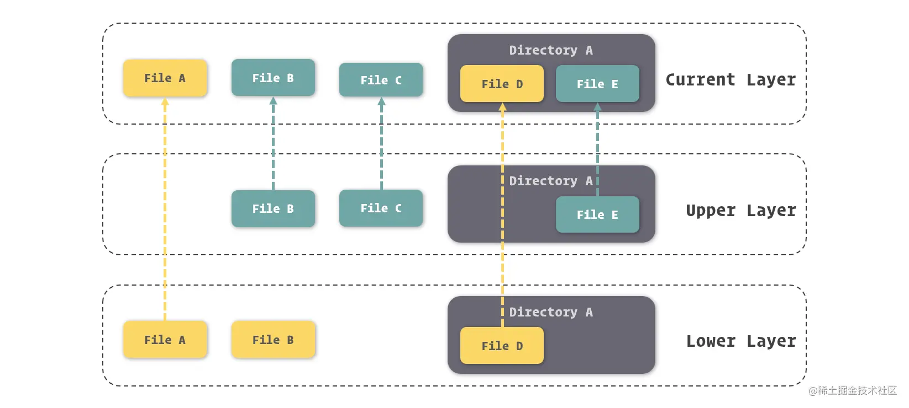
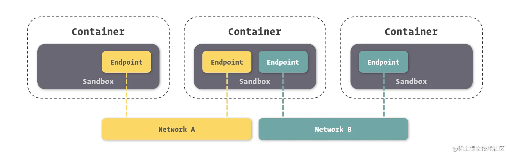
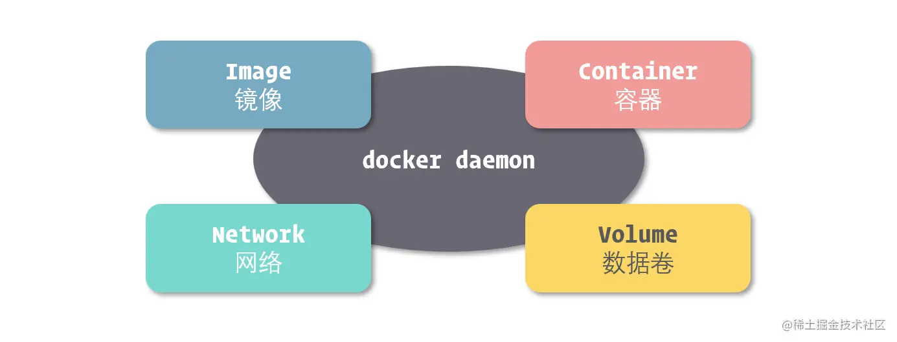
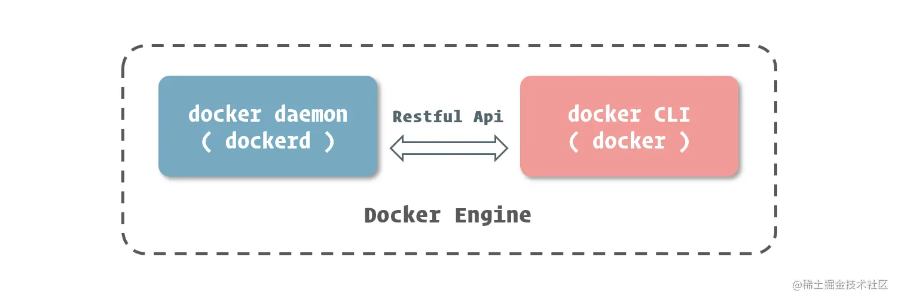

# 了解 Docker 的核心组成

这一节更像一张词汇表，在掌握这些与 Docker 紧密相关的词汇后，大家可以更好的理解之后小节中的内容。

## 四大组成对象

在之前的小节里，我们提到了 Docker 实现容器引擎的一些技术，但那些都是一些相对底层的原理实现，在 Docker 将它们封装后，我们并不会直接操作它们。

在 Docker 中，另外提供出了一些软件层面的概念，这才是我们操作 Docker 所针对的对象。

有四个对象 ( Object )  它们分别是：**镜像 ( Image )**、**容器 ( Container )**、**网络 ( Network )**、**数据卷 ( Volume )**。

### 镜像

镜像 ( Image ) 这个概念相信大家不会陌生，因为它是其他虚拟化技术 ( 特别是虚拟机 ) 中常常被使用的一个概念。

所谓镜像，可以理解为一个只读的文件包，其中包含了**虚拟环境运行最原始文件系统的内容**。

Docker 的镜像与虚拟机中的镜像还是有一定区别的。

- Docker 中的一个创新是利用了 AUFS 作为底层文件系统实现，通过这种方式，Docker 实现了一种**增量式**的镜像结构。

  

  每次对镜像内容的修改，**Docker 都会将这些修改**铸造成一个**镜像层**，而一个镜像其实就是由其下层所有的镜像层所组成的。当然，每一个镜像层单独拿出来，与它之下的镜像层都可以组成一个镜像。

- 另外，由于这种结构，Docker 的镜像实质上是**无法被修改**的

  因为所有对镜像的修改只会产生新的镜像，而不是更新原有的镜像。

### 容器

容器 ( Container ) 就更好理解了，在容器技术中，容器就是用来隔离虚拟环境的基础设施，而在 Docker 里，它也被引申为**隔离出来的虚拟环境**。

*如果把镜像理解为编程中的**类**，那么容器就可以理解为类的**实例**。*

镜像内存放的是不可变化的东西，当以它们为基础的容器启动后，容器内也就成为了一个“活”的空间。

用更官方的定义，Docker 的**容器**应该有**三项内容组成**：

- 一个 Docker **镜像**
- 一个**程序运行环境**
- 一个**指令集合**

关于镜像与容器的更多细节知识，我们在后面的小节中还会单独进行讲解。

### 网络

对于大部分程序来说，它们的运行都不会是孤立的，而是要与外界或者更准确的说是**与其他程序进行交互**的，这里的交互绝大多数情况下指的就是数据信息的交换。

网络通讯是目前最常用的一种程序间的数据交换方式了。

由于计算机网络领域拥有相对统一且独立的协议等约定，其跨平台性非常优秀，所有的应用都可以通过网络在不同的硬件平台或操作系统平台上进行数据交互。

特别是在分布式云计算的时代，应用或服务间的通讯更是充分依赖于网络传输，所以自然拥有一套完善的网络体系支撑，是承载应用运行所必须的基础设施。

在 Docker 中，实现了强大的网络功能，我们不但能够十分轻松的**对每个容器的网络进行配置**，还能**在容器间建立虚拟网络**，将数个容器包裹其中，同时与其他网络环境隔离。

Docker 能够在容器中营造独立的域名解析环境，这使得我们可以**在不修改代码和配置的前提下直接迁移容器**，Docker 会为我们完成新环境的网络适配。

对于这个功能，我们甚至能够**在不同的物理服务器间实现**，让处在两台物理机上的两个 Docker 所提供的容器，**加入到同一个虚拟网络**中，形成完全屏蔽硬件的效果。

正是因为拥有强大的网络功能，才能让我们制造健壮的 Docker 应用体系。

### 数据卷

除了网络之外，文件也是重要的进行数据交互的资源。

Docker 底层的 Union File System 技术。在 UnionFS 的加持下，除了能够从宿主操作系统中挂载目录外，还能够建立独立的目录持久存放数据，或者在容器间共享。

在 Docker 中，通过这几种方式进行数据共享或持久化的文件或目录，我们都称为数据卷 ( Volume )。

## Docker Engine

### docker daemon 和 docker CLI

daemon (后台程序)

