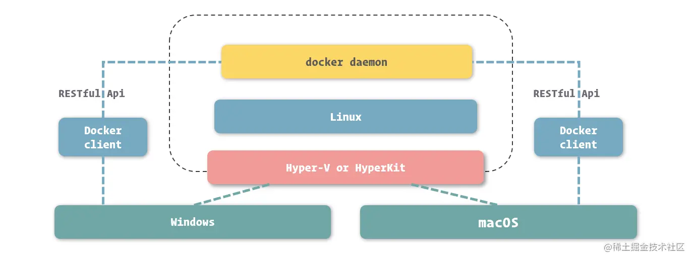

[toc]

# 搭建 Docker 运行环境

## 安装前的准备

### Docker Engine 的版本

对于 Docker Engine 来说，其主要分为两个系列：

- 社区版 ( CE, Community Edition )
- 企业版 ( EE, Enterprise Edition )

社区版 ( Docker Engine CE ) 主要提供了 Docker 中的容器管理等基础功能，主要针对开发者和小型团队进行开发和试验。(免费)

企业版 ( Docker Engine EE ) 则在社区版的基础上增加了诸如容器管理、镜像管理、插件、安全等额外服务与功能，为容器的稳定运行提供了支持，适合于中大型项目的线上运行。

Docker Engine 的迭代版本又会分为稳定版 ( Stable release ) 和预览版 ( Edge release )。不论是稳定版还是预览版，它们都会以发布时的年月来命名版本号，例如如 17 年 3 月的版本，版本号就是 17.03。

### Docker 的环境依赖

由于 Docker 的容器隔离依赖于 Linux 内核中的相关支持，所以使用 Docker 首先需要确保安装机器的 **Linux kernel** 中**包含 Docker 所需要使用的特性**。

## 在 Linux 系统中安装 Docker

# 在 Windows 和 Mac 中使用 Docker

## Docker Desktop

Docker 官方为 Windows 和 macOS 系统单独开辟了一条产品线，名为 Docker Desktop，其定位是快速为开发者提供在 Windows 和 macOS 中运行 Docker 环境的工具。

Docker Desktop 产品线包含两个软件，也就是针对 Windows 系统的 Docker for Windows 和针对 macOS 的 Docker for Mac。

### 安装 Docker Desktop

对于 Windows 系统来说，安装 Docker for Windows 需要符合以下条件：

- 必须使用 Windows 10 Pro ( 专业版 )
- 必须使用 64 bit 版本的 Windows

对于 macOS 系统来说，安装 Docker for Mac 需要符合以下条件：

- Mac 硬件必须为 2010 年以后的型号
- 必须使用 macOS El Capitan 10.11 及以后的版本

- [Docker for Windows](https://link.juejin.cn/?target=https%3A%2F%2Fstore.docker.com%2Feditions%2Fcommunity%2Fdocker-ce-desktop-windows) ( [store.docker.com/editions/co…](https://link.juejin.cn/?target=https%3A%2F%2Fstore.docker.com%2Feditions%2Fcommunity%2Fdocker-ce-desktop-windows) )
- [Docker for Mac](https://link.juejin.cn/?target=https%3A%2F%2Fstore.docker.com%2Feditions%2Fcommunity%2Fdocker-ce-desktop-mac) ( [store.docker.com/editions/co…](https://link.juejin.cn/?target=https%3A%2F%2Fstore.docker.com%2Feditions%2Fcommunity%2Fdocker-ce-desktop-mac) )

### 启动 Docker

打开软件之后，我们会在 Windows 的任务栏或者 macOS 的状态栏中看到 Docker 的大鲸鱼图标。

Docker for Windows 或 Docker for Mac 在启动时，这只大鲸鱼上的集装箱会一直闪动，这说明 Docker 程序正在部署 docker daemon 所需要的一些环境并执行 docker daemon 的启动。当集装箱不再闪动，就说明 Docker 服务已经准备就绪，我们就可以在 Windows 和 macOS 中使用 Docker 了。

## Docker Desktop 的实现原理

Docker 是**依赖于 Linux 而存在的**。那么问题来了，Docker Desktop 是如何实现让我们在 Windows 和 macOS 中如此顺畅的使用 Docker 的呢？

既然 Windows 和 macOS 中没有 Docker 能够利用的 Linux 环境，那么我们生造一个 Linux 环境就行啦！Docker for Windows 和 Docker for Mac 正是这么实现的。

在 Windows 中，我们可以通过 Hyper-V 实现虚拟化，而在 macOS 中，我们可以通过 HyperKit 实现虚拟化。

Docker for Windows 和 Docker for Mac 这里利用了这两个操作系统提供的功能来搭建一个虚拟 Linux 系统，并在其之上安装和运行 docker daemon。

### 主机文件挂载

## 配置 Docker Desktop

打开 Docker for Windows 和 Docker for Mac 的配置页面后，我们可以发现几个配置页面。

Docker for Windows 和 Docker for Mac 的配置项目较 Docker Engine 来说要多上许多，这主要是因为 Docker Desktop 是 Docker Engine 的超集，所以其不仅包含了 Docker Engine 的配置内容，还要包含诸如虚拟机实现等其他配置。

抽出几个与 Docker 相关的关键配置，分别简单说明它们的作用：

#### 文件系统挂载配置

在 Docker for Windows 的 Shared Drivers 面板，以及在 Docker for Mac 中的 File Sharing 面板中，包含了我们之前提到的将本机目录挂载到 Hypervisor 里 Linux 系统中的配置。

#### 资源控制配置

在 Advanced 面板中，我们可以调整 Docker 最大占用的本机资源。

更准确的说我们是在调整虚拟 Linux 环境所能占用的资源，是通过这个方式影响 Docker 所能占用的最大资源。

#### 网络配置

在 Docker for Windows 的 Network 面板，以及在 Docker for Mac 中的 Advanced 面板中，我们可以配置 Docker 内部默认网络的子网等内容。

这个网络的作用以及更详细的内容，我们会在之第 9 节中进行讲解。

#### docker daemon 配置

在 Daemon 面板里，我们可以直接配置对 docker daemon 的运行配置进行调整。

默认情况下，在 Daemon 面板里只有 Insecure registries 和 Registry mirrors 两个配置，分别用来定义未认证镜像仓库地址和镜像源地址。

我们可以点击切换按钮切换到 Advanced 模式，在这个模式下，我们可以直接编辑 docker daemon 的 daemon.json 配置文件，实现更具体、完整的配置 docker daemon 的目的。