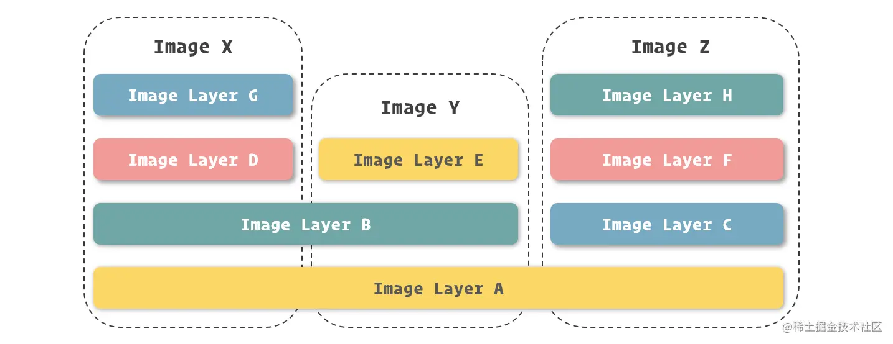
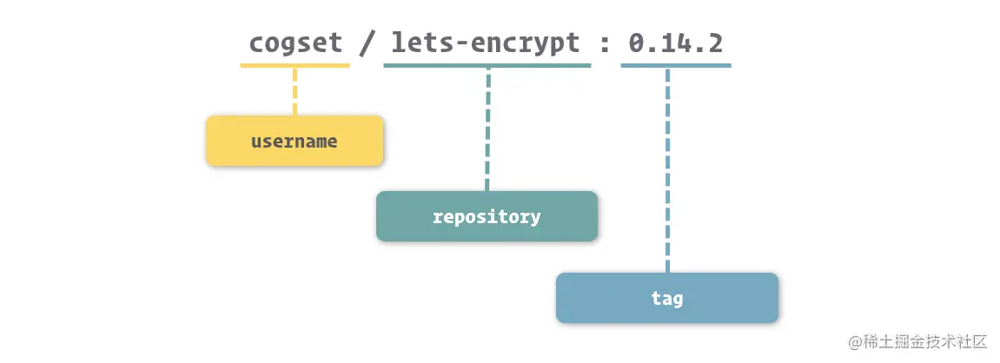
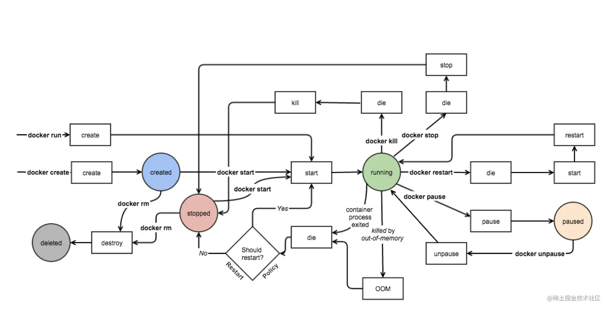

[toc]

# 镜像与容器

**镜像和容器**作为 Docker 里最基础的概念，我们很有必要了解 Docker 对它们的很多定义以及其他与它们有关的知识。

## Docker 镜像

如果进行形象的表述，我们可以将 Docker 镜像**理解为包含应用程序以及其相关依赖的一个基础文件系统**，在 Docker 容器启动的过程中，它以只读的方式被用于创建容器的运行环境。

Docker 镜像其实是由基于 UnionFS 文件系统的一组镜像层依次挂载而得，而每个镜像层包含的其实是对上一镜像层的修改，这些修改其实是发生在容器运行的过程中的。所以，我们也可以反过来理解，**镜像是对容器运行环境进行持久化存储的结果**。

### 深入镜像实现

与其他虚拟机的镜像管理不同，Docker 将镜像管理纳入到了自身设计之中，也就是说，所有的 Docker 镜像都是按照 Docker 所设定的逻辑打包的，也是受到 Docker Engine 所控制的。

- 常见的虚拟机镜像，通常是由热心的提供者以他们自己熟悉的方式打包成镜像文件，被我们从网上下载或是其他方式获得后，恢复到虚拟机中的文件系统里的。

- Docker 的镜像我们必须通过 Docker 来打包，也必须通过 Docker 下载或导入后使用，不能单独直接恢复成容器中的文件系统。

固定的格式意味着我们可以很轻松的在不同的服务器间传递 Docker 镜像，配合 Docker 自身对镜像的管理功能，让我们在不同的机器中传递和共享 Docker 变得非常方便

对于每一个记录文件系统修改的镜像层来说，Docker 都会根据它们的信息生成了一个 **Hash 码**，这是一个 64 长度的字符串，足以保证全球**唯一**性。这种编码的形式在 Docker 很多地方都有体现，之后我们会经常见到。

由于镜像层都有唯一的编码，我们就能够区分不同的镜像层并能保证它们的内容与编码是一致的，这带来了另一项好处，就是允许我们**在镜像之间共享镜像层**。

Docker 管理之下的镜像，占用空间是以 MB 为单位进行衡量的，加之镜像之间还能够共享部分的镜像层，也就是共享存储空间，所以我们在常见的硬盘里放下几十、数百个镜像也不是什么难事。

### 查看镜像

镜像是由 Docker 进行管理的，所以它们的存储位置和存储方式等我们并不需要过多的关心，我们只需要利用 Docker 所提供的一些**接口或命令对它们进行控制**即可。

`docker images` : 查看当前连接的 docker daemon 中存放和管理了哪些镜像

在 `docker images` 命令的结果中，我们可以看到**镜像的 ID ( IMAGE ID)**、**构建时间 ( CREATED )**、**占用空间 ( SIZE )** 等数据。

为了避免屏幕的空间都被这些看似“乱码”的镜像 ID 所挤占，所以 Docker 只显示了镜像 ID 的前 12 个字符，大部分情况下，它们已经能够让我们在单一主机中识别出不同的镜像了。

### 镜像命名

`docker images` 命令打印出的内容中，我们还能看到两个与镜像命名有关的数据：**REPOSITORY** 和 **TAG**，这两者其实就组成了 docker 对镜像的命名规则。

准确的来说，镜像的命名我们可以分成三个部分：**username**、**repository** 和 **tag**。

- **username**： 主要用于识别上传镜像的不同用户，与 GitHub 中的用户空间类似。
- **repository**：主要用于识别进行的内容，形成对镜像的表意描述。
- **tag**：主要用户表示镜像的**版本**，方便区分进行内容的不同细节

镜像的标签是对同一种镜像进行更细层次区分的方法，也是最终识别镜像的关键部分。

`docker images` 结果中，有的镜像有 username 这个部分，而有的镜像是没有的。没有 username 这个部分的镜像，表示镜像是由 Docker 官方所维护和提供的，所以就不单独标记用户了

Docker 中镜像的 repository 部分通常采用的是软件名。

与其说我们在使用 Docker 进行来启动容器，这个过程倒更像我们在运行指定版本的应用程序。

在操作中没有具体给出镜像的 tag 时，Docker 会采用 **latest** 作为缺省 tag。

在不需要了解应用程序迭代周期的情况下，可以利用 latest 镜像保持软件最新版本的使用。

## 容器的生命周期

还有一个**重要**的概念，也就是容器的生命周期。

Docker 揽下了大部分对容器管理的活，只提供给我们非常简单的操作接口，这就意味着 Docker 里对容器的一些运行细节会被更加严格的定义，这其中就包括了容器的生命周期。

这里有一张**容器**运行的**状态**流转图：

图中展示了几种常见对 Docker 容器的操作命令，以及执行它们之后容器运行状态的变化。这里我们撇开命令，着重看看**容器的几个核心状态**，也就是图中色块表示的：**Created**、**Running**、**Paused**、**Stopped**、**Deleted**。

其分别代表着：

- **Created**：容器已经被创建，容器所需的相关资源已经准备就绪，但容器中的程序还未处于运行状态。
- **Running**：容器正在运行，也就是容器中的应用正在运行。
- **Paused**：容器已暂停，表示容器中的所有程序都处于暂停 ( 不是停止 ) 状态。
- **Stopped**：容器处于停止状态，占用的资源和沙盒环境都依然存在，只是容器中的应用程序均已停止。
- **Deleted**：容器已删除，相关占用的资源及存储在 Docker 中的管理信息也都已释放和移除。

在这几种状态中，Running 是最为关键的状态，在这种状态中的容器，就是真正正在运行的容器了。

### 主进程

如果单纯去看容器的生命周期会有一些难理解的地方，而 Docker 中对容器生命周期的定义其实并不是独立存在的。

在 Docker 的设计中，容器的生命周期其实与**容器中 PID 为 1 这个进程**有着密切的关系。更确切的说，它们其实是共患难，同生死的兄弟。容器的启动，本质上可以理解为这个进程的启动，而容器的停止也就意味着这个进程的停止，反过来理解亦然。

当我们启动容器时，Docker 其实会按照**镜像**中的定义，启动对应的程序，并将**这个程序的主进程作为容器的主进程** ( 也就是 PID 为 1 的进程 )。

- 当我们控制容器停止时，Docker 会向主进程发送结束信号，通知程序退出。
- 当容器中的主进程主动关闭时 ( 正常结束或出错停止 )，也会让容器随之停止。

最佳的 Docker 实践方法是遵循着它的逻辑，逐渐习惯这种容器即应用，应用即容器的虚拟化方式。

虽然在 Docker 中我们也能够实现在同一个容器中运行多个不同类型的程序，但这么做的话，Docker 就无法跟踪不同应用的生命周期，有可能造成应用的非正常关闭，进而影响系统、数据的稳定性。

## 写时复制机制

写时复制 ( Copy on Write ) 这个词对于开发者来说应该并不陌生，在很多编程语言里，都隐藏了写时复制的实现。

在编程里，写时复制常常用于对象或数组的拷贝中，当我们拷贝对象或数组时，复制的过程并不是马上发生在内存中，而只是先让两个变量同时指向同一个内存空间，并进行一些标记，当我们要对对象或数组进行修改时，才真正**进行内存的拷贝**。

Docker 的写时复制与编程中的相类似，也就是在通过镜像运行容器时，并不是马上就把镜像里的所有内容拷贝到容器所运行的沙盒文件系统中，而是利用 UnionFS 将镜像以只读的方式挂载到沙盒文件系统中。*只有在容器中发生对文件的修改时，修改才会体现到沙盒环境上。*

容器在创建和启动的过程中，不需要进行任何的文件系统复制操作，也不需要为容器单独开辟大量的硬盘空间，与其他虚拟化方式对这个过程的操作进行对比，Docker 启动的速度可见一斑。

采用写时复制机制来设计的 Docker，既保证了镜像在生成为容器时，以及容器在运行过程中，不会对自身造成修改。又借助剔除常见虚拟化在初始化时需要从镜像中拷贝整个文件系统的过程，大幅提高了容器的创建和启动速度。

可以说，Docker 容器能够实现秒级启动速度，写时复制机制在其中发挥了举足轻重的作用。

##### 总结:

镜像：可复用性强，来自同一个镜像的不同镜像一般可以共用父类部分不变内容。

​	优势：很大程度的节省空间。

容器：写时复制。

​	优势：达到秒级启动