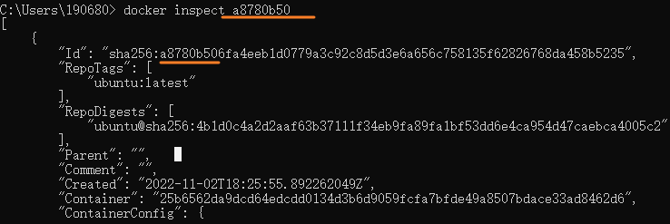

[toc]

# 从镜像仓库获得镜像

Docker 与其他虚拟化软件的一处不同就是将**镜像管理**纳入到了功能之中。

实现虚拟化只是程序能够无缝移植的一部分，而有了镜像管理，就真正取代了我们在移植过程中的繁琐操作。

利用 Docker 的镜像管理功能，我们可以很方便的**通过网络传输和分享镜像，并保障镜像内容的一致性**。

所以，了解 Docker 的镜像管理方法可以算是掌握 Docker 的第一步。


## 镜像仓库

Docker 里集中存放镜像的一个概念，也就是**镜像仓库**。

把镜像的结构用 Git 项目的结构做类比，那么镜像仓库就可以看似 GitLab、GitHub 等的托管平台，只不过 Docker 的镜像仓库托管的不是代码项目，而是镜像。

存储镜像最大的作用是实现了 **Docker 镜像的分发**。

借助镜像仓库，我们得到了一个镜像的中转站，我们可以将开发环境上所使用的镜像推送至镜像仓库，并在测试或生产环境上拉取到它们，而这个过程仅需要几个命令，甚至自动化完成。


### 获取镜像

最常用的获取现有镜像的方式还是直接从镜像仓库中拉取，因为这种方式简单、快速、有保障。

`docker pull`: 拉取镜像, 命令的参数就是我们之前所提到的镜像仓库名。


下载进度会分为几行，其实每一行代表的就是一个镜像层。 *? cmd 运行命令的只有一行*: `可能是版本不一样, 小册是18年的..`


Docker 首先会拉取镜像所基于的所有镜像层，之后再单独拉取每一个镜像层并组合成这个镜像。当然，如果在本地已经存在相同的镜像层 ( 共享于其他的镜像 )，那么 Docker 就直接略过这个镜像层的拉取而直接采用本地的内容。


镜像在被拉取之后，就存放到了本地，接受当前这个 Docker 实例管理了，我们可以通过 `docker images` 命令看到它们。


## Docker Hub

既然说到镜像仓库，就不得不提 **Docker Hub** 了。

Docker Hub 是 Docker 官方建立的中央镜像仓库，除了普通镜像仓库的功能外，它内部还有更加细致的权限管理，支持构建钩子和自动构建，并且有一套精致的 Web 操作页面。

Docker Hub 的地址是：[hub.docker.com/](https://hub.docker.com/)  国内访问有点慢

由于定位是 Docker 的中央镜像仓库系统，同时也是 Docker Engine 的**默认镜像仓库**，所以 Docker Hub 是开发者共享镜像的首选，那么也就意味着其中的镜像足够丰富。

常用服务软件的镜像，我们都能在 Docker Hub 中找到，甚至能找到针对它们不同用法的不同镜像。

同时，Docker Hub 也允许我们将我们制作好的镜像上传到其中，与广大 Docker 用户共享你的成果。

### 搜索镜像

在 Docker Hub 的搜索结果中，有几项关键的信息有助于我们选择合适的镜像：

- **OFFICIAL** 代表镜像为 Docker 官方提供和维护，相对来说稳定性和安全性较高
- **STARS** 代表镜像的关注人数，这类似 GitHub 的 Stars，可以理解为热度
- **PULLS** 代表镜像被拉取的次数，基本上能够表示镜像被使用的频度

还可以使用`docker search` 这个命令搜索 Docker Hub 中的镜像


## 管理镜像

对镜像的**管理**要比搜索和获取镜像更常用，所以了解镜像管理相关的操作以及知识是非常有必要的。

`docker inspect`: 获得(已拉取的)镜像更详细的信息


`docker inspect` 还能查看容器等之前我们所提到的 Docker 对象的信息，而传参的方式除了传递镜像或容器的名称外，还可以**传入镜像 ID 或容器 ID**。

```ruby
$ sudo docker inspect redis:4.0
$ sudo docker inspect 2fef532e
```



(8位)


### 参数识别

镜像 ID 是 64 个字符，而 `docker images` 命令里的缩写也有 12 个字符，为什么我这里展示的操作命令里只填写了 8 个字符呢

不论我们是通过镜像名还是镜像 ID 传递到 `docker inspect` 或者其他类似的命令 ( 需要指定 Docker 对象的命令 ) 里，Docker 都会根据我们传入的内容去寻找与之匹配的内容，**只要我们所给出的内容能够找出唯一的镜像**，那么 Docker 就会对这个镜像执行给定的操作。 否则操作不会进行，Docker 也会显示错误。

只要我们提供了能够唯一识别镜像或容器的信息，即使它短到只有 1 个字符，Docker 都是可以处理的。


例如我们有五个镜像：

```bash
REPOSITORY            TAG                 IMAGE ID            CREATED             SIZE
php                   7-fpm               f214b5c48a25        11 days ago         368MB
ubuntu                latest              cd6d8154f1e1        13 days ago         84.1MB
redis                 3.2                 2fef532eadb3        13 days ago         76MB
redis                 4.0                 e1a73233e3be        13 days ago         83.4MB
openresty/openresty   1.13.6.2-alpine     08d5c926e4b6        3 months ago        49.3MB
cogset/cron           latest              c01d5ac6fc8a        16 months ago       125MB
```

我们注意到镜像 ID 前缀为 2 的只有 redis:3.2 这个镜像，那么我们就可以使用 2 来指代这个镜像。

```ruby
$ sudo docker inspect 2
```

而前缀为 c 的镜像有两个，这时候如果我们直接使用 c 来指代镜像的话，Docker 会提示未能匹配到镜像。

```less
$ sudo docker inspect c
[]
Error: No such object: c
```


### 删除镜像

虽然 Docker 镜像占用的空间比较小，但日渐冗杂的镜像和凌乱的镜像版本会让管理越来越困难，所以有时候我们需要清理一些无用的镜像，将它们从本地的 Docker Engine 中移除。

`docker rmi`:  删除镜像, 参数是镜像的名称或 ID。


删除镜像的过程其实是删除镜像内的镜像层，在删除镜像命令打印的结果里，我们可以看到被删除的镜像层以及它们的 ID。

当然，如果存在两个镜像共用一个镜像层的情况，你也不需要担心 Docker 会删除被共享的那部分镜像层，只有当被删除的镜像不被引用时，Docker 才会将它们从硬盘空间中移除。

`docker rmi` 命令也支持同时删除多个镜像，只需要通过空格传递多个镜像 ID 或镜像名即可。