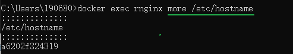

[toc]

# 运行和管理容器

## 容器的创建和启动

### 创建容器

当我们选择好镜像以后，就可以通过 `docker create` 这个命令来创建容器了。


执行 `docker create` 后，Docker 会根据我们所给出的镜像创建容器，在控制台中会打印出 Docker 为容器所**分配的容器 ID**，此时容器是处于 Created 状态的。

使用容器ID并不方便

使用容器名操作容器，就先得给容器命名，在创建容器时，我们可以通过 `--name` 这个选项来**配置容器名**。

```lua
$ sudo docker create --name nginx nginx:1.12
```


### 启动容器

通过 `docker create` 创建的容器，是处于 Created 状态的，其内部的应用程序还没有启动，所以我们需要通过 `docker start` 命令来启动它。

```ruby
$ sudo docker start nginx
```

当容器启动后，其中的应用就会运行起来，容器的几个生命周期也会绑定到了这个应用上，这个之前我们已经提及，这里就不在赘述。

只要应用程序还在运行，那么容器的状态就会是 Running，除非进行一些修改容器的操作。

`docker run` 这个命令将 `docker create` 和 `docker start` 这两步操作合成为一步

```bash
$ sudo docker run --name nginx -d nginx:1.12
89f2b769498a50f5c35a314ab82300ce9945cbb69da9cda4b022646125db8ca7
```


`docker run` 创建的容器，在创建完成之后会直接启动起来，不需要我们再使用 `docker start` 去启动了。


通常来说我们启动容器会期望它运行在“后台”，而 `docker run` 在启动容器时，会采用“前台”运行这种方式，这时候我们的**控制台就会衔接到容器**上，不能再进行其他操作了。

我们可以通过 `-d` 或 `--detach` 这个选项告诉 Docker 在启动后将程序与控制台分离，使其进入“后台”运行。


## 管理容器

 `docker ps` 罗列出 Docker 中的容器。


默认情况下，`docker ps` 列出的容器是处于运行中的容器，如果要列出所有状态的容器，需要增加 `-a` 或 `--all` 选项。


`docker ps` 结果中的 **COMMAND** 表示的是**容器中主程序** ( 也就是与容器生命周期所绑定进程所关联的程序 ) 的启动命令，这条命令是**在镜像内定义的**，而容器的启动其实质就是**启动这条命令**。

关于 COMMAND 的更多知识，我们在之后的 Docker 镜像制作中会更详细的解读。

结果中的 **STATUS** 表示容器所处的状态，其值和我们之前所谈到的状态有所区别，主要是因为这里还记录了其他的一些信息。在这里，常见的状态表示有三种：

- **Created** 此时容器已创建，但还没有被启动过。
- **Up [ Time ]** 这时候容器处于正在运行状态，而这里的 Time 表示容器从开始运行到查看时的时间。
- **Exited ([ Code ]) [ Time ]** 容器已经结束运行，这里的 Code 表示容器结束运行时，主程序返回的程序退出码，而 Time 则表示容器结束到查看时的时间。


为啥会用类似 Linux 中查看进程的 `ps` 呢？

由于容器并非真的包裹住了进程，而只是**隔离了进程**，进程还是允许在宿主机操作系统之上的，所以列出镜像的过程到更新是**查看正在运行的进程**，故而有了这样的名字。

### 停止和删除容器

要将正在运行的容器停止，我们可以使用 `docker stop` 命令。


容器停止后，其维持的文件系统沙盒环境还是存在的，内部被修改的内容也都会保留，我们可以通过 `docker start` 命令将这个容器再次启动。


完全删除容器时，可以通过 `docker rm` 命令将容器进行删除。

正在运行中的容器默认情况下是不能被删除的，我们可以通过增加 `-f` 或 `--force` 选项来让 `docker rm` 强制停止并删除容器，不过这种做法并不妥当。


### 随手删除容器

Docker 的轻量级容器设计，讲究随用随开，随关随删。

不需要使用容器时，**最佳的做法是删除它而不是仅仅停止它**。


容器一旦删除，其内部的文件系统变动也就消失了，这样做岂不是非常麻烦?

要解决这个疑惑，其根本是解决**为什么我们会对容器中的文件系统做更改**。

我这里总结了两个对虚拟环境做更改的原因，以及在 Docker 中如何优雅的解决它们。

- 1. 在使用虚拟机或其他虚拟化所搭建的虚拟环境时，我们倾向于使用一个干净的系统镜像并搭建程序的运行环境，由于将这类虚拟环境制作成镜像的成本较高，耗时也非常久，所以我们对于一些细小的改动倾向于修改后保持虚拟环境不被清除即可。
  2. 而在 Docker 中，打包镜像的成本是非常低的，其速度也快得惊人，所以如果我们要为程序准备一些环境或者配置，完全可以直接将它们打包至新的镜像中，下次直接使用这个新的镜像创建容器即可。
- 容器中应用程序所产生的一些文件数据，是非常重要的，如果这些数据随着容器的删除而丢失，其损失是非常巨大的。对于这类由应用程序所产生的**数据**，并且需要保证它们不会随着容器的删除而消失的，我们可以**使用 Docker 中的数据卷来单独存放**。由于数据卷是独立于容器存在的，所以其能保证数据不会随着容器的删除而丢失。关于数据卷的具体使用，在之后的小节会专门讲解。


容器的随用随删既能保证在我们不需要它们的时候它们不会枉占很多资源，也保证了每次我们建立和启动容器时，它们都是“热乎”的崭新版本。


## 进入容器

容器是一个隔离运行环境的东西，它里面除了镜像所规定的主进程外，其他的进程也是能够运行的，Docker 为我们提供了一个命令 `docker exec` 来让容器**运行**我们所给出的命令。

试试用容器中的 `more` 命令查看容器的主机名定义。

```bash
$ sudo docker exec nginx more /etc/hostname
::::::::::::::
/etc/hostname
::::::::::::::
83821ea220ed
```



`docker exec` 命令能帮助我们在正在运行的容器中运行指定命令，这对于服务控制，运维监控等有着不错的应用场景。

但是在开发过程中，我们更常使用它来作为我们**进入容器的桥梁**。


进入容器，就是通过 `docker exec` 命令来启动 sh 或 bash，并通过它们实现对容器内的虚拟环境的控制。

由于 bash 的功能要比 sh 丰富，所以在能够使用 bash 的容器里，我们优先选择它作为控制台程序。

```ruby
$ sudo docker exec -it nginx bash
root@83821ea220ed:/#
```


在借助 `docker exec` 进入容器的时候，我们需要特别注意命令中的两个选项不可或缺，即 `-i` 和 `-t` ( 它们俩可以利用简写机制合并成 `-it` )。

- `-i` ( `--interactive` ) 表示保持我们的输入流，只有使用它才能保证控制台程序能够正确识别我们的命令。
-  `-t` ( `--tty` ) 表示启用一个伪终端，形成我们与 bash 的交互，如果没有它，我们无法看到 bash 内部的执行结果。


### 衔接到容器

`docker attach` 命令，用于将当前的输入输出流连接到指定的容器上。

```
$ sudo docker attach nginx
```

这个命令最直观的效果可以理解为我们将容器中的主程序转为了“前台”运行 ( 与 `docker run` 中的 `-d` 选项有相反的意思 )。

... 所以并没有太多用武之地

