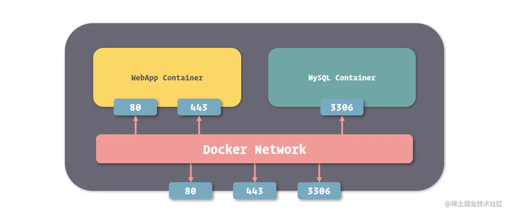

[toc]

# 为容器配置网络

## 容器网络

容器网络实质上也是由 Docker 为应用程序所创造的虚拟环境的一部分，它能让应用从宿主机操作系统的网络环境中独立出来，形成容器自有的网络设备、IP 协议栈、端口套接字、IP 路由表、防火墙等等与网络相关的模块。


Docker 网络中，有三个比较核心的概念，也就是：

**沙盒 ( Sandbox )**、**网络 ( Network )**、**端点 ( Endpoint )**。

这三者形成了 Docker 网络的核心模型，也就是容器网络模型 ( Container Network Model )。

- **沙盒**提供了容器的**虚拟网络栈**，也就是之前所提到的端口套接字、IP 路由表、防火墙等的内容。

  其实现隔离了容器网络与宿主机网络，形成了完全独立的容器网络环境。

- **网络**可以理解为 Docker 内部的**虚拟子网**，网络内的参与者相互可见并能够进行通讯。

  Docker 的这种虚拟网络也是于宿主机网络存在隔离关系的，其目的主要是形成容器间的安全通讯环境。

- **端点**是位于容器或网络隔离墙之上的洞，其主要目的是形成一个可以控制的突破封闭的网络环境的出入口。

  当容器的端点与网络的端点形成配对后，就如同在这两者之间搭建了桥梁，便能够进行数据传输了。


### 浅析 Docker 的网络实现

容器网络模型为容器引擎提供了一套标准的网络对接范式，而在 Docker 中，实现这套范式的是 Docker 所封装的 libnetwork 模块。

而对于网络的具体实现，在 Docker 的发展过程中也逐渐抽象，形成了统一的抽象定义。进而通过这些抽象定义，便可以对 Docker 网络的实现方式进行不同的变化。


Docker 官方为我们提供了五种 Docker 网络驱动，分别是：**Bridge Driver**、**Host Driver**、**Overlay Driver**、**MacLan Driver**、**None Driver**。

Bridge 网络是 Docker 容器的默认网络驱动，简而言之其就是通过网桥来实现网络通讯 ( 网桥网络的实现可以基于硬件，也可以基于软件 )。

Overlay 网络是借助 Docker 集群模块 Docker Swarm 来搭建的跨 Docker Daemon 网络，我们可以通过它搭建跨物理主机的虚拟网络，进而让不同物理机中运行的容器感知不到多个物理机的存在。

Bridge Driver 和 Overlay Driver 在开发中使用频率较高，之后的小节讲解里，关于容器网络的部分我们都主要围绕着它们展开。


## 容器互联

Docker 提倡容器与应用共生的轻量级容器理念，所以**容器中通常只包含一种应用**程序

但如今纷繁的系统服务，没有几个是可以通过单一的应用程序支撑的。

拿最简单的 Web 应用为例，也至少需要业务应用、数据库应用、缓存应用等组成。也就是说，在 Docker 里我们需要通过**多个容器来组成这样的系统**。

而这些互联网时代的应用，其间的通讯方式主要以网络为主，所以打通容器间的网络，是使它们能够**互相通讯**的关键所在。

要让一个**容器连接到另外一个容器**，我们可以在容器通过 `docker create` 或 `docker run` 创建时**通过 `--link` 选项进行配置**。

> docker已经不推荐用link了，用自定义网络来实现容器互联

这里我们创建一个 MySQL 容器，将运行我们 Web 应用的容器连接到这个 MySQL 容器上，打通两个容器间的网络，实现它们之间的网络互通。

```shell
$ sudo docker run -d --name mysql -e MYSQL_RANDOM_ROOT_PASSWORD=yes mysql
$ sudo docker run -d --name webapp --link mysql webapp:latest
```

容器间的网络已经打通，那么我们要如何在 Web 应用中连接到 MySQL 数据库呢？Docker 为容器间连接提供了一种非常友好的方式，我们只需要将容器的网络命名填入到连接地址中，就可以访问需要连接的容器了。

假设我们在 Web 应用中使用的是 JDBC 进行数据库连接的，我们可以这么填写连接。

```ini
String url = "jdbc:mysql://mysql:3306/webapp";
```

在这里，连接地址中的 mysql 就好似我们常见的域名解析，Docker 会将其指向 MySQL 容器的 IP 地址。

Docker 在容器互通中为我们带来的一项便利，也就是我们不再需要真实的知道另外一个容器的 IP 地址就能进行连接。

再具体来对比，在以往的开发中，我们每切换一个环境 ( 例如将程序从开发环境提交到测试环境 )，都需要重新配置程序中的各项连接地址等参数，而在 Docker 里，我们并不需要关心这个，只需要程序中配置被连接容器的别名，映射 IP 的工作就交给 Docker 完成了。


### 暴露端口

虽然容器间的网络打通了，但并不意味着我们可以任意访问被连接容器中的任何服务。

Docker 为容器网络增加了一套安全机制，只有容器自身允许的**端口**，才能被其他容器所访问。

这个容器自我标记端口可被访问的过程，我们通常称为暴露端口。我们在 `docker ps` 的结果中可以看到容器暴露给其他容器访问的端口。


端口的暴露可以通过 Docker 镜像进行定义，也可以在容器创建时进行定义。

在容器创建时进行定义的方法是借助 `--expose` 这个选项。

```sh
$ sudo docker run -d --name mysql --expose 13306 --expose 23306 mysql:5.7
```

为 MySQL 暴露了 13306 和 23306 这两个端口，暴露后我们可以在 `docker ps` 中看到这两个端口已经成功的打开。

容器暴露了端口只是类似我们打开了容器的防火墙，具体能不能通过这个端口访问容器中的服务，还需要容器中的应用监听并处理来自这个端口的请求。


### 通过别名连接

使用 `--link :<name>:<alias>` 的形式，连接到 MySQL 容器，并设置它的别名为 database。


## 管理网络

容器能够互相连接的前提是两者同处于一个网络中 ( 这里的网络是指容器网络模型中的网络 )。

网络这个概念我们可以理解为 Docker 所虚拟的子网，而容器网络**沙盒**可以看做是虚拟的**主机**，只有当多个主机在同一子网里时，才能互相看到并进行网络数据交换。

启动 Docker 服务时，它会为我们创建一个默认的 bridge 网络，而我们创建的容器在不专门指定网络的情况下都会连接到这个网络上。所以我们刚才之所以能够把 webapp 容器连接到 mysql 容器上，其原因是两者都处于 bridge 这个网络上。

通过 `docker inspect` 命令查看容器，可以在 Network 部分看到容器网络相关的信息。

- docker inspect rnginx


能够看到 mysql 容器在 bridge 网络中所分配的 IP 地址，其自身的端点、Mac 地址，bridge 网络的网关地址等信息。

Docker 默认创建的这个 bridge 网络是非常重要的，理由自然是在没有明确指定容器网络时，容器都会连接到这个网络中。

在之前讲解 Docker for Win 和 Docker for Mac 安装的时候，我们提到过这两个软件的配置中都有一块配置 Docker 中默认网络的内容，这块所指的默认网络就是这个 bridge 网络。


### 创建网络

在 Docker 里，我们也能够创建网络，形成自己定义虚拟子网的目的。

docker CLI 里**与网络相关的命令都以 `docker network` 开头**，其中创建网络的命令是 `docker network create`。

```lua
$ sudo docker network create -d bridge individual
```

通过 `-d` 选项我们可以为新的网络指定**驱动**的类型，其值可以是刚才我们所提及的 bridge、host、overlay、maclan、none，也可以是其他网络驱动插件所定义的类型。

这里我们使用的是 Bridge Driver ( 当我们不指定网络驱动时，Docker 也会默认采用 Bridge Driver 作为网络驱动 )。

通过 `docker network ls` 或是 `docker network list` 可以查看 Docker 中已经存在的网络。


创建容器时，可以通过 `--network` 来指定容器所加入的网络，一旦这个参数被指定，容器便不会默认加入到 bridge 这个网络中了 ( 但是仍然可以通过 `--network bridge` 让其加入 )。


## 端口映射

在实际使用中，还有一个非常常见的需求，就是我们需要在容器外通过网络访问容器中的应用。

最简单的一个例子，我们提供了 Web 服务，那么我们就需要提供一种方式访问运行在容器中的 Web 应用。

Docker 提供了一个**端口映射**的功能实现这样的需求。



通过 Docker 端口映射功能，我们可以把容器的端口**映射到宿主操作系统的端口**上，当我们从外部访问宿主操作系统的端口时，数据请求就会自动发送给与之关联的容器端口。

要映射端口，我们可以在创建容器时使用 `-p` 或者是 `--publish` 选项。

```bash
docker run -d --name nginx -p 80:80 -p 443:443 nginx:1.12
```


端口映射选项的格式是 **`-p <ip>:<host-port>:<container-port>`**，其中 ip 是宿主操作系统的监听 ip，可以用来控制监听的网卡，默认为 0.0.0.0，也就是监听所有网卡。

host-port 和 container-port 分别表示映射到**宿主操作系统的端口和容器的端口**，这两者是可以不一样的，我们可以将容器的 80 端口映射到宿主操作系统的 8080 端口，传入 `-p 8080:80` 即可。


### 在 Windows 和 macOS 中使用映射

Docker 的端口映射功能是将容器端口映射到宿主操作系统的端口上，实际来说就是映射到了 Linux 系统的端口上。

 Windows 和 macOS 中运行的 Docker，其 Linux 环境是被虚拟出来的，如果我们仅仅是将端口映射到 Linux 上，由于虚拟环境还有一层隔离，我们依然不能通过 Windows 或 macOS 的端口来访问容器。

解决这种问题的方法很简单，只需要再加一次映射，将虚拟 Linux 系统中的端口映射到 Windows 或 macOS 的端口即可。


这个端口映射的操作程序会自动帮助我们完成，所以我们不需要做任何额外的事情