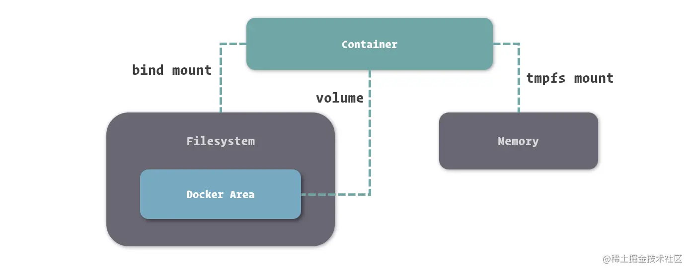

[toc]

# 管理和存储数据

 Docker 里，容器运行的文件系统处于沙盒环境中，与外界其实是隔离的，那么我们又要如何在 Docker 中合理的通过文件与外界进行数据交换呢

## 数据管理实现方式

Docker 容器中的文件系统于我们这些开发使用者来说，虽然有很多优势，但也有很多弊端，其中显著的两点就是：

- 沙盒**文件系统**是跟随容器**生命周期**所创建和移除的，**数据无法直接被持久化存储。**
- 由于容器隔离，我们**很难从容器外部获得或操作容器内部文件中的数据**。

Docker 很好的解决了这些问题，这主要还是归功于 Docker 容器文件系统是基于 UnionFS。

UnionFS 支持挂载不同类型的文件系统到统一的目录结构中，所以我们**只需要将宿主操作系统中**，**文件系统里的文件或目录挂载到容器**中，便能够让容器内外共享这个文件。

### 挂载方式

基于底层存储实现，Docker 提供了三种适用于不同场景的文件系统挂载方式：**Bind Mount**、**Volume** 和 **Tmpfs Mount**。

- **Bind Mount** 能够直接将宿主操作系统中的目录和文件挂载到容器内的文件系统中，通过指定容器外的路径和容器内的路径，就可以形成**挂载映射**关系，在容器内外对文件的读写，都是相互可见的。
- **Volume** 也是从宿主操作系统中挂载目录到容器内，只不过这个挂载的目录**由 Docker 进行管理**，我们只需要指定容器内的目录，不需要关心具体挂载到了宿主操作系统中的哪里。
- **Tmpfs Mount** 支持挂载系统内存中的一部分到容器的文件系统里，不过由于内存和容器的特征，它的存储并**不是持久**的，其中的内容会随着容器的停止而消失。

## 挂载文件到容器