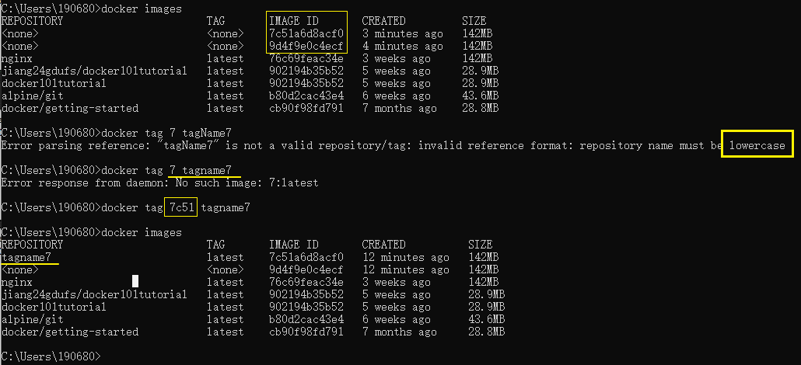

[toc]

# 保存和共享镜像

Docker能够实现相比于其他虚拟化软件更快的**环境迁移和部署**

## 提交容器更改

之前我们已经介绍过了，Docker **镜像**的**本质是多个基于 UnionFS 的镜像层依次挂载的结果**，而容器的**文件系统**则是在**以只读方式挂载镜像后增加的一个可读可写的沙盒环境**。

基于这样的结构，Docker 中为我们提供了将容器中的这个可读可写的沙盒环境持久化为一个镜像层的方法。很轻松的在 Docker 里将容器内的修改记录下来，保存为一个新的镜像。

`docker commit`: 将容器修改的内容保存为镜像

镜像的结构很像代码仓库里的修改记录，而记录容器修改的过程又像是在提交代码，所以这里我们更形象的称之为提交容器的更改。

```
$ sudo docker commit webapp
sha256:0bc42f7ff218029c6c4199ab5c75ab83aeaaed3b5c731f715a3e807dda61d19e
```


没做任何操作, 直接多次commit, 每次生成的hash码不同

但是并没有修改的容器的hashId


列出images可以看到新增了

从本地镜像列表中找到它


`docker commit -m "Configured" webapp` ~ git commit -m "x"

### 为镜像命名

在上面的例子里，我们发现提交容器更新后产生的镜像并没 REPOSITORY 和 TAG 的内容，也就是说，这个新的镜像还没有名字。

`docker tag` 为镜像指定镜像名。

`docker tag ImageId tagName`



也能够对已有的镜像创建一个新的命名。


当我们对未命名的镜像进行命名后，Docker 就不会在镜像列表里继续显示这个镜像，取而代之的是我们新的命名。

而如果我们对已有镜像使用 `docker tag`，旧的镜像依然会存在于镜像列表中。

由于**镜像是对镜像层的引用记录**，所以我们对镜像进行命名后，虽然能够在镜像列表里同时看到新老两个镜像，实质是它们其实引用着相同的镜像层，这个我们能够从镜像 ID 中看得出来 ( 因为镜像 ID 就是最上层镜像层的 ID )。

正是这个原因，我们虽然创建了新的镜像，但对物理存储的占用空间却不是镜像大小直接翻倍，并且创建也在霎那之间。

 `docker commit` 命令里指定新的镜像名，这种方式在使用容器提交时会更加方便。

```ruby
$ sudo docker commit -m "Upgrade" webapp webapp：2.0
```


## 镜像的迁移

在我们将更新导出为镜像后，就可以开始迁移镜像的工作了。

由于 Docker 是以集中的方式管理镜像的，所以在迁移之前，我们要先从 Docker 中取出镜像。

`docker save` 命令可以将镜像输出，提供了一种让我们**保存镜像到 Docker 外部**的方式。

```sh
# 管道进行接收 ( 也就是命令中的 > 符号 )
docker save webapp:1.0 > webapp-1.0.tar

等同于

# -o 选项，用来指定输出文件
docker save -o ./webapp-1.0.tar webapp:1.0
```


用解压软件查看其中的内容，你会看到里面其实就是镜像所基于的**几个镜像层**的记录文件。

### 导入镜像

`docker load`: 导入镜像

```hs
docker load < webapp-1.0.tar
等同于
docker load -i webapp-1.0.tar
```

镜像导入后，我们就可以通过 `docker images` 看到它了，导入的镜像会延用原有的镜像名称

`docker rm` : 删除容器

`docker rmi`: 删除镜像

删除镜像后再导入


### 批量迁移

通过 `docker save` 和 `docker load` 命令我们还能够批量迁移镜像


## 导出和导入容器

也许 Docker 的开发者认为，提交镜像修改，再导出镜像进行迁移的方法还不够效率，所以还为我们提供了一个导出**容器**的方法。

使用 `docker export` 命令我们可以直接导出容器，我们可以把它简单的理解为 `docker commit` 与 `docker save` 的结合体。

```shell
$ sudo docker export -o ./webapp.tar webapp
```

相对的，使用 `docker export` 导出的容器包，我们可以使用 `docker import` 导入。

使用 `docker import` 并非直接将容器导入，而是将容器运行时的内容以镜像的形式导入。所以导入的结果其实是一个镜像，而不是容器。

在 `docker import` 的参数里，我们可以给这个镜像命名。

```shell
$ sudo docker import ./webapp.tar webapp:1.0
```

在开发的过程中，使用 `docker save` 和 `docker load`，或者是使用 `docker export` 和 `docker import` 都可以达到迁移容器或者镜像的目的。