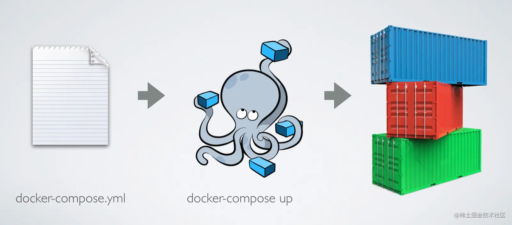

[toc]

# 使用 Docker Compose 管理容器

Docker 采用轻量级容器的设计，每个容器一般只运行一个软件，而目前绝大多数应用系统都绝不是一个软件所能组成的。

容器间互相连接、交换数据的各种方法，通过这些方法足以搭建起完整的用于应用系统运行的容器群，但是这显然还不够，这个容器群的搭建需要执行太多命令，更重要的是需要考虑太多应用和容器间的依赖关系处理

## 解决容器管理问题

拿任何一个相对完整的应用系统来说，都不可能是由一个程序独立支撑的，而对于使用 Docker 来部署的分布式计算服务更是这样。

随着时代的发展和技术演进，我们越来越推崇将大型服务拆分成较小的微服务，分别部署到独立的机器或容器中。

也就是说，我们的应用系统往往由数十个甚至上百个**应用程序或微服务组成**。

即使是一个小的微服务模块，通常都需要多个应用协作完成工作。

还是缺少一个对容器组合进行管理的东西。

### Docker Compose

Dockerfile 是将容器内运行环境的搭建固化下来，那么 Docker Compose 我们就可以理解为将多个容器运行的方式和配置固化下来。

在 Docker Compose 里，我们通过一个配置文件，将所有与应用系统相关的软件及它们对应的容器进行配置，之后使用 Docker Compose 提供的命令进行启动，就能让 Docker Compose 将刚才我们所提到的那些复杂问题解决掉。

## 安装 Docker Compose

虽然 Docker Compose 目前也是由 Docker 官方主要维护，但其却不属于 Docker Engine 的一部分，而是一个独立的软件。所以如果我们要在 Linux 中使用它，还必须要单独下载使用。

## Docker Compose 的基本使用逻辑

如果将使用 Docker Compose 的步骤简化来说，可以分成三步。

1. 如果需要的话，编写容器所需镜像的 Dockerfile；( 也可以使用现有的镜像 )
2. 编写用于配置容器的 docker-compose.yml；
3. 使用 docker-compose 命令启动应用。

准备镜像这一过程我们之前已经掌握了，这里我们就简单来看看后面两个步骤。

### 编写 Docker Compose 配置

配置文件是 Docker Compose 的核心部分，我们正是通过它去定义组成应用服务容器群的各项配置，而编写配置文件，则是使用 Docker Compose 过程中最核心的一个步骤。