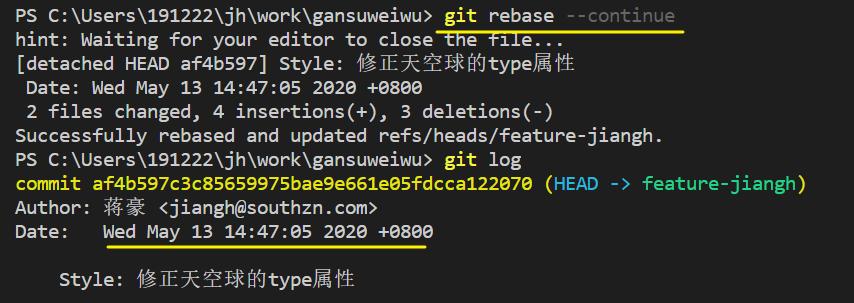

[TOC]


### how to use git correctly


rebase 模式


分支合并

远程有个同名的分支

开发者 可以在一个以名字命名的分支上开创子分支,

功能点可以在子分支上开发完成后, 在名字分支上合并, 然后再主分支上推送

临时离开分支/未完成的功能可以stash, stash后原工作区的内容会被删除, 清空工作区后可以拉取代码, stash的内容可以在任一分支pop出来使用


修改commit message

修改本地最近一次commit的message

```bash
git commit --amend
```


合并多个commit为一个commit


```bash
git rebase -i HEAD~n
// -i的意思是--interactive 即弹出交互式的界面让用户编辑完成合并操作
// n 最近多少次的提交信息
```

注意, n 不会包括 merge 操作的log


先提交的在在上面, 如果把后面2次的提交合并到最早的哪次,

**注意不能把最上面的那条设为s**, 不然报错, cannot 'squash' without a previous commit ~


上面未被注释的部分列出的是我们本次rebase操作包含的所有提交，下面注释部分是git为我们提供的命令说明。每一个commit id 前面的pick表示指令类型，git 为我们提供了以下几个命令:

> pick：保留该commit（缩写:p）
>
> reword：保留该commit，但我需要修改该commit的注释（缩写:r）
>
> edit：保留该commit, 但我要停下来修改该提交(不仅仅修改注释)（缩写:e）
>
> squash：将该commit和前一个commit合并（缩写:s）
>
> fixup：将该commit和前一个commit合并，但我不要保留该提交的注释信息（缩写:f）
>
> exec：执行shell命令（缩写:x）
>
> drop：我要丢弃该commit（缩写:d）


设置新的commit message后执行 rebase --continue即可




!!不过不要滥用这个命令, 有时候会很奇怪的

### 正确的使用git rebase -i HEAD~N更改commit message逻辑

```bash
git rebase -i HEAD~N   #最近N次提交记录
git rebase -i 32e0a87f #从这个提交记录的之后所有
git rebase -i  [startpoint]  [endpoint] #前开后闭
```

此时会弹出一个vim编辑界面

针对需要修改的commit message pick => reword/r 设置这个commit需要修改标识; (如果是在git的vim编辑器中修改的话此时只需要添加 r 标识, 修改提交信息在下面操作)

可以多个commit message一齐修改

然后退出编辑 ctrl+c, 键入:wq(冒号也是要键入的) 回车退出

退出后即会弹出vim编辑界面来修改设置 reword 标识的commit message

最后使用git log 来检测一次是否有正确修改到 (也可以在 git view History刷新确认)


**撤销上次本地commit**

```bash
git reset --soft HEAD^1
```

### git reset HEAD~

撤销后会在暂存区


### 同步


git rebase 命令?


回退, 回退跟把提交记录也一起回退

git reset soft/hard, 

回退之后如何提交 ? 

​	如何覆盖提交

强制更新远程仓库

​	` git push origin dev --force` 

同步到某一个分支的某个版本的方式

	1. 确认两个分支的共同分支点.
 	2. 回退到该分支点,
 	3. stash代码
 	4. 拉去另一分支的代码
 	5. 重新提交, (提交信息可以复制原来的)


如果直接在master分支更改了版本, dev分支如何同步更新成master现在的版本并且保留原来dev分支上的提交记录

**为了dev分支合并到master分支上**, master的版本必须与dev保持一致, 一致是指两个分支合并后不会有版本异常的问题


回退到某一分支的对应版本

​	

git log 参数, 可删选多个条件

1. --oneline
2. --after=="2020-15-05" --before="="2020-25-05" (时间)
3. -p (show the log with the diff changes)
4. --author="蒋豪" 
5. --grep="Message" -i ( filter commits by log messages by the respective pattern, -i to ingoreCase )
6. git log file.txt (Filter commits by files)
7. --merges


拉取代码后不能推送... 


尽量是在最新的dev分支开新分支添加新功能, 然后再写完之后推送之前拉取dev分支的代码, 其余时间尽量先不要拉dev; 然后如果是提交完了一版需要修改则重新开分支不要在原有的分支上进行处理


修改已经推送到远程的commit message

1.  git commit --amend 命令，（修改最近一次提交的注释信息），会进入到vim 编辑器

2. git push -f (强制提交)

3. 多条

4. ```bash
   $ git log
   $ git rebase -i HEAD~5
   $ git commit --amend
   $ git rebase --continue
   $ git push -f
   ```


~ 接上条, 推送到远程并且提交MR后需要修改commit message

直接git push -f 就行, 不需要再开MR


删除远程分支

`git push origin --delete [branchname]`

删除本地分支

`git branch -d [branchname]`
