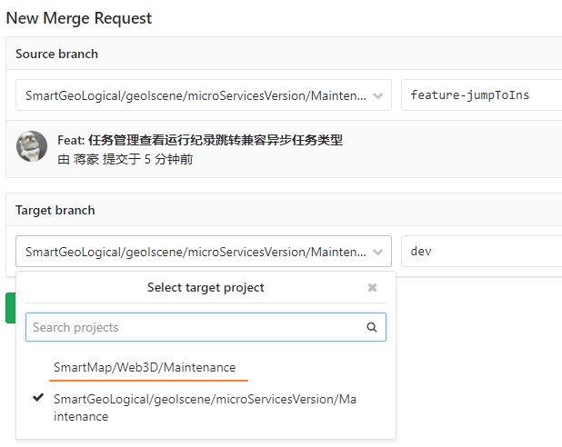

[toc]

# 提交请求

1. 什么是冲突
   1. 当前分支与合并分支提交的代码存在差异
2. 冲突如何解决
   1. 线上解决
      - 提示存在冲突
      - resolve conflicts
      - choose one to use (maybe need to find the author)
      - 
3. 查看提交前后的代码
   1. merge 分支中的changes可以看到差异
4. 解决冲突后如何merge
   1. 好像在线解决完后又一个merge submit
5. 等待管理员处理 merge request
6. 合并代码

# 带权限的管理代码

1. 可以自己merge分支

## git tag

7:所有工作确认完成以后，打标签(tag)

git tag -a tagname -m ‘comment’

8:将标签添加到远程仓库

git push origin taggitname

## fork 项目更新

fork项目的修改可以通过gitlab提交MR给原项目, (可以选择目标分支)

pull request 选择正确的同步方向

- 修改git远程仓库的地址

  `git remote set-url origin` 

  拉取代码后再切换?

- 添加原作者项目的 remote 地址， 然后将代码 fetch 过来 
  git remote add sri https://github.com/kraih/mojo 
  git fetch sri 
  ‘sri’相当于一个别名 
  查看本地项目目录： git remote -v 
