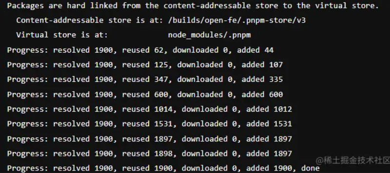

[TOC]

# symlinked-node-modules-structure

# 基于符号链接的 node_modules 结构

> *INFO* 
>
> 本文只介绍在没有包有 peer 依赖的情况下 pnpm 的 `node_modules` 是如何被构建的。 
>
> 对与有 peer 依赖的更复杂的场景，请看[peer 是如何被解决的](https://pnpm.io/zh/how-peers-are-resolved)。

pnpm 的 `node_modules` 布局使用**symbolic links (符号链接)**来创建依赖项的嵌套结构。

`node_modules` 中每个包的每个文件都是来自内容可寻址存储的 **hard link 硬链接**。 

假设您安装了依赖于 `bar@1.0.0` 的 `foo@1.0.0`。 pnpm 会将两个包硬链接到 `node_modules` 如下所示：

```text
node_modules
└── .pnpm
    ├── bar@1.0.0
    │   └── node_modules
    │       └── bar -> <store>/bar
    │           ├── index.js
    │           └── package.json
    └── foo@1.0.0
        └── node_modules
            └── foo -> <store>/foo
                ├── index.js
                └── package.json
```


这是 `node_modules` 中的唯一的“真实”文件。 一旦所有包都硬链接到 `node_modules`，就会创建符号链接来构建**嵌套的依赖关系图结构**。

您可能已经注意到，这两个包都硬链接到一个 `node_modules` 文件夹（`foo@1.0.0/node_modules/foo`）内的子文件夹中。 这必要的：

1. **允许包自行导入自己。** `foo` 应该能够 `require('foo/package.json')` 或者 `import * as package from "foo/package.json"`。
2. **避免循环符号链接。** 依赖以及需要依赖的包被放置在一个文件夹下。 对于 Node.js 来说，依赖是在包的内部 `node_modules` 中或在任何其它在父目录 `node_modules` 中是没有区别的。

安装的下一阶段是符号链接依赖项。 `bar` 将被符号链接到 `foo@1.0.0/node_modules` 文件夹：

```text
node_modules
└── .pnpm
    ├── bar@1.0.0
    │   └── node_modules
    │       └── bar -> <store>/bar
    └── foo@1.0.0
        └── node_modules
            ├── foo -> <store>/foo
            └── bar -> ../../bar@1.0.0/node_modules/bar
```


接下来，处理直接依赖关系。 `foo` 将被符号链接至根目录的 `node_modules` 文件夹，因为 `foo` 是项目的依赖项：

```text
node_modules
├── foo -> ./.pnpm/foo@1.0.0/node_modules/foo
└── .pnpm
    ├── bar@1.0.0
    │   └── node_modules
    │       └── bar -> <store>/bar
    └── foo@1.0.0
        └── node_modules
            ├── foo -> <store>/foo
            └── bar -> ../../bar@1.0.0/node_modules/bar
```


这是一个非常简单的例子。 但是，**无论依赖项的数量和依赖关系图的深度如何，布局都会保持这种结构。**

让我们添加 `qar@2.0.0` 作为 `bar` 和 `foo` 的依赖项 (**嵌套依赖**) 。 这是新的结构的样子：

```text
node_modules
├── foo -> ./.pnpm/foo@1.0.0/node_modules/foo
└── .pnpm
    ├── bar@1.0.0
    │   └── node_modules
    │       ├── bar -> <store>/bar
    │       └── qar -> ../../qar@2.0.0/node_modules/qar
    ├── foo@1.0.0
    │   └── node_modules
    │       ├── foo -> <store>/foo
    │       ├── bar -> ../../bar@1.0.0/node_modules/bar
    │       └── qar -> ../../qar@2.0.0/node_modules/qar
    └── qar@2.0.0
        └── node_modules
            └── qar -> <store>/qar
```


如您所见，**即使图形现在更深（`foo > bar > qar`），但目录深度仍然相同**。

这种布局乍一看可能很奇怪，但它与 Node 的模块解析算法完全兼容！ 解析模块时，Node 会忽略符号链接，因此当 `foo@1.0.0/node_modules/foo/index.js` 需要 `bar` 时，Node 不会使用在 `foo@1.0.0/node_modules/bar` 的 `bar`，相反，`bar` 是被解析到其实际位置（`bar@1.0.0/node_modules/bar`）。 因此，`bar` 也可以解析其在 `bar@1.0.0/node_modules` 中的依赖项。

这种布局的一大好处是只有真正在依赖项中的包才能访问。 使用平铺的 `node_modules` 结构，所有被提升的包都可以访问。 要了解更多关于为什么这是一个优势，见“[pnpm 的严格性有助于避免愚蠢的错误](https://www.kochan.io/nodejs/pnpms-strictness-helps-to-avoid-silly-bugs.html)”。


# [Linux软链接和硬链接](https://www.cnblogs.com/itech/archive/2009/04/10/1433052.html)

Linux链接分两种，一种被称为硬链接（Hard Link），另一种被称为符号链接（Symbolic Link）。

默认情况下，ln命令产生硬链接。

【硬连接】
硬连接指**通过索引节点来进行连接**。

在Linux的文件系统中，保存在磁盘分区中的文件不管是什么类型都给它分配一个编号，称为索引节点号(Inode Index)。在Linux中，**多个文件名指向同一索引节点是存在的。一般这种连接就是硬连接**。

**硬连接的作用是允许一个文件拥有多个有效路径名**，这样用户就可以建立硬连接到重要文件，以防止“误删”的功能。其原因如上所述，因为对应该目录的索引节点有一个以上的连接。**只删除一个连接**并不影响索引节点本身和其它的连接，**只有当最后一个连接被删除后**，文件的数据块及目录的连接才会被释放。也就是说，**文件真正删除的条件是与之相关的所有硬连接文件均被删除**。


【软链接】
另外一种连接称之为**符号连接（Symbolic Link）**，也叫软链接。

软链接文件有类似于Windows的快捷方式。

它实际上是一个特殊的文件。在符号连接中，**文件实际上是一个文本文件，其中包含的有另一文件的位置信息**。


## 应用场景

### 硬链接

1. 文件备份：为了防止重要的文件被误删，文件备份是一种好的办法，但拷贝文件会带来磁盘空间的消耗。**硬链接能不占用磁盘空间实现文件备份**。
2. 文件共享：多人共同维护同一份文件时，可以通过硬链接的方式，在私人目录里创建硬链接，每个人的修改都能同步到源文件，但又避免某个人误删就丢掉了文件的问题。
3. 文件分类：不同的文件资源需要分类，比如某个电影即是的分类是外国、悬疑，那我们可以在外国的文件夹和悬疑的文件夹里分别创建硬链接，这样可以避免重复拷贝电影浪费磁盘空间。有人可能说，使用软链接不也可以吗？是的，但不太好。因为一旦源文件移动位置或者重命名，软链接就失效了。

### 软链接

1. 快捷方式：**对于路径很深的文件，查找起来不太方便。利用软链接在桌面创建快捷方式**，可以迅速打开并编辑文件。
2. 灵活切换程序版本：对于机器上同时存在多个版本的程序，可以通过更改软链接的指向，从而迅速切换程序版本。[这里](https://link.juejin.cn?target=https%3A%2F%2Fwww.eet-china.com%2Fmp%2Fa76055.html)提到了python版本的切换可以这么做。
3. 动态库版本管理：不是很懂，具体可以看[这里](https://link.juejin.cn?target=https%3A%2F%2Fwww.eet-china.com%2Fmp%2Fa76055.html)。


## pnpm 是怎么做到如此大的提升的呢？ [juejin](https://juejin.cn/post/7043998041786810398#heading-9)

### Store

`pnpm`资源在磁盘上的存储位置。

`pnpm` 使用名为 .pnpm-store的 [store dir](https://link.juejin.cn?target=https%3A%2F%2Fpnpm.io%2Fzh%2Fnpmrc%23store-dir)，Mac/linux中默认会设置到`{home dir}>/.pnpm-store/v3`；windows下会设置到当前盘的根目录下，比如C（`C/.pnpm-store/v3`）、D盘（`D/.pnpm-store/v3`）。


### Links（hard link & symbolic link）

还记得文章刚开始，放了两张beachmark的图表，图表上可以看到很明显的性能提升（如果你使用过，感触会更明显）！

pnpm 是怎么做到如此大的提升的呢？一部分原因是使用了计算机当中的 **[Hard link](https://link.juejin.cn?target=https%3A%2F%2Fzh.wikipedia.org%2Fwiki%2F%E7%A1%AC%E9%93%BE%E6%8E%A5)** ，它减少了文件下载的数量，从而提升了下载和响应速度。

#### hard link 机制

通过`hard link`， 用户可以通过不同的路径引用方式去找到某个文件，需要注意的是一般用户权限下只能硬链接到文件，**不能用于目录**。

`pnpm` 会**在`Store`(上面的Store) 目录里**存储项目 `node_modules` 文件的 `hard links` ，通过访问这些link直接访问文件资源。

举个例子，例如项目里面有个 2MB 的依赖 `react`，在 pnpm 中，看上去这个 `react`依赖同时占用了 2MB 的 node_modules 目录以及全局 store 目录 2MB 的空间(加起来是 4MB)，但因为 `hard link` 的机制使得两个目录下相同的 2MB 空间能从两个不同位置进行`CAS寻址`直接引用到文件，因此实际上这个`react`依赖只用占用2MB 的空间，而不是4MB。

因为这样一个机制，导致每次安装依赖的时候，如果是个相同的依赖，有好多项目都用到这个依赖，那么这个依赖实际上最优情况(即版本相同)只用安装一次。

而在`npm`和`yarn`中，如何一个依赖被多个项目使用，会发生多次下载和安装！

如果是 npm 或 yarn，那么这个依赖在多个项目中使用，在每次安装的时候都会被重新下载一次。



如图可以看到在使用 pnpm 对项目安装依赖的时候，**如果某个依赖在 store 目录中存在了话，那么就会直接从 store 目录里面去 hard-link**，避免了二次安装带来的时间消耗，如果依赖在 store 目录里面不存在的话，就会去下载一次。

通过`Store` + `hard link`的方式，不仅解决了项目中的**NPM doppelgangers (分身) **问题，项目之间也不存在该问题，从而完美解决了`npm3+`和`yarn`中的包重复问题！

### **如果随着项目越来越大，版本变更变多，历史版本的资源会堆积，导致`Store`目录越来越大，那如何解决这个问题呢？**

针对这个现象，pnpm 提供了一个**命令**来解决这个问题: [pnpm store | pnpm](https://link.juejin.cn?target=https%3A%2F%2Fpnpm.io%2Fcli%2Fstore)。

同时该命令提供了一个选项，使用方法为 `pnpm store prune`   (prune: 修剪)，它提供了一种用于**删除一些不被全局项目所引用到的 packages** 的功能，例如有个包 `axios@1.0.0` 被一个项目所引用了，但是某次修改使得项目里这个包被更新到了 `1.0.1` ，那么 store 里面的 1.0.0 的 axios 就就成了个不被引用的包，执行 `pnpm store prune` 就可以在 store 里面删掉它了。

该命令推荐偶尔进行使用，但不要频繁使用，因为可能某天这个不被引用的包又突然被哪个项目引用了，这样就可以不用再去重新下载这个包了。

#### symbolic link

**由于`hark link`只能用于文件不能用于目录**，但是`pnpm`的`node_modules`是树形目录结构，那么如何链接到文件？ 通过`symbolic link`（也可称之为软链或者符号链接）来实现！

通过前面的讲解，我们知道了`pnpm`在全局通过`Store`来存储所有的node_modules依赖，并且在`.pnpm/node_modules`中存储项目的hard links，通过`hard link`来链接真实的文件资源，**项目中则通过`symbolic link`链接到`.pnpm/node_modules`目录中，依赖放置在同一级别避免了循环的软链。**

`pnpm` 的 `node_modules` 结构一开始看起来很奇怪：

1. 它完全适配了 Node.js。
2. 包与其依赖被完美地组织在一起。


### 有 peer 依赖的包的结构[更加复杂](https://link.juejin.cn/?target=https%3A%2F%2Fpnpm.io%2Fzh%2Fhow-peers-are-resolved)一些，但思路是一样的：使用软链与平铺目录来构建一个嵌套结构。