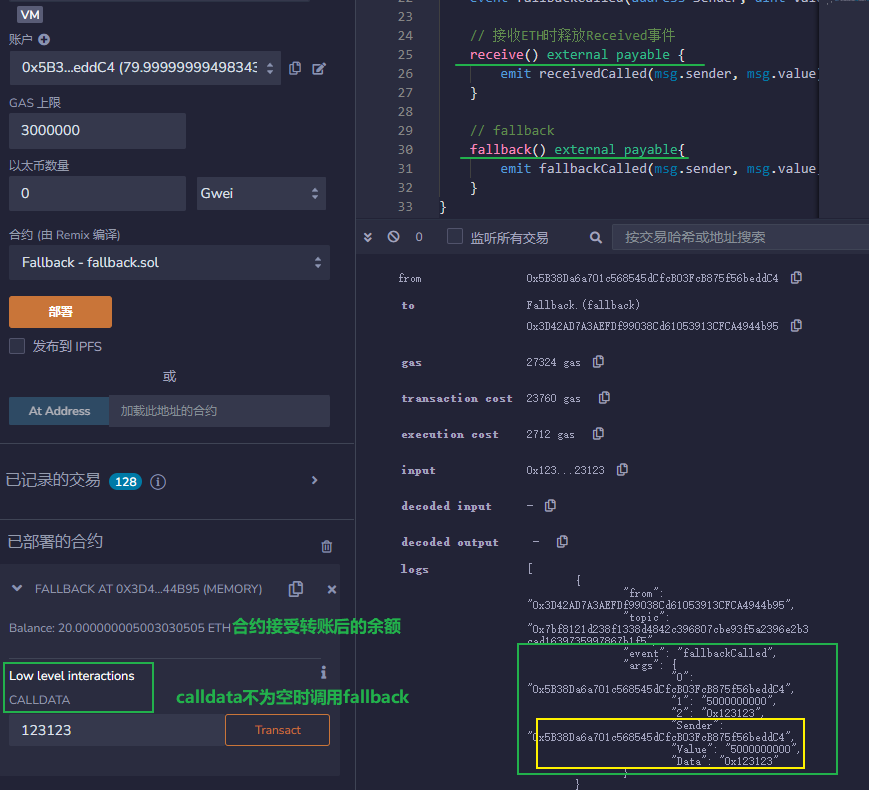
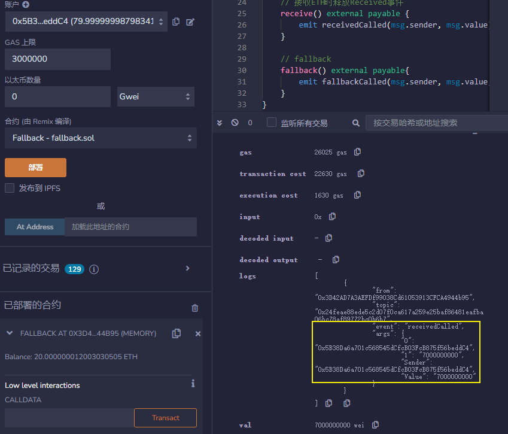

[toc]

# 接收ETH receive和fallback

`Solidity`支持两种特殊的回调函数，`receive()`和`fallback()`，他们主要在两种情况下被使用：

1. **接收ETH**
2. 处理合约中不存在的函数调用（代理合约proxy contract）

## 接收ETH函数 receive

`receive()`函数是在合约收到`ETH`转账时被调用的函数。

一个合约最多有一个`receive()`函数，声明方式与一般函数不一样，不需要`function`关键字：`receive() external payable { ... }`。

`receive()`函数不能有任何的参数，不能返回任何值，必须包含`external`和`payable`。


当合约接收ETH的时候，`receive()`会被触发。`receive()`最好不要执行太多的逻辑因为如果别人用`send`和`transfer`方法发送`ETH`的话，`gas`会限制在`2300`，`receive()`太复杂可能会触发`Out of Gas`报错；如果用`call`就可以自定义`gas`执行更复杂的逻辑（这三种发送ETH的方法我们之后会讲到）。


可以在`receive()`里发送一个`event`，例如：

```
    // 定义事件
    event Received(address Sender, uint Value);
    // 接收ETH时释放Received事件
    receive() external payable {
        emit Received(msg.sender, msg.value);
    }
```

有些恶意合约，会在`receive()` 函数（老版本的话，就是 `fallback()` 函数）嵌入恶意消耗`gas`的内容或者使得执行故意失败的代码，导致一些包含退款和转账逻辑的合约不能正常工作，因此写包含退款等逻辑的合约时候，一定要注意这种情况。


## 回退函数 fallback

`fallback()`函数会在调用合约不存在的函数时被触发。可用于接收ETH，也可以用于代理合约`proxy contract`。

`fallback()`声明时不需要`function`关键字，必须由`external`修饰，一般也会用`payable`修饰，用于接收ETH:`fallback() external payable { ... }`。

我们定义一个`fallback()`函数，被触发时候会释放`fallbackCalled`事件，并输出`msg.sender`，`msg.value`和`msg.data`:

```solidity
    event fallbackCalled(address Sender, uint Value, bytes Data);

    // fallback
    fallback() external payable{
        emit fallbackCalled(msg.sender, msg.value, msg.data);
    }
```


## receive和fallback的区别

`receive`和`fallback`都能够用于接收`ETH`，他们触发的规则如下：

```
触发fallback() 还是 receive()?
           接收ETH
              |
         msg.data是空？ // 完整calldata
            /  \
          是    否
          /      \
receive()存在?   fallback()
        / \
       是  否
      /     \
receive()   fallback()
```

简单来说，合约接收`ETH`时，

- `msg.data`为空**且**存在`receive()`时，会触发`receive()`；
- `msg.data`不为空或不存在`receive()`时，会触发`fallback()`，此时`fallback()`必须为`payable`。

`receive()`和`payable fallback()`均不存在的时候，向合约**直接**发送`ETH`将会报错（你仍可以通过带有`payable`的函数向合约发送`ETH`）。





# 发送ETH

`Solidity`有三种方法向其他合约发送`ETH`，他们是：`transfer()`，`send()`和`call()`，其中`call()`是被鼓励的用法。

## 接收ETH合约

先部署一个接收`ETH`合约`ReceiveETH`用于验证

`ReceiveETH`合约里有一个事件`Log`，记录收到的`ETH`数量和`gas`剩余。还有两个函数，一个是`receive()`函数，收到`ETH`被触发，并发送`Log`事件；另一个是查询合约`ETH`余额的`getBalance()`函数。

```
contract ReceiveETH {
    // 收到eth事件，记录amount和gas
    event Log(uint amount, uint gas);
    
    // receive方法，接收eth时被触发
    receive() external payable{
        emit Log(msg.value, gasleft());
    }
    
    // 返回合约ETH余额
    function getBalance() view public returns(uint) {
        return address(this).balance;
    }
}
```

## 发送ETH合约

### transfer

- 用法是`接收方地址.transfer(发送ETH数额)`。
- `transfer()`的`gas`限制是`2300`，足够用于转账，但对方合约的`fallback()`或`receive()`函数不能实现太复杂的逻辑。
- `transfer()`如果转账失败，会自动`revert`（回滚交易）。

### send

- 用法是`接收方地址.send(发送ETH数额)`。
- `send()`的`gas`限制是`2300`，足够用于转账，但对方合约的`fallback()`或`receive()`函数不能实现太复杂的逻辑。
- `send()`如果转账失败，不会`revert`。
- `send()`的返回值是`bool`，代表着转账成功或失败，需要额外代码处理一下。

### call

- 用法是`接收方地址.call{value: 发送ETH数额}("")`。
- `call()`没有`gas`限制，可以支持对方合约`fallback()`或`receive()`函数实现复杂逻辑。
- `call()`如果转账失败，不会`revert`。
- `call()`的返回值是`(bool, data)`，其中`bool`代表着转账成功或失败，需要额外代码处理一下。

这一讲，我们介绍`solidity`三种发送`ETH`的方法：`transfer`，`send`和`call`。

- `call`没有`gas`限制，最为灵活，是最提倡的方法；
- `transfer`有`2300 gas`限制，但是发送失败会自动`revert`交易，是次优选择；
- `send`有`2300 gas`限制，而且发送失败不会自动`revert`交易，几乎没有人用它。

```solidity
    // 用transfer()发送ETH
function transferETH(address payable _to, uint256 amount) external payable{
	_to.transfer(amount);
}
// send()发送ETH
function sendETH(address payable _to, uint256 amount) external payable{
    // 处理下send的返回值，如果失败，revert交易并发送error
    bool success = _to.send(amount);
    if(!success){
    	revert SendFailed();
    }
}
// call()发送ETH
function callETH(address payable _to, uint256 amount) external payable{
    // 处理下call的返回值，如果失败，revert交易并发送error
    (bool success,) = _to.call{value: amount}("");
    if(!success){
    	revert CallFailed();
    }
}
```

