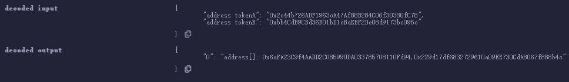
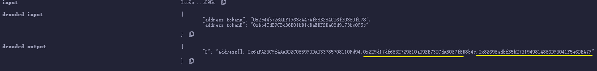
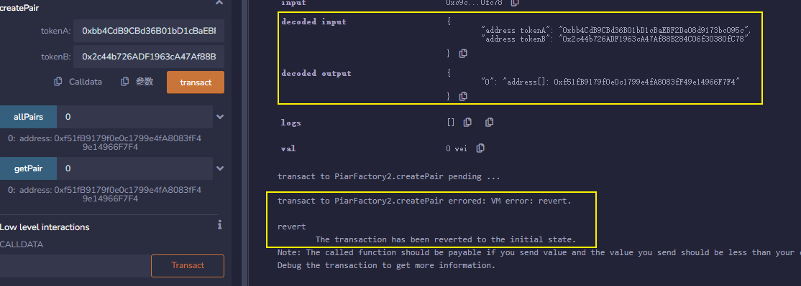
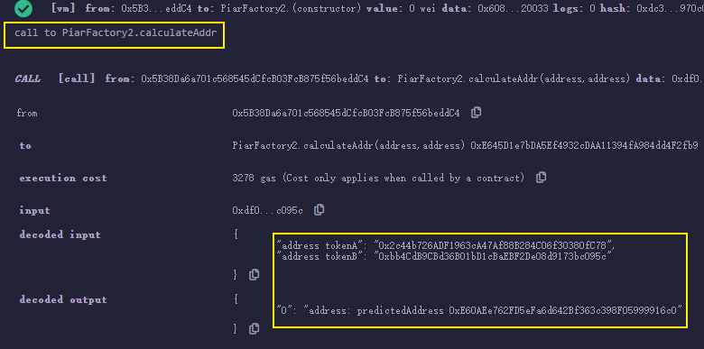
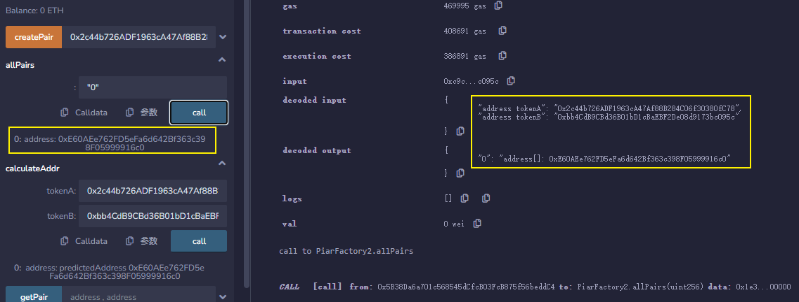

[toc]

# 在合约中创建新合约

用户（外部账户，`EOA`）可以创建智能合约

智能合约同样也可以创建新的智能合约。

去中心化交易所`uniswap`就是利用工厂合约（`PairFactory`）创建了无数个币对合约（`Pair`）。这一讲，我会用简化版的`uniswap`讲如何通过合约创建合约。

## `create`

有两种方法可以在合约中创建新合约，`create`和`create2`，这里我们讲`create`，下一讲会介绍`create2`。

`create`的用法很简单，就是`new`一个合约，并传入新合约构造函数所需的参数：

```solidity
Contract x = new Contract{value: _value}(params)
```

其中`Contract`是要创建的合约名，`x`是合约对象（地址），如果构造函数是`payable`，可以创建时转入`_value`数量的`ETH`，`params`是新合约构造函数的参数。

### `Pair`合约

```solidity
contract Pair{
    address public factory; // 工厂合约地址
    address public token0; // 代币1
    address public token1; // 代币2

    constructor() payable {
        factory = msg.sender;
    }

    // called once by the factory at time of deployment
    function initialize(address _token0, address _token1) external {
        require(msg.sender == factory, 'UniswapV2: FORBIDDEN'); // sufficient check
        token0 = _token0;
        token1 = _token1;
    }
}
```


`Pair`合约很简单，包含3个状态变量：`factory`，`token0`和`token1`。

构造函数`constructor`在部署时将`factory`赋值为工厂合约地址。`initialize`函数会由工厂合约在部署完成后手动调用以初始化代币地址，将`token0`和`token1`更新为币对中两种代币的地址。

> **提问**：为什么`uniswap`不在`constructor`中将`token0`和`token1`地址更新好？
>
> **答**：因为`uniswap`使用的是`create2`创建合约，生成的合约地址可以实现预测，更多详情请阅读[第25讲](https://github.com/AmazingAng/WTF-Solidity/blob/main/25_Create2/readme.md)。


### `PairFactory`

```solidity
contract PairFactory{
    mapping(address => mapping(address => address)) public getPair; // 通过两个代币地址查Pair地址
    address[] public allPairs; // 保存所有Pair地址

    function createPair(address tokenA, address tokenB) external returns (address pairAddr) {
        // 创建新合约
        Pair pair = new Pair(); 
        // 调用新合约的initialize方法
        pair.initialize(tokenA, tokenB);
        // 更新地址map
        pairAddr = address(pair);
        allPairs.push(pairAddr);
        getPair[tokenA][tokenB] = pairAddr;
        getPair[tokenB][tokenA] = pairAddr;
    }
}
```

工厂合约（`PairFactory`）有两个状态变量`getPair`是两个代币地址到币对地址的`map`，方便根据代币找到币对地址；`allPairs`是币对地址的数组，存储了所有代币地址。

`PairFactory`合约只有一个`createPair`函数，根据输入的两个代币地址`tokenA`和`tokenB`来创建新的`Pair`合约。其中

```
    Pair pair = new Pair(); 
```


就是创建合约的代码，非常简单。大家可以部署好`PairFactory`合约，然后用下面两个地址作为参数调用`createPair`，看看创建的币对地址是什么：

```
WBNB地址: 0x2c44b726ADF1963cA47Af88B284C06f30380fC78
BSC链上的PEOPLE地址: 0xbb4CdB9CBd36B01bD1cBaEBF2De08d9173bc095c
```






同样的币对地址也不会生成相同的地址

## CREATE2

### CREATE如何计算地址

智能合约可以由其他合约和普通账户利用`CREATE`操作码创建。 

在这两种情况下，新合约的地址都**以相同的方式计算**：创建者的地址(通常为部署的钱包地址或者合约地址)和`nonce`(该地址发送交易的总数,对于合约账户是创建的合约总数,每创建一个合约nonce+1))的哈希。

```
新地址 = hash(创建者地址, nonce)
```


创建者地址不会变，但`nonce`可能会随时间而改变，因此用`CREATE`创建的合约地址不好预测。

### CREATE2如何计算地址

`CREATE2`的目的是为了让合约地址独立于未来的事件。不管未来区块链上发生了什么，你都可以把合约部署在事先计算好的地址上。

用`CREATE2`创建的合约地址由4个部分决定：

- `0xFF`：一个常数，避免和`CREATE`冲突
- `CreatorAddress`: 调用 Create2 的当前合约（创建合约）地址。
- `salt`（盐）：一个创建者指定的 uint256 类型的值，的主要目的是用来影响新创建的合约的地址。
- `initcode`: 新合约的初始字节码（合约的Creation Code和构造函数的参数）。

```
新地址 = hash("0xFF",创建者地址, salt, initcode)
```


`CREATE2` 确保，如果创建者使用 `CREATE2` 和提供的 `salt` 部署给定的合约`initcode`，它将存储在 `新地址` 中。


## 如何使用`CREATE2`

`CREATE2`的用法和之前讲的`Create`类似，同样是`new`一个合约，并传入新合约构造函数所需的参数，只不过要多传一个`salt`参数：

```solidity
Contract x = new Contract{salt: _salt, value: _value}(params)
```


其中`Contract`是要创建的合约名，`x`是合约对象（地址），`_salt`是指定的盐；如果构造函数是`payable`，可以创建时转入`_value`数量的`ETH`，`params`是新合约构造函数的参数。

## 极简Uniswap2

### `PairFactory2`

```diff
contract PairFactory2{
        mapping(address => mapping(address => address)) public getPair; // 通过两个代币地址查Pair地址
        address[] public allPairs; // 保存所有Pair地址

        function createPair2(address tokenA, address tokenB) external returns (address pairAddr) {
            require(tokenA != tokenB, 'IDENTICAL_ADDRESSES'); //避免tokenA和tokenB相同产生的冲突
+            // 用tokenA和tokenB地址计算salt
+            (address token0, address token1) = tokenA < tokenB ? (tokenA, tokenB) : (tokenB, tokenA); //将tokenA和tokenB按大小排序
+            bytes32 salt = keccak256(abi.encodePacked(token0, token1));
+            // 用create2部署新合约
+            Pair pair = new Pair{salt: salt}(); 
            // 调用新合约的initialize方法
            pair.initialize(tokenA, tokenB);
            // 更新地址map
            pairAddr = address(pair);
            allPairs.push(pairAddr);
            getPair[tokenA][tokenB] = pairAddr;
            getPair[tokenB][tokenA] = pairAddr;
        }
```

其中

```
    Pair pair = new Pair{salt: salt}(); 
```


就是利用`CREATE2`创建合约的代码，非常简单，而`salt`为`token1`和`token2`的`hash`：

```
    bytes32 salt = keccak256(abi.encodePacked(token0, token1));
```



同样的币对第二次生成就会报错

### 事先计算`Pair`地址

```solidity
        // 提前计算pair合约地址
        function calculateAddr(address tokenA, address tokenB) public view returns(address predictedAddress){
            require(tokenA != tokenB, 'IDENTICAL_ADDRESSES'); //避免tokenA和tokenB相同产生的冲突
            // 计算用tokenA和tokenB地址计算salt
            (address token0, address token1) = tokenA < tokenB ? (tokenA, tokenB) : (tokenB, tokenA); //将tokenA和tokenB按大小排序
            bytes32 salt = keccak256(abi.encodePacked(token0, token1));
            // 计算合约地址方法 hash()
            predictedAddress = address(uint160(uint(keccak256(abi.encodePacked(
                bytes1(0xff),
                address(this),
                salt,
                keccak256(type(Pair).creationCode)
            )))));
        }
```


`calculateAddr`函数来事先计算`tokenA`和`tokenB`将会生成的`Pair`地址。通过它，我们可以验证我们事先计算的地址和实际地址是否相同。







#### 如果部署合约构造函数中存在参数

例如当create2合约时：

> Pair pair = new Pair{salt: salt}(address(this));

计算时，需要将参数和initcode一起进行打包：

```diff
- keccak256(type(Pair).creationCode) => 
+ keccak256(abi.encodePacked(type(Pair).creationCode, abi.encode(address(this))))
```

```solidity
predictedAddress = address(uint160(uint(keccak256(abi.encodePacked(
                bytes1(0xff),
                address(this),
                salt,
                keccak256(abi.encodePacked(type(Pair).creationCode, abi.encode(address(this))))
            )))));
```


## create2的实际应用场景

1. 交易所为新用户**预留创建钱包合约地址**。
2. 由 `CREATE2` 驱动的 `factory` 合约，在`uniswapV2`中交易对的创建是在 `Factory`中调用`create2`完成。这样做的好处是: 它可以得到一个确定的`pair`地址, 使得 `Router`中就可以通过 `(tokenA, tokenB)` 计算出`pair`地址, 不再需要执行一次 `Factory.getPair(tokenA, tokenB)` 的跨合约调用。


# 删除合约

## `selfdestruct`

`selfdestruct`命令可以用来删除智能合约，并将该合约剩余`ETH`转到指定地址。`selfdestruct`是为了应对合约出错的极端情况而设计的。

`selfdestruct` 关键字被标记为「不再建议使用」，在一些情况下它会导致预期之外的合约语义，但由于目前还没有代替方案，目前只是对开发者做了编译阶段的警告，相关内容可以查看 [EIP-6049](https://eips.ethereum.org/EIPS/eip-6049)。

### 如何使用`selfdestruct`

`selfdestruct`使用起来非常简单：

```
selfdestruct(_addr)；
```


其中`_addr`是接收合约中剩余`ETH`的地址。

### 例子

```
contract DeleteContract {

    uint public value = 10;

    constructor() payable {}

    receive() external payable {}

    function deleteContract() external {
        // 调用selfdestruct销毁合约，并把剩余的ETH转给msg.sender
        selfdestruct(payable(msg.sender));
    }

    function getBalance() external view returns(uint balance){
        balance = address(this).balance;
    }
}
```


在`DeleteContract`合约中，我们写了一个`public`状态变量`value`，两个函数：`getBalance()`用于获取合约`ETH`余额，`deleteContract()`用于自毁合约，并把`ETH`转入给发起人。

### 注意事项

1. 对外提供合约销毁接口时，最好设置为只有合约所有者可以调用，可以**使用函数修饰符`onlyOwner`**进行函数声明。
2. 当合约被销毁后与智能合约的交互也能成功，并且返回0。
3. 当合约中有`selfdestruct`功能时常常会带来**安全问题和信任问题**，合约中的Selfdestruct功能会为攻击者打开攻击向量(例如使用`selfdestruct`向一个合约频繁转入token进行攻击，这将大大节省了GAS的费用，虽然很少人这么做)，此外，此功能还会降低用户对合约的信心。