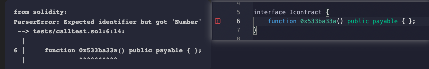
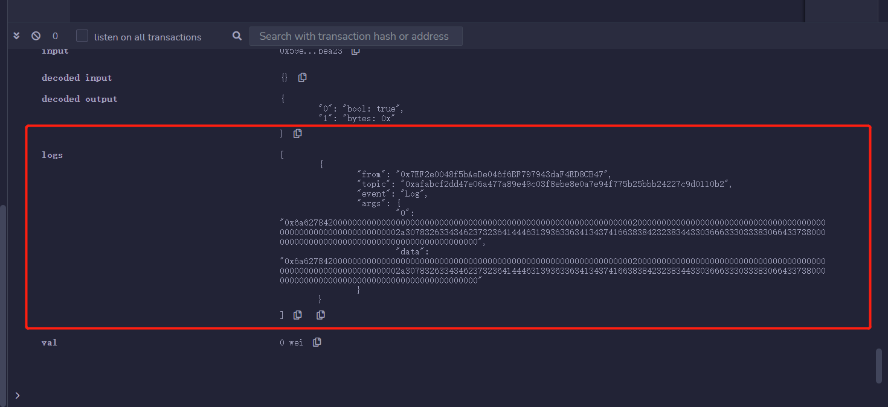

[toc]

# ABI编码解码

`ABI` (Application Binary Interface，应用二进制接口)是与以太坊智能合约交互的标准。

数据基于他们的类型编码；并且由于编码后不包含类型信息，解码时需要注明它们的类型。

`Solidity`中，`ABI编码`有4个函数：

- `abi.encode`,
- `abi.encodePacked`, 
- `abi.encodeWithSignature`, 
- `abi.encodeWithSelector`。

而`ABI解码`有1个函数：`abi.decode`，用于解码`abi.encode`的数据。

## ABI编码

我们将编码4个变量，他们的类型分别是`uint256`（别名 uint）, `address`, `string`, `uint256[2]`

```solidity
    uint x = 10;
    address addr = 0x7A58c0Be72BE218B41C608b7Fe7C5bB630736C71;
    string name = "0xAA";
    uint[2] array = [5, 6]; 
```

### `abi.encode`

将给定参数利用[ABI规则](https://learnblockchain.cn/docs/solidity/abi-spec.html)编码。`ABI`被设计出来跟智能合约交互，他将每个参数填充为32字节的数据，并拼接在一起。如果你要和合约交互，你要用的就是`abi.encode`。

```solidity
function encode() public view returns(bytes memory result) {
    result = abi.encode(x, addr, name, array);
}
```


编码的结果为

`0x000000000000000000000000000000000000000000000000000000000000000a0000000000000000000000007a58c0be72be218b41c608b7fe7c5bb630736c7100000000000000000000000000000000000000000000000000000000000000a00000000000000000000000000000000000000000000000000000000000000005000000000000000000000000000000000000000000000000000000000000000600000000000000000000000000000000000000000000000000000000000000043078414100000000000000000000000000000000000000000000000000000000`，由于`abi.encode`将每个数据都填充为32字节，中间有很多`0`。

### `abi.encodePacked`

将给定参数根据其所需最低空间编码。它类似 `abi.encode`，但是会把其中填充的很多`0`省略。比如，只用1字节来编码`uint8`类型。当你想省空间，并且不与合约交互的时候，可以使用`abi.encodePacked`，例如算一些数据的`hash`时。

```
    function encodePacked() public view returns(bytes memory result) {
        result = abi.encodePacked(x, addr, name, array);
    }
```


编码的结果为`0x000000000000000000000000000000000000000000000000000000000000000a7a58c0be72be218b41c608b7fe7c5bb630736c713078414100000000000000000000000000000000000000000000000000000000000000050000000000000000000000000000000000000000000000000000000000000006`，由于`abi.encodePacked`对编码进行了压缩，长度比`abi.encode`短很多。


### `abi.encodeWithSignature`

与`abi.encode`功能类似，只不过**第一个参数为`函数签名`**，比如`"foo(uint256,address,string,uint256[2])"`。当调用其他合约的时候可以使用。

```
    function encodeWithSignature() public view returns(bytes memory result) {
        result = abi.encodeWithSignature("foo(uint256,address,string,uint256[2])", x, addr, name, array);
    }
```


编码的结果为`0xe87082f1000000000000000000000000000000000000000000000000000000000000000a0000000000000000000000007a58c0be72be218b41c608b7fe7c5bb630736c7100000000000000000000000000000000000000000000000000000000000000a00000000000000000000000000000000000000000000000000000000000000005000000000000000000000000000000000000000000000000000000000000000600000000000000000000000000000000000000000000000000000000000000043078414100000000000000000000000000000000000000000000000000000000`，等同于在`abi.encode`编码**结果前加上了4字节**的`函数选择器`[1](https://github.com/AmazingAng/WTF-Solidity/blob/main/27_ABIEncode/readme.md#user-content-fn-说明-3309d9d83e86efe7410deeb66a71c584)。


### `abi.encodeWithSelector`

与`abi.encodeWithSignature`功能类似，只不过**第一个参数为`函数选择器`**，为`函数签名`Keccak哈希的**前4个字节** (bytes4)。

```solidity
    function encodeWithSelector() public view returns(bytes memory result) {
        result = abi.encodeWithSelector(bytes4(keccak256("foo(uint256,address,string,uint256[2])")), x, addr, name, array);
    }
```

编码的结果为`0xe87082f1000000000000000000000000000000000000000000000000000000000000000a0000000000000000000000007a58c0be72be218b41c608b7fe7c5bb630736c7100000000000000000000000000000000000000000000000000000000000000a00000000000000000000000000000000000000000000000000000000000000005000000000000000000000000000000000000000000000000000000000000000600000000000000000000000000000000000000000000000000000000000000043078414100000000000000000000000000000000000000000000000000000000`，与`abi.encodeWithSignature`结果一样。


## ABI解码

### `abi.decode`

`abi.decode`用于解码`abi.encode`生成的二进制编码，将它还原成原本的参数。


## ABI的使用场景

1. 在合约开发中，ABI常配合call来实现对合约的底层调用。

```
    bytes4 selector = contract.getValue.selector;

    bytes memory data = abi.encodeWithSelector(selector, _x);
    (bool success, bytes memory returnedData) = address(contract).staticcall(data);
    require(success);

    return abi.decode(returnedData, (uint256));
```


1. ethers.js中常用ABI实现合约的导入和函数调用。

```
    const wavePortalContract = new ethers.Contract(contractAddress, contractABI, signer);
    /*
        * Call the getAllWaves method from your Smart Contract
        */
    const waves = await wavePortalContract.getAllWaves();
```


1. 对不开源合约进行反编译后，某些函数无法查到函数签名，可通过ABI进行调用。

- 0x533ba33a() 是一个反编译后显示的函数，只有函数编码后的结果，并且无法查到函数签名 [](https://github.com/AmazingAng/WTF-Solidity/blob/main/27_ABIEncode/img/27-4.png) [](https://github.com/AmazingAng/WTF-Solidity/blob/main/27_ABIEncode/img/27-5.png)
- 这种情况无法通过构造interface接口或contract来进行调用 [](https://github.com/AmazingAng/WTF-Solidity/blob/main/27_ABIEncode/img/27-6.png)

这种情况下，就可以通过ABI函数选择器来调用

```
    bytes memory data = abi.encodeWithSelector(bytes4(0x533ba33a));

    (bool success, bytes memory returnedData) = address(contract).staticcall(data);
    require(success);

    return abi.decode(returnedData, (uint256));
```


## 总结

在以太坊中，数据必须编码成字节码才能和智能合约交互。这一讲，我们介绍了4种`abi编码`方法和1种`abi解码`方法。


# 哈希函数（hash function）

哈希函数（hash function）是一个密码学概念，它可以将任意长度的消息转换为一个固定长度的值，这个值也称作哈希（hash）。

## Hash的性质

一个好的哈希函数应该具有以下几个特性：

- 单向性：从输入的消息到它的哈希的正向运算简单且唯一确定，而反过来非常难，只能靠暴力枚举。
- 灵敏性：输入的消息改变一点对它的哈希改变很大。
- 高效性：从输入的消息到哈希的运算高效。
- 均一性：每个哈希值被取到的概率应该基本相等。
- 抗碰撞性：
  - 弱抗碰撞性：给定一个消息`x`，找到另一个消息`x'`使得`hash(x) = hash(x')`是困难的。
  - 强抗碰撞性：找到任意`x`和`x'`，使得`hash(x) = hash(x')`是困难的。

## Hash的应用

- 生成数据唯一标识
- 加密签名
- 安全加密

## Keccak256

`Keccak256`函数是`solidity`中最常用的哈希函数，用法非常简单：

```
哈希 = keccak256(数据);
```


### Keccak256和sha3

这是一个很有趣的事情：

1. sha3由keccak标准化而来，在很多场合下Keccak和SHA3是同义词，但在2015年8月SHA3最终完成标准化时，NIST调整了填充算法。**所以SHA3就和keccak计算的结果不一样**，这点在实际开发中要注意。
2. 以太坊在开发的时候sha3还在标准化中，所以采用了keccak，所以Ethereum和Solidity智能合约代码中的SHA3是指Keccak256，而不是标准的NIST-SHA3，为了避免混淆，直接在合约代码中写成Keccak256是最清晰的

### 生成数据唯一标识

我们可以利用`keccak256`来生成一些数据的唯一标识。比如我们有几个不同类型的数据：`uint`，`string`，`address`，我们可以先用`abi.encodePacked`方法将他们打包编码，然后再用`keccak256`来生成唯一标识：

```solidity
    function hash(
        uint _num,
        string memory _string,
        address _addr
    ) public pure returns (bytes32) {
        return keccak256(abi.encodePacked(_num, _string, _addr));
    }
```


# 函数选择器

## `selector`

当我们调用智能合约时，本质上是向目标合约发送了一段`calldata`，在remix中发送一次交易后，可以在详细信息中看见`input`即为此次交易的`calldata`

发送的`calldata`中前4个字节是`selector`（函数选择器）。

### `msg.data`

`msg.data`是`solidity`中的一个全局变量，值为完整的`calldata`（调用函数时传入的数据）。

在下面的代码中，我们可以通过`Log`事件来输出调用`mint`函数的`calldata`：

```
    // event 返回msg.data
    event Log(bytes data);

    function mint(address to) external{
        emit Log(msg.data);
    }
```


当参数为`0x2c44b726ADF1963cA47Af88B284C06f30380fC78`时，输出的`calldata`为

```
0x6a6278420000000000000000000000002c44b726adf1963ca47af88b284c06f30380fc78
```


这段很乱的字节码可以分成两部分：

```
前4个字节为函数选择器selector：
0x6a627842 // 4个字节~4*8bit~

后面32个字节为输入的参数：
0x0000000000000000000000002c44b726adf1963ca47af88b284c06f30380fc78
```

其实`calldata`就是告诉智能合约，我要调**用哪个函数，以及参数**是什么。

### `method id`、`selector`和`函数签名`

**`method id`定义为`函数签名`的`Keccak`哈希后的前4个字节，当`selector`与`method id`相匹配时，即表示调用该函数**，那么`函数签名`是什么？

其实在第21讲中，我们简单介绍了函数签名，为`"函数名（逗号分隔的参数类型)"`。

举个例子，上面代码中`mint`的函数签名为`"mint(address)"`。

在同一个智能合约中，不同的函数有不同的函数签名，因此我们可以通过函数签名来确定要调用哪个函数。

**注意**，在函数签名中，`uint`和`int`要写为`uint256`和`int256`。

我们写一个函数，来验证`mint`函数的`method id`是否为`0x6a627842`。大家可以运行下面的函数，看看结果。

```
function mintSelector() external pure returns(bytes4 mSelector){
    return bytes4(keccak256("mint(address)"));
}
```

### 使用`selector`

我们可以利用`selector`来调用目标函数。例如我想调用`mint`函数，我只需要利用`abi.encodeWithSelector`将`mint`函数的`method id`作为`selector`和参数打包编码，传给`call`函数：

```
    function callWithSignature() external returns(bool, bytes memory){
        (bool success, bytes memory data) = address(this).call(abi.encodeWithSelector(0x6a627842, 0x2c44b726ADF1963cA47Af88B284C06f30380fC78));
        return(success, data);
    }
```


在日志中，我们可以看到`mint`函数被成功调用，并输出`Log`事件。

[](https://github.com/AmazingAng/WTF-Solidity/blob/main/29_Selector/img/29-3.png)

## 总结

这一讲，我们介绍了什么是`函数选择器`（`selector`），它和`msg.data`、`函数签名`的关系，以及如何使用它调用目标函数。