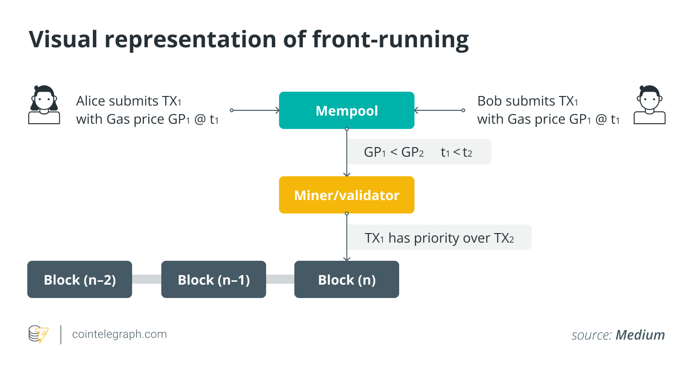

[toc]

# S11. 抢先交易

## Front-running

### 传统抢跑

抢跑最初诞生于传统金融市场，是一场单纯为了利益的竞赛。在金融市场中，信息差催生了金融中介机构，他们可以通过最先了解某些行业信息并最先做出反应从而实现获利。

2021 年 9 月，NFT 市场 OpenSea 的产品负责人 Nate Chastain，被发现通过抢先购买将在 OpenSea 首页展示的 NFT 获利。 他利用内幕信息来获得不公平的信息差，OpenSea 将要在首页推送哪些 NFT，然后在展出在首页前抢先买入，然后再在 NFT 登上首页后卖出。然而，有一个人通过将 NFT 交易时间戳与 OpenSea 上有问题的 NFT 的首页促销进行匹配，发现了这一非法行为，Nate 也被告上法院。

另一个传统抢跑的例子包括是**在代币上[币安](https://www.wsj.com/articles/crypto-might-have-an-insider-trading-problem-11653084398?mod=hp_lista_pos4)/[coinbase](https://www.protocol.com/fintech/coinbase-crypto-insider-trading)等知名交易所**之前，会有得知内幕消息的老鼠仓提前买入。在上币的公告发出后，币价会大幅上涨，这时抢跑者会卖出盈利。

### 链上抢跑

链上抢跑指的是搜索者或矿工通过调高`gas`或其他方法将自己的交易安插在其他交易之前，来攫取价值。在区块链中，矿工可以通过打包、排除或重新排序他们产生的区块中的交易来获得一定的利润，而`MEV`是衡量这种利润的指标。

在用户的交易被矿工打包进以太坊区块链之前，大部分交易会汇集到Mempool（交易内存池）中，矿工在这里寻找费用高的交易优先打包出块，实现利益最大化。通常来说，gas price越高的交易，越容易被打包。同时，一些`MEV`机器人也会搜索`mempool`中有利可图的交易。

比如，一笔在去中心化交易所中滑点设置过高的`swap`交易可能会被**三明治攻击**：通过调整gas，套利者会在这笔交易之前插一个买单，再在之后发送一个卖单，并从中盈利。这等效于哄抬市价。

## 抢跑实践

如果你学会了抢跑，你就算是入门的币圈科学家了。

接下来，让我们实践一下，抢跑一笔铸造NFT的交易。我们将会用到的工具：

- `Foundry`的`anvil`工具搭建本地测试链，请提前安装好 [foundry](https://book.getfoundry.sh/getting-started/installation)。
- `remix`进行NFT合约的部署和铸造
- `etherjs`脚本监听`mempool`并进行抢跑。

