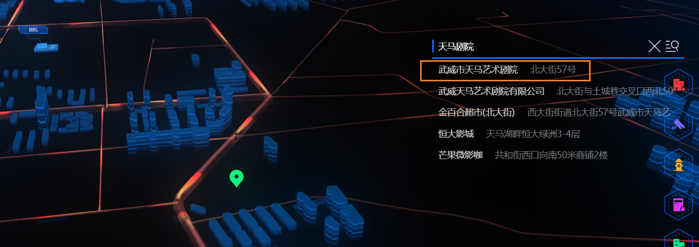
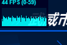

1. 室内图标 ----  1 + 1 + 2闪烁
2. 相机旋转动画传入旋转段数
3. 旋转速度受到会在进入楼栋后加快... 但是看speed 却没有增加, 清除mesh/options也不管用
   1. ... 由于进入的之后又执行了 begin 导致增加了raf的执行次数

1. 标注点加载
2. 点击标注点的弹窗提示
3. 主建筑中心店更换 (ok
4. 图片更改, center更改, (图片地址可以直接使用svg类型的
5. 图标切换svg类型的处理 ---- (delay)
   1. [参考](http://www.webgl3d.cn/threejs/examples/webgl_loader_svg.html)

1.  什么时候影藏这个弹窗吗?
2. view 2 add 这个传参需要重置, 
3. view时, 新增标注不会切换类型 ,
4. 不保存就没得删除键点了

偏移问题纠偏

5. 场景中影响卡顿的操作
   1. 合并mesh,geometry, 是否可以考虑在worker中处理, 
   2. 加载数据异步请求可不可以丢给worker
   3. 

6 整理下试用期工作 (ok

7. 使用draco压缩后的gltf格式的模型代替obj格式的模型

7. 火灾动画， 扇形旋转？ 扫描？ 墙体
8. 一、进入系统场景问题，场景出来稍慢，要加一个tif，数据加载动画
   二、场景卡顿的问题，还有卡顿
   三、道路问题，道路太高了，需要简单清晰一点
   四、进入单栋建筑，卡顿，
   五、进入单层位置对不上。
9. 退出室内时清除图标 (ok), 重新进入时的图标隐藏(ok
10. 退出楼栋到主场景时的相机定位导致标注图片尺寸异常
    1. 标注图片的scale 数据可能被改变了
11. 扫描动画内部可以弄成圆平面然后
    1. 扩散 - geometry
    2. 透明度 - material
12. 扫光导致卡顿 / 相机动画抖动?
13. 抽离图标/精灵图相关的调用 ---- 暴露一个Group给Map加入就可以
    1. 主建筑标注
    2. circularMesh
    3. 设备精灵图
    4. fireWall/scan
    5. 标注图标
    6. 定位图标
14. 排查性能问题, 偶尔掉帧(平时就掉到30帧)的
15. 地面设备图标动画影响掉帧, 固定掉帧; 间隔固定时间就会掉帧的样子, 数了一下低帧数之间的格数是固定6-7格

​	15 是tween.update里执行复杂的操作导致的, 而且的infinit的

