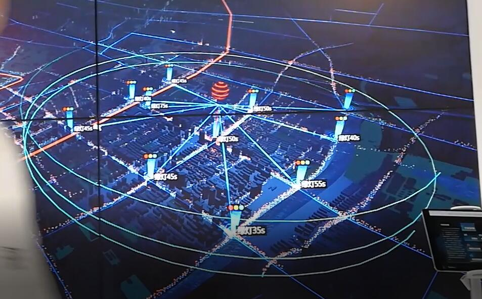

### web 平台

1. uploadProgress在web内不显示进度条
   1. web ~ iframe url="..."
   2. form ~ preview 
2. charts 统计数据异常
   1. sum 被覆盖
   2. 分页表格是否带统计, 如果需要一起处理?

3. web/charts/forms 打包方式跟使用方式!  梳理清楚
4. smartForm 发布但没有提交到gitlen
5. -- smartCharts 不带changelog, smartFrom&smartWeb带了changelog,

### 甘肃武威项目

1. 层级切换更改道路粗细 (优先级低

2. #### 新增主建筑动画效果 (ok, 继续优化)

3. #### 重点建筑楼栋查看模式 ( 新增标注 )

5. 弹窗定位抖动?
6. 楼栋模式消防设施, 那我理解起来的做法就是3个弹窗, 公用一个visible, 然后自身的offset, 然后把交互写到对应的组件里
7. 
8. 移除室内模拟图标
9. 三个索引标题 ~ 组合成数组

   1. 1）室内外属性查询配合 —— done
      2）重点建筑楼栋查看模式 —— ing
      3）场景区域切换
      4）地图辅助要素（河流、植被、道路和poi标注等） —— ing
      5）消防分析点效果调整
      6）道路层级切换 (合并后不好切换)
      7）新增主建筑动画效果 —— done
      8）高德坐标定位纠偏 --- done
      9）场景加入指北针
      10）189栋重点单位换成主建筑一样的贴图 --- done
      11）墙体透明度研究，调整透明度而非发光度 ( 泛光及后处理效果影响)
      12）大场景图标调色+调大小--- 滚到高度临界值图标尺寸调整
10. 抖动... 
11. tooltip 本末倒置的提示位置
12. 确认室外设备的地点是否正确?
13. 

相机动画在这种高德转世界定位情况下需要旋转math*pi

我查过了。这两个计算出来的坐标都是对的。即使是用自己的转换方法也是对的。只是因为道路和建筑面都进行了X轴翻转。导致最开始图标出现的位置不是对的。但是我发现图标跟真实位置也刚好是一个PI角度。所以我对图标反转了

20200622_101 开会

1. 室内结构优化, 从单层场景中应该可以明确分辨
   1. 墙体 (承重墙/实墙/虚墙), 可以考虑使用颜色区分或者厚度区分
   2. 可以添加相对写实的门窗等结构 
   3. 外墙或者轮廓/配色调整
2. 深入挖掘消防相关的价值 (很虚无缥缈..)
