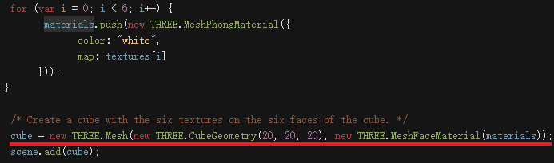
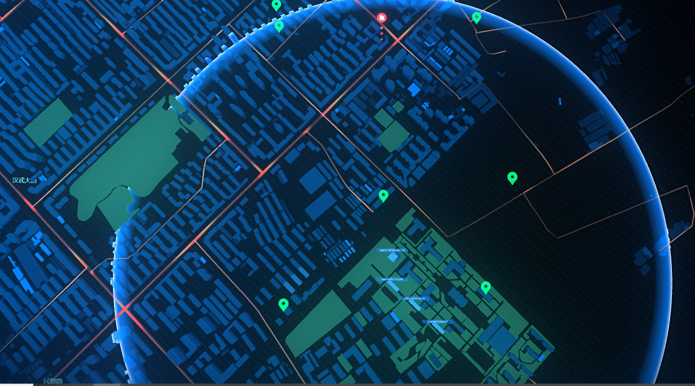

1. 日志丢失问题

   1. dev分支1.1.0~拉取master1.1.0~打版本确定日志是否正确按版本号输出

      阿轮说是 上一次 输出日志之前没有进行版本更新导致这次版本容纳了两次版本的日志更新

   2. 多尝试

2. 消防
   1. 需要大哥调整的地方
      1. 地图要素, 植被, 河流的纹理图
      2. 室外设备图标的尺寸需要调整
      3. 道路字体
      4. 1
   2. 草地模型, 透明度, 矢量拉伸
   3. 湖面波纹

纹理包裹模式&纹理.repeat.set

应用多个模型

入场动画去掉旋转, 

扫光点哪里去哪里

扫光波及的范围
