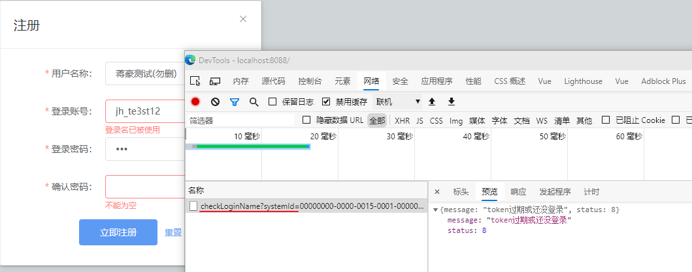

运维系统注册校验重名

可以了  (test_jh/123)

邮箱验证码~? 

嵌套表单?

注册checkname

跳转卡死的问题...

优化交互细节

1888888888880-9/123

1888888888888/123

jiangh@southzn.com

q1/1234

18999999999/123

添加路由

18999999990/123 ~ gljlum84@livinginsurance.eu/https://tempmailo.com/

todo~找回密码移出来

邮箱验证码校验

1. 绑定邮箱
2. 

图标管理, 无图标报错?

有图标则不爆错
