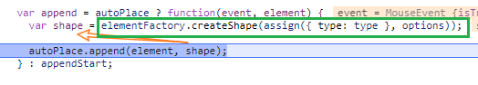

[toc]

# Saas平台

这个是初版的设计，后续这个作为SaaS平台的一部分：https://www.yuque.com/docs/share/425a124b-bce0-4586-8552-f93c36ffdfb8?#SPRz3

我们考虑用powerJob这个框架实现算法的算法管理和调度功能，需要对它提供的页面进行修改。
powerJob github：https://github.com/KFCFans/PowerJob 
你先在线试用一下，基本接口都差不多，加了一些字段需要修改。

试用的地址你打开github就看到


先按平台的交互和风格搭建下前端吧。后台是支持微服务的，可以整合到跟web3d一起的。 powerJob的前端代码的源码作者没有提供。

[PowerJob 产品手册-语雀](https://www.yuque.com/powerjob/guidence)


怎么搭, 搭在哪里


可视化流程图 ~ [d3](https://observablehq.com/@olange/layouted-graph-visualization)

**可能会采用的流程图设计库 bpmn**, 如何使用 如何在webpack中使用, 可以参考 examples/bundling

可以参考的开源库 vue-bpmn


-- 样式优化

1. 详情弹窗3列
2. 首页 算法信息 展示 ~ parsed
3. 主题风格
4. 编辑状态,是否可编辑, 切换编辑状态可用透明遮罩
5. 支持下载/导入成本地文件(OK) 借助FR解析为字符串
6. 能否支持动态js添加节点? 可以使用 on 监听事件


样式设置

矩形填充色

fill

fill-opacity

线条颜色

stroke 笔锋

```
stroke-opacity: 1;
stroke: green;
stroke-width: 1px;
```


bpmn官方节点的配置面板

汉化 https://gitee.com/polarloves/bpmn-js/tree/master/app/customTranslate


bpmn-js 

or

jeeplus-bpmn 

... 好像是一样的但又有些不一样

理论上是一样的.

Viewer/Modeler

事件监听[$_事件](https://github.com/LinDaiDai/bpmn-chinese-document/blob/master/LinDaiDai/%E5%85%A8%E7%BD%91%E6%9C%80%E8%AF%A6bpmn.js%E6%95%99%E6%9D%90-%E4%BA%8B%E4%BB%B6%E7%AF%87.md)

1. modeler
2. element


```
modeler.on("commandStack.changed"
modeler.on("selection.changed"
modeler.on("element.changed"
modeler.on("element.click"
```

click on one element => `selection.changed` => `element.click` => `element.changed`

click on white space =>  `selection.changed[element === undefined]` => `element.click(element === root)`

add one element => `element.changed` => `commandStack.changed` => `selection.changed`


自定义渲染

自定义右侧面板 用于联调


输出流程基本日志描述


节点与信息面板关联 参考vue-bpmn-element [Modeler添加监听事件]

操作element和connection时如何确认是否为已经保存的/或者在编辑完成时统一覆盖由后台解析


自定义左侧功能列表


动态导入节点? ~ 1. 加入到children 2. 同步id/描述 [更改属性要通过**modeling.updateProperties**修改] `modeler.get('modeling').updateProperties(element, properties)`, properties为对象, 属性为需要覆盖的k-v值, 可参考vue-bpmn-element 

```js
bpmnModeler.on('shape.added', e => {
        console.error(e);
        var elementRegistry = bpmnModeler.get('elementRegistry');
        var shape = e.element ? elementRegistry.get(e.element.id) : e.shape;
        console.error(shape);
});
```

shape为加入了节点(element/shape), shape会有parent关联, 考虑的方式为创建一个模板, 然后手动置入其parent中

$vm0.bpmnModeler.get('canvas')

canvas.addShape

Edit&show


$attrs 中为自定义属性可以在xml中体现, svg中没有; 现在的切入点就是, 新增节点时获取该element的引用, 然后补充填充属性关联任务节点; 可以拓展为自定义节点



{type: 'bpmn:UserTask' }


访问根节点

`Object.values($vm0.bpmnModeler.get('elementRegistry')._elements)[0].element`
`Root {labels: Array(0), children: Array(20), …}`


动态添加节点到根节点中 [都是土方法, 不确定有没有API获取], 可以封装

获取根节点.. Object.values($vm0.bpmnModeler.get('elementRegistry')._elements)[0].element;

创建shape: task $vm0.bpmnModeler.get('elementFactory').createShape({type: 'bpmn:UserTask'})

插入节点: $vm0.bpmnModeler.get('modeling').appendShape(root, shape, {x: 200, y: 200}, root, {})


### Core Services

The [diagram-js core](https://github.com/bpmn-io/diagram-js/tree/master/lib/core) is built around a number of essential services:

- [`Canvas`](https://github.com/bpmn-io/diagram-js/blob/master/lib/core/Canvas.js) - provides APIs for adding and removing graphical elements; deals with element life cycle and provides APIs to zoom and scroll.
- [`EventBus`](https://github.com/bpmn-io/diagram-js/blob/master/lib/core/EventBus.js) - the library's global communication channel with a *fire and forget* policy. Interested parties can subscribe to various events and act upon them once they are emitted. The event bus helps us to decouple concerns and to modularize functionality so that new features can hook up easily with existing behavior.
- [`ElementFactory`](https://github.com/bpmn-io/diagram-js/blob/master/lib/core/ElementFactory.js) - a factory for creating shapes and connections according to diagram-js' internal data model.
- [`ElementRegistry`](https://github.com/bpmn-io/diagram-js/blob/master/lib/core/ElementRegistry.js) - knows all elements added to the diagram and provides APIs to retrieve the elements and their graphical representation by *id*.
- [`GraphicsFactory`](https://github.com/bpmn-io/diagram-js/blob/master/lib/core/GraphicsFactory.js) - responsible for creating graphical representations of shapes and connections. The actual look and feel is defined by renderers, i.e. the [`DefaultRenderer`](https://github.com/bpmn-io/diagram-js/blob/master/lib/draw/DefaultRenderer.js) inside the [draw module](https://github.com/bpmn-io/diagram-js/tree/master/lib/draw).


### 核心服务

该[diagram-js core](https://github.com/bpmn-io/diagram-js/tree/master/lib/core)是围绕一些基本服务构建的：

- [`Canvas`](https://github.com/bpmn-io/diagram-js/blob/master/lib/core/Canvas.js)-提供用于添加和删除图形元素的API；处理元素的生命周期，并提供用于缩放和滚动的API。
- [`EventBus`](https://github.com/bpmn-io/diagram-js/blob/master/lib/core/EventBus.js)-实施“*一劳永逸”*政策的图书馆全球交流渠道。感兴趣的各方可以订阅各种事件，并在事件发生后立即采取行动。事件总线帮助我们消除关注点并模块化功能，以便新功能可以轻松地与现有行为挂钩。
- [`ElementFactory`](https://github.com/bpmn-io/diagram-js/blob/master/lib/core/ElementFactory.js) -用于根据diagram-js的内部数据模型创建形状和连接的工厂。
- [`ElementRegistry`](https://github.com/bpmn-io/diagram-js/blob/master/lib/core/ElementRegistry.js)-知道添加到图中的所有元素，并提供API来通过*id*检索元素及其图形表示。
- [`GraphicsFactory`](https://github.com/bpmn-io/diagram-js/blob/master/lib/core/GraphicsFactory.js)-负责创建形状和连接的图形表示。实际的外观由渲染器（即[draw模块](https://github.com/bpmn-io/diagram-js/tree/master/lib/draw)[`DefaultRenderer`](https://github.com/bpmn-io/diagram-js/blob/master/lib/draw/DefaultRenderer.js)内部）定义。


条件流怎么写? 是从一个task节点中输出的两个流向


自定义context-pad, 

编写类来覆盖


创建: **线(`bpmn:SequenceFlow`)、网关(`ExclusiveGateway`)、活动(`Activities`)** 等等其他类型的节点


联调~属性的规范~用于后台解析文件


bpmn 文件结构

bpmn2 标签

bpmn2:process

​	process 子节点, 必带属性id

bpmndi:BPMNDiagram

​	bpmndi:BPMNPlane, 每个关联上面的id


支持activiti可以自定义属性用于解析

ServiceTask activiti:extensionId


导入节点


隐藏左侧栏, contextpad 只有连线

自定义左侧栏, 屏蔽下方的按钮, 关闭contextPad

自定义右侧面板

优化画布

---- 数据导入面板


data-element-id="Activity_1dy1xba-51" 

通过属性选择器获取

document.querySelectorAll('[data-element-id^="Activity"]')

.state > .djs-visual > rect  [style]


箭头, 多边形 .djs-visual > path [ stroke, stroke-width ] [三角形,  marker-end ]


整体状态,[ 成功, 出错 ]


现在数据里还没有体现,

```
bpmnTaskId: "Activity_1u5d8z1-49"
instanceId: null
jobId: 49
jobName: "test"
jobType: null
result: null
status: null
```


xml/bpmn导出的文件是相同的


基于bpmn的数据


# web3d

#### 运维

- 个人中心
  - 更改sticky => fixed {top, width} sticky {top * 2}
  - 更改成userCenter一个新的路由, 同时迁移资料编辑模块 
- 图标管理
  - 图标列表拖拽~~拖拽首个图标/拖拽到首个图标时没有更新
    - VueDraggable 改变了元数据
    - 采用不复用DOM节点的key策略导致事件被卸载
    - 相同的zindex会自行改变顺序

#### 门户

 个人中心图像加载失败的处理实践 [$](https://www.zhangxinxu.com/wordpress/2020/10/css-style-image-load-fail/)


