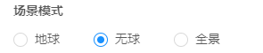
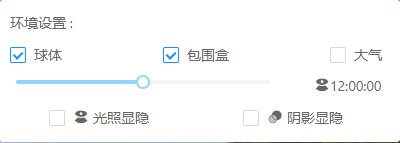

地形开挖配置重构

1. 增加对图层类型的整体过滤

   举例: 可以设置为模型数据为保留类型, 则开挖时不影响该类型的所有图层

   默认配置为: 

   - [ ] 倾斜数据
   - [x] 模型数据
   - [x] BIM模型
   - [x] 地形模型

   默认开挖对倾斜数据之外的图层没有影响

2. 原来单一图层的过滤设置的修改

   与保留类型的关系为:

   - 如果该图层的类型作为保留图层, 则不论是否添加到保留图层, 开挖均不会影响该图层
   - 如果该图层的类型未作为保留图层
     - 如果该图层设置为保留图层, 开挖不会影响该图层
     - 如果该图层为设置为保留图层, 则开挖会作用在此图层


配置地形开挖的图层

```
[
  {
    "id": "01894d4a541e408012b13915fec281df",
    "name": "WSline",
    "mid": "002167a8-d743-4c9a-b539-402bda003dda",
    "type": "MODEL",
    "url": "http://172.16.11.71:8070/sgeocserver/mapserver/manager/visit/WSlineZZ1/data/layer"
  },
  {
    "id": "9304362c4d91bce4192a02bbb51d4c6d",
    "name": "WSpoint",
    "mid": "dec85aa5-7b5e-4270-84e3-11bf93e12210",
    "type": "MODEL",
    "url": "http://172.16.11.71:8070/sgeocserver/mapserver/manager/visit/WSpointzz/data/layer"
  },
  {
    "id": "e28120f2984eb2f3ff4826912b10db8d",
    "name": "RSpoint",
    "mid": "6b39c735-a80f-4308-8859-9262d720905e",
    "type": "MODEL",
    "url": "http://172.16.11.71:8070/sgeocserver/mapserver/manager/visit/RSpointzz/data/layer"
  },
  {
    "id": "89c879ad816594f2d44e037676ba2e82",
    "name": "JPline",
    "mid": "94ad8347-4396-4986-b037-c63d9ddf00bb",
    "type": "MODEL",
    "url": "http://172.16.11.71:8070/sgeocserver/mapserver/manager/visit/JPlinezz1/data/layer"
  },
  {
    "id": "8a459688e37e9ca8fed2463fa8326059",
    "name": "JPpoint",
    "mid": "281349d9-cce5-49f0-a3a6-0f1f96538a26",
    "type": "MODEL",
    "url": "http://172.16.11.71:8070/sgeocserver/mapserver/manager/visit/JPpointzz/data/layer"
  },
  {
    "id": "4f9aa517bba53be207f2c8524a25e565",
    "name": "RSline",
    "mid": "ba390a92-b26a-4350-93f2-7726a4eeb3f2",
    "type": "MODEL",
    "url": "http://172.16.11.71:8070/sgeocserver/mapserver/manager/visit/RSlineZZ1/data/layer"
  },
  {
    "id": "962bc481ece8f83f01399f14ecefc0a9",
    "name": "EXline",
    "mid": "e030b7be-cd8e-475f-9275-5d57e1e05fed",
    "type": "MODEL",
    "url": "http://172.16.11.71:8070/sgeocserver/mapserver/manager/visit/EXlineZZ1/data/layer"
  },
  {
    "id": "66f07fbbe54fd753e8c84223bcfb4d4b",
    "name": "DXpoint",
    "mid": "f519da3c-2694-43e2-99c8-1743c2f2f5f6",
    "type": "MODEL",
    "url": "http://172.16.11.71:8070/sgeocserver/mapserver/manager/visit/DXpointZZ1/data/layer"
  },
  {
    "id": "a2b8621b2b6835f5f7d490de973b5c77",
    "name": "DXline",
    "mid": "22c15899-29d8-41c9-a88e-91f8388045d5",
    "type": "MODEL",
    "url": "http://172.16.11.71:8070/sgeocserver/mapserver/manager/visit/DXline111/data/layer"
  },
  {
    "id": "ecaeb10d54be19f43ca5aebec8e91d2f",
    "name": "EXpoint",
    "mid": "b279d9ac-53bb-491d-8fbf-7d9ca9142a89",
    "type": "MODEL",
    "url": "http://172.16.11.71:8070/sgeocserver/mapserver/manager/visit/EXpointZZ/data/layer"
  }
]
```

```
[
  "WSline",
  "WSpoint",
  "RSpoint",
  "JPline",
  "JPpoint",
  "RSline",
  "EXline",
  "DXpoint",
  "DXline",
  "EXpoint"
]
```


## 场景模式

地球影响

1. 图层配置 (**无球模式 不影响 且用途为观察数据**)
2. 底图/影像/地形

场景模式具体操作

1. 地形
2. 地球
3. 天空大气
4. 天空盒
5. 月球
6. 背景色
7. 全局变量: SceneMode

场景效果

1. 天空盒子 -- 星空
2. 天空 -- 太阳/月亮可以不显示

场景默认设置 normal-config

添加到功能列表后的环境设置

场景为无球 ~ 可以直接关闭 天空盒&天空实体 

​	(可以不做数据关联, 但是场景要体现 (优先级), ~ ) 


**无球模式为了不看球 ，只看数据**


场景模式迁移到场景效果中, 

与球体对应

设置视角/封面判断了sceneMode (依赖关系), 无球模式直接return;

---- 更改值&订阅 只需要`handleSceneMode` 正确迁移, 不影响订阅,

如何保存场景模式到配置当中? (todo)  store

      	1. 保存场景后不变 
     	2. 新场景有Mode, 之前的场景无Mode, 可能是数据源不同 (场景初始化)
     	3. 目前无球模式没啥用, 也无法以noGlobe状态保存... 
     	4. 

如何二次读取修改的配置对象

  `sgeocserver/sceneservice/manager/sceneConfig?sceneId=&userId=`


1. 功能存在影响过多
2. 作为图层和底图/影像/地形的基底


bootStrap => viewer * 会有多次执行的情况

初始启动 => 初始化场景


多次进入场景效果会开启天空盒子/天空中的选项, 会按照对应的state进行交互,

无球模式关联设置

以保存为无球模式的场景不加载 skyBox 导致无法切换场景模式

保存为无球模式刷新后报错? -- skyBox 初始化失败 

```ts
// bootstrap.service.ts
setSkyBox()
```

```ts
// skyBoxManager.service.ts
case skyBoxEnum.none:
        this.isNearGroundSky = false;
        this.currentSky = null;
        break;
```

none 时也挂载skyBox(默认星空), 是以隐藏状态, 

这样处理也不报错也允许了环境设置中的提供包围盒控制

其他问题: ...


## 场景Save 接口

`sgeocserver/sceneservice/manager/save?userId=`

```json
{
  "id": "3867699b-3025-43a2-b6bd-b80d7427670a",
  "sceneName": "JH-测试场景效果",
  "description": "",
  "status": 3,
  "cover": "/uploadservice/upload/3867699b-3025-43a2-b6bd-b80d7427670a1610680284858.jpeg",
  "perspectiveJson": "{\"InitialPosition\":{\"lon\":104.355,\"lat\":28.704999999999995,\"height\":10000000},\"InitialOrientation\":{\"heading\":360,\"roll\":0,\"pitch\":-90}}",
  "logo": "",
  "sceneMode": "noGlobe",
  "externalScene": null,
  "creator": "蒋豪",
  "creatorId": "cb4badb3-6b00-429e-88ef-5bf27fb9ea5e",
  "createTime": "2021-01-15 11:11:24",
  "accessCount": 0,
  "belongDepartmentId": "0022000300150002",
  "migrationTime": null,
  "configurationJson":"{...}",
  "layerTree": "{\"treeData\":[],\"configData\":{\"customPointCloudScheme\":[],\"configScheme\":{\"pointCloudColors\":[],\"tilesetStyles\":[],\"materials\":[],\"vectorStyles\":[],\"vector2Styles\":[],\"imageryStyles\":[]}}}",
  "functionData": "[]",
  "sceneNo": "1742376286"
}

```

scene-info 配置作为一级

configuration 包含场景效果和其他设置... 作为二级

数据来源需要修正.

部分地方使用无球模式来展示数据( 最好就不修改 ) 不要影响这个

`this.viewer.scene.skyAtmosphere.show = false;` 全局搜这个

save & reuse 数据采用的 service 不变, 所以只是交互的地方改了, 不会影响原来的使用


## 无球模式重构方案

现有的包含**无球模式**交互逻辑

配置项: 场景信息 - 场景模式-无球模式



使用项: 场景效果-添加到功能列表后, 可以在环境设置中控制球体



无球模式影响范围

```ts
changeSceneMode(mode: SceneModeEnum) {
    if (!this.viewer) {
      return;
    }
    switch (mode) {
      case SceneModeEnum.globe:
        // 地球模式
        this.imageLayersService.viewer = this.viewer;
        this.viewer.scene.globe.show = true;
        this.viewer.scene.skyAtmosphere.show = true;
        this.viewer.scene.skyBox.show = true;
        this.viewer.scene.moon.show = false;
        this.viewer.scene.backgroundColor = undefined;
        this.viewer.sceneMode = Cesium.SceneMode.SCENE3D;
        break;
      case SceneModeEnum.noGlobe:
        // 无球模式
        this.viewer.scene.terrainProvider = new Cesium.EllipsoidTerrainProvider({});
        this.viewer.scene.globe.show = false;
        this.viewer.scene.skyAtmosphere.show = false;
        this.viewer.scene.skyBox.show = false;
        this.viewer.scene.moon.show = false;
        this.viewer.scene.backgroundColor = Cesium.Color.BLACK;
        this.viewer.sceneMode = Cesium.SceneMode.COLUMBUS_VIEW;
        break;
      case SceneModeEnum.panorama:
        // 全景模式
        break;
    }
  }
```

- 替换为Cesium默认椭球地形
- 隐藏地球/天空大气层/天空盒子/月球
- 设置背景为黑色
- 修改场景模式枚举值

使用项的中的球体只会控制球体的显示隐藏

 

无球模式旨在减少不必要的地形、影像和其他模型,  聚焦于添加在场景中的图层, 方便在搭建场景的时候对数据进行核对校验和查看数据添加到场景中的效果


冗余可能并不冗余

1. 保存数据/读取数据的数据来源 不变
2. 为了在场景效果中添加该配置项和默认值, 配置接口上增加了该属性


不加state, 无球模式无法覆盖天空盒的状态, 不确定是不是因为不加state的原因

但是执行的顺序是 `changeSceneMode` => `initDefaultSkyBox` => `changeSkyBox` `bootstrap.service.ts`

导致被隐藏的天空盒又被重新显示了

原来的配置保存/获取方式

`sceneservice/manager/info?&id=&infoType=&userId=` 获取的是场景信息

`sceneservice/manager/sceneConfig?sceneId=&userId=`获取的是场景效果 normalConfig

从 `normalConfig` 保存/读取配置


原有中对`sceneMode`的依赖怎么处理? -- 设置封面/视角读取了`sceneMode`, 

  在获取到数据`normalCOnfig`之后同步到这个服务`scenemode.service`上? (所以不能修改原有的配置接口) (使用原有数据服务是ok的, dispatch, 也可以使用不同的数据源 dispatch 就能同步) 保存配置时不影响

​		sceneMode 为scene-info组件数据(默认配置对象), 可以提升到service上用来通信

  另一方面, 旧的场景如果没有这个配置呢?  还是可以从info的那个接口读取备用值

 **sceneMode**通信

---- 新场景会在normalConfig中带上场景模式

兼容旧版本方式

- normalConfig 无sceneMode
- sceneMode 在以及配置中 scene-info
- 

别被删掉了(合并到 migrate 分支里了)

主要是把方案写好 (代码实现不着急, 需要跟产品沟通)


`overallView.sevice.ts` 全景模式下设置封面和视角报错


## 全景模式

全景模式的配置步骤

1. 图层配置, 导入一个全景图像数据图层
2. 功能池搜索"全景影像", 勾选使用
3. 点击全景影像 ~ 全屏模式 ~ (这个模式依赖于数据)
4. 选择图片, 等待场景切换
5. 设置名称&封面(修改场景模式)&视角 保存

[功能池~数据~场景模式缺一不可]

二次访问

1. 如果设置场景模式为"球体"/"无球"则会进入全景矢量点的图层
2. 如果设置场景模式为"全景"则会进入全景影响场景
3. 全景模式半屏模式下, 切换地球/无球还是能够交互的, 保存后就不在以"全景"来交互生成场景(提供了这样的交互但是保存后就失效) (切换到半瓶模式下会报错)
4. 全景影响弹窗交互不友好
5. 切换全景影像图层后, 功能列表没有正确交互, 还是上一次的数据, 重新勾选功能池之后也仍旧如此,(错误原因是判断了DOM节点是否存在, 通过className来选择节点, 如果没有正确移除那么就始终无法更新), 


优化点: 

1. 创建新场景时,如果选择了全景影像图层跟功能全景影响, (点击交互后)默认触发全景模式进选择第一张图片加载全景场景(跳过点"全屏模式"和"选取图像"的交互)

2. 全屏模式~点击选择全景图片的这个交互不够明确

3. 全屏模式选取全景图片后, 切换到(半屏/球体模式)后会变白; 来回切换模式需要重新选泽全屏模式和图片创建全景场景

   


核心: 

​	div > canvas (场景) 如果场景为空, 则页面显示白屏

​	#viewerContainer  ~ viewer.container

​	#overallContainer ~ overallview.service.container


保存为全景模式的场景全景模式下设置封面报错的原因是二者不是同一个模式下会报错, 因为有对应的方法

```ts
// 设置封面
  hanldeSetCoverClick() {
    if (this.sceneMode === SceneModeEnum.globe 
        || this.sceneMode === SceneModeEnum.noGlobe) {
      const sceneShot = this.viewerService.getSceneShot();
      this.sceneInfo.cover = sceneShot;
    } else if (this.sceneMode === SceneModeEnum.panorama) {
      const img = this.overallviewService.setScreenShot();
      this.sceneInfo.cover = img.src;
    }
    this.submitStore();
  }
```

全景模式下初始化renderer

```ts
import('three').then((m) => {
      THREE = m;
      this.createScene(this.path);
    });

createScene (){
    ... 
    this.scene = new THREE.Scene();
      this.renderer = new THREE.WebGLRenderer({ antialias: true });
      this.renderer.setSize(this.width, this.height);
      // 可视范围
      this.renderer.setViewport(0, 0, this.width, this.height);
      this.container.append(this.renderer.domElement);
      this.camera = new THREE.PerspectiveCamera(45, this.width / this.height, this.near, this.far);
      this.camera.target = new THREE.Vector3(0, 0, 0);
      const geometry = new THREE.SphereBufferGeometry(500, 60, 40);
      geometry.scale(-1, 1, 1); // 反转X轴上的几何图形，使所有的面点向内。
}
```


图标管理优化方案

1. 响应式 toolbar
2. 图标可以加一个浅色背景
3. 图标地址 19 => 71


