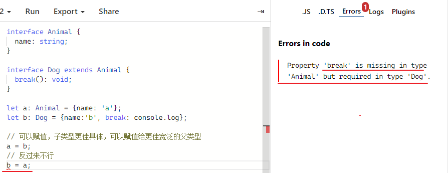
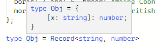
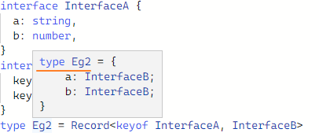

[TOC]

## Utility Types [#](https://www.typescriptlang.org/docs/handbook/utility-types.html)


TypeScript provides several utility types to facilitate (facilitate: 促进) common type transformations. 

These utilities are available globally.

Ts内置类型工具原理解析: https://juejin.cn/post/6994102811218673700#heading-5


## extends关键词特性（重点）

- **用于接口，表示继承**

```typescript
interface T1 {
  name: string,
}

interface T2 {
  sex: number,
}

/**
 * @example
 * T3 = {name: string, sex: number, age: number}
 */
interface T3 extends T1, T2 {
  age: number,
}
```

注意，接口支持多重继承，语法为逗号隔开。

如果是type实现继承，则可以使用交叉类型`type A = B & C & D`。

- **表示条件类型，可用于条件判断**

表示条件判断，如果前面的条件满足，则返回问号后的第一个参数，否则第二个。**类似于js的三元运算**。

```typescript
/**
 * @example
 * type A1 = 1
 */
type A1 = 'x' extends 'x' ? 1 : 2;

/**
 * @example
 * type A2 = 2
 */
type A2 = 'x' | 'y' extends 'x' ? 1 : 2;

/**
 * @example
 * type A3 = 1 | 2
 */
type P<T> = T extends 'x' ? 1 : 2;
type A3 = P<'x' | 'y'>
```

提问：为什么`A2`和`A3`的值不一样？

- 如果用于简单的条件判断，则是直接**判断前面的类型是否可分配给后面的类型**
- **若`extends`前面的类型是泛型**，**且泛型传入的是联合类型时**，则会依次判断该联合类型的所有子类型是否可分配给extends后面的类型（是一个分发的过程）。

**总结，就是`extends`前面的参数为联合类型时则会分解（依次遍历所有的子类型进行条件判断）联合类型进行判断。然后将最终的结果组成新的联合类型。**

- 阻止extends关键词对于联合类型的分发特性

如果不想被分解（分发），做法也很简单，可以通过简单的元组类型包裹以下：

```typescript
type P<T> = [T] extends ['x'] ? 1 : 2;
/**
 * type A4 = 2;
 */
type A4 = P<'x' | 'y'>
```

[条件类型的分布式特性文档](https://www.typescriptlang.org/docs/handbook/2/conditional-types.html#distributive-conditional-types)


### 类型兼容性

> 集合论中，如果一个集合的所有元素在集合B中都存在，则A是B的子集；
>
> 类型系统中，如果一个类型的属性更具体，则该类型是子类型。（因为属性更少则说明该类型约束的更宽泛，是父类型）

**因此，我们可以得出基本的结论：子类型比父类型更加具体,父类型比子类型更宽泛。** 

下面我们也将基于类型的可复制性（可分配性）、协变、逆变、双向协变等进行进一步的讲解。

- 可赋值性

```typescript
interface Animal {
  name: string;
}

interface Dog extends Animal {
  break(): void;
}

let a: Animal;
let b: Dog;

// 可以赋值，子类型更佳具体，可以赋值给更佳宽泛的父类型
a = b;
// 反过来不行
b = a;
```



- 可赋值性在**联合类型**中的特性

```typescript
type A = 1 | 2 | 3;
type B = 2 | 3;
let a: A;
let b: B;

// 不可赋值
b = a;
// 可以赋值
a = b;
```

是不是`A`的类型更多，`A`就是子类型呢？

恰恰相反，`A`此处类型更多但是其表达的类型更宽泛，所以`A`是父类型，`B`是子类型。

- 协变

```typescript
interface Animal {
  name: string;
}

interface Dog extends Animal {
  break(): void;
}

let Eg1: Animal;
let Eg2: Dog;
// 兼容，可以赋值
Eg1 = Eg2;

let Eg3: Array<Animal>
let Eg4: Array<Dog>
// 兼容，可以赋值
Eg3 = Eg4
```

通过`Eg3`和`Eg4`来看，在`Animal`和`Dog`在变成数组后，`Array`依旧可以赋值给`Array`，因此对于`type MakeArray = Array`来说就是协变的。

具有父子关系的多个类型，在通过某种构造关系构造成的新的类型，如果还具有父子关系则是协变的，而关系逆转了（子变父，父变子）就是逆变的。


- 逆变

```typescript
interface Animal {
  name: string;
}

interface Dog extends Animal {
  break(): void;
}

type AnimalFn = (arg: Animal) => void
type DogFn = (arg: Dog) => void

let Eg1: AnimalFn;
let Eg2: DogFn;
// 不再可以赋值了，
// AnimalFn = DogFn不可以赋值了, Animal = Dog是可以的
Eg1 = Eg2;
// 反过来可以
Eg2 = Eg1;
```

理论上，`Animal = Dog`是类型安全的，那么`AnimalFn = DogFn`也应该类型安全才对，为什么Ts认为不安全呢？

看下面的例子：

```typescript
let animal: AnimalFn = (arg: Animal) => {}
let dog: DogFn = (arg: Dog) => {
  arg.break();
}

// 假设类型安全可以赋值
animal = dog;
// 那么animal在调用时约束的参数，缺少dog所需的参数，此时会导致错误
animal({name: 'cat'});
```

从这个例子看到，如果dogFn赋值给animalFn，那么animalFn在调用时，约束的是参数必须要为Animal类型（而不是Dog），但是animal实际为dog的调用，此时就会出现错误。


- 双向协变

Ts在函数参数的比较中**实际上默认采取的策略是双向协变**：只有当源函数参数能够赋值给目标函数或者反过来时才能赋值成功。

这是不稳定的，因为调用者可能传入了一个具有更精确类型信息的函数，但是调用这个传入的函数的时候却使用了不是那么精确的类型信息（典型的就是上述的逆变）。 

但是实际上，这极少会发生错误，并且能够实现很多JavaScript里的常见模式：

```typescript
// lib.dom.d.ts中EventListener的接口定义
interface EventListener {
  (evt: Event): void;
}
// 简化后的Event
interface Event {
  readonly target: EventTarget | null;
  preventDefault(): void;
}
// 简化合并后的MouseEvent
interface MouseEvent extends Event {
  readonly x: number;
  readonly y: number;
}

// 简化后的Window接口
interface Window {
  // 简化后的addEventListener
  addEventListener(type: string, listener: EventListener)
}

// 日常使用
window.addEventListener('click', (e: Event) => {});
window.addEventListener('mouseover', (e: MouseEvent) => {});
```

可以看到`Window`的`listener`函数要求参数是`Event`，但是日常使用时更多时候传入的是`Event`子类型。但是这里可以正常使用，正是其默认行为是双向协变的原因。

**可以通过`tsconfig.js`中修改`strictFunctionType`属性来严格控制协变和逆变。**


## `Partial<Type>`

Constructs a type with all properties of `Type` set to optional. 

This utility will return a type that represents all subsets of a given type.

构建一个类型 with all properties of `Type` set to **optional**。

返回给定类型的所有子集的类型。

##### Example

```ts
interface Todo {
  title: string;
  description: string;
}
 
function updateTodo(todo: Todo, fieldsToUpdate: Partial<Todo>) {
  return { ...todo, ...fieldsToUpdate };
}
 
const todo1 = {
  title: "organize desk",
  description: "clear clutter",
};
 
const todo2 = updateTodo(todo1, {
  description: "throw out trash",
});
```

**`type Partial<T> = { [P in keyof T]?: T[P] | undefined; }`**

- `[P in keyof T]`通过映射类型，遍历`T`上的所有属性
- `?:`设置为属性为可选的
- `T[P]`设置类型为原来的类型

将制定的`key`变成可选类型:

```typescript
/**
 * 主要通过K extends keyof T约束K必须为keyof T的子类型
 * keyof T得到的是T的所有key组成的联合类型
 */
type PartialOptional<T, K extends keyof T> = {
  [P in K]?: T[P];
}
```


## `Required<Type>`

Constructs a type consisting of **all properties of `Type` set to required**. 

**The opposite of [`Partial`](https://www.typescriptlang.org/docs/handbook/utility-types.html#partialtype).**

##### Example

```ts
interface Props {
  a?: number;
  b?: string;
}
 
const obj: Props = { a: 5 };
 
const obj2: Required<Props> = { a: 5 };
// Property 'b' is missing in type '{ a: number; }' but required in type 'Required<Props>'.
```

**`type Required<T> = { [P in keyof T]-?: T[P]; }`**

 `-?` 移除可选项; 使用方式类似于 {xx?: string}; 


##  `Readonly<Type>`

Constructs a type with all properties of `Type` set to `readonly`, meaning the properties of the constructed type cannot be reassigned.

##### Example

```ts
interface Todo {
  title: string;
}
 
const todo: Readonly<Todo> = {
  title: "Delete inactive users",
};
 
todo.title = "Hello";
// Cannot assign to 'title' because it is a read-only property.
```

This utility is useful for representing assignment expressions that will fail at runtime (i.e. when attempting to reassign properties of a [frozen object](https://developer.mozilla.org/docs/Web/JavaScript/Reference/Global_Objects/Object/freeze)).

这个工具对于表示将在运行时失败的赋值表达式很有用

**`type Readonly<T> = { readonly [P in keyof T]: T[P]; }`**


##### `Object.freeze`

```ts
function freeze<Type>(obj: Type): Readonly<Type>;
```


## `Record<Keys, Type>`

Constructs **an object type** whose property keys are `Keys` and whose property values are `Type`. 

This utility can be used to **map the properties of a type to another type**.



##### Example

```ts
interface CatInfo {
  age: number;
  breed: string;
}
 
type CatName = "miffy" | "boris" | "mordred";
 
const cats: Record<CatName, CatInfo> = {
  miffy: { age: 10, breed: "Persian" },
  boris: { age: 5, breed: "Maine Coon" },
  mordred: { age: 16, breed: "British Shorthair" },
};
 
cats.boris;
 
const cats: Record<CatName, CatInfo>
```


```ts
// lib.es5.d.ts
type Record<K extends keyof any, T> = {
    [P in K]: T;
};

// 官网悬浮示例
type Record<K extends string | number | symbol, T> = { [P in K]: T; }
```


掘金文中的拓展

```typescript
/**
 * 核心实现就是遍历K，将值设置为T
 */
type Record<K extends keyof any, T> = {
  [P in K]: T
}

interface InterfaceA {
  a: string,
  b: number,
}
interface InterfaceB {
  key1: number,
  key2: string,
}
type Eg2 = Record<keyof InterfaceA, InterfaceB>
```



- 值得注意的是`keyof any`得到的是`string | number | symbol`
- 原因在于类型key的类型只能为`string | number | symbol`


## `Pick<Type, Keys>`

Constructs a type by picking the set of properties **`Keys`** (string literal or union of string literals) from `Type`.

通过从`type`中选择属性`keys'（字符串字面量或字符串字面量的集合）来构造一种类型。

##### Example

```ts
interface Todo {
  title: string;
  description: string;
  completed: boolean;
}
 
type TodoPreview = Pick<Todo, "title" | "completed">;
 
const todo: TodoPreview = {
  title: "Clean room",
  completed: false,
};
 
todo;
 ^
const todo: TodoPreview
```


**扩展: 同态与非同态。划重点！！！ 划重点！！！ 划重点！！！**

- `Partial`、`Readonly`和`Pick`都属于**同态**的，即其实现需要输入类型T来拷贝属性，因此属性修饰符（例如readonly、?:）都会被拷贝。可从下面例子验证：

```ts
/**
 * @example
 * type Eg = {readonly a?: string}
 */
type Eg = Pick<{readonly a?: string}, 'a'>
```

- `Record`是非同态的，不需要拷贝属性，因此不会拷贝属性修饰符


## `Omit<Type, Keys>`

(omit: 忽略, 省略, 遗漏)

Constructs a type by picking all properties from `Type` and then removing `Keys` (string literal or union of string literals).

> 跟pick相反, pick是保留类型, omit 是移除

##### Example

```ts
interface Todo {
  title: string;
  description: string;
  completed: boolean;
  createdAt: number;
}
 
type TodoPreview = Omit<Todo, "description">; // 移除des
 
const todo: TodoPreview = {
  title: "Clean room",
  completed: false,
  createdAt: 1615544252770,
};
 
todo;
 ^
const todo: TodoPreview
 
type TodoInfo = Omit<Todo, "completed" | "createdAt">; // 移除comp和crea
 
const todoInfo: TodoInfo = {
  title: "Pick up kids",
  description: "Kindergarten closes at 5pm",
};
 
todoInfo;
   ^
const todoInfo: TodoInfo
```


```ts
/** lib.es5.d.ts
 * Construct a type with the properties of T except for those in type K.
 */
type Omit<T, K extends keyof any> = Pick<T, Exclude<keyof T, K>>;

// 官网示例
type Omit<T, K extends string | number | symbol> = { 
    [P in Exclude<keyof T, K>]: T[P]; 
}
```


## Exclude<UnionType, ExcludedMembers>

(Exclude: 不包括, 排除)

Constructs a type by excluding from `UnionType` all union members that are assignable to `ExcludedMembers`.

> `Exclude`提取存在于`T`，但不存在于`U`的类型组成的联合类型。

```ts
type T0 = Exclude<"a" | "b" | "c", "a">;   
	type T0 = "b" | "c"

type T1 = Exclude<"a" | "b" | "c", "a" | "b">;    
	type T1 = "c"

type T2 = Exclude<string | number | (() => void), Function>;     
	type T2 = string | number
```

```ts
type Exclude<T, U> = T extends U ? never : T
```

- `never`表示一个不存在的类型
- `never`与其他类型的**联合**后，是没有`never`的


## `Extract<Type, Union>`

Constructs a type by extracting from `Type` all union members that are assignable to `Union`.

(Extract: 提取)

> `Extract`提取**联合类型T和联合类型U的所有交集**。

```ts
type T0 = Extract<"a" | "b" | "c", "a" | "f">; 
	type T0 = "a"
type T1 = Extract<string | number | (() => void), Function>;    
	type T1 = () => void
```

```ts
type Extract<T, U> = T extends U ? T : never
```


跟pick有什么区别呢??

​	pick 是从一个 类型 上去 选择

