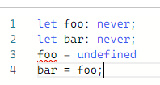

# Never

[一个关于 never 的介绍视频](https://egghead.io/lessons/typescript-use-the-never-type-to-avoid-code-with-dead-ends-using-typescript)

程序语言的设计确实应该存在一个底部类型的概念，当你在分析代码流的时候，这会是一个理所当然存在的类型。

TypeScript 就是这样一种分析代码流的语言，因此它需要一个可靠的，代表永远不会发生的类型。

**`never` 类型是 TypeScript 中的底层类型**。

它自然被分配的一些例子：

- 一个**从来不会有返回值的函数**（如：如果函数内含有 `while(true) {}`）；
- 一个**总是会抛出错误的函数**（如：`function foo() { throw new Error('Not Implemented') }`，`foo` 的返回类型是 `never`）；

你也可以将它用做类型注解：

```ts
let foo: never; // ok
```

但是，**`never` 类型仅能被赋值给另外一个 `never`**：

```ts
let foo: never = 123; // Error: number 类型不能赋值给 never 类型

// ok, 作为函数返回类型的 never
let bar: never = (() => {
  throw new Error('Throw my hands in the air like I just dont care');
})();
```

很棒，现在让我们看看它的关键用例。



## [#](https://jkchao.github.io/typescript-book-chinese/typings/neverType.html#用例：详细的检查)用例：详细的检查

```ts
function foo(x: string | number): boolean {
  if (typeof x === 'string') {
    return true;
  } else if (typeof x === 'number') {
    return false;
  }

  // 如果不是一个 never 类型，这会报错：
  // - 不是所有条件都有返回值 （严格模式下）
  // - 或者检查到无法访问的代码
  // 但是由于 TypeScript 理解 `fail` 函数返回为 `never` 类型
  // 它可以让你调用它，因为你可能会在运行时用它来做安全或者详细的检查。
  return fail('Unexhaustive');
}

function fail(message: string): never {
  throw new Error(message);
}
```

`never` 仅能被赋值给另外一个 `never` 类型，因此你可以用它来进行编译时的全面的检查，我们将会在[辨析联合类型](https://jkchao.github.io/typescript-book-chinese/typings/discrominatedUnion.html)中讲解它。


## [#](https://jkchao.github.io/typescript-book-chinese/typings/neverType.html#与-void-的差异)与 `void` 的差异

一旦有人告诉你，`never` 表示一个从来不会优雅的返回的函数时，你可能马上就会想到与此类似的 `void`，然而实际上，

- **`void` 表示没有任何类型**
- **`never` 表示永远不存在的值的类型**

当一个函数返回空值时，它的返回值为 void 类型，但是，当一个函数永不返回时（或者总是抛出错误），它的返回值为 never 类型。

void 类型可以被赋值（在 strictNullChecking 为 false 时），但是除了 never 本身以外，其他任何类型不能赋值给 never。


### never & undefined & void


