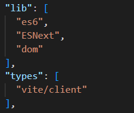

## [@types](https://jkchao.github.io/typescript-book-chinese/typings/types.html#types) 

社区已经记录了 90% 的顶级 JavaScript 库。

这意味着，你可以非常高效地使用这些库，而无须在单独的窗口打开相应文档以确保输入的正确性。


通过 `npm` 来安装使用 `@types`

例如为 `jquery` 添加声明文件：

```shell
npm install @types/jquery --save-dev
```

`@types` 支持全局和模块类型定义。


### [#](https://jkchao.github.io/typescript-book-chinese/typings/types.html#全局-types)全局 `@types`

默认情况下，TypeScript 会自动包含支持全局使用的任何声明定义。

例如，对于 jquery，你应该能够在项目中开始全局使用 `$`。


### [#](https://jkchao.github.io/typescript-book-chinese/typings/types.html#模块-types)模块 `@types`

安装完之后，不需要特别的配置，你就可以像使用模块一样使用它：

```ts
import * as $ from 'jquery';

// 现在你可以此模块中任意使用$了 :)
```


## 控制全局

可以看出，对于某些团队而言，拥有允许全局使用的定义是一个问题。

因此，你可以通过配置 `tsconfig.json` 的 `compilerOptions.types` 选项，引入有意义的类型：

```ts
{
  "compilerOptions": {
    "types" : [
      "jquery"
    ]
  }
}
```

如上例所示，通过配置 `compilerOptions.types: [ "jquery" ]` 后，**只允许使用 `jquery` 的 `@types` 包**，

即使这个人安装了另一个声明文件，比如 `npm install @types/node`，它的全局变量（例如 `process`）也不会泄漏到你的代码中，直到你将它们添加到 tsconfig.json 类型选项。




`smart-charts/tsconfig.json`

## [#](https://jkchao.github.io/typescript-book-chinese/typings/ambient.html#声明文件)声明文件

你可以通过 `declare` 关键字来告诉 TypeScript，你正在试图表述一个其他地方已经存在的代码

如：写在 JavaScript、CoffeeScript 或者是像浏览器和 Node.js 运行环境里的代码：

```ts
declare var foo: any;
foo = 123; // allow
```

把这些声明放入 `.ts` 或者 `.d.ts` 里。

在你实际的项目里，我们强烈建议你应该**把声明放入独立的 `.d.ts` 里**（可以从一个命名为 `global.d.ts` 或者 `vendor.d.ts` 文件开始）。

如果**一个文件有扩展名 `.d.ts`，这意味着每个根级别的声明都必须以 `declare` 关键字作为前缀**。

这有利于让开发者清楚的知道，在这里 TypeScript 将不会把它编译成任何代码，同时**开发者需要确保这些在编译时存在**。

> TIP
>
> - 环境声明就好像你与编译器之间的一个约定，如果在编译时它们不存在，但是你却使用了它们，程序将会在没有警告的情况下中断。
> - 环境声明就好像是一个文档。如果源文件更新了，你应该同步更新。所以，当你在运行时有新的行为时，如果没有去更新环境声明，编译器将会报错。

## [#](https://jkchao.github.io/typescript-book-chinese/typings/ambient.html#变量)变量