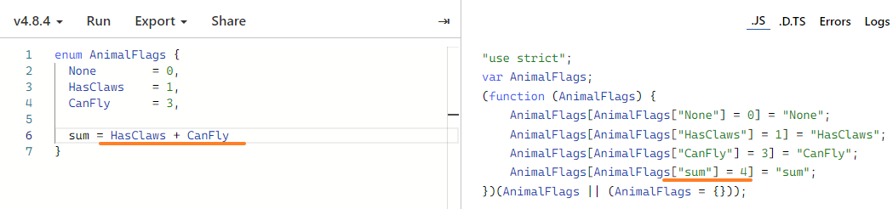

# [#](https://jkchao.github.io/typescript-book-chinese/typings/enums.html#枚举)枚举

枚举是组织收集有关联变量的一种方式，许多程序语言（如：c/c#/Java）都有枚举数据类型。

下面是定义一个 TypeScript 枚举类型的方式：

```ts
enum CardSuit {
  Clubs,
  Diamonds,
  Hearts,
  Spades
}

// 简单的使用枚举类型
let Card = CardSuit.Clubs;

// 类型安全
Card = 'not a member of card suit'; // Error: string 不能赋值给 `CardSuit` 类型
```

**这些枚举类型的值都是数字类型**，因此它们被称为数字类型枚举。


## [#](https://jkchao.github.io/typescript-book-chinese/typings/enums.html#数字类型枚举与数字类型)数字类型枚举与数字类型

数字类型枚举，**允许我们将数字类型**或者**其他任何与数字类型兼容的类型赋值给枚举类型的实例**。


## 数字类型枚举与字符串类型

在我们继续深入学习枚举类型之前，先来看看它编译的 JavaScript 吧，以下是一个简单的 TypeScript 枚举类型：

```ts
enum Tristate {
  False,
  True,
  Unknown
}
```

其被编译成 JavaScript 后如下所示：

```ts
var Tristate;
(function(Tristate) {
  Tristate[(Tristate['False'] = 0)] = 'False';
  Tristate[(Tristate['True'] = 1)] = 'True';
  Tristate[(Tristate['Unknown'] = 2)] = 'Unknown';
})(Tristate || (Tristate = {}));
```


## [#](https://jkchao.github.io/typescript-book-chinese/typings/enums.html#改变与数字枚举关联的数字)改变与数字枚举关联的数字

默认情况下，第一个枚举值是 `0`，然后每个后续值依次递增 1：

```ts
enum Color {
  Red, // 0
  Green, // 1
  Blue // 2
}
```

通过特定的赋值来改变给任何枚举成员关联的数字

```ts
enum Color {
  DarkRed = 3, // 3
  DarkGreen, // 4
  DarkBlue // 5
}
```

> TIP
>
> 我通常用 `= 1` 初始化，因为在枚举类型值里，它能让你做一个安全可靠的检查。


## 使用数字类型作为标志

枚举的一个很好用途是**使用枚举作为标志**。

这些标志允许你检查一组条件中的某个条件是否为真。

考虑如下代码例子，我们有一组关于 animals 的属性：

```ts
enum AnimalFlags {
  None        = 0,
  HasClaws    = 1 << 0,
  CanFly      = 1 << 1,
  EatsFish    = 1 << 2,
  Endangered  = 1 << 3
}
```

当你在使用这种标记的时候，这些位运算符 `|` (或)、`&` （和）、`~` （非）将会是你最好的朋友：

```ts
enum AnimalFlags {
  None        = 0,
  HasClaws    = 1 << 0,
  CanFly      = 1 << 1
}

interface Animal {
  flags: AnimalFlags;
  [key: string]: any;
}

function printAnimalAbilities(animal: Animal) {
  var animalFlags = animal.flags;
  if (animalFlags & AnimalFlags.HasClaws) {
    console.log('animal has claws');
  }
  if (animalFlags & AnimalFlags.CanFly) {
    console.log('animal can fly');
  }
  if (animalFlags == AnimalFlags.None) {
    console.log('nothing');
  }
}

var animal = { flags: AnimalFlags.None };
printAnimalAbilities(animal); // nothing
animal.flags |= AnimalFlags.HasClaws;
printAnimalAbilities(animal); // animal has claws
animal.flags &= ~AnimalFlags.HasClaws;
printAnimalAbilities(animal); // nothing
animal.flags |= AnimalFlags.HasClaws | AnimalFlags.CanFly;
printAnimalAbilities(animal); // animal has claws, animal can fly
```

在这里：

- 我们使用 `|=` 来添加一个标志；
- 组合使用 `&=` 和 `~` 来清理一个标志；
- `|` 来合并标志。


>  TIP
>
> 你可以组合标志，用来在枚举类型中定义方便快捷的方式，如下 `EndangeredFlyingClawedFishEating`：

```ts
enum AnimalFlags {
  None        = 0,
  HasClaws    = 1 << 0,
  CanFly      = 1 << 1,
  EatsFish    = 1 << 2,
  Endangered  = 1 << 3,

  EndangeredFlyingClawedFishEating = HasClaws | CanFly | EatsFish | Endangered
}
```

枚举的成员可以使用上面定义的成员的值.




## 字符串枚举

在上文中，我们只看到了数字类型的枚举，实际上，枚举类型的值，也可以是字符串类型。


## [#](https://jkchao.github.io/typescript-book-chinese/typings/enums.html#常量枚举)常量枚举


### [#](https://jkchao.github.io/typescript-book-chinese/typings/enums.html#常量枚举-preserveconstenums-选项)常量枚举 `preserveConstEnums` 选项


## [#](https://jkchao.github.io/typescript-book-chinese/typings/enums.html#有静态方法的枚举)有静态方法的枚举

使用 `enum` + `namespace` 的声明的方式向枚举类型添加静态方法。

如下例所示，我们将静态成员 `isBusinessDay` 添加到枚举上：

```ts
enum Weekday {
  Monday,
  Tuesday,
  Wednesday,
  Thursday,
  Friday,
  Saturday,
  Sunday
}

namespace Weekday {
  export function isBusinessDay(day: Weekday) {
    switch (day) {
      case Weekday.Saturday:
      case Weekday.Sunday:
        return false;
      default:
        return true;
    }
  }
}

const mon = Weekday.Monday;
const sun = Weekday.Sunday;

console.log(Weekday.isBusinessDay(mon)); // true
console.log(Weekday.isBusinessDay(sun));
```