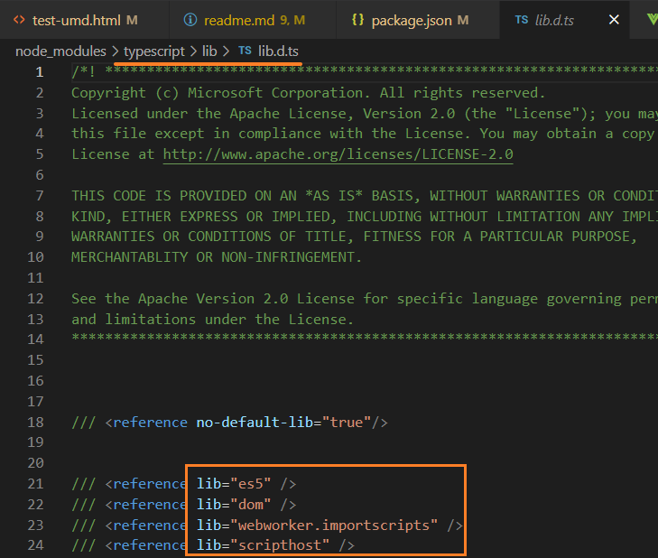
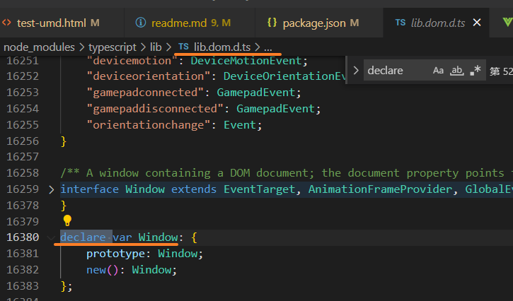

# [#](https://jkchao.github.io/typescript-book-chinese/typings/lib.html#lib-d-ts)`lib.d.ts`

当你安装 `TypeScript` 时，会顺带安装一个 `lib.d.ts` 声明文件。这个文件包含 JavaScript 运行时以及 DOM 中存在各种常见的环境声明。

- 它自动包含在 TypeScript 项目的编译上下文中；
- 它能让你快速开始书写经过类型检查的 JavaScript 代码。

你可以通过指定 `--noLib` 的编译器命令行标志（或者在 `tsconfig.json` 中指定选项 `noLib: true`）从上下文中排除此文件。

## [#](https://jkchao.github.io/typescript-book-chinese/typings/lib.html#使用例子)使用例子

看如下例子：

```ts
const foo = 123;
const bar = foo.toString();
```

这段代码的类型检查正常，因为 `lib.d.ts` 为所有 JavaScript 对象定义了 `toString` 方法。

如果你在 `noLib` 选项下，使用相同的代码，这将会出现类型检查错误：

```ts
const foo = 123;
const bar = foo.toString(); // Error: 属性 toString 不存在类型 number 上
```

现在你已经理解了 `lib.d.ts` 的重要性，至于它的内容是怎么样的，我们接下来将会解释。

## [#](https://jkchao.github.io/typescript-book-chinese/typings/lib.html#观察-lib-d-ts-的内容)观察 `lib.d.ts` 的内容






`lib.d.ts` 的内容主要是一些变量声明（如：`window`、`document`、`math`）和一些类似的接口声明（如：`Window`、`Document`、`Math`）。

寻找代码类型（如：`Math.floor`）的最简单方式是使用 IDE 的 `F12`（跳转到定义）。

让我们来看一个变量声明的示例，如 `window` 被定义为：

```ts
declare var window: Window;
```

这只是一个简单的 `declare var`，后面跟一个**变量名称**（`window`）和一个**用来类型注解的接口**（`Window`），这些变量通常指向一些全局的接口，例如，以下是 `Window` 接口的一小部分：

```ts
interface Window
  extends EventTarget,
    WindowTimers,
    WindowSessionStorage,
    WindowLocalStorage,
    WindowConsole,
    GlobalEventHandlers,
    IDBEnvironment,
    WindowBase64 {
  animationStartTime: number;
  applicationCache: ApplicationCache;
  clientInformation: Navigator;
  closed: boolean;
  crypto: Crypto;
  // so on and so forth...
}
```

你可以在这些接口里看到大量的类型信息，当你不使用 TypeScript 时，你需要将它们保存在你的大脑里。现在你可以使用 `intellisense` 之类东西，从而可以减少对知识的记忆。

使用这些全局变量是有利的。在不更改 `lib.d.ts` 的情况下，它可以让你添加额外的属性。接下来，我们将介绍这些概念。

## [#](https://jkchao.github.io/typescript-book-chinese/typings/lib.html#修改原始类型)修改原始类型

在 TypeScript 中，接口是开放式的，这意味着当你想使用不存在的成员时，只需要将它们添加至 `lib.d.ts` 中的接口声明中即可，TypeScript 将会自动接收它。

注意，你需要在[全局模块](https://jkchao.github.io/typescript-book-chinese/project/modules.html)中做这些修改，以使这些接口与 `lib.d.ts` 相关联。

我们推荐你创建一个称为 `global.d.ts` 的特殊文件。

这里有我们需要添加至 `Window`，`Math`，`Date` 的一些例子：

### Window

仅仅是添加至 `Window` 接口：

```ts
interface Window {
  helloWorld(): void;
}
```

这将允许你以类型安全的形式使用它：

```ts
// Add it at runtime
window.helloWorld = () => console.log('hello world');

// Call it
window.helloWorld();

// 滥用会导致错误
window.helloWorld('gracius'); // Error: 提供的参数与目标不匹配
```

### Math

全局变量 `Math` 在 `lib.d.ts` 中被定义为：

```ts
/** An intrinsic object that provides basic mathematics functionality and constants. */
declare var Math: Math;
```

即变量 `Math` 是 `Math` 的一个实例，`Math` 接口被定义为：

```ts
interface Math {
  E: number;
  LN10: number;
  // others ...
}
```

当你想在 `Math` 全局变量上添加你需要的属性时，你只需要把它添加到 `Math` 的全局接口上即可，例如：在[`seedrandom Project`](https://www.npmjs.com/package/seedrandom)项目里，它添加了 `seedrandom` 函数至全局的 `Math` 对象上，这很容易被声明：

```ts
interface Math {
  seedrandom(seed?: string): void;
}
```

你可以像下面一样使用它：

```ts
Math.seedrandom();

Math.seedrandom('Any string you want');
```


## [#](https://jkchao.github.io/typescript-book-chinese/typings/lib.html#使用你自己定义的-lib-d-ts)使用你自己定义的 `lib.d.ts`

正如上文所说，使用 `--noLib` 编译选项会导致 TypeScript 排除自动包含的 `lib.d.ts` 文件。

为什么这个功能是有效的，我例举了一些常见原因：

- 运行的 JavaScript **环境与基于标准浏览器运行时环境有很大不同**；
- 你希望在代码里严格的控制全局变量，例如：`lib.d.ts` 将 `item` 定义为全局变量，你不希望它泄漏到你的代码里。

一旦你排除了默认的 `lib.d.ts` 文件，你就可以在编译上下文中包含一个命名相似的文件，TypeScript 将提取该文件进行类型检查。

> TIP
>
> 小心使用 `--noLib` 选项，一旦你使用了它，当你把你的项目分享给其他人时，它们也将被迫使用 `--noLib` 选项，更糟糕的是，如果将这些代码放入你的项目中，你可能需要将它们移植到基于你的代码的 `lib` 中。

## [#](https://jkchao.github.io/typescript-book-chinese/typings/lib.html#编译目标对-lib-d-ts-的影响)编译目标对 `lib.d.ts` 的影响

设置编译目标为 `es6` 时，能导致 `lib.d.ts` 包含更多像 Promise 现代（es6）内容的**环境声明**。

编译器目标的这种作用，改变了代码的环境，这对某些人来说是理想的，但是这对另外一些人来说造成了困扰，因为它将编译出的代码与环境混为一谈。

当你想对环境进行更细粒的控制时，你应该使用我们接下来将要讨论的 `--lib` 选项。

## [#](https://jkchao.github.io/typescript-book-chinese/typings/lib.html#lib-选项)`--lib` 选项

有时，你想要解耦编译目标（即生成的 JavaScript 版本）和环境库支持之间的关系。

例如对于 Promise，你的编译目标是 `--target es5`，但是你仍然想使用它，这时，你可以使用 `lib` 对它进行控制。

你可以通过命令行或者在 `tsconfig.json` 中提供此选项（推荐）：

### [#](https://jkchao.github.io/typescript-book-chinese/typings/lib.html#命令行)命令行

```ts
tsc --target es5 --lib dom,es6
```

### [#](https://jkchao.github.io/typescript-book-chinese/typings/lib.html#config-json)config.json

```json
"compilerOptions": {
    "lib": ["dom", "es6"]
}
```

`lib` 分类如下：

- JavaScript 功能
  - es5
  - es6
  - es2015
  - es7
  - es2016
  - es2017
  - esnext
- 运行环境
  - dom
  - dom.iterable
  - webworker
  - scripthost
- **ESNext 功能**选项
  - es2015.core
  - es2015.collection
  - es2015.generator
  - es2015.iterable
  - es2015.promise
  - es2015.proxy
  - es2015.reflect
  - es2015.symbol
  - es2015.symbol.wellknown
  - es2016.array.include
  - es2017.object
  - es2017.sharedmemory
  - esnext.asynciterable

