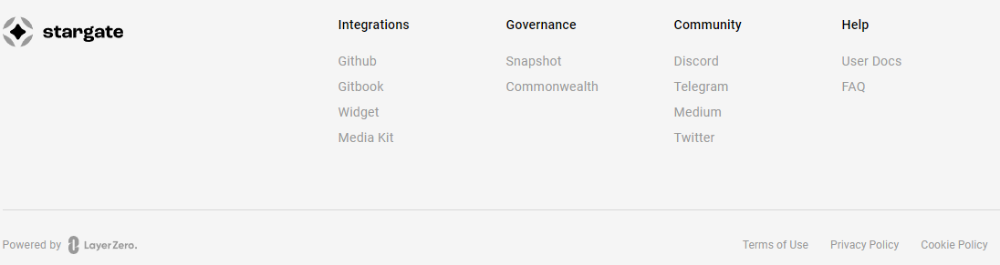
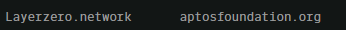
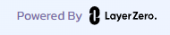
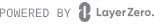

[toc]

# [Layerzero空投教程](https://go2web3.io/?p=146)

## **交互策略思考**

这种跨链产品猜空投权重一般都比较简单。

- （1）使用跨链产品的次数。（可能有最低次的要求，像hop是有最少2次的要求）
- （2）使用跨链产品的资金。（可能有最低资金的要求，像hop是有最少1000u的要求）
- （3）使用跨链产品的时间。（这个可能是时间越长，空投数量越多）
- （4）组LP流动性、质押。
- （5）因为这是个底层协议，可能会有权重看交互过多少个应用该协议的dapp。
- （6）社区活动

**提个醒：**

- 交互的频次上，跨链需求没有DEX高，没必要为了交互每天去跨，一至俩周去交互一个dapp就好了
- 个人认为和LayerZero交互，只有你的交易信息在layerzeroscan能查到，这才是和layerzero发生关系了，否则都只是和项目+使用的链发生关系

> **注意：**在“跨链“时。
>
> 在选择网络时，请记住，在每个网络中，gas 的支付都是用不同的代币以及在您进行交易的那些网络中进行的，所以会出现，你把一个币跨到另外一个网络了，因为另外一个网络没有gas币，跨不回来。

针对交互策略第5点，我在官方DC里面，按他们宣布集成的应用，做了一个整理，刷交互应用数量的时候，选择官方宣布的准没错。

- 2022/01/18 LayerZero上的第一个应用Stargate，链接： [*https://stargate.finance/*](https://stargate.finance/)
- 2022/03/31 获得投资
- 2022/08/06 AngleProtocol 已与 LayerZero 集成 。链接：[*https://www.angle.money/*](https://www.angle.money/)
- 2022/10/19 上了Aptos， 链接：[*https://theaptosbridge.com/bridge*](https://theaptosbridge.com/bridge)
- 2022/11/20 Metis 测试网 [*https://usdcdemo.layerzero.network/bridge*](https://usdcdemo.layerzero.network/bridge)
- 2022/12/13 BSC链的CAKE和aptos链之间的跨，链接：*http://bridge.pancakeswap.finance/aptos*
- 2023/02/22 主网的ETH和测试网的ETH兑换，链接：*[https://testnetbridge.com/ ](https://testnetbridge.com/)*。

> ### 官网推荐的 Bridges
>
> - [Aptos](https://theaptosbridge.com/)
> - [BTC.b](https://bitcoinbridge.network/)
> - [USDC](https://usdcdemo.layerzero.network/)
> - [Testnet](https://testnetbridge.com/)

> https://stargate.finance/
>
> 
>
> Poewer by LayerZero
>
> - Angle
> - Aptos 
> - Metis 测试网 
> - BSC链的CAKE和aptos链之间的跨: 
> - 测试网 