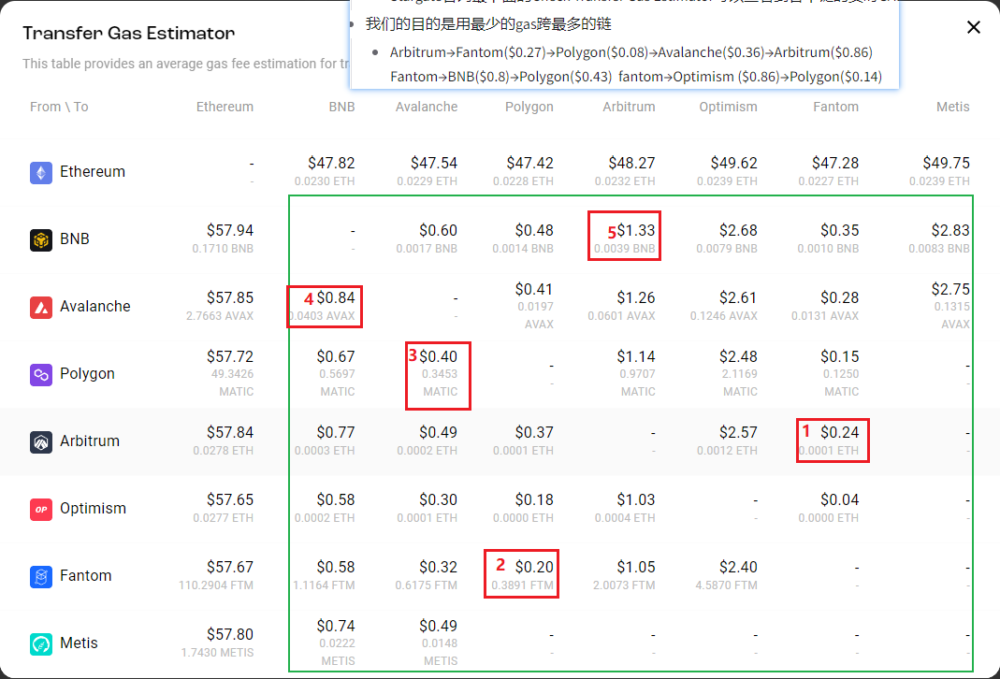

[toc]

> LayerZero和Stargate都是Cosmos生态系统中的项目。
>
> LayerZero是一个基于Tendermint和Cosmos SDK的开发框架，它提供了一组工具和库，帮助开发人员构建可扩展的、高性能的区块链应用。在LayerZero的帮助下，开发人员可以轻松地构建和部署自己的区块链应用，并与其他区块链互操作。
>
> Stargate是Cosmos SDK v0.40.0的一个重要升级，它引入了许多新的功能，包括IBC（Inter-Blockchain Communication，跨链通信）和模块的扩展性。它还提高了性能和安全性，并为开发人员提供了更多的工具和库，帮助他们构建更好的区块链应用。
>
> 因此，可以说LayerZero和Stargate都是帮助开发人员构建可扩展的、高性能的区块链应用的工具和库。虽然它们有所不同，但它们都是Cosmos生态系统中的项目，可以相互配合使用。

# [L0 空投 新手教程 - 0xKevin ](./files/LayerZero空投低保，精品号新手教程.html)

## 跨链

[𝐋𝐚𝐲𝐞𝐫𝐙𝐞𝐫𝐨](https://twitter.com/0xKevin00/status/1647847398566400000) 

提醒下，不论使用啥跨，记得选stargate，选了其他的是不算的，为啥跨这些桥，因为他们**底层使用了L0的全链协议**，所以交互算TX 跨链间隔10分钟，时间随机，金额随机，**可以UC可以E** 完整一次后，每周星们swap下，每月再来一次穷逼套餐