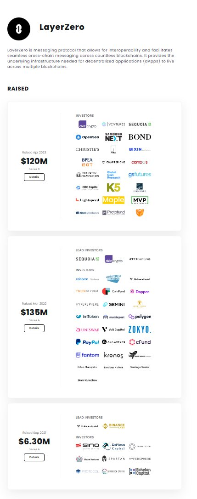
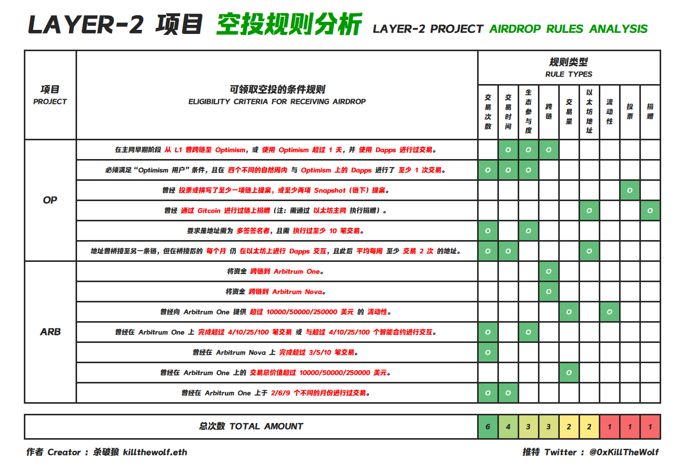

[toc]

[source](https://twitter.com/Said46807236/status/1645780713294405636)

# 全方面解析L0三部曲

## L0的空投标准

L0: [官网](https://layerzero.network/) [推](https://twitter.com/LayerZero_Labs) [L0scan](https://layerzeroscan.com/) [介绍文章](https://medium.com/layerzero-official/layerzero-an-omnichain-interoperability-protocol-b43d2ae975b6)

我将其分为以下几部分 

1. 跨链的数量 

   这里的数量指的是你跨过了多少条不同的链。从stargate（"L0的亲儿子"）上，我们可以看到有7条链，除此之外，别忘记了Aptos，总共8条链。作为全链协议，如果你只在单纯两条链上跨来跨去，如果你是项目方，这符合“全链”二字吗？L0官方推出的“真币换假币”，一定要体验

​	

上图[来源](https://stargate.finance/transfer): stargate官网

2. tx数量和资金量 

   从arb的空投标准中，我们可以发现它的空投对tx数量有四个等级的区分，分别是4，10，25，100。L0你到底用了多少次？是不是深层用户？就要从tx数量上来找答案了。并且我建议最后走一次大金额的跨链，大金额也是极为的重要。

   

3. 交互协议数 

   L0上有不少的项目。将其全面交互一次是极其有必要的。为了方便大家，我将其一次性列在下方。 

   - dex桥：xsushi，stargate，omnibtc，woofi，core，harmony，pancakeswap，Angle Protocol 

   - 借贷：rdnt 

   - nft:小鳄鱼，小企鹅，hologragh，omnisea 

   - 测试网：换币

     

4. 交互时间 

   将它放在第四点。是因为我们还剩的时间真的不多了，我相信L0发币就是在未来几个月的事情。你想要做到多个月交互已经是不太可能了

   所以你要更好的为将来打下基础（也就是现在请行动起来)。L0发币前，我认为你至少要做到每周都有交互，并且在第一周有5天进行了交互

5. 结论

   最后谈谈我的看法，在最终快照前，我们至少有10tx，交互链大于2，交互天数大于4，交互周数大于4周，体验了nft，dex，以及借贷……我相信如果完成了以上的任务，你一定能获得layerzero空投（至少价值2000u）

> 有没有最低成本的全交互教程，另外博主zksync，starknet有涉猎嘛
>
> starknet[置顶](https://twitter.com/Starknet/status/1643880448031076352)
>
> 1
>
> 上市可能影响发布空投.. 很多人纠结

## 低成本交互（0.6u）

今天又有不少说L0 [@LayerZero_Labs](https://twitter.com/LayerZero_Labs) 要上市的消息。有意思的是除了纽交所的恭喜图片外，还有不少群友的p图（为什么要p呢？）你细品，当然是为了更少的人卷！ 

他发不发你当然不会知道。但是你不撸就一定没有，还记得当初的arb发币前，也是说要上市异曲同工啊。 

众所周知，在L0上进行跨链是非常昂贵的！同样的从bsc跨到op，从正常的桥走只要0.15u而走L0却需要1.74u。一次1.74，那10次不得20u+？ 

但是我为大家带来的都是干货，别人的教程会有这张图吗?（右图）从图上很容易就会发现matic-ftm两条链之间跨只需要0.08u，有时候甚至只需要0.05u！你跨10几次只需要1u！

上图地址**[来源](https://stargate.finance/transfer)**: stargate官网

(我截图当天这个gas已经比教程高了许多)

还有一些人可能会问，op-ftm不是只要0.04u吗？从图上看的确是这样的，但是这里又要告诉一个别的“低质量重复”教程没有的东西了。从区块浏览器上来看，尽管我只跨了0.0001eth，但是最后收了我0.00024eth，还有0.000115的**gas**费，并且我这时候跨的收的还是少的。 这是L0独有的“保护费”收取！并且op链gas高

但是如果你只从ftm-matic两条链来回跨，在我看来还是有些不够的。多次反复强调“全链”的概念，希望你能够明白。arb，op**跨链**可以去走我推荐的测试网跨[https://testnetbridge.com](https://t.co/1aCq8ij6i4)，

这个跨链收取的费用是0.0001eth，**不同时间段是不一样的**。(测试网这个GAS已经被卷起来了) 

这样你既体验了测试网项目，又在arb，op链上进行了跨链，一鱼多吃。

> op-ftm ?  ftm-matic?
>
> arb-op

通过上述操作，我们已经在四条链上留下了我们的操作记录，并且成本是极低的哦，大概在0.6u左右吧，四条链，挑战一下全网！在跨链的时候**不要去stargate官网跨**，选择两个聚合器

- [https://classic.bungee.exchange](https://t.co/BXhbbwa5HX) 
- [https://jumper.exchange/swap](https://t.co/YI2wdKRbwi)

都有融资且未发币，选择其中的stargate跨链方式，又一鱼多吃了，哎，真舒服

只体验stargate也不太够，通过sushi，omnibtc多个**跨链dex**来跨链也是十分必要，内置的也是stargate跨链。在这里说一下，跨到ava也不贵！ 

- [https://app.omnibtc.finance/swap](https://t.co/qfbEyfnqS1) 
- [https://sushi.com/swap](https://t.co/zhlRDqjt2b) 

还有aptos的桥就比较贵了，但是它采取的并不是stargate内置，所以还是有必要去做，看你自己选择吧。（可选）

Rndt [@RDNTCapital](https://twitter.com/RDNTCapital)这个借贷项目，我认为还是有体验的必要的。上面通过layerzero的一共有两个地方。很多教程也是没有讲到。(较贵但有必要) 

第一个：就是通过他的跨链桥将 [$RDNT](https://twitter.com/search?q=%24RDNT&src=cashtag_click) 从arb发送到bsc，或者从bsc发送到arb。 

第二个：就是你先存钱（无L0）进去，然后可以从另一个链取钱（有L0）出来。

在这里提一下nft跨链，这里我推荐的项目是 [@holographxyz](https://twitter.com/holographxyz)

小鳄鱼和企鹅的价格都较高，可以的话你可以买一个，但是如果你不想买又想通过nft跨链的话，可以在该平台上进行跨链。上面有三条链，eth，ava和polygon。eth的价格较高，选择ava和polygon是比较合适和便宜。（大概在1.5u左右）

总结，通过上述，你跨了**arb，op，ftm，polygon，apt，ava，bsc等7条链**，并且你对其中一些进行选择的话，成本是极低的，且基本笼盖了大多数项目。希望我的教程能帮助到更多的人，你们的支持是我创作的最大动力！

## 多号与女巫

女巫一直是撸毛圈一个老生长谈的话题了。在arb过后，有不少人又增加了自己的号数量，毕竟多一个号就可以多一份空投嘛。不少人的号数量甚至是大于100的哦！

此次L0如果发币，对女巫的审查是否会像arb那样的轻松呢？从arb的空投标准上，在230w钱包中有65w获得了空投，但是X-explore的报告中确发现了更多！

查ip的项目其实不太多,但是apt那时候是查了ip的，单号3000u,但是arb又没有查，

但是L0现在上号已经不太建议太多了。