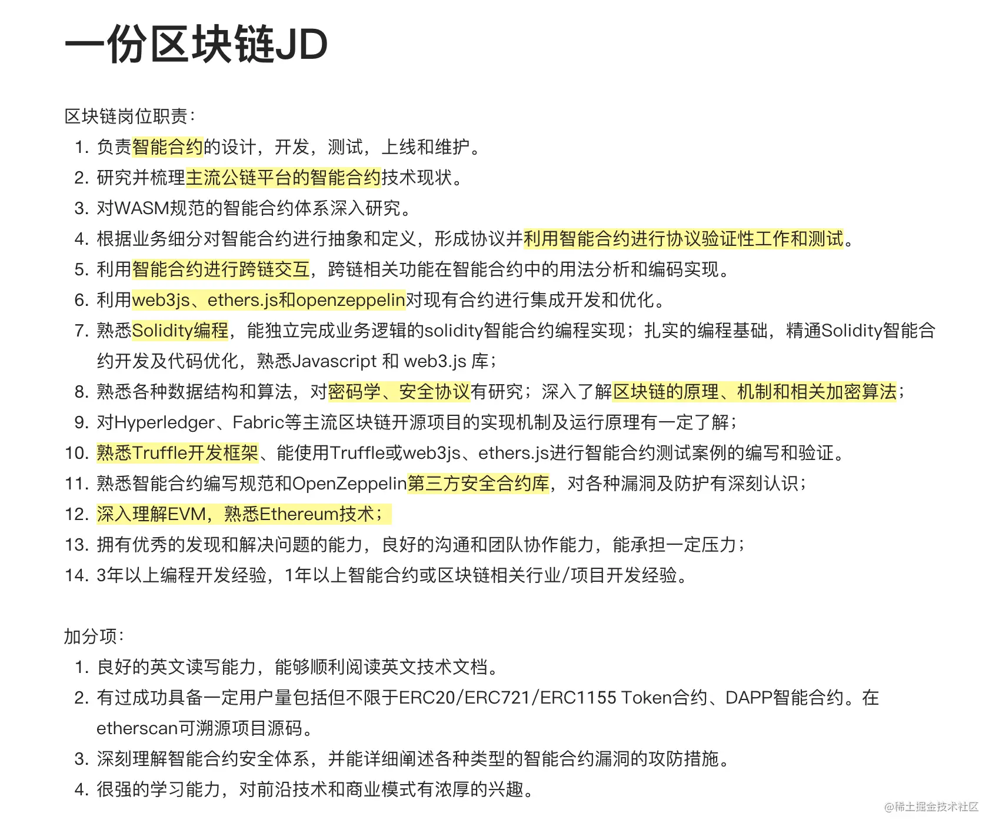

[toc]

### JD

从这份区块链里面可以可以看到以下的技术要点：

- 区块链基础原理
- 熟悉Ethereum技术，深入理解EVM
- Solidity编程
- 智能合约设计、开发、测试、上线和维护
- 智能合约的跨链交易
- Truffle开发框架
- web3js、ethers.js、OpenZeppelin等库

即使你还从未接触过Web3的开发，但如果你是一位有过Web开发经验的程序员，Dapp的应用开发范式基本是一致的，我相信你大概能从这份JD里面能总结出这么几点：

1. 区块链的基础原理和Ethereum技术是Web3开发的基础知识
2. 智能合约是区块链开发一个很重要的环节
3. Solidity是编写智能合约的一个重要语言
4. Truflle是一个主流的区块链开发框架
5. web3js、ethers.js、OpenZeppelin这几个是区块链开发中经常使用的库

没错，这几个技术点是我们Dapp开发和编写智能合约通常会使用到的。

