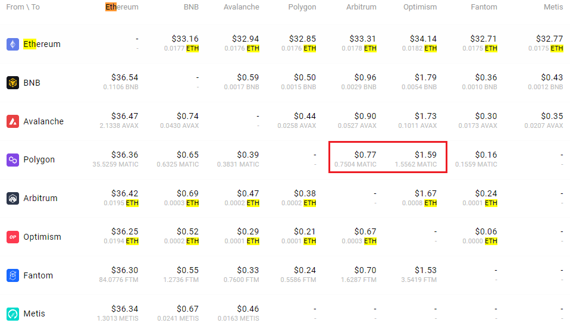

### 如何选择网络？

- BEP2指的是BNB信标链，即此前的“币安链”。
- BEP20则指BNB智能链(BSC)，即此前的“币安智能链”。
- **ERC20指的是以太坊网络**，其**原生代币**称为ETH。
- TRC20指的是TRON网络。
- EOS表示企业运营系统网络。
- BTC则代表比特币网络。
- BTC (SegWit)指的是原生隔离见证(bech32)，是以“bc1”开头的地址。用户可向SegWit (bech32)地址提现或发送比特币。欲了解详情，敬请参看[隔离见证(SegWit)的介绍](https://www.binance.com/cn/support/faq/0a6fcbc99a87424481c08bd894601759)。

*如选择BEP2或EOS等网络，须在转账时填写MEMO，否则无法检测到所选的地址。*

- 网络选择取决于外部提现钱包/交易平台的情况。如外部平台仅支持ERC20，则须选择ERC20充值网络。
- 不要选择费用最低的选项，**而是选择与外部平台兼容的网络**。例如，ERC20代币仅限发送至其他的ERC20地址，而BSC代币只能发送到其他BSC地址。充值网络不兼容或不匹配将造成资金损失。
- 同样，**请确认收币平台支持您提现的代币的合约地址**，否则您的资产可能会丢失且无法追回。您可从相应的平台查看其支持的合约地址列表

### polygon做交互没有matic怎么办？1分钟解决。

https://mirror.xyz/goout.eth/4lF7RL3mOkjwcjOXSNDcMHhhR-bbOSdboSx-eLtgCIo

https://polygon.technology/blog/swap-for-gas-get-matic-token-on-polygon-pos-in-a-flash

> 很久之前的了.. https://wallet.polygon.technology/polygon/gas-swap 
>
> minimun: 0.5
>
> 

### 什么叫土狗币和meme币

"土狗币"和"Meme币"是两种通常指代在加密货币市场上出现的低价值、高风险的数字货币。

"土狗币"是指由中国的狗仔队带动的一波低价股票、低市值加密货币的投机行为，其中土指中国本土，狗指狗仔队，币指加密货币。这些数字货币往往没有实际的应用或基本价值支持，但在一些社交媒体平台上被炒作，吸引了大量的投机者和短期投资者。

"Meme币"则是指一些以网络文化、流行文化、或梗文化为主题的数字货币，这些数字货币通常没有实际应用或基本价值支持，但其价格可能会因为社交媒体上的热度和网络效应而快速上涨或下跌。比如近年来出现的一些以恶搞和梗文化为主题的数字货币，例如Dogecoin、Shiba Inu等。

需要注意的是，投资数字货币需要谨慎，尤其是在涉及低价值、高风险的数字货币时，需要认真评估其实际价值和潜在风险，并谨慎做出投资决策。

### 老鼠仓

老鼠仓是指某些人在利用未公开信息进行股票交易的行为，即在掌握了未公开信息之后，通过买卖股票来获利。这种行为通常被视为违法和不道德的，因为这些人在利用他人缺乏信息的情况下获取不当利益，损害了市场的公平性和透明度。

在数字货币市场中，类似于老鼠仓的行为也存在。例如，一些内部人员或项目方在掌握了未公开信息之后，通过大量买卖代币来牟取暴利，这种行为同样被视为违法和不道德的。

需要注意的是，投资数字货币需要谨慎，任何不当行为都可能会对市场造成负面影响，损害投资者的利益和市场的健康发展。

### 地址隔离

链上地址 metamask1 ->交易所地址->交易所热钱包->其他的钱包 metamask2

### 空投处理

加密 KOL hoeem 复盘了 OP、CANTO、APT、BLUR、ARB 5 个代币在空投分发后的前 24 小时、14 天和 30 天内的价格表现，得出结论： 1. 在空投后24 小时内卖出代币； 2. 保持耐心，在前 14 天避免 fomo； 3. 前 30 天被证明是再次买入这些空投代币的绝佳时机。

### TRX转账一次只消耗1 TRX教程

众所周知，TRX转账，如果接收人的账户里有U，那么消耗的能量为33000，如果没U，消耗翻倍

如果不租能量，正常消耗TRX的话，对方钱包为有U的情况下转账一次大概需要十几个TRX，大概是14个左右TRX，折合1 USDT 多一点，大概人民币为8块钱左右，对方钱包为没U的情况下，转账的费用是以上费用翻倍。

租赁能量的机器人：https://t.me/trxbaobot

租赁33000能量一次只需要1 TRX，相比自己消耗TRX立省90% 

使用教程：

先给机器人转1个TRX，然后把你的钱包地址发给机器人，机器人就会往你的钱包地址上转能量