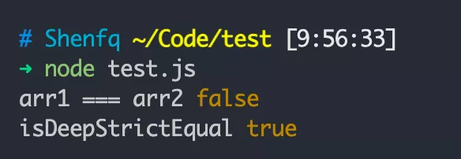
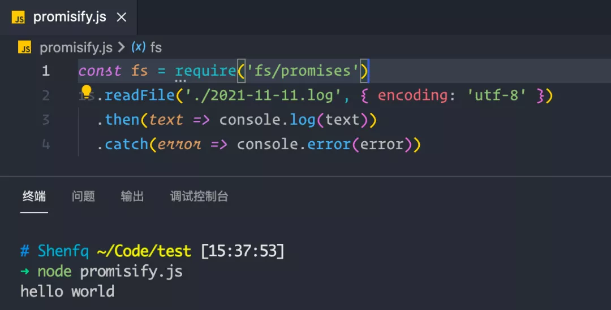
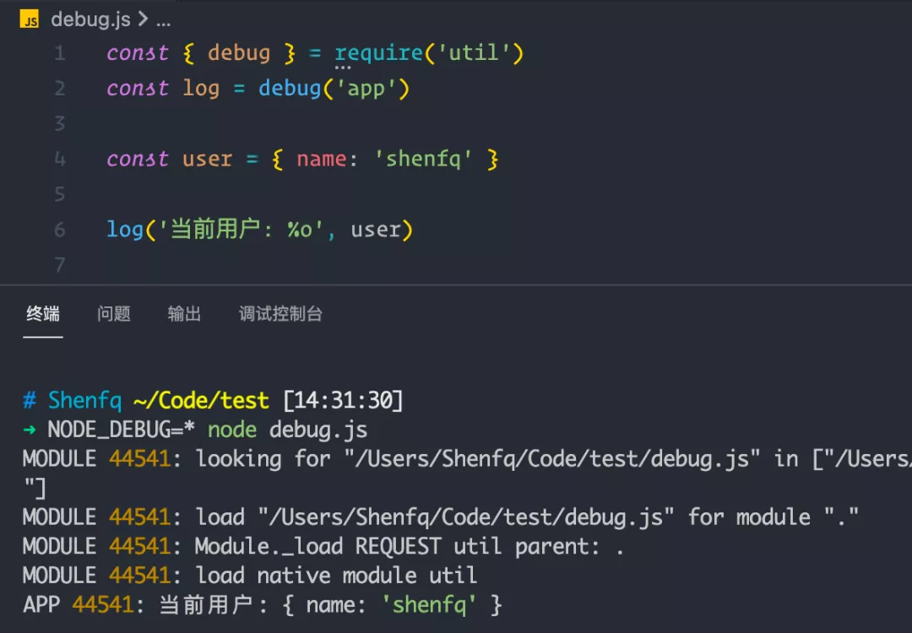
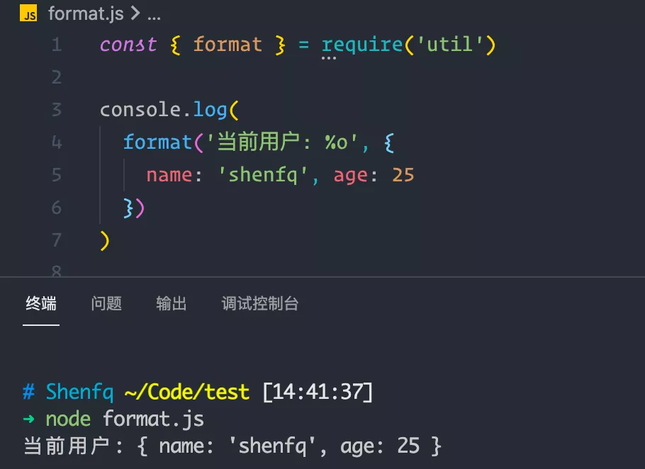
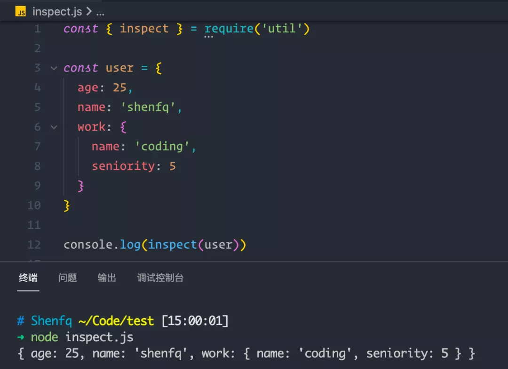
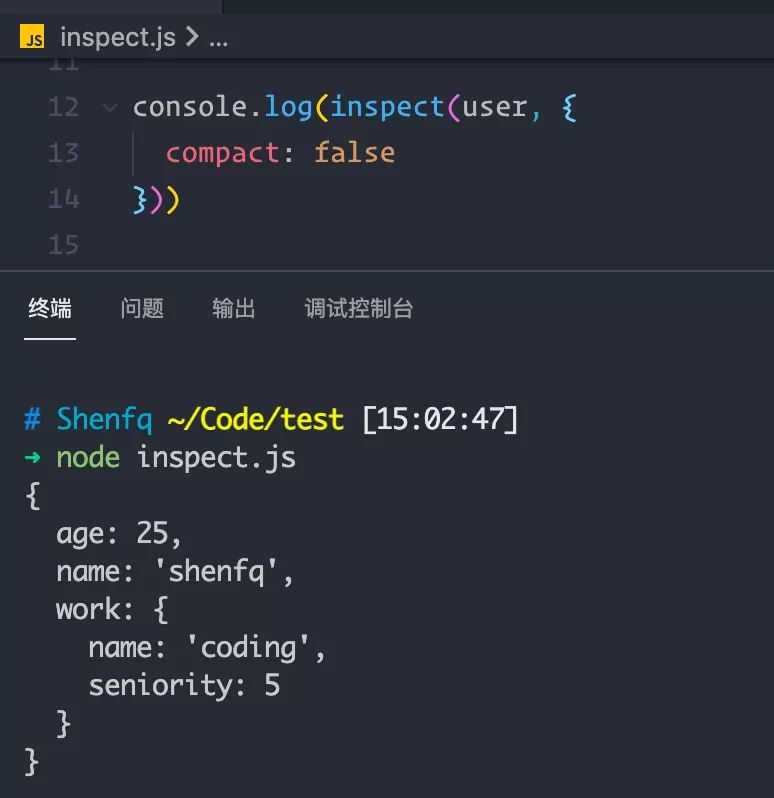
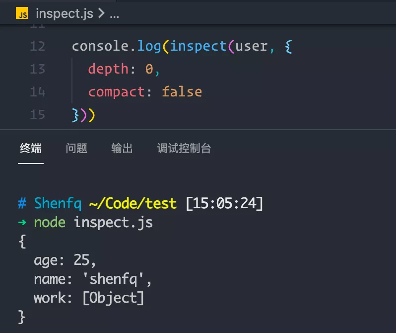
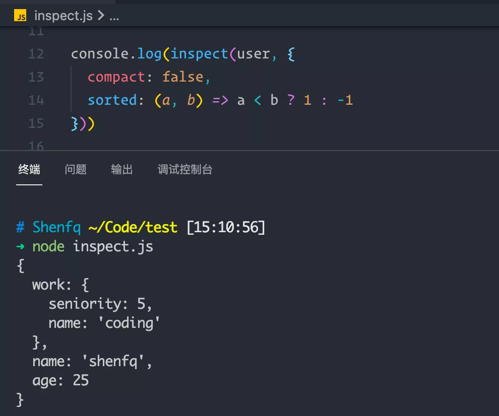

[TOC]

# [Node.js 内置的 util 模块究竟有多好用？ (qq.com)](https://mp.weixin.qq.com/s/WRyN9d9G1apllyLddFXJWQ)

> 早期的 Node API 都是 `Error First` 风格的，也就是所有的异步函数都会接受一个回调函数，该回调的一个参数为 error 对象，如果正常返回 error 对象为 `null`，后面的参数为成功响应的结果。

**[util 实用工具 | Node.js API 文档 (nodejs.cn)](http://nodejs.cn/api/util.html)**


在 JavaScript 中，进行变量的类型校验是一个非常令人头疼的事，如果只是简单的使用 `typeof` 会到各种各样的问题。

举几个简单的🌰：

```
console.log(typeof null) // 'object'
console.log(typeof new Array) // 'object'
console.log(typeof new String) // 'object'
```

后来，大家发现可以使用 `Object.prototype.toString()` 方法来进行变量类型的判断。

```
const getTypeString = obj => Object.prototype.toString.call(obj)

getTypeString(null) // '[object Null]'
getTypeString('string') //'[object String]'
getTypeString(new String) //'[object String]'
```

对 `toString()` 方法进行代理，可以得到一个类型字符串，我们就可以在这个字符串上面搞事情。

```
const getTypeString = obj => {
  return Object.prototype.toString.call(obj)
}
const isType = type => {
  return obj => {
    return getTypeString(obj) === `[object ${type}]`
  }
}

const isArray = isType('Array') // 该方法一般通过 Array.isArray 代替

const isNull = isType('Null')
const isObject = isType('Object')
const isRegExp = isType('RegExp')
const isFunction = isType('Function')
const isAsyncFunction = isType('AsyncFunction')
isNull(null) // true
isObject({}) // true
isRegExp(/\w/) // true
isFunction(() => {}) // true
isAsyncFunction(async () => {}) // true
```

But，在 Node.js 中，内部其实是有一组用来判断变量类型的 api 的。而且功能异常丰富，除了基础类型的判断，还支持判断 Promise 对象、Date 对象、各种ArrayBuffer。

```
const types = require('util/types')

types.isDate(new Date) // true
types.isPromise(new Promise(() => {})) // true
types.isArrayBuffer(new ArrayBuffer(16)) // true
```

## 严格相等

在 JavaScript 中，对象、数组等变量在判断相等的过程中，如果用 `===` 通常只会判断这两个变量是否指向同一内存地址。如果想判断对象的键对应的所有值是否相等，需要对两个对象进行遍历。在 `util` 中，也提供了一个方法可以用来判断两个对象是否严格相等：`util.isDeepStrictEqual(val1, val2)`

```
const util = require('util')

const val1 = { name: 'shenfq' }
const val2 = { name: 'shenfq' }

console.log('val1 === val2', val1 === val2) // false
console.log('isDeepStrictEqual', util.isDeepStrictEqual(val1, val2)) // true
```


该方法同样可以用来判断数组，是否严格相等：

```
const util = require('util')

const arr1 = [1, 3, 5]
const arr2 = [1, 3, 5]

console.log('arr1 === arr2', arr1 === arr2) // false
console.log('isDeepStrictEqual', util.isDeepStrictEqual(arr1, arr2)) // true
```



## Error First & Promise

**早期的 Node API 都是 `Error First` 风格的，也就是所有的异步函数都会接受一个回调函数，该回调的一个参数为 error 对象，如果正常返回 error 对象为 `null`，后面的参数为成功响应的结果。**

```
// 下面是一个读取文件的示例
const fs = require('fs')
fs.readFile('nginx.log', (error, data) => {
  if (error) {
    // 读取文件失败
    console.error(error)
    return
  }
  // 读取文件成功，打印结果
  console.log(data)
})
```

在 Node 8 发布的时候，新增了一个 `promisify` 接口，用于将 `Error First` 风格的 API 转为 Promise API。

```
const fs = require('fs')
const util = require('util')

const readFile = util.promisify(fs.readFile)
readFile('./2021-11-11.log', { encoding: 'utf-8' })
  .then(text => console.log(text)) 
 .catch(error => console.error(error))
```


不过，后来也有很多人觉得这些原生 API 支持 Promise 的方式太过繁琐，每个 API 都需要单独的包装一层 `promisify` 方法。在 Node 10 发布的时候，原生模块都新增了一个 `.promises` 属性，该属性下的所有 API 都 Promise 风格的。

```
const fs = require('fs').promises
fs.readFile('./2021-11-11.log', { encoding: 'utf-8' })
  .then(text => console.log(text)) 
 .catch(error => console.error(error))
```


**注意**：Node 14 后，`promises` API 又新增了一种引入方式，通过修改包名的方式引入。

```
const fs = require('fs/promises')
fs.readFile('./2021-11-11.log', { encoding: 'utf-8' })
  .then(text => console.log(text)) 
 .catch(error => console.error(error))
```



除了将 `Error First` 风格的 API 转为 Promise API，`util` 中还提供 `callbackify` 方法，用于将 `async` 函数转换为 `Error First` 风格的函数。

下面通过 `callbackify` 将 promise 化的 `fs` 还原为 `Error First` 风格的函数。

```
const fs = require('fs/promises')
const util = require('util')

const readFile = util.callbackify(fs.readFile)
readFile('./2021-11-12.log', { encoding: 'utf-8' }, (error, text) => {
  if (error) {
    console.error(error)
    return
  }
  console.log(text)
})
```

## 调试与输出

如果有开发过 Node 服务，应该都用过 `debug` 模块，通过该模块可以在控制台看到更加明晰的调试信息。

```
const debug = require('debug')
const log = debug('app')

const user = { name: 'shenfq' }

log('当前用户: %o', user)
```


其实，通过 `util.debug` 也能实现类似的效果：

```
const debug = require('debug')
const log = debug('app')

const user = { name: 'shenfq' }

log('当前用户: %o', user)
```

只是在启动时，需要将 `DEBUG` 环境变量替换为 `NODE_DEBUG`。



如果你有认真看上面的代码，应该会发现，在 `log('当前用户: %o', user)` 方法前面的字符串中，有一个 `%o` 占位符，表示这个地方将会填充一个对象（object）。这与 C 语言或 python 中的，`printf` 类似。同样，在 `util` 模块中，直接提供了格式化的方法：`util.format`。

```
const { format } = require('util')

console.log(
  format('当前用户: %o', {
    name: 'shenfq', age: 25
  })
)
```



除了 `%o` 占位符，不同的数据类型应使用不同的占位符。

| 占位符 | 类型                     |
| :----- | :----------------------- |
| %s     | 字符串                   |
| %d     | 数字（包括整数和浮点数） |
| %i     | 整数                     |
| %f     | 浮点数                   |
| %j     | JSON                     |
| %o     | Object                   |

JavaScript 中的对象是一个很复杂的东西，除了直接使用 `util.format` 外加 `%o` 占位符的方式格式化对象，`util` 中还提供了一个叫做 `inspect` 方法来进行对象格式化。

```
const { inspect } = require('util')

const user = {
  age: 25,
  name: 'shenfq',
  work: {
    name: 'coding',
    seniority: 5
  }
}

console.log(inspect(user))
```



这么看 `inspect` 好像什么都没做，但是 `inspect` 方法还有第二个参数，用来进行格式化时的一些个性化配置。

- `depth: number`：控制显示层级；
- `sorted: boolean|Function`: 是否按照key的编码值进行排序；
- `compact: boolean`：是否进行单行显示；

当然上面只是一部分配置，更详细的配置可查阅 node 文档，下面我们写几个案例：

所有的属性都换行显示：

```
inspect(user, {
 compact: false
})
```



只格式化对象第一层的值：

```
inspect(user, {
  depth: 0,
 compact: false
})
```



按照key值的编码倒序输出：

```
inspect(user, {
 compact: false,
  sorted: (a, b) => a < b ? 1 : -1
})
```


