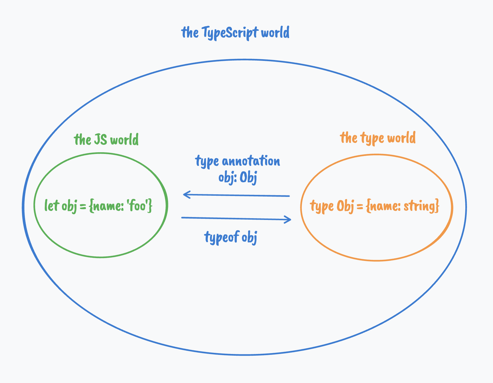

[TOC]

# An Introduction To Type Programming In TypeScript

## Types are a complex language of their own[#](https://www.zhenghao.io/posts/type-programming#types-are-a-complex-language-of-their-own)

I used to think of TypeScript as just JavaScript with type annotations sprinkled on top of it. 

With that mindset, I often found writing correct types <u>tricky and daunting</u>, to a point they got in the way of building the actual applications I wanted to build, and frequently, it led me to reach for `any`. And with `any`, I lose all type safety.

Indeed, types can get really complicated if you let them.

After writing TypeScript for a while, it occurred to me that the TypeScript language actually consists of two sub-languages - one is JavaScript, and the other is the type language:

- for the JavaScript language, the world is made of JavaScript values
- for the type language, the world is made of types

#### 类型本身就是一种复杂的语言

我曾经认为TypeScript只是JavaScript，上面撒着类型注释。

有了这种心态，我经常发现编写正确的类型<u>既棘手又令人生畏</u>，以至于它们阻碍了我想要构建的实际应用程序，并且经常导致我使用 `any` .并且随着 `any`，我失去了所有类型的安全性

事实上，如果你放任它们，类型会变得非常复杂。

在编写了一段时间的TypeScript之后，我突然想到TypeScript语言实际上由两个**子语言**组成 - 一个是JavaScript，另一个是 type language：

- 对于JavaScript语言，世界是由JavaScript值构成的
- 对于type语言，世界是由type组成的

------

When we write TypeScript code, we are constantly dancing between these two worlds: 

​	we create types in our type world and "summon" them in our JavaScript world using type annotations (or have them implicitly inferred by the compiler); 

​	we can go in the other direction too: use TypeScript's [typeof operator](https://www.typescriptlang.org/docs/handbook/2/typeof-types.html#the-typeof-type-operator) on JavaScript variables/properties to retrieve the corresponding types (not the `typeof` operator JavaScript provides to check runtime values' types).

当我们编写TypeScript代码时，我们不断在这两个世界之间跳舞：

​	我们在类型世界中创建类型，并使用类型注释在我们的JavaScript世界中"召唤"它们（或者让编译器隐式推断它们）;

​	我们也可以朝另一个方向走：在JavaScript变量/属性上使用TypeScript的[typeof运算符](https://www.typescriptlang.org/docs/handbook/2/typeof-types.html#the-typeof-type-operator)来检索相应的类型（而不是JavaScript提供的用于检查运行时值类型的运算符`typeof`）。



------

The JavaScript language is very expressive, so is the type language - in fact, the type language is so expressive that it has been proven to be Turing complete.

Here I don't make any value judgment of whether being Turing complete is good or bad, nor do I know if it is even by design or by accident (in fact, often times, Turing-completeness was achieved [by accident](http://beza1e1.tuxen.de/articles/accidentally_turing_complete.html)). My point is the type language itself, as innocuous as it seems, is certainly powerful, highly capable and can perform arbitrary computation at compile time.

When I started to think of the type language in TypeScript as a full-fledged programming language, I realized it even has a few characteristics of a functional programming language:

1. use recursion instead of iteration
   1. in [TypeScript 4.5](https://devblogs.microsoft.com/typescript/announcing-typescript-4-5/#tailrec-conditional) we have tail call optimized recursion (to some extent)
2. types (data) are immutable

In this post, we will learn the type language in TypeScript by comparing it with JavaScript so that you can leverage your existing JavaScript knowledge to master TypeScript quicker.

> This post assumes that readers have some familiarity with JavaScript and TypeScript. And if you want to learn TypeScript from scratch properly, you should start with [The TypeScript Handbook](https://www.typescriptlang.org/docs/handbook/intro.html). I am not here to compete with the docs.

JavaScript语言非常富有表现力，类型语言也是如此 - 事实上，类型语言是如此富有表现力，以至于它已被证明是图灵完备的。

在这里，我不对图灵完备是好是坏做出任何价值判断，也不知道它是设计还是偶然的（事实上，很多时候，图灵完备性是[偶然实现的](http://beza1e1.tuxen.de/articles/accidentally_turing_complete.html)）。我的观点是，类型语言本身，尽管看起来无害，但肯定是强大的，功能强大的，可以在编译时执行任意计算。

当我开始将TypeScript中的类型语言视为一种成熟的编程语言时，我意识到它甚至具有函数式编程语言的一些特征：

1. 使用递归而不是迭代
   1. 在[TypeScript 4.5](https://devblogs.microsoft.com/typescript/announcing-typescript-4-5/#tailrec-conditional)中，我们有尾部调用优化的递归（在某种程度上）
2. 类型（数据）是不可变的

在这篇文章中，我们将通过将TypeScript与JavaScript进行比较来学习TypeScript中的类型语言，以便您可以利用现有的JavaScript知识更快地掌握TypeScript。

> 这篇文章假设读者对JavaScript和TypeScript有一定的了解。如果你想从头开始正确地学习TypeScript，你应该从[The TypeScript Handbook](https://www.typescriptlang.org/docs/handbook/intro.html)开始。我不是来这里与文档竞争的。

------

## Variable declaration

In JavaScript, the world is made of JavaScript values, and we declare variables to refer to values using keywords **`var`, `const` and `let`.** For example:

```javascript
const obj = {name: 'foo'}
```

In the type language, the world is made of **types**, and we declare type variables using keywords **`type` and `interface`.** For example:

```javascript
type Obj = {name: string}
```

> A more accurate name for “type variables” is type synonyms or type alias. I use the word "type variables" to draw an analogy to how a JavaScript variable references a value.
>
> It is not a perfect analogy though, a type alias doesn’t create or introduce a new type—they are only a new name for existing types. But I hope drawing this analogy makes explaining concepts of the type language much easier.
>
> "类型变量"更准确的名称是类型同义词或类型别名。我使用"类型变量"这个词来类比JavaScript变量如何引用值。
>
> 然而，这并不是一个完美的类比，类型别名不会创建或引入新类型 - 它们只是现有类型的新名称。但我希望打这个比方可以更容易地解释类型语言的概念。

Types and values are very related. A type, at its core, represents the set of possible values and the valid operations that can be done on the values. 

Sometimes the set is finite, e.g., `type Name = 'foo' | 'bar'`, a lot of times the set is infinite, e.g., `type Age = number`. 

In TypeScript we integrate types and values and make them **work together** to ensure that **the runtime values match the compile-time types**.

类型和值非常相关。类型的核心是一组可能的值以及可以对这些值执行的有效操作。

有时集合是有限的，例如，`type Name = 'foo' | 'bar'`，很多时候集合是无限的，例如，`type Age = number` 。

在 TypeScript 中，我们集成类型和值，并使它们协同工作，以确保**运行时值与编译时类型匹配**。


### Local variable declaration

We talked about how you can create type variables in the type language. 

However, the type variables have a global scope by default. 

To create a local type variable, we can use the `infer` keyword in our type language.

默认情况下，类型变量具有全局作用域。

要创建局部类型变量，我们可以在类型语言中使用关键字`infer`

```typescript
type A = 'foo'; // global scope
type B = A extends infer C ? (
    C extends 'foo' ? true : false// *only* inside this expression, C represents A
) : never
```

Although this particular way of creating scoped variables might seem strange to JavaScript developers, it actually finds its roots in some pure functional programming languages.

 For example, in Haskell, we can use the `let` keyword with `in` to perform scoped assignments as in `let {assignments} in {expression}`:

尽管这种创建作用域变量的特殊方式对 JavaScript 开发人员来说似乎很奇怪，但它实际上在一些纯函数式编程语言中找到了自己的根源.

例如，在 Haskell 中，我们可以使用关键字 with 来执行作用域内赋值，如：`let``in``let {assignments} in {expression}`

```typescript
let two = 2; three = 3 in two * three 
//                         ↑       ↑
// two and three are only in scope for the expression `two * three` 
```

**`infer` is useful for caching some intermediate types ** 

**`infer`对于缓存某些中间类型很有用**

Here is an example:

```typescript
type ConvertFooToBar<G> = G extends 'foo' ? 'bar' : never
type ConvertBarToBaz<G> = G extends 'bar' ? 'baz' : never

type ConvertFooToBaz<T> = ConvertFooToBar<T> extends infer Bar ? 
        Bar extends 'bar' ? ConvertBarToBaz<Bar> : never 
    : never

type Baz = ConvertFooToBaz<'foo'>
```

Without `infer` to create a local type variable `Bar`, we have to calculate `Bar` twice:

```typescript
type ConvertFooToBar<G> = G extends 'foo' ? 'bar' : never
type ConvertBarToBaz<G> = G extends 'bar' ? 'baz' : never

type ConvertFooToBaz<T> = ConvertFooToBar<T> extends 'bar' ? 
    ConvertBarToBaz<ConvertFooToBar<T> > : never // call `ConvertFooToBar` twice

type Baz = ConvertFooToBaz<'foo'>
```

## Equality comparisons and conditional branching[#](https://www.zhenghao.io/posts/type-programming#equality-comparisons-and-conditional-branching)

In JavaScript. we can use `===`/`==` with if statement or the conditional (ternary) operator `?` to perform equality check and conditional branching.

In the type language, on the other hand, we use the `extends` keyword for "equality check", and the conditional (ternary) operator `?` for conditional branching too as in:

另一方面，在类型语言中，我们使用关键字`extends`进行"相等检查"，并将条件（三元）运算符`?`用于条件分支，如：

```Haskell
TypeC = TypeA extends TypeB ? TrueExpression : FalseExpression
```

If `TypeA` is assignable or substitutable to `TypeB`, then we enter the first branch and get the type from `TrueExpression` and assign that to `TypeC` ; otherwise we get the type from `FalseExpression` as a result to `TypeC`.

如果 `TypeA`  对于 `TypeB` 是可赋值或可替换的 ，则我们输入第一个分支并从中获取类型`TrueExpression`并将其赋值给`TypeC` ;否则，我们将类型从 `FalseExpression` 作为结果赋值给`TypeC` 。

> The concept of assignability/substitutability is one of the core concepts in TypeScript that deserves a separate post - I wrote [one covering that in detail](https://www.zhenghao.io/posts/type-hierarchy-tree).
>
> *可分配性/可替代性的概念是TypeScript中的核心概念之一，值得单独写一篇文章 - 我写了*[一篇详细介绍它](https://www.zhenghao.io/posts/type-hierarchy-tree)*的文章。*

A concrete example in JavaScript:

```typescript
const username = 'foo'
let matched

if(username === 'foo') {
    matched = true
} else {
    matched = false
}
```

Translate it into the type language:

```javascript
type Username = 'foo'
type Matched = Username extends 'foo' ? true : false // true
```

The `extends` keyword is versatile. It can also apply constraints to generic type parameters. For example:

关键字是通用的。它还可以对泛型类型参数应用约束。例如：`extends`

```typescript
function getUserName<T extends {name: string}>(user: T) {
	return user.name
}
```

By adding the generic constraints (通过添加泛型约束), `<T extends {name: string}>` we ensure the argument our function takes always consist of a `name` property of the type `string`.

## Retrieve types of properties by indexing into object types[#](https://www.zhenghao.io/posts/type-programming#retrieve-types-of-properties-by-indexing-into-object-types) 通过索引到对象类型来检索属性类型

In JavaScript we can access object properties with **square brackets** e.g. `obj['prop']` or the **dot operator** e.g., `obj.prop`.

In the type language, we can extract property types with square brackets as well.

```typescript
type User = {name: string, age: number}
type Name = User['name']
```

This works not just with object types, we can also index the type with tuples and arrays.

```typescript
type Names = string[]
type Name = Names[number]

type Tuple = [string, number]
type Age = Tuple[1]
```

## Functions[#](https://www.zhenghao.io/posts/type-programming#functions)

Functions are the main reusable “building blocks” of any JavaScript program. 

They take some input (some JavaScript values) and return an output (also some JavaScript values). 

In the type language, we have generics. Generics **parameterize** types like functions **parameterize** value. 

Therefore, a generic is conceptually similar to a function in JavaScript.

在类型语言中，我们有泛型。泛型**参数化类型，**如函数**参数化**值。

因此，**泛型在概念上类似于 JavaScript 中的函数。**

For example, in JavaScript:

```typescript
function fn(a, b = 'world') { return [a, b] }
const result = fn('hello') // ["hello", "world"]
```

For our type language, we have:

```javascript
type Fn  <A extends string, B extends string = 'world'>   =  [A, B]
//   ↑    ↑           ↑                          ↑              ↑
// name parameter parameter type          default value   function body/return statement

type Result = Fn<'hello'> // ["hello", "world"]
```

> **this is still not a perfect analogy though...** **这仍然不是一个完美的类比...**
>
> Generics are by no means exactly the same as JavaScript's functions. 
>
> For one, unlike functions in JavaScript, Generics are not **first-class citizens** in the type language. 
>
> That means we cannot pass a generic to another generic like we pass a function to another function as TypeScript doesn't allow [generics as type parameters](https://github.com/microsoft/TypeScript/issues/1213).
>
> 泛型绝不是与JavaScript的函数完全相同。
>
> 首先，与JavaScript中的函数不同，泛型在类型语言中不是**一等公民**。
>
> 这意味着我们不能像将一个函数传递给另一个函数那样将**泛型传递给另一个泛型**，因为TypeScript不允许[泛型作为类型参数](https://github.com/microsoft/TypeScript/issues/1213)。

### Map and filter[#](https://www.zhenghao.io/posts/type-programming#map-and-filter)

In our type language, types are **immutable**. 

If we want to modify a part of a type, we have to **transform the existing** ones into **new types**. 

In the type language, the details of iterating over a data structure (i.e. an object type) and applying transformations evenly are abstracted away by [Mapped Types](https://www.typescriptlang.org/docs/handbook/2/mapped-types.html). 

We can use it to implement operations that are conceptually similar to the map and filter array methods in JavaScript.

在我们的类型语言中，**类型是不可变的**。

如果我们想修改类型的一部分，我们必须**将现有的类型转换为新的类型**。

在类型语言中，迭代数据结构（即对象类型）和均匀应用转换的详细信息由[映射类型](https://www.typescriptlang.org/docs/handbook/2/mapped-types.html)抽象出来。

我们可以使用它来实现在概念上类似于JavaScript中的映射和过滤器数组方法的操作。

In JavaScript, let's say we want to transform an object's properties from numbers to strings:

```typescript
const user = {
    name: 'foo',
    age: 28
}

function stringifyProp(object) {
    return Object.fromEntries(Object.entries(object)
		.map(([key, value]) => [key, String(value)]))
}

const userWithStringProps = stringifyProp(user) // {name:'foo', age: '28'}
```

In the type langauge, the mapping is done using this syntax **`[K in keyof T]`** where the `keyof` operator gives us property names as a string union type.

```javascript
type User = {
    name: string,
    age: number
}

type StringifyProp<T> = {
    [K in keyof T]: string
}

type UserWithStringProps = StringifyProp<User> // { name: string; age: string; }
```

In JavaScript, we can **filter out** the properties of an object based on some critiria. For example, we can filter out all non-string properties:

```typescript
const user = {
    name: 'foo',
    age: 28
}

function filterNonStringProp(object) {
    return Object.fromEntries(Object.entries(object)
        .filter(([key, value]) => typeof value === 'string' && [key, value]))
}

const filteredUser = filterNonStringProp(user) // {name: 'foo'}
```

In our type language, this can be achieved with the `as` operator and the `never` type:

```javascript
type User = {
    name: string,
    age: number
}

type FilterStringProp<T> = {
    // not easy to understand
    // is string ? string : never
    [K in keyof T as T[K] extends string ? K : never]: string
}

type FilteredUser = FilterStringProp<User> // { name: string }
```

There are a bunch of builtin [utility “functions”](https://www.typescriptlang.org/docs/handbook/utility-types.html) (generics) for transforming types in TypeScript so often times you don't have to re-invent the wheels.

## Pattern matching[#](https://www.zhenghao.io/posts/type-programming#pattern-matching) 模式匹配

We can also use the `infer` keyword to perform pattern matching in the type language.

我们还可以使用关键字`infer`在类型语言中执行模式匹配。

For example, in a JavaScript program, we can use regex to extract a part of a string:

```typescript
const str = 'foo-bar'.replace(/foo-*/, '')
console.log(str) // 'bar'
```

The equivalence(等价性) in our type language:

```javascript
type Str = 'foo-bar'

// ?? 为什么 Bar 的type
type Bar = Str extends `foo-${infer rest}` ? rest : never // 'bar'
```

what is `infer` doing?


## Recursion, instead of iteration[#](https://www.zhenghao.io/posts/type-programming#recursion-instead-of-iteration)

Just like many pure functional programming languages out there, in our type language, there is no syntactical construct for **for loop** to iterate over a list of data. 

Recursion take the place of loops.

Let's say in JavaScript, we want to write a function to return an array with same item repeated multiple times. 

Here is one possible way you can do that:

```typescript
function fillArray(item, n) {
    const res = [];
    for (let i = 0; i < n; i++) {
        res[i] = item;
    }
    return res;
}
```

The recurisve solution would be:

```javascript
function fillArray(item, n, array = []) {
    return array.length === n ? array : fillArray(item, n, [item, ...array])
}
```

How do we write out the equivalence in our type language? 

Here are logical steps to arrive at one solution:

1. create a generic type called `FillArray` (remember we talked about that generics in our type language are just like functions?)

   ```ts
   FillArray<Item, N extends number, Array extends Item[] = []>
   ```

2. Inside the "function body", we need to check if the `length` property on `Array` is already `N` using the `extends` keyword

   - if it has reached to `N` (the base case), then we simply return `Array`
   - if it hasn't reached to `N`, it recurses and added one more `Item` into `Array`

   ??

Putting these together, we have:

```javascript
type FillArray<Item, N extends number, Array extends Item[] = []> 
    = Array['length'] extends N 
        ? Array : FillArray<Item, N, [...Array, Item]>;

type Foos = FillArray<'foo', 3> // ["foo", "foo", "foo"]        
```

### Limits for recursion depth[#](https://www.zhenghao.io/posts/type-programming#limits-for-recursion-depth)

Before TypeScript 4.5, the max recursion depth is [45](https://www.typescriptlang.org/play?ts=4.4.4&ssl=3&ssc=10&pln=3&pc=17#code/C4TwDgpgBAShkENgDkA8BJYEC2AaKyUEAHlgHYAmAzlGQK7YBGEATvgCp1gA20J51KAjIgA2gF0oAXigSAfNKiceEUQHJeZAObAAFmsn8IlGoQD8SrrygAuWPAhI0mHPmT5RAOm-Le+F9jicgDcAFCgkFAAQopwiCioagCMavgALACsCuHg0ACCsQ5OiSnpAGwKAPSVUFTACADGANZQAPYAbqwAZtytAO5AA). In TypeScript 4.5, we have tail call optimization, and the limit increased to [999](https://www.typescriptlang.org/play?ts=4.5.4#code/C4TwDgpgBAShkENgDkA8BJYEC2AaKyUEAHlgHYAmAzlGQK7YBGEATvgCp1gA20J51KAjIgA2gF0oAXigSAfNKiceEUQHJeZAObAAFmsn8IlGoQD8SrrygAuWPAhI0mHPmT5RAOm-Le+F9jicgDcAFChoJBQAIKKcIgoqGoAjGr4AJyZchHg0ABCcQ5OSan4yQAMlQoA9NVQVMAIAMYA1lAA9gBurABm3O0A7qFAA).

在 TypeScript 4.5 之前，最大递归深度为 [45](https://www.typescriptlang.org/play?ts=4.4.4&ssl=3&ssc=10&pln=3&pc=17#code/C4TwDgpgBAShkENgDkA8BJYEC2AaKyUEAHlgHYAmAzlGQK7YBGEATvgCp1gA20J51KAjIgA2gF0oAXigSAfNKiceEUQHJeZAObAAFmsn8IlGoQD8SrrygAuWPAhI0mHPmT5RAOm-Le+F9jicgDcAFCgkFAAQopwiCioagCMavgALACsCuHg0ACCsQ5OiSnpAGwKAPSVUFTACADGANZQAPYAbqwAZtytAO5AA)。在 TypeScript 4.5 中，我们有尾部调用优化，限制增加到 [999](https://www.typescriptlang.org/play?ts=4.5.4#code/C4TwDgpgBAShkENgDkA8BJYEC2AaKyUEAHlgHYAmAzlGQK7YBGEATvgCp1gA20J51KAjIgA2gF0oAXigSAfNKiceEUQHJeZAObAAFmsn8IlGoQD8SrrygAuWPAhI0mHPmT5RAOm-Le+F9jicgDcAFChoJBQAIKKcIgoqGoAjGr4AJyZchHg0ABCcQ5OSan4yQAMlQoA9NVQVMAIAMYA1lAA9gBurABm3O0A7qFAA)。

## Avoid type gymnastics in production code[#](https://www.zhenghao.io/posts/type-programming#avoid-type-gymnastics-in-production-code)

Sometimes type programming is jokingly referred to as “type gymnastics” when it gets really complex, fancy and far more sophisticated than it needs to be in a typical application. 

有时，类型编程被戏称为**"类型体操"**，当它变得非常复杂，花哨并且比典型应用程序中需要的复杂得多时。

For example:

1. [simulating a Chinese chess (象棋)](https://github.com/chinese-chess-everywhere/type-chess)
2. [simulating a Tic Tac Toe game](https://blog.joshuakgoldberg.com/type-system-game-engines/)
3. [implementing arithmetic](https://itnext.io/implementing-arithmetic-within-typescripts-type-system-a1ef140a6f6f)

They are more like academic exercises, not suitable for production applications because:

1. they are hard to comprehend, especially with esoteric TypeScript features.
2. they are hard to debug due to incredibly long and cryptic compiler error messages.
3. they are slow to compile.

> Just like we have Leetcode for practicing your core programming skills, we have [type-challenges](https://github.com/type-challenges/type-challenges) for practicing your type programming skills.

## Closing thoughts[#](https://www.zhenghao.io/posts/type-programming#closing-thoughts)

We have covered a lot in this blog post. The point of this post is not to really teach you TypeScript, rather than to reintroduce the "hidden" type language you might have overlooked ever since you started learning TypeScript.

Type programming is a niche and underdiscussed topic in the TypeScript community, and I don't think there is anything wrong with that - because ultimately adding types is just a means to an end, the end being writing more dependable web applications in JavaScript. Therefore, to me it is totally understandable that people don't often take the time to "properly" study the type language as they would for JavaScript or other programming languages.

我们在这篇博文中介绍了很多内容。这篇文章的重点不是真正教你TypeScript，而不是重新引入自你开始学习TypeScript以来你可能忽略的"隐藏"类型语言。

类型编程在TypeScript社区中是一个利基和未被充分讨论的话题，我认为这没有任何问题 - 因为最终添加类型只是达到目的的一种手段，最终是用JavaScript编写更可靠的Web应用程序。因此，对我来说，人们通常不会像JavaScript或其他编程语言那样花时间"正确"学习类型语言，这是完全可以理解的。

## Further Reading[#](https://www.zhenghao.io/posts/type-programming#further-reading)

- [Proof that TypeScript's Type System is Turing Complete](https://gist.github.com/hediet/63f4844acf5ac330804801084f87a6d4)
- [TypeScript and Turing Completeness](https://itnext.io/typescript-and-turing-completeness-ba8ded8f3de3)
