[toc]

## Chrome DevTools 全攻略ï¼åŠ©åŠ›é«˜æ•ˆå¼€å‘

## Console é¢æ¿

> 此章节请打开 justwe7.github.io/devtools/console/console.html 一起食用
>
> 一方é¢ç”¨æ¥è®°å½•é¡µé¢åœ¨æ‰§è¡Œè¿‡ç¨‹ä¸­çš„ä¿¡æ¯ï¼ˆä¸€èˆ¬é€šè¿‡å„ç§ console 语å¥æ¥å®ç°ï¼‰ï¼Œå¦ä¸€æ–¹é¢ç”¨æ¥å½“åš shell 窗å£æ¥æ‰§è¡Œè„šæœ¬ä»¥åŠä¸é¡µé¢æ–‡æ¡£ã€DevTools 等进行交互

组åˆå¿«æ·é”®æŒ‰é”®:
Windows: `Control` + `Shift` + `J`
Mac: `Command` + `Option` + `J`

首先看一下 console 对象下é¢éƒ½æœ‰å“ªäº›æ–¹æ³•:
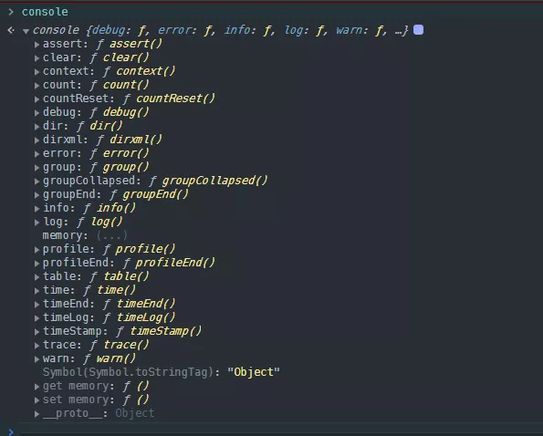

### console.clear()

顾åæ€ä¹‰ï¼Œæ¸…空æ§åˆ¶å°

### console.log(), info(), warn(), error()

日常用的比较多的就是这几个了，其中 `log` å’Œ `info`，å°è±¡ä¸­åœ¨ 2016 年之å‰è€ç”¨ info 打å°ï¼Œè¿˜æ˜¯æœ‰åŒºåˆ«çš„，`info` 输出的内容å‰é¢æ˜¯æœ‰ä¸€ä¸ªè“色背景的å°åœˆ, 大概跟这个差ä¸å¤š: i，åæ¥ chrome 更新就没了(IE 还是å¯ä»¥çœ‹å‡ºå·®åˆ«çš„)

```
console.log('普通信æ¯')
console.info('æ示性信æ¯')
console.error('错误信æ¯')
console.warn('警示信æ¯')
```

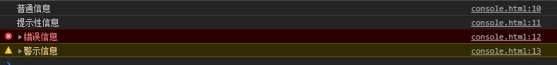

**使用å ä½ç¬¦**

```
// 支æŒé€—å·åˆ†éš”å‚数，ä¸éœ€è¦æ¯ä¸ªå‚数都å•ç‹¬æ‰“å°
console.log(1, '2', +'3')
// å ä½ç¬¦
// %s 
console.log('今晚%s è€è™', '打', '？？？')
// %c 
console.log('今晚%s%c è€è™', '打', 'color: red', '？？？')
// 带有å ä½ç¬¦çš„å‚数之å的若干å‚æ•°å±äºå ä½ç¬¦çš„é…ç½®å‚æ•°
```

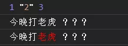

其余的å ä½ç¬¦åˆ—表还有：

| å ä½ç¬¦ | 功能           |
| :----- | :------------- |
| %s     | 字符串         |
| %d     | æ•´æ•°           |
| %i     | æ•´æ•°           |
| %f     | 浮点数         |
| %o     | å¯¹è±¡çš„é“¾æ¥     |
| %c     | css æ ¼å¼å­—符串 |

### console.time(), timeEnd()

`time` å’Œ `timeEnd` 一般放在一起用，传入一个å‚数用æ¥æ ‡è¯†èµ·å§‹ä½ç½®ç”¨äºç»Ÿè®¡æ—¶é—´:

```
console.time('t')
Array(900000).fill({}).forEach((v, index) => v.index = index)
console.timeEnd('t')
// t: 28.18603515625ms
```

会打å°å‡ºä¸­é—´ä»£ç çš„执行时间

### console.count()

顾åæ€ä¹‰ã€‚。计数,å¯ä»¥ç”¨æ¥ç»Ÿè®¡æŸä¸ªå‡½æ•°çš„执行次数，也å¯ä»¥ä¼ å…¥ä¸€ä¸ªå‚数，并且根æ®ä¼ å…¥çš„å‚数分组统计调用的次数

```
function foo(type = '') {
  type ? console.count(type) : console.count()
  return 'type：' + type
}

foo('A') //A: 1
foo('B') //B: 1
foo()    //default: 1
foo()    //default: 2
foo()    //default: 3
foo('A') //A: 2
```

### console.trace()

用äºè¿½è¸ªä»£ç çš„调用栈，ä¸ç”¨ä¸“门断点å»çœ‹äº†

```
console.trace()
function foo() {
  console.trace()
}
foo()
```

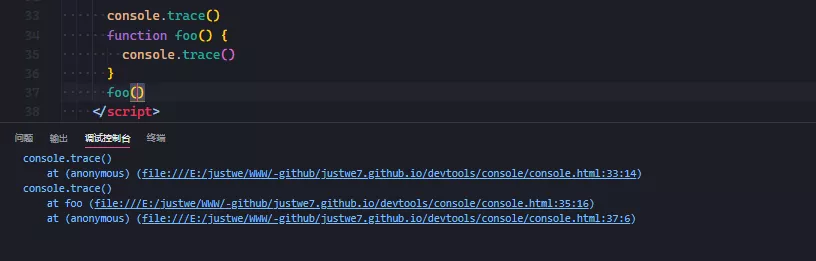

### console.table()

console.table()方法å¯ä»¥å°†å¤åˆç±»å‹çš„æ•°æ®è½¬ä¸ºè¡¨æ ¼æ˜¾ç¤º

```
var arr = [
  { name: '梅西', qq: 10 },
  { name: 'C ç½—', qq: 7 },
  { name: '内马尔', qq: 11 },
]
console.table(arr)
```

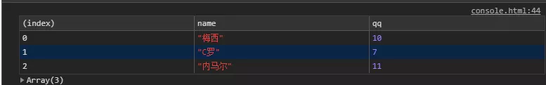

### console.dir()

按便äºé˜…读和打å°çš„å½¢å¼å°†å¯¹è±¡æ‰“å°

```
var obj = {
  name: 'justwe7',
  age: 26,
  fn: function () {
    alert('justwe7')
  },
}
console.log(obj)
console.dir(obj)
```

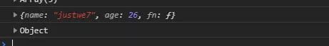

æ‰“å° DOM 对象区别：
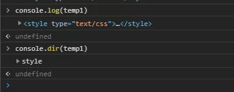

### console.assert()

断言，用æ¥è¿›è¡Œæ¡ä»¶åˆ¤æ–­ã€‚当表达å¼ä¸º false 时，则显示错误信æ¯ï¼Œä¸ä¼šä¸­æ–­ç¨‹åºæ‰§è¡Œã€‚

> å¯ä»¥ç”¨äºæ示用户，内部状æ€ä¸æ­£ç¡®ï¼ˆæŠŠé‚£ä¸ªè¯´å‡è¯çš„æªå‡ºæ¥ï¼‰

```
var val = 1
console.assert(val === 1, 'ç­‰äº 1')
console.assert(val !== 1, 'ä¸ç­‰äº 1')
console.log('代ç å¾€ä¸‹æ‰§è¡Œå‘¢å•Š')
```

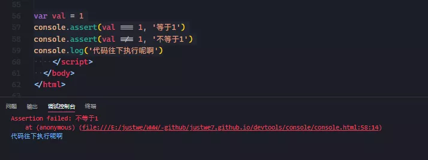

### console.group(), groupEnd()

分组输出信æ¯ï¼Œå¯ä»¥ç”¨é¼ æ ‡æŠ˜å /展开

```
console.group('分组 1')
console.log('分组 1-1111')
console.log('分组 1-2222')
console.log('分组 1-3333')
console.groupEnd()
console.group('分组 2')
console.log('分组 2-1111')
console.log('分组 2-2222')
console.log('分组 2-3333')
console.groupEnd()
```

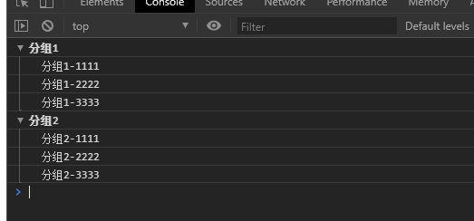

### `$` 选择器

#### `$_`

å¯ä»¥è®°å½•ä¸Šæ¬¡è®¡ç®—的结æœï¼Œç›´æ¥ç”¨äºä»£ç æ‰§è¡Œ:

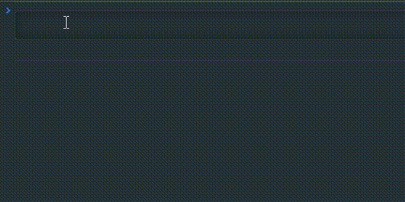

#### `$0,$1...$4`

代表最近 5 个审查元素**选中**过的 DOM 节点，看图（是è¦é€‰ä¸­ä¸€ä¸‹ï¼Œæˆ‘更喜欢用存储全局å˜é‡çš„æ–¹å¼ç©ï¼Œçœçš„自己手残åˆé€‰äº†ä¸€ä¸ªèŠ‚点）：


#### `$和$$`

- `$(selector)`是åŸç”Ÿ document.querySelector() çš„å°è£…。
- `$$(selector)`è¿”å›çš„是所有满足选择æ¡ä»¶çš„元素的一个集åˆï¼Œæ˜¯ document.querySelectorAll() çš„å°è£…

#### $x

将所匹é…的节点放在一个数组里返å›

```
<ul>
  <ul>
    <li><p>li 下的 p1</p></li>
    <li><p>li 下的 p2</p></li>
    <li><p>li 下的 p3</p></li>
  </ul>
</ul>
<p>外é¢çš„ p</p>
$x('//li') // 所有的 li
$x('//p') // 所有的 p
$x('//li//p') // 所有的 li 下的 p
$x('//li[p]') // 所有的 li 下的 p
```

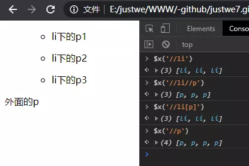

#### keys(), values()

è·Ÿ ES6 对象扩展方法， `Object.keys()` å’Œ `Object.values()` 相åŒ

```
keys(obj);
values(obj);
```

#### copy()

å¯ä»¥ç›´æ¥å°†å˜é‡å¤åˆ¶åˆ°å‰ªè´´æ¿

```
copy(temp1)
```

ä¸ `Save global variable` 结åˆä½¿ç”¨ç¥å™¨

## Element é¢æ¿

> 此章节请打开 justwe7.github.io/devtools/element/element.html 一起食用
>
> 在 Elements é¢æ¿ä¸­å¯ä»¥é€šè¿‡ DOM æ ‘çš„å½¢å¼æŸ¥çœ‹æ‰€æœ‰é¡µé¢å…ƒç´ ï¼ŒåŒæ—¶ä¹Ÿèƒ½å¯¹è¿™äº›é¡µé¢å…ƒç´ è¿›è¡Œæ‰€è§å³æ‰€å¾—的编辑

组åˆå¿«æ·é”®æŒ‰é”®:
Windows: `Control` + `Shift` + `C`
Mac: `Command` + `Option` + `C`

### css 调试

#### style

选中目标节点，element é¢ç‰ˆï¼ŒæŸ¥çœ‹ style->:hov,选择对应的状æ€å³å¯

1. 

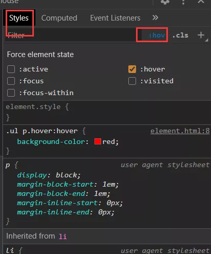

1. 

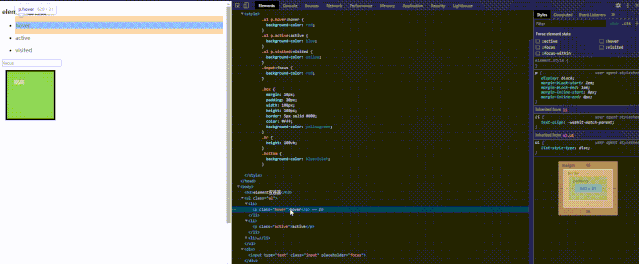

#### computed

有时候样å¼è¦†ç›–过多，查看起æ¥å¾ˆéº»çƒ¦ï¼Œ`computed` 就派上用场了

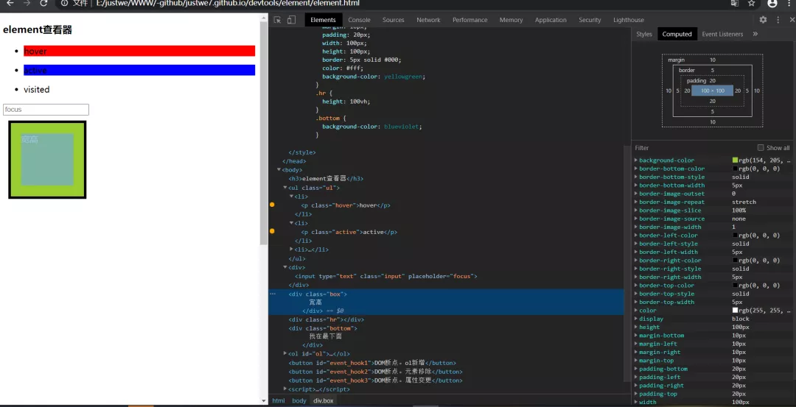

> 点击æŸä¸ªæ ·å¼å¯ä»¥ç›´æ¥è·³è½¬è‡³å¯¹åº” css 定义

#### 调整æŸä¸ªå…ƒç´ çš„数值

选中想è¦æ›´æ”¹çš„值，按方å‘键上下就å¯ä»¥ `+ / -` 1 个å•ä½çš„值

> `alt + æ–¹å‘é”®` å¯ä»¥ ×10 调整å•ä½å€¼
> `Ctrl + æ–¹å‘é”®` å¯ä»¥ ×100 调整å•ä½å€¼
> `shift + æ–¹å‘é”®` å¯ä»¥ /10 调整å•ä½

### html 调试

#### 骚æ“作

选中节点，直æ¥æŒ‰é”®ç›˜ `H` å¯ä»¥ç›´æ¥è®©å…ƒç´ æ˜¾ç¤º/éšè—，ä¸ç”¨æ‰‹åŠ¨æ•²æ ·å¼äº†ï¼Œæ•ˆæœç­‰åŒ `visibility: hidden`，还是è¦å æ®ç›’模å‹ç©ºé—´çš„。（记得把输入法改æˆè‹±æ–‡~）

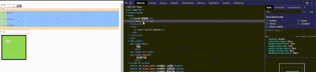

#### å°†æŸä¸ªå…ƒç´ å­˜å‚¨åˆ°å…¨å±€ä¸´æ—¶å˜é‡ä¸­

选中节点，å³é”®ï¼Œ`Store as global variable`（在 network é¢æ¿ä¸­ä¹Ÿèƒ½ç”¨ï¼Œå°¤å…¶æ˜¯ç­›é€‰æ¥å£çš„è¿”å›å€¼å¾ˆæ–¹ä¾¿ï¼‰

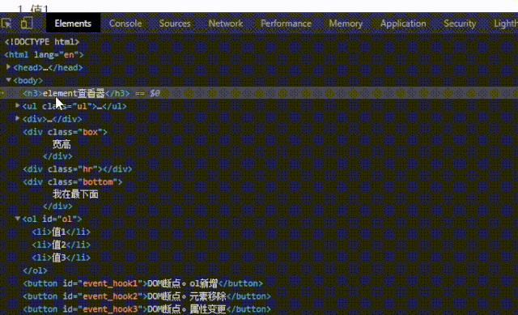

#### 滚动到æŸä¸ªèŠ‚点

如æœé¡µé¢å¾ˆé•¿ï¼Œæƒ³æ‰¾ä¸€ä¸ªæ–‡æœ¬èŠ‚点的显示ä½ç½®åˆä¸æƒ³æ‰‹åŠ¨æ»‘动å¯ä»¥è¯•è¯• `Scroll into view`

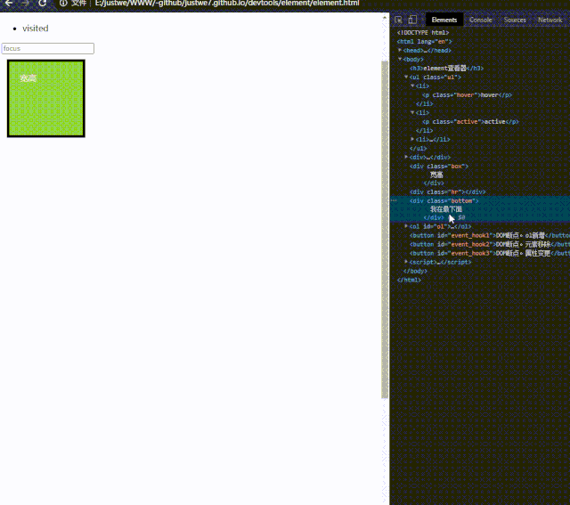

#### Edge 专å±çš„ 3D 视图

使用 chromium åçš„ Edge 真的是改头æ¢é¢ï¼Œ**3D 视图**å¯ä»¥å¸®å¿™å®šä½ä¸€äº›å®šä½å±‚级还有 DOM 嵌套的问题，页é¢ç»“æ„写的好ä¸å¥½çœ‹å¾ˆç›´è§‚çš„å¯ä»¥çœ‹å‡ºæ¥(跟辅助功能里é¢çš„ dom 树结åˆä½¿ç”¨å¾ˆèˆ’æœ)

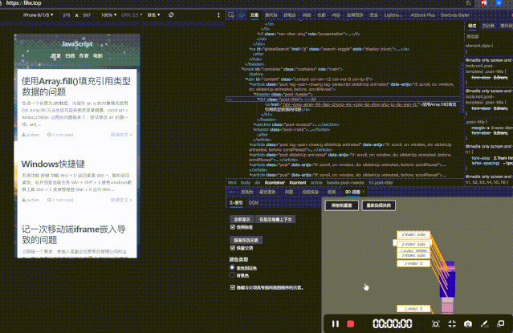

ç›®å‰ chrome 还是没有这项功能的，Edge 打开ä½ç½®ï¼šæ§åˆ¶å°æ‰“å¼€çŠ¶æ€ => `Esc`打开抽屉 => `···`选择 3D 视图é¢æ¿

### DOM 断点

å¯ä»¥ç›‘å¬åˆ° DOM 节点的å˜æ›´(å­èŠ‚点å˜åŠ¨/å±æ€§å˜æ›´/元素移除)，并断点至å˜æ›´ DOM 状æ€çš„ js 代ç è¡Œï¼š

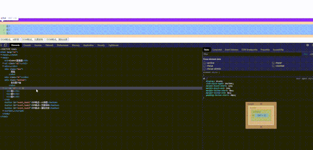

## Network é¢æ¿

> å¯ä»¥æŸ¥çœ‹é€šè¿‡ç½‘络请求的资æºçš„相关详细信æ¯

组åˆå¿«æ·é”®æŒ‰é”®:
Windows: `Control` + `Shift` + `I`
Mac: `Command` + `Option` + `I`

按区域划分大概分为如下几个区域：
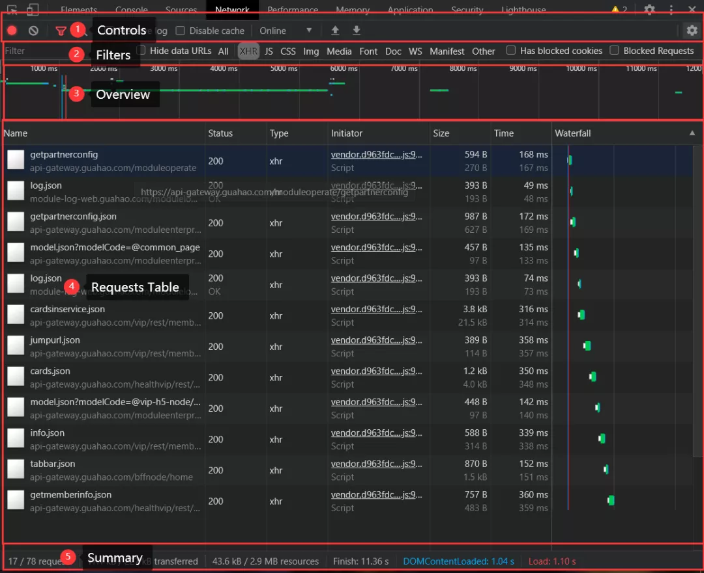

1. `Controls` - æ§åˆ¶ Network 功能选项，以åŠä¸€äº›å±•ç¤ºå¤–观

2. `Filters` - æ§åˆ¶åœ¨ Requests Table 中显示哪些类å‹çš„资æº

   > tipsï¼šæŒ‰ä½ Cmd (Mac) 或 Ctrl (Windows/Linux) 并点击筛选项å¯ä»¥åŒæ—¶é€‰æ‹©å¤šä¸ªç­›é€‰é¡¹

3. `Overview` - 此图表显示了资æºæ£€ç´¢æ—¶é—´çš„时间线。如æœçœ‹åˆ°å¤šæ¡ç«–线堆å åœ¨ä¸€èµ·ï¼Œåˆ™è¯´æ˜è¿™äº›èµ„æºè¢«åŒæ—¶æ£€ç´¢

4. `Requests Table` - 此表格列出了检索的æ¯ä¸€ä¸ªèµ„æºã€‚ 默认情况下，此表格按时间顺åºæ’åºï¼Œæœ€æ—©çš„资æºåœ¨é¡¶éƒ¨ã€‚点击资æºçš„å称å¯ä»¥æ˜¾ç¤ºæ›´å¤šä¿¡æ¯ã€‚ æ示：å³é”®ç‚¹å‡» Timeline 以外的任何一个表格标题å¯ä»¥æ·»åŠ æˆ–移除信æ¯åˆ—

5. `Summary` - å¯ä»¥ä¸€ç›®äº†ç„¶åœ°çœ‹åˆ°é¡µé¢çš„请求总数ã€ä¼ è¾“çš„æ•°æ®æ€»é‡ã€åŠ è½½æ—¶é—´

### （1ã€2）Controls，Filters 区域

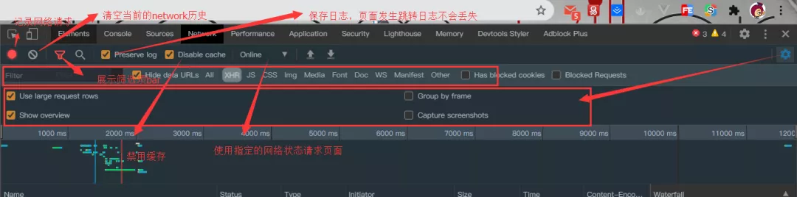

Filters æ§åˆ¶çš„展示：

- **使用大请求行** - 默认情况下，`Requests Table`一个资æºåªæ˜¾ç¤ºå¾ˆå°çš„一行。选中`Use large resource rows`(使用大资æºè¡Œ)按钮å¯ä»¥æ˜¾ç¤ºä¸¤ä¸ªæ–‡æœ¬å­—段：主è¦å­—段和次è¦å­—段。
- **æ•è·å±å¹•æˆªå›¾** - 将鼠标悬åœåœ¨æŸä¸ªå±å¹•æˆªå›¾ä¸Šçš„时候，Timeline/Waterfall(时间轴)会显示一æ¡å‚直的黄线，指示该帧是何时被æ•è·çš„
- **显示概述** - 展示页é¢æ•´ä¸ªç”Ÿå‘½å‘¨æœŸçš„å„个阶段（Overview 区域）的耗时（è“色绿色的那些横æ ï¼‰

### （3） Overview 区域

页é¢æ•´ä¸ªç”Ÿå‘½å‘¨æœŸçš„å„个阶段网络资æºåŠ è½½è€—时信æ¯çš„汇总，å¯ä»¥é€‰æ‹©åŒºåŸŸæ¥ç­›é€‰ `Requests Table` 的详细资æºä¿¡æ¯

### (4) Requests Table 区域

标题æ çš„对应æ述：

- `Name`**(å称)**: 资æºçš„å称。

- `Status`**(状æ€)**: HTTP 状æ€ä»£ç ã€‚

- `Type`**(ç±»å‹)**: 请求的资æºçš„ MIME ç±»å‹ã€‚

- `Initiator`**(å‘èµ·)**: å‘起请求的对象或进程。它å¯èƒ½æœ‰ä»¥ä¸‹å‡ ç§å€¼ï¼š

- - `Parser`**(解æ器)**: Chrome çš„ HTML 解æ器å‘起了请求。
  - `Redirect`**(é‡å®šå‘)**: HTTP é‡å®šå‘å¯åŠ¨äº†è¯·æ±‚。
  - `Script`**(脚本)**: 脚本å¯åŠ¨äº†è¯·æ±‚。
  - `Other`**(其他)**: 一些其他进程或动作å‘起请求，例如用户点击链æ¥è·³è½¬åˆ°é¡µé¢ï¼Œæˆ–在地å€æ ä¸­è¾“入网å€ã€‚

- `Size`**(大å°)**: å“应头的大å°ï¼ˆé€šå¸¸æ˜¯å‡ ç™¾å­—节）加上å“应数æ®ï¼Œç”±æœåŠ¡å™¨æ供。

- `Time`**(时间)**: 总æŒç»­æ—¶é—´ï¼Œä»è¯·æ±‚的开始到æ¥æ”¶å“应中的最å一个字节

- `Timeline/Waterfall`**(时间轴)**: 显示所有网络请求的å¯è§†åŒ–统计信æ¯

> 在标题æ å¦‚(Name 上)å³é”®ï¼Œå¯ä»¥æ·»åŠ æˆ–删除信æ¯åˆ—。比如å¯ä»¥å¤šåŠ ä¸€åˆ— Response Header => Content-Encoding 选项æ¥æ€»è§ˆé¡µé¢èµ„æºçš„ gzip å‹ç¼©æƒ…况:

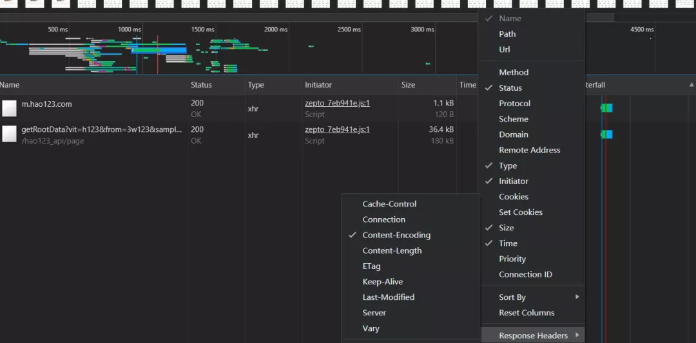

#### é‡æ–°å‘èµ·`xhr`请求

在平时和å端è”调时，我们用的最多的å¯èƒ½å°±æ˜¯`Network`é¢æ¿äº†ã€‚但是æ¯æ¬¡æƒ³é‡æ–°æŸ¥çœ‹ä¸€ä¸ªè¯·æ±‚通过刷新页é¢ã€ç‚¹å‡»æŒ‰é’®ç­‰æ–¹å¼å»è§¦å‘`xhr`请求，这ç§æ–¹å¼æœ‰æ—¶æ˜¾å¾—会比较麻烦，å¯ä»¥é€šè¿‡`Replay XHR`çš„æ–¹å¼å»å‘起一æ¡æ–°çš„请求：

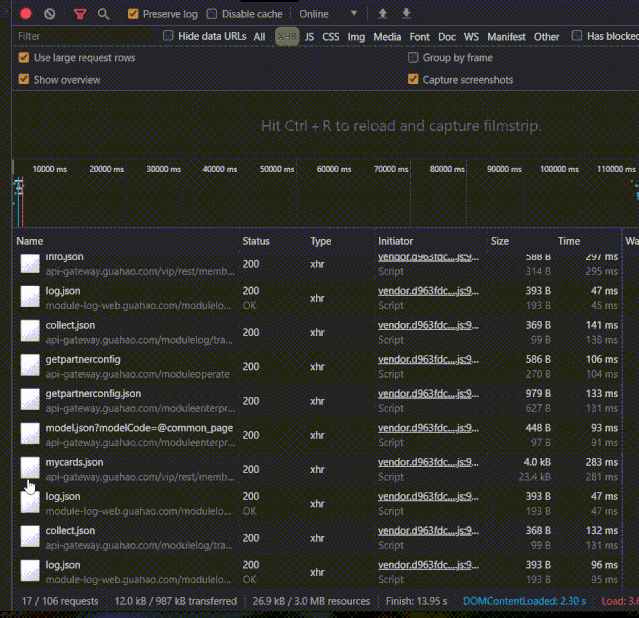

#### 查看 HTTP 相关信æ¯

**查看网络请求的å‚æ•°**

å¯ä»¥é€šè¿‡ç‚¹å‡» `query string parameters` (查询字符串å‚æ•°)æ—边的 `view URL encoded` (查看 URL ç¼–ç )或 `view decoded` (查看解ç )链æ¥ï¼ŒæŸ¥çœ‹ URL ç¼–ç æˆ–解ç æ ¼å¼çš„ `query string parameters` (查询字符串å‚æ•°)。在使用 postman å¤åˆ¶ç›¸å…³å…¥å‚时尤其å®ç”¨ã€‚

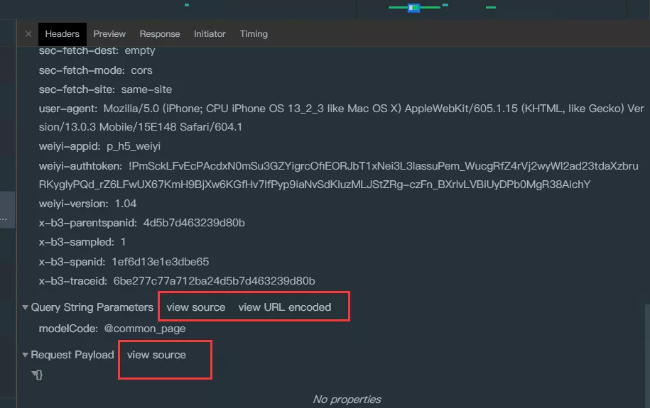

**查看 HTTP å“应内容**点击 Response(å“应)标签页å¯ä»¥æŸ¥çœ‹è¯¥èµ„æºæœªæ ¼å¼åŒ–çš„ HTTP å“应内容

> æ¥å£çš„è¿”å›å€¼(在 preview 中）åŒæ ·ä¹Ÿå¯ä»¥ `Save global variable` 存储一个全局å˜é‡
> 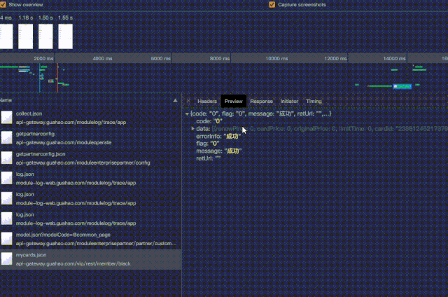

#### Size å’Œ Time 为什么有两行å‚数？

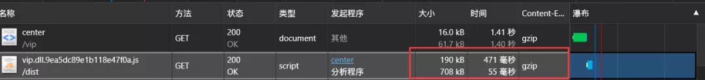

##### å…³äº Size 列

`Size`有两行：

- 第一行表示的是数æ®çš„**传输时**的大å°ï¼Œä¾‹å¦‚上图中的`190KB`
- 第二行表示的是数æ®**å®é™…**的大å°`708KB`

> 在æœåŠ¡å™¨ç«¯é‡‡å–`gzip`å‹ç¼©ç®—法将åŸæœ‰`708KB`å‹ç¼©è‡³`190KB`,传输大å°ç¼©çŸ­`3.7 å€`，大大的æ高了资æºä¼ è¾“的效ç‡

**需è¦æ³¨æ„的点：**

`gzip`å‹ç¼©åªä¼šå‹ç¼©`å“应体`内容，所以适用äºè¿”å›æ•°æ®é‡å¤§çš„时候，如æœæ•°æ®é‡å¤ªå°çš„è¯ï¼Œæœ‰å¯èƒ½ä¼šå¯¼è‡´æ•°æ®**传输时**的大å°æ¯”**å®é™…**大å°è¦å¤§(*加入了一些é¢å¤–çš„å“应头*)

##### å…³äº Time 列

Time 有两行：

- 第一行表示ä»å®¢æˆ·ç«¯å‘é€è¯·æ±‚到æœåŠ¡ç«¯è¿”å›æ‰€æœ‰æ•°æ®æ‰€èŠ±è´¹çš„总时间，对äºä¸Šå›¾æ¥è¯´å°±æ˜¯`471ms`
- 第二行表示的是ä»å®¢æˆ·ç«¯å‘é€è¯·æ±‚到æœåŠ¡å™¨ç«¯è¿”å›ç¬¬ä¸€ä¸ªå­—节所表示的时间，对äºä¸Šå›¾æ¥è¯´å°±æ˜¯`55ms`

> 第一行的时间代表了所有项目：例如`解æ dns`，`建立è¿æ¥`，`等待æœåŠ¡å™¨è¿”å›æ•°æ®`，`传输数æ®`ç­‰
>
> 第二行的时间是 `总时间 - æ•°æ®ä¼ è¾“`的时间

ä»ä¸Šé¢çš„分æ中我们看到 ä»**客户端请求到æœåŠ¡å™¨å¤„ç†ç»“æŸå‡†å¤‡è¿”å›æ•°æ®**花了`55ms`，但是在进行**传输数æ®**的时候花费了`471ms`

对äºç½‘慢的用户æ¥è¯´ï¼Œå¯èƒ½ä¼šè€—费更长的时间，所以在写代ç ï¼ˆæ¥å£ï¼‰çš„时候，返å›çš„æ•°æ®é‡è¦å°½é‡ç²¾ç®€

#### Waterfall

点击æŸä¸ªèµ„æºä¼šå±•ç¤ºå‡ºè¯¦ç»†çš„网络加载信æ¯ï¼š

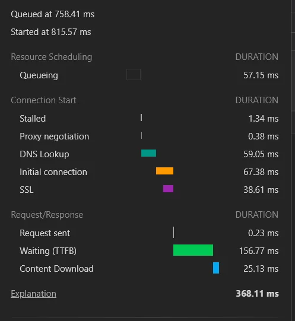

相关字段æè¿°:

- `Queuing` (æ’队)

  > æµè§ˆå™¨åœ¨ä»¥ä¸‹æƒ…况下对请求æ’队

- 1. 存在更高优先级的请求,请求被渲染引æ“æ¨è¿Ÿï¼Œè¿™ç»å¸¸å‘生在 images（图åƒï¼‰ä¸Š,因为它被认为比关键资æºï¼ˆå¦‚脚本/æ ·å¼ï¼‰çš„优先级ä½ã€‚
  2. æ­¤æºå·²æ‰“开六个 TCP è¿æ¥ï¼Œè¾¾åˆ°é™å€¼ï¼Œä»…é€‚ç”¨äº HTTP/1.0 å’Œ HTTP/1.1。在等待一个å³å°†è¢«é‡Šæ”¾çš„ä¸å¯ç”¨çš„ TCP socket
  3. æµè§ˆå™¨æ­£åœ¨çŸ­æš‚分é…ç£ç›˜ç¼“存中的空间，生æˆç£ç›˜ç¼“å­˜æ¡ç›®ï¼ˆé€šå¸¸é常快）

- `Stalled` (åœæ») - å‘é€è¯·æ±‚之å‰ç­‰å¾…的时间。它å¯èƒ½å› ä¸ºè¿›å…¥é˜Ÿåˆ—çš„ä»»æ„åŸå› è€Œè¢«é˜»å¡ï¼Œè¿™ä¸ªæ—¶é—´åŒ…括代ç†å商的时间。请求å¯èƒ½ä¼šå›  Queueing 中æ述的任何åŸå› è€Œåœæ­¢ã€‚

- `DNS lookup` (DNS 查找) - æµè§ˆå™¨æ­£åœ¨è§£æ请求 IP 地å€ï¼Œé¡µé¢ä¸Šçš„æ¯ä¸ªæ–°åŸŸéƒ½éœ€è¦å®Œæ•´çš„往返(roundtrip)æ‰èƒ½è¿›è¡Œ DNS 查找

- `Proxy Negotiation` - æµè§ˆå™¨æ­£åœ¨ä¸ä»£ç†æœåŠ¡å™¨å商请求

- `initial connection` (åˆå§‹è¿æ¥) - 建立è¿æ¥æ‰€éœ€çš„时间，包括 TCP æ¡æ‰‹/é‡è¯•å’Œå商 SSL。

- `SSL handshake` (SSL æ¡æ‰‹) - å®Œæˆ SSL æ¡æ‰‹æ‰€ç”¨çš„时间

- `Request sent` (请求å‘é€) - å‘出网络请求所花费的时间，通常是几分之一毫秒。

- `Waiting` (等待) - 等待åˆå§‹å“应所花费的时间，也称为`Time To First Byte`(æ¥æ”¶åˆ°ç¬¬ä¸€ä¸ªå­—节所花费的时间)。这个时间除了等待æœåŠ¡å™¨ä¼ é€’å“应所花费的时间之外，还包括 1 次往返延迟时间åŠæœåŠ¡å™¨å‡†å¤‡å“应所用的时间（æœåŠ¡å™¨å‘é€æ•°æ®çš„延迟时间）

- `Content Download`(内容下载) - æ¥æ”¶å“应数æ®æ‰€èŠ±è´¹çš„时间(ä»æ¥æ”¶åˆ°ç¬¬ä¸€ä¸ªå­—节开始，到下载完最å一个字节结æŸ)

- `ServiceWorker Preparation` - æµè§ˆå™¨æ­£åœ¨å¯åŠ¨ Service Worker

- `Request to ServiceWorker` - 正在将请求å‘é€åˆ° Service Worker

- `Receiving Push` - æµè§ˆå™¨æ­£åœ¨é€šè¿‡ HTTP/2 æœåŠ¡å™¨æ¨é€æ¥æ”¶æ­¤å“应的数æ®

- `Reading Push` - æµè§ˆå™¨æ­£åœ¨è¯»å–之å‰æ”¶åˆ°çš„本地数æ®

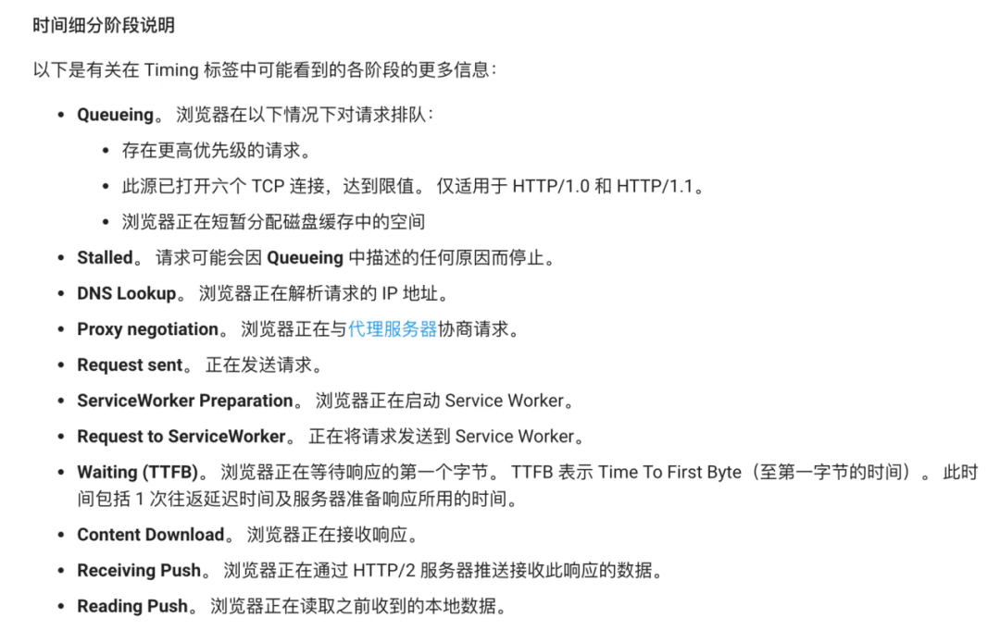

### (5) Summary 区域


`requests` æŸ¥çœ‹è¯·æ±‚çš„æ€»æ•°é‡ | `transferred` æŸ¥çœ‹è¯·æ±‚çš„æ€»å¤§å° | `resources` èµ„æº | `Finish` 所有 http 请求å“应完æˆçš„时间 | DOMContentLoaded 时间 | load 时间

当页é¢çš„åˆå§‹çš„标记被解æå®Œæ—¶ï¼Œä¼šè§¦å‘ `DOMContentLoaded`。 它在 Network(网络)é¢æ¿ä¸Šçš„显示：

- 在 Overview (概览)窗格中的è“色å‚直线表示这个事件。
- 在 Requests Table (请求列表)中的红色å‚直线也表示这个事件。
- 在 Summary (概è¦)窗格中，您å¯ä»¥æŸ¥çœ‹äº‹ä»¶çš„确切时间。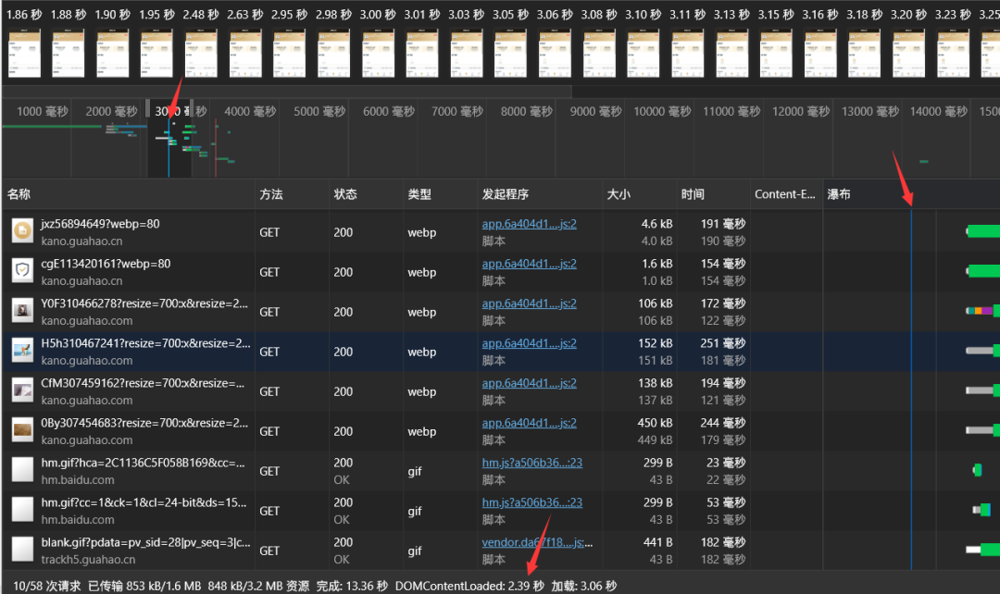

当页é¢å®Œå…¨åŠ è½½æ—¶è§¦å‘ `load` 事件。 它显示也显示在：

- 在 Overview (概览)窗格的红色å‚直线表示这个事件。
- 在 Requests Table (请求列表)中的红色å‚直线也表示这个事件。
- 在 Summary (概è¦)中，å¯ä»¥æŸ¥çœ‹æ”¹äº‹ä»¶çš„确切时间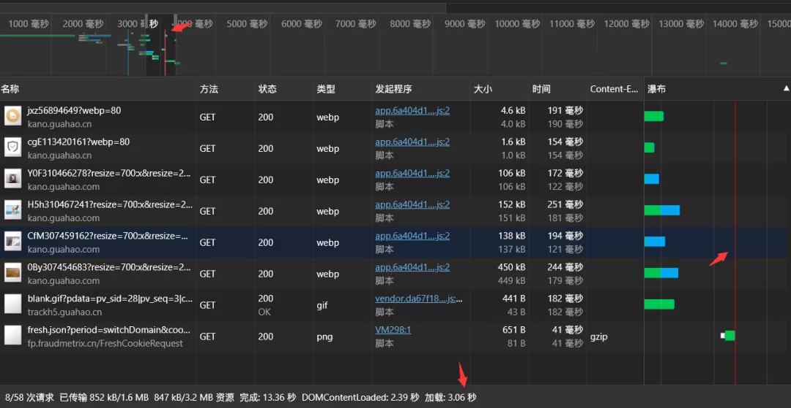

> DOMContentLoaded 会比 Load 时间å°ï¼Œä¸¤è€…时间差大致等äºå¤–部资æºåŠ è½½ï¼ˆä¸€èˆ¬æ˜¯å›¾ç‰‡/字体）的时间
>
> Finish 时间是页é¢ä¸Šæ‰€æœ‰ http 请求å‘é€åˆ°å“应完æˆçš„时间（如æœé¡µé¢å­˜åœ¨ä¸€ä¸ªè½®è¯¢çš„æ¥å£ï¼Œè¿™ä¸ªå€¼ä¹Ÿä¼šç´¯åŠ çš„）。HTTP1.0/1.1 åè®®é™å®šå•ä¸ªåŸŸå的请求并å‘é‡æ˜¯ 6 ä¸ªï¼Œå³ Finish 是所有请求（ä¸åªæ˜¯ XHR 请求，还包括 DOC，img，js，css 等资æºçš„请求）在并å‘é‡ä¸º 6 çš„é™åˆ¶ä¸‹å®Œæˆçš„时间。
>
> - Finish 的时间比 Load 大，æ„味ç€é¡µé¢æœ‰ç›¸å½“部分的请求é‡
> - Finish 的时间比 Load å°ï¼Œæ„味ç€é¡µé¢è¯·æ±‚é‡å¾ˆå°‘，如æœé¡µé¢æ˜¯åªæœ‰ä¸€ä¸ª html 文档请求的é™æ€é¡µé¢ï¼ŒFinish æ—¶é—´åŸºæœ¬å°±ç­‰äº HTML 文档请求的时间
>
> 所以 Finish æ—¶é—´ä¸ DOMContentLoaded å’Œ Load 并无直æ¥å…³ç³»

### 使用 Network é¢æ¿è¿›è¡Œç½‘络优化

> å‚考 Network é¢æ¿å¯ä»¥é’ˆå¯¹ Network æ出一些优化建议

#### æ’队或åœæ­¢é˜»å¡

最常è§çš„问题是很多个请求æ’队或被阻å¡ã€‚这表示ä»å•ä¸ªå®¢æˆ·ç«¯æ£€ç´¢çš„资æºå¤ªå¤šã€‚在 HTTP 1.0/1.1 è¿æ¥å议中，Chrome é™åˆ¶æ¯ä¸ªåŸŸå最多执行 6 个 TCP è¿æ¥ã€‚如æœä¸€æ¬¡è¯·æ±‚å二个资æºï¼Œå‰ 6 个将开始，å 6 个将æ’队。一旦其中一个请求完æˆï¼Œé˜Ÿåˆ—中的第一个请求项目将开始其请求过程。

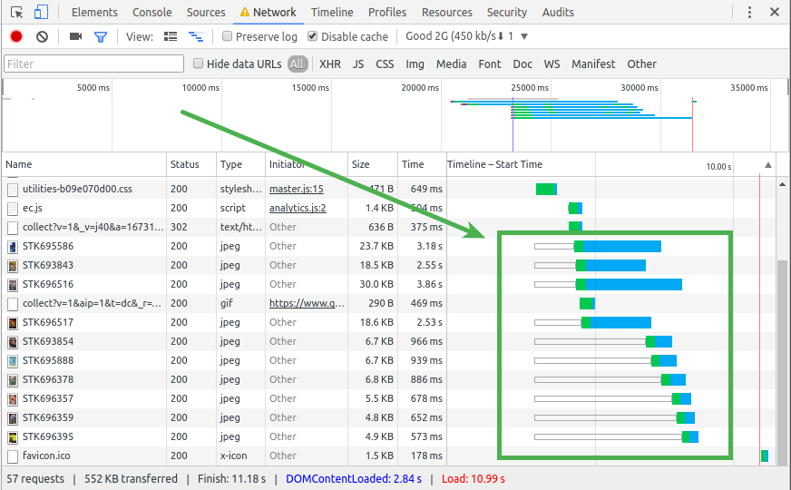

è¦è§£å†³ä¼ ç»Ÿ HTTP 1 的此问题，需è¦ç”¨å¤šä¸ªå­åŸŸåæä¾›æœåŠ¡èµ„æºï¼Œå°†èµ„æºæ‹†åˆ†åˆ°å¤šä¸ªå­åŸŸä¸­ï¼Œå‡åŒ€åˆ†é…。

> 上é¢è¯´çš„ä¿®å¤ HTTP 1 è¿æ¥æ•°é—®é¢˜ï¼Œä¸é€‚ç”¨äº HTTP 2 è¿æ¥ï¼Œå¦‚æœå·²éƒ¨ç½² HTTP 2，ä¸è¦å¯¹èµ„æºè¿›è¡ŒåŸŸåˆ’åˆ†ï¼Œå› ä¸ºå®ƒä¼šå½±å“ HTTP 2 的工作åŸç†ï¼ˆåœ¨ HTTP 2 中 TCP è¿æ¥å¤šè·¯å¤ç”¨è¿æ¥çš„）。å–消了 HTTP 1 çš„ 6 个è¿æ¥é™åˆ¶ï¼Œå¹¶ä¸”å¯ä»¥é€šè¿‡å•ä¸ªè¿æ¥åŒæ—¶ä¼ è¾“多个资æºã€‚

#### æ¥æ”¶åˆ°ç¬¬ä¸€ä¸ªå­—节的时间很慢

绿色的å—å æ®æ¯”例很高：

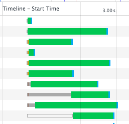

TTFB 就是等待第一个å“应字节的时间，建议在 200ms 以下，以下情况å¯èƒ½ä¼šå¯¼è‡´é«˜ TTFB:

1. 客户端和æœåŠ¡å™¨ä¹‹é—´çš„网络æ¡ä»¶å·®
2. è¦ä¹ˆï¼ŒæœåŠ¡å™¨ç«¯ç¨‹åºå“应很慢

> 为了解决高 TTFB，首先å»æ’除尽å¯èƒ½å¤šçš„网络è¿æ¥ã€‚ç†æƒ³æƒ…况下，在本地托管应用程åºï¼ˆéƒ¨ç½²åœ¨æœ¬åœ°ï¼‰ï¼Œå¹¶æŸ¥çœ‹æ˜¯å¦ä»æœ‰ä¸€ä¸ªå¤§çš„ TTFB。如æœæœ‰ï¼Œé‚£ä¹ˆéœ€è¦ä¼˜åŒ–应用程åºé’ˆçš„å“应速度。这å¯èƒ½æ„味ç€ä¼˜åŒ–æ•°æ®åº“查询，为内容的æŸäº›éƒ¨åˆ†å®ç°é«˜é€Ÿç¼“存，或修改 Web æœåŠ¡å™¨é…置。å端å¯èƒ½å¾ˆæ…¢çš„åŸå› æœ‰å¾ˆå¤šã€‚您需è¦å¯¹æ‚¨çš„程åºè¿›è¡Œç ”究，并找出ä¸ç¬¦åˆæ‚¨é¢„期的内容。
>
> 如æœæœ¬åœ° TTFB ä½ï¼Œé‚£ä¹ˆæ˜¯æ‚¨çš„客户端和æœåŠ¡å™¨ä¹‹é—´çš„网络问题。网络传输å¯èƒ½è¢«å¾ˆå¤šç§äº‹æƒ…干扰阻ç¢ã€‚在客户端和æœåŠ¡å™¨ä¹‹é—´æœ‰å¾ˆå¤šç‚¹ï¼Œæ¯ä¸ªéƒ½æœ‰è‡ªå·±çš„è¿æ¥é™åˆ¶ï¼Œå¯èƒ½ä¼šå¯¼è‡´é—®é¢˜ã€‚测试å‡å°‘è¿™ç§æƒ…况的最简å•çš„方法是将您的应用程åºæ”¾åœ¨å¦ä¸€å°ä¸»æœºä¸Šï¼Œçœ‹çœ‹ TTFB 是å¦æ”¹è¿›ã€‚

#### 加载缓慢

è“色的å—å æ®æ¯”例很高：


å¦‚æœ `Content Download` (内容下载)阶段花费了很多时间，æ高æœåŠ¡å“应速度ã€å¹¶è¡Œä¸‹è½½ç­‰ä¼˜åŒ–æªæ–½å¸®åŠ©éƒ½ä¸å¤§ã€‚ 主è¦çš„解决方案是å‘é€æ›´å°‘的字节（比如一张高质é‡çš„大图å¯èƒ½å‡  M 的大å°ï¼Œè¿™æ—¶å¯ä»¥é…Œæƒ…优化一下图片的宽高/清晰度）

## Sources é¢æ¿

> 此章节请打开 justwe7.github.io/devtools/debug-js/get-started.html 一起食用
>
> 主è¦ç”¨æ¥è°ƒè¯•é¡µé¢ä¸­çš„ JavaScript

### 自定义代ç ç‰‡æ®µ Snippets

> 我们ç»å¸¸æœ‰äº› `JavaScript` 的代ç æƒ³åœ¨æ§åˆ¶å°ä¸­è°ƒè¯•ï¼Œå‡å¦‚代ç é‡å¤šçš„情况下直æ¥åœ¨ `console` 下写比较麻烦，或者我们ç»å¸¸æœ‰äº›ä»£ç ç‰‡æ®µ(防抖ã€èŠ‚æµã€è·å–地å€æ å‚æ•°ç­‰)想ä¿å­˜èµ·æ¥ï¼Œæ¯æ¬¡æ‰“å¼€ `Devtools` 都能è·å–到这些代ç ç‰‡æ®µï¼Œè€Œä¸ç”¨å†å»ä»ç¬”记里é¢æ‰¾ã€‚

如图所示，在 `Sources` 这个`tab`æ ä¸‹ï¼Œæœ‰ä¸ª `Snippets` 标签，在里é¢å¯ä»¥æ·»åŠ ä¸€äº›å¸¸ç”¨çš„代ç ç‰‡æ®µã€‚（当个å°ç¬”记本）

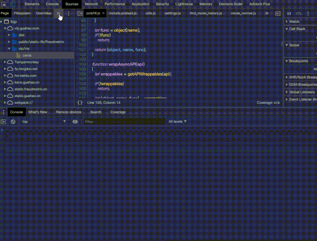

### 设置断点

#### 断点的é¢æ¿

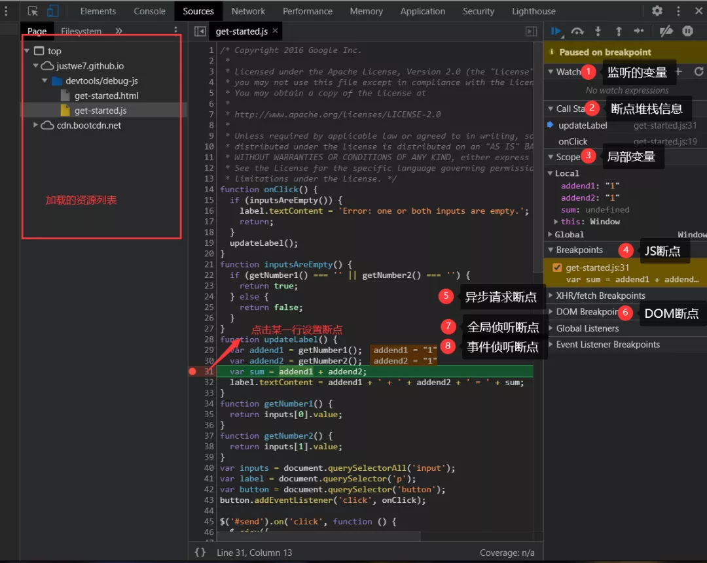

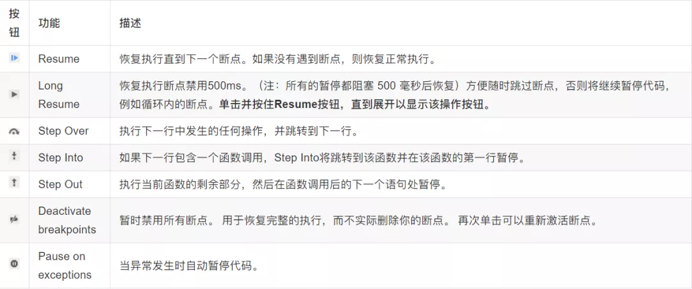

#### 指定ä½ç½®çš„中断

断点调试基本æµç¨‹

找到æºä»£ç ï¼Œç‚¹å‡»è¦ä¸­æ–­ä»£ç æ‰§è¡Œçš„ä½ç½®ï¼Œç‚¹å‡»çº¢è‰²æŒ‰é’®çš„ä½ç½®ã€‚然åå†è§¦å‘该方法执行，因为已知点击按钮å¯ä»¥è§¦å‘，精准的定ä½åˆ°ä»£ç è¡Œå°±å¯ä»¥äº†:

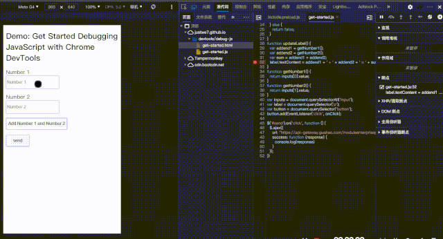

#### 全局事件中断

å‡å¦‚ä¸çŸ¥é“代ç æ‰§è¡Œçš„ä½ç½®ï¼Œå¦‚以下场景：

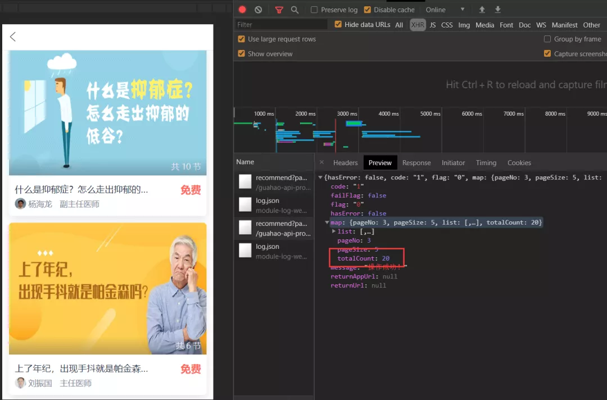

看æ¥å£è¿”å›çš„列表总数应该是 20 æ¡ï¼Œä½†æ˜¯é¡µé¢åˆ° 15 æ¡å°±æ˜¾ç¤ºåˆ°åº•éƒ¨äº†

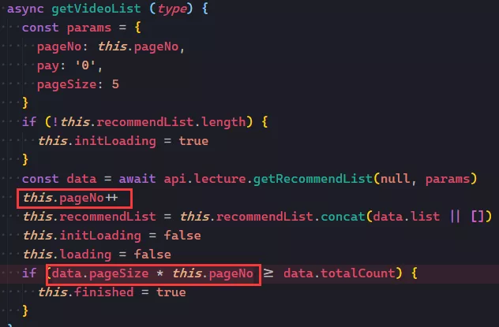

看代ç å†™çš„判断æ¡ä»¶æœ‰ç‚¹é—®é¢˜ï¼Œä½†ä»ç¼–译å的代ç æ‰¾åˆ°å¯¹åº”ä½ç½®è¿›è¡Œè°ƒè¯•å°±ç›¸å½“äºå¤§æµ·æ针了。想试试自己的设想的解决方å¼æ˜¯å¦æ­£ç¡®ï¼š

1. 因为列表是æ拉加载，所以肯定会触å‘网络请求，å¯ä»¥åœ¨äº‹ä»¶ä¾¦å¬å™¨é‡Œé¢æ‰“一个 `XHR` 的断点

2. 然åæ拉加载页é¢è§¦å‘æ¥å£è¯·æ±‚，如预期的，代ç ä¸­æ–­æ‰§è¡Œäº†ã€‚但æ示找ä¸åˆ° sourcemap，暂时把 js 的资æºæ˜ å°„给关æ‰(相关解决方å¼)：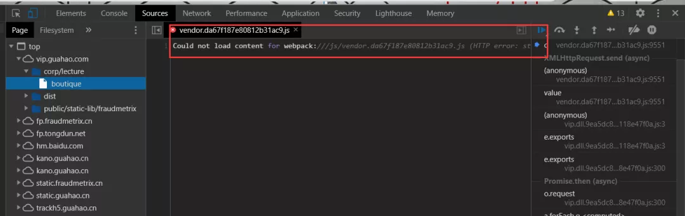

3. å†æ¬¡è§¦å‘断点，å‘ç°å¯ä»¥æŸ¥çœ‹åˆ°ä¸­æ–­çš„代ç äº†ï¼Œå› ä¸ºè‚¯å®šæ˜¯é¡µé¢ä¸­çš„业务代ç å°†è¯·æ±‚æ¨å…¥åˆ°æ‰§è¡Œå †æ ˆçš„，所以å¯ä»¥åœ¨å †æ ˆä¸­æ‰¾åˆ°å¯¹åº”的方法å：`getVideoList`

   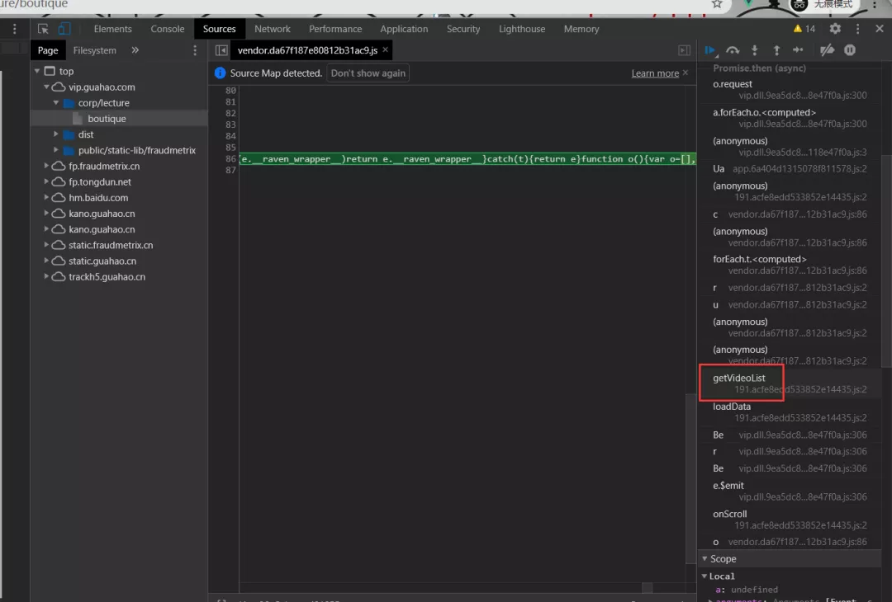

4. 点击方法åå¯ä»¥è·³è½¬åˆ°å¯¹åº”çš„æºç ï¼Œå¯ä»¥çœ‹åˆ°åœˆèµ·æ¥çš„代ç å’Œæ‰€çŒœæƒ³çš„问题代ç åº”该是åŒä¸€å¤„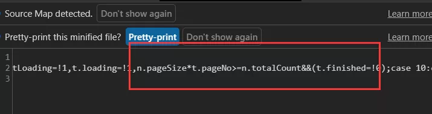

5. å›è¿‡æ¥çœ‹ä¸‹é—®é¢˜åŸå› ï¼š 页é¢è¯·æ±‚完新数æ®åç›´æ¥ `pageNum` 自å¢ï¼Œç„¶åç›´æ¥å°±ç”¨äºæ˜¯å¦ç»“æŸçš„判断了，有点ä¸å¤Ÿä¸¥è°¨ï¼Œä¸å¦‚ç›´æ¥æ¯”对当å‰çš„列表长度ä¸æ¥å£è¿”å›çš„æ•°æ®æ€»æ•°æ¥åˆ¤æ–­: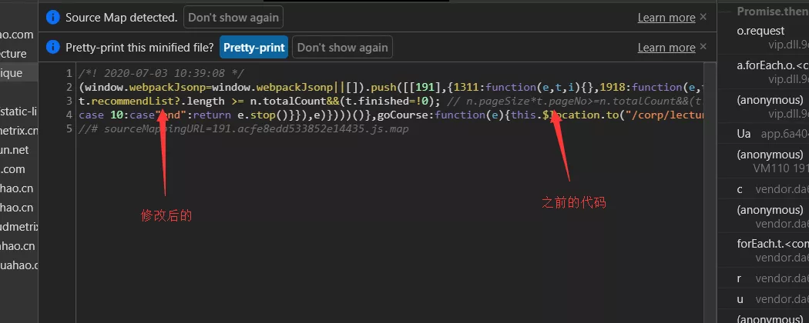

6. è®°ä½è¦ä¿®æ”¹çš„代ç ï¼Œåœ¨è¿™ä¸ªæ–‡ä»¶å¼€å¤´ï¼Œä¹Ÿå°±æ˜¯ `191.xxx.js`

7. 1. 第一行先打个断点，push 方法之å‰å†æ‰“一个断点: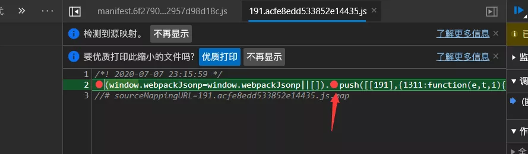(如æœæ²¡æœ‰å†åˆ·æ–°ä¸€ä¸‹(也ä¸æ¸…楚为什么å¯èƒ½ä¼šæ²¡æœ‰))
   2. 然å刷新页é¢ï¼Œæ‰¾åˆ°åˆšåˆšæƒ³è¦ä¿®æ”¹çš„代ç : 用 `t.recommendList.length` 替æ¢æ‰ `n.pageSize*t.pageNo`（å‰ä¸¤æ­¥æ˜¯ä¸ºäº†é¿å… js 开始解æ问题代ç ï¼Œå…ˆé˜»å¡ä¸€ä¸‹è¿è¡Œ: stackoverflow）

8. å†`Ctrl + S`，ä¿å­˜ä¸€ä¸‹ï¼Œç„¶å看下页é¢æ•ˆæœï¼Œåˆ—表å¯ä»¥å…¨éƒ¨åŠ è½½å‡ºæ¥äº†: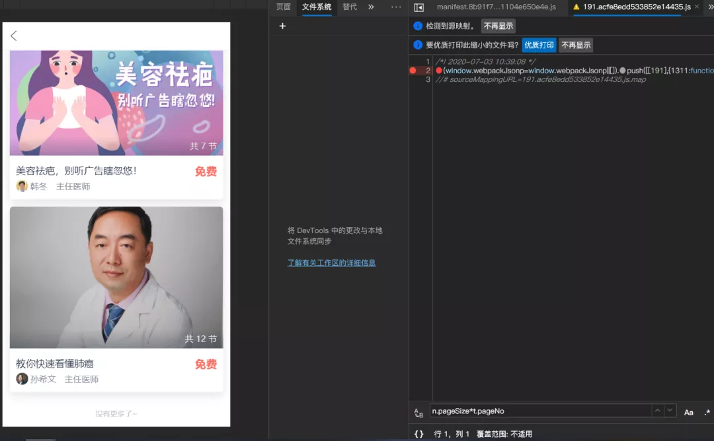

> 在ç¾åŒ–代ç çš„é¢æ¿ä¸­æ˜¯ä¸æ”¯æŒç›´æ¥ä¿®æ”¹é¡µé¢ä»£ç çš„

#### 黑盒模å¼

把脚本文件放入 Blackbox(黑盒)，å¯ä»¥å¿½ç•¥æ¥è‡ªç¬¬ä¸‰æ–¹åº“的调用堆栈

默认（ä¸å¼€å¯é»‘盒）：
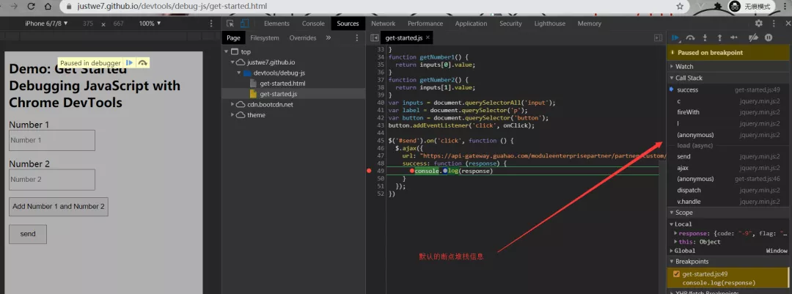

å¼€å¯é»‘盒：
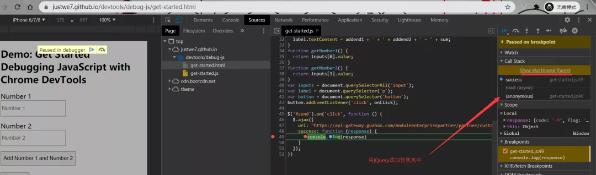

- 打开方å¼â‘ 

- 1. 打开 DevTools `Settings` (设置)
  2. 在左侧的导航èœå•ä¸­ï¼Œå•å‡» `Blackboxing` (黑箱)
  3. 点击 `Add pattern...` (添加模å¼)按钮。
  4. 在 `Pattern`(模å¼)文本框输入您希望ä»è°ƒç”¨å †æ ˆä¸­æ’除的文件å模å¼ã€‚DevTools 会æ’除该模å¼åŒ¹é…的任何脚本。
  5. 在文本字段å³ä¾§çš„下拉èœå•ä¸­ï¼Œé€‰æ‹© `Blackbox` (黑箱)以执行脚本文件但是æ’除æ¥è‡ªè°ƒç”¨å †æ ˆçš„调用，或选择 `Disabled` (ç¦ç”¨)æ¥é˜»æ­¢æ–‡ä»¶æ‰§è¡Œã€‚
  6. 点击`Add`(添加) ä¿å­˜

- 打开方å¼â‘¡
  ç›´æ¥åœ¨æƒ³è¦å¿½ç•¥çš„堆栈信æ¯ä¸Š `blackbox script`

#### DOM 断点

查看 element é¢æ¿DOM 断点

## Performance é¢æ¿

> 此章节请使用**Chrome çš„éšèº«æ¨¡å¼**打开 justwe7.github.io/devtools/jank/index.html 一起食用 éšèº«æ¨¡å¼å¯ä»¥ä¿è¯ Chrome 在一个相对干净的ç¯å¢ƒä¸‹è¿è¡Œã€‚å‡å¦‚安装了许多 chrome æ’件，这些æ’件å¯èƒ½ä¼šå½±å“分æ性能表ç°
>
> 在 Performance é¢æ¿å¯ä»¥æŸ¥çœ‹é¡µé¢åŠ è½½è¿‡ç¨‹ä¸­çš„详细信æ¯ï¼Œæ¯”如在什么时间开始åšä»€ä¹ˆäº‹æƒ…ï¼Œè€—æ—¶å¤šä¹…ç­‰ç­‰ã€‚ç›¸è¾ƒäº Network é¢æ¿ï¼Œä¸ä»…å¯ä»¥çœ‹åˆ°é€šè¿‡ç½‘络加载资æºçš„ä¿¡æ¯ï¼Œè¿˜èƒ½çœ‹åˆ°è§£æ JSã€è®¡ç®—æ ·å¼ã€é‡ç»˜ç­‰é¡µé¢åŠ è½½çš„方方é¢é¢çš„ä¿¡æ¯

### é¢æ¿ä¸»è¦çš„区域划分：

1. `Controls` - 开始记录，åœæ­¢è®°å½•å’Œé…置记录期间æ•è·çš„ä¿¡æ¯

2. `Overview` - 页é¢æ€§èƒ½çš„汇总

3. `Flame Chart` - [ç«ç„°å›¾(线程é¢æ¿)]。在ç«ç„°å›¾ä¸Šçœ‹åˆ°ä¸‰æ¡ï¼ˆç»¿è‰²çš„有好几æ¡ï¼‰å‚直的虚线：

4. - è“线代表 `DOMContentLoaded` 事件
   - 绿线代表首次绘制的时间
   - 红线代表 `load` 事件

5. `Details` - 在 Flame Chart 中，选择了æŸä¸€äº‹ä»¶å，这部分会展示ä¸è¿™ä¸ªäº‹ä»¶ç›¸å…³çš„更多信æ¯ï¼›

   > 如æœé€‰æ‹©äº†æŸä¸€å¸§ï¼Œè¿™éƒ¨åˆ†ä¼šå±•ç¤ºä¸é€‰ä¸­å¸§ç›¸å…³çš„ä¿¡æ¯ã€‚如æœæ—¢æ²¡æœ‰é€‰ä¸­äº‹ä»¶ä¹Ÿæ²¡æœ‰é€‰ä¸­å¸§ï¼Œåˆ™è¿™éƒ¨åˆ†ä¼šå±•ç¤ºå½“å‰è®°å½•æ—¶é—´æ®µå†…的相关信æ¯ã€‚

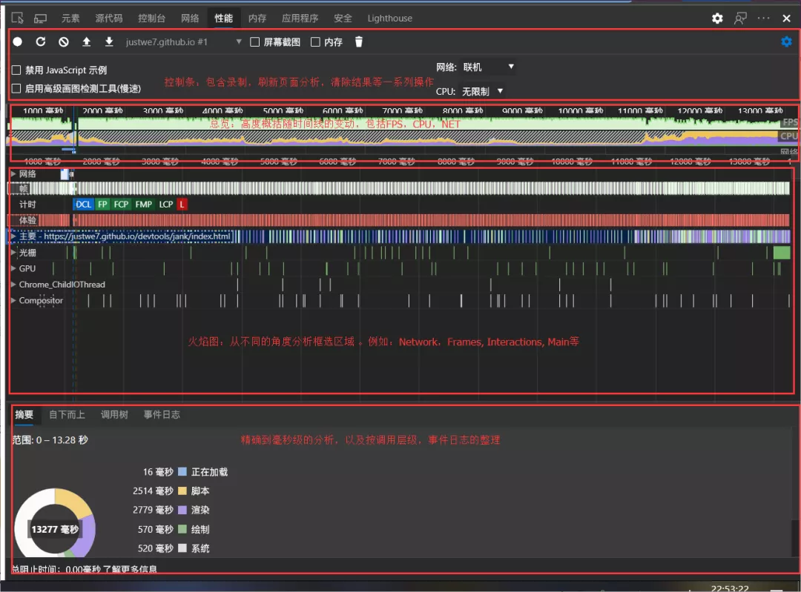

### 开始记录

1. 首先点击æ§åˆ¶æ¡å·¦è¾¹çš„第一个圆圈，开始记录日志
2. 等待几分钟(正常æ“作页é¢)
3. 点击 Stop 按钮，Devtools åœæ­¢å½•åˆ¶ï¼Œå¤„ç†æ•°æ®ï¼Œç„¶å显示性能报告

然å就会出æ¥ä¸Šå›¾çš„内容

> ä¸å°å¼æœºå’Œç¬”记本电脑相比移动设备的 CPU 功ç‡è¦å°å¾—多。无论何时分æ页é¢ï¼Œéƒ½ä½¿ç”¨ CPU é™åˆ¶æ¥æ¨¡æ‹Ÿé¡µé¢åœ¨ç§»åŠ¨è®¾å¤‡ä¸Šçš„表ç°ã€‚ 在"å¼€å‘工具"中，å•å‡»"性能"选项å¡ã€‚ ç¡®ä¿å¯ç”¨"å±å¹•æˆªå›¾"å¤é€‰æ¡†ã€‚ å•å‡»"æ•è·è®¾ç½®"。 Capture SettingsDevTools æ­ç¤ºäº†ä¸å¦‚何æ•è·æ€§èƒ½æŒ‡æ ‡ç›¸å…³çš„设置。 å¯¹äº CPU，选择 2 å€å‡é€Ÿã€‚DevTools 会é™åˆ¶ CPU 使其速度比平时慢 2 å€

> 注æ„：如æœæƒ³è¦ç¡®ä¿å®ƒä»¬åœ¨ä½ç«¯ç§»åŠ¨è®¾å¤‡ä¸Šè¿è¡Œè‰¯å¥½ï¼Œè¯·å°† CPU é™åˆ¶è®¾ç½®ä¸º 20 å€å‡é€Ÿã€‚

### (1)controls æ§åˆ¶æ¡åŒºåŸŸ

- 上åŠåŒºåŸŸ

- - `Screenshots` 截图：默认勾选，æ¯ä¸€å¸§éƒ½ä¼šæˆªå›¾
  - `Memory` 内存消耗记录：勾选åå¯ä»¥çœ‹åˆ°å„ç§å†…存消耗曲线

- 下é¢çš„ checkbox 区域

- - `Disable javaScript samples` [ç¦ç”¨ javaScript 示例]：å‡å°‘在手机è¿è¡Œæ—¶ç³»ç»Ÿçš„开销，模拟手机è¿è¡Œæ—¶å‹¾é€‰
  - `Network` [网络模拟]：å¯ä»¥æ¨¡æ‹Ÿåœ¨ 3G,4G 等网络æ¡ä»¶ä¸‹è¿è¡Œé¡µé¢
  - `Enable advanced paint instrumentation(slow)` [å¯ç”¨é«˜çº§ç”»å›¾æ£€æµ‹å·¥å…·(慢速)]：æ•è·é«˜çº§ç”»å›¾æ£€æµ‹å·¥å…·ï¼Œå¸¦æ¥æ˜¾è‘—的性能开销
  - `CPU` [CPU é™åˆ¶æ€§èƒ½]：主è¦ä¸ºäº†æ¨¡æ‹Ÿåº• CPU 下è¿è¡Œæ€§èƒ½

### (2)overview 总览区域

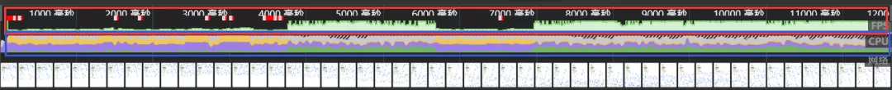

#### FPS

绿色竖线越高，FPS 越高。 FPS 图表上的红色å—(上图刚开始的部分)表示长时间帧，很å¯èƒ½ä¼šå‡ºç°å¡é¡¿ã€‚ç»å¸¸æ‰“游æˆè‚¯å®šçŸ¥é“这个指标代表什么，`120FPS` 代表æµç•…（手动滑稽）

ç«ç„°å›¾çš„ `FPS` å¯ä»¥é‡åŒ–这项å‚æ•°

> FPS（frames per second）是用æ¥åˆ†æ动画的一个主è¦æ€§èƒ½æŒ‡æ ‡ã€‚能ä¿æŒåœ¨ 60 çš„ FPS çš„è¯ï¼Œé‚£ä¹ˆç”¨æˆ·ä½“验就是ä¸é”™çš„
>
> Q: 为什么是 60fps?
>
> A: 我们的目标是ä¿è¯é¡µé¢è¦æœ‰é«˜äºæ¯ç§’ 60fps(帧)的刷新频ç‡ï¼Œè¿™å’Œç›®å‰å¤§å¤šæ•°æ˜¾ç¤ºå™¨çš„刷新ç‡ç›¸å»åˆ(60Hz)。如æœç½‘页动画能够åšåˆ°æ¯ç§’ 60 帧，就会跟显示器åŒæ­¥åˆ·æ–°ï¼Œè¾¾åˆ°æœ€ä½³çš„视觉效æœã€‚è¿™æ„味ç€ï¼Œä¸€ç§’之内进行 60 次é‡æ–°æ¸²æŸ“，æ¯æ¬¡é‡æ–°æ¸²æŸ“的时间ä¸èƒ½è¶…过 16.66 毫秒

#### CPU

CPU 资æºã€‚**æ­¤é¢ç§¯å›¾æŒ‡ç¤ºæ¶ˆè€— CPU 资æºçš„事件类å‹**。在 CPU 图表中的å„ç§é¢œè‰²ä¸ `Summary` é¢æ¿é‡Œçš„颜色是相互对应的，`Summary` é¢æ¿å°±åœ¨ `Performance` é¢æ¿çš„下方。CPU 图表中的å„ç§é¢œè‰²ä»£è¡¨ç€åœ¨è¿™ä¸ªæ—¶é—´æ®µå†…，CPU 在å„ç§å¤„ç†ä¸Šæ‰€èŠ±è´¹çš„时间。如æœä½ çœ‹åˆ°äº†æŸä¸ªå¤„ç†å ç”¨äº†å¤§é‡çš„时间，那么这å¯èƒ½å°±æ˜¯ä¸€ä¸ªå¯ä»¥æ‰¾åˆ°æ€§èƒ½ç“¶é¢ˆçš„线索

##### CPU 资æºé¢ç§¯å›¾é¢œè‰²åˆ’分:

| 颜色            | 执行内容                     |
| :-------------- | :--------------------------- |
| è“色(Loading)   | 网络通信和 HTML è§£æ         |
| 黄色(Scripting) | JavaScript 执行              |
| 紫色(Rendering) | æ ·å¼è®¡ç®—和布局，å³é‡æ’       |
| 绿色(Painting)  | 更改外观而ä¸ä¼šå½±å“布局，é‡ç»˜ |
| ç°è‰²(other)     | 其它事件花费的时间           |
| 白色(Idle)      | 空闲时间                     |

> é‡ç»˜æ˜¯å½“节点需è¦æ›´æ”¹å¤–观而ä¸ä¼šå½±å“å¸ƒå±€çš„ï¼Œæ¯”å¦‚æ”¹å˜ color å°±å«ç§°ä¸ºé‡ç»˜ å›æµ(é‡æ’)是布局或者几何å±æ€§éœ€è¦æ”¹å˜å°±ç§°ä¸ºå›æµ
>
> é‡æ’必定会å‘生é‡ç»˜ï¼Œé‡ç»˜ä¸ä¸€å®šä¼šå¼•å‘é‡æ’。é‡æ’所需的æˆæœ¬æ¯”é‡ç»˜é«˜çš„多，改å˜æ·±å±‚次的节点很å¯èƒ½å¯¼è‡´çˆ¶èŠ‚点的一系列é‡æ’

js 修改 dom 结æ„æˆ–æ ·å¼ -> 计算 style -> layout(é‡æ’) -> paint(é‡ç»˜) -> composite(åˆæˆ)

justwe7.github.io/性能优化的相关总结

#### NET

æ¯æ¡å½©è‰²æ¨ªæ è¡¨ç¤ºä¸€ç§èµ„æºã€‚横æ è¶Šé•¿ï¼Œæ£€ç´¢èµ„æºæ‰€éœ€çš„时间越长。 æ¯ä¸ªæ¨ªæ çš„浅色部分表示等待时间（ä»è¯·æ±‚资æºåˆ°ç¬¬ä¸€ä¸ªå­—节下载完æˆçš„时间） 深色部分表示传输时间（下载第一个和最å一个字节之间的时间）

- HTML：è“色
- CSS：紫色
- JS：黄色
- 图片：绿色

> 感觉优化网络性能直æ¥ä½¿ç”¨ network é¢æ¿å°±å¥½äº†

### (3)Flame Chart ç«ç„°å›¾ï¼ˆçº¿ç¨‹é¢æ¿ï¼‰

详细的分ææŸäº›ä»»åŠ¡çš„详细耗时，ä»è€Œå®šä½é—®é¢˜

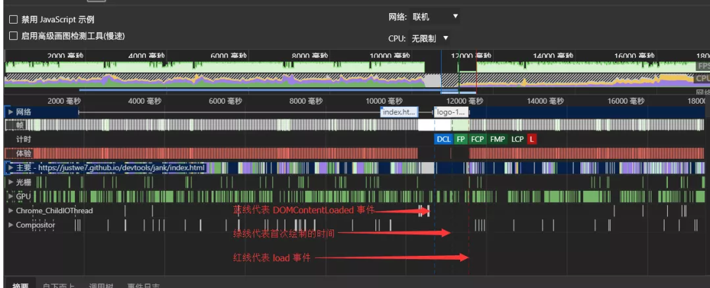

#### 看到的几æ¡è™šçº¿ï¼š

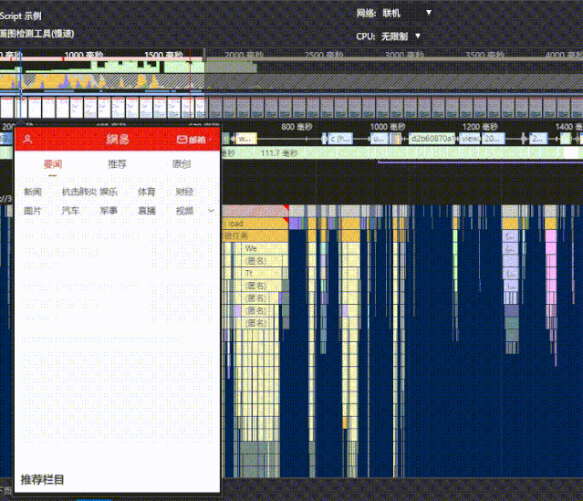

- è“线代表 `DOMContentLoaded` 事件

- 绿线代表首次绘制的时间

- - FP(First Paint): 首次绘制
  - FCP(First Contentful Paint)： 第一次丰富内容的绘图
  - FMP(First Meaningful Paint)：第一次有æ„义的绘图
  - LCP(Largest Contentful Paint)： 最大区域内容绘制

- 红线代表 `load` 事件

> - `DOMContentLoaded`: 就是 dom 内容加载完毕。 那什么是 dom 内容加载完毕呢？打开一个网页当输入一个 URL，页é¢çš„展示首先是空白的，然å过一会，页é¢ä¼šå±•ç¤ºå‡ºå†…容，但是页é¢çš„有些资æºæ¯”如说图片资æºè¿˜æ— æ³•çœ‹åˆ°ï¼Œæ­¤æ—¶é¡µé¢æ˜¯å¯ä»¥æ­£å¸¸çš„交互，过一段时间å，图片æ‰å®Œæˆæ˜¾ç¤ºåœ¨é¡µé¢ã€‚ä»é¡µé¢ç©ºç™½åˆ°å±•ç¤ºå‡ºé¡µé¢å†…å®¹ï¼Œä¼šè§¦å‘ `DOMContentLoaded` 事件。而这段时间就是 HTML 文档被加载和解æ完æˆã€‚
> - `load`: 页é¢ä¸Šæ‰€æœ‰çš„资æºï¼ˆå›¾ç‰‡ï¼ŒéŸ³é¢‘，视频等）被加载以åæ‰ä¼šè§¦å‘ load 事件，简å•æ¥è¯´ï¼Œé¡µé¢çš„ load 事件会在 `DOMContentLoaded` 被触å‘之åæ‰è§¦å‘。

#### Main

看下主线程，Devtools 展示了主线程è¿è¡ŒçŠ¶å†µ

- X 轴代表ç€æ—¶é—´ã€‚æ¯ä¸ªé•¿æ¡ä»£è¡¨ç€ä¸€ä¸ª event。长æ¡è¶Šé•¿å°±ä»£è¡¨è¿™ä¸ª event 花费的时间越长。
- Y 轴代表了调用栈（call stack）。在栈里，上é¢çš„ event 调用了下é¢çš„ event

Google 官方文档的例å­ï¼š

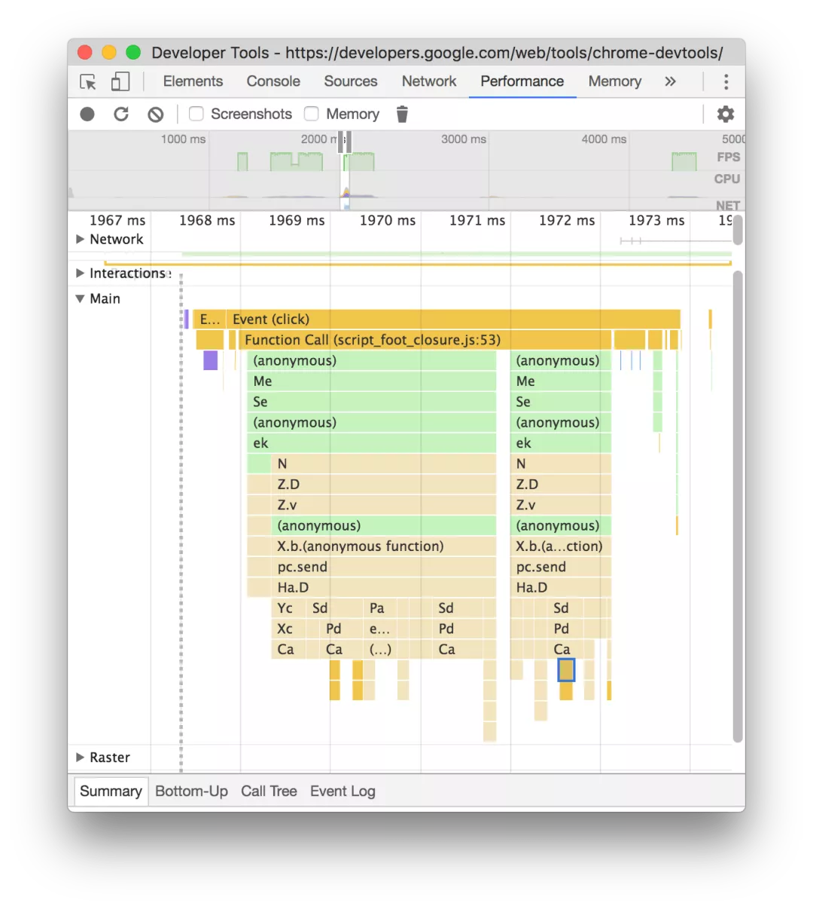

如上图：click 事件触å‘了 `script_foot_closure.js` 第 53 行的函数调用。 å†çœ‹ä¸‹é¢ï¼ŒFunction Call å¯ä»¥çœ‹åˆ°ä¸€ä¸ªåŒ¿å函数被调用，然å调用 Me() 函数，然å调用 Se()，ä¾æ­¤ç±»æ¨ã€‚

> DevTools 为脚本分é…éšæœºé¢œè‰²ã€‚在上图中，æ¥è‡ªä¸€ä¸ªè„šæœ¬çš„函数调用显示为浅绿色。æ¥è‡ªå¦ä¸€ä¸ªè„šæœ¬çš„调用被渲染æˆç±³è‰²ã€‚较深的黄色表示脚本活动，而紫色的事件表示渲染活动。这些较暗的黄色和紫色事件在所有记录中都是一致的。

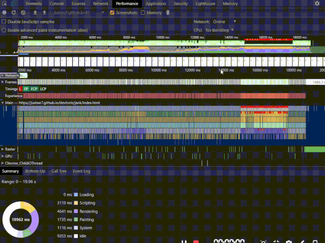

1. 在性能报告中，有很多的数æ®ã€‚å¯ä»¥é€šè¿‡åŒå‡»ï¼Œæ‹–动等等动作æ¥æ”¾å¤§ç¼©å°æŠ¥å‘ŠèŒƒå›´ï¼Œä»å„ç§æ—¶é—´æ®µæ¥è§‚察分æ报告
2. 在事件长æ¡çš„å³ä¸Šè§’处，如æœå‡ºç°äº†çº¢è‰²å°ä¸‰è§’，说æ˜è¿™ä¸ªäº‹ä»¶æ˜¯å­˜åœ¨é—®é¢˜çš„，需è¦ç‰¹åˆ«æ³¨æ„
3. åŒå‡»è¿™ä¸ªå¸¦æœ‰çº¢è‰²å°ä¸‰è§’的事件。在 Summary é¢æ¿ä¼šçœ‹åˆ°è¯¦ç»†ä¿¡æ¯ã€‚æ³¨æ„ reveal 这个链æ¥ï¼ŒåŒå‡»å®ƒä¼šè®©é«˜äº®è§¦å‘这个事件的 event。如æœç‚¹å‡»äº† app.js:94 这个链æ¥ï¼Œå°±ä¼šè·³è½¬åˆ°å¯¹åº”的代ç å¤„

### (4)Details 区域

一般è¦é…åˆ `Flame Chart` 一起使用

- `Summary` 区域是一个饼状图总览，汇总了å„个事件类å‹æ‰€è€—费的总时长，å¦å¤–还有三个查看选项：
- `Bottom-Up` 选项å¡ï¼šè¦æŸ¥çœ‹ç›´æ¥èŠ±è´¹æœ€å¤šæ—¶é—´çš„活动时使用
- `Call Tree` 选项å¡ï¼šæƒ³æŸ¥çœ‹å¯¼è‡´æœ€å¤šå·¥ä½œçš„根活动时使用
- `Event Log` 选项å¡ï¼šæƒ³è¦æŒ‰è®°å½•æœŸé—´çš„活动顺åºæŸ¥çœ‹æ´»åŠ¨æ—¶ä½¿ç”¨

### window.performance 对象

> Performance æ¥å£å¯ä»¥è·å–到当å‰é¡µé¢ä¸­ä¸æ€§èƒ½ç›¸å…³çš„ä¿¡æ¯ã€‚它是 High Resolution Time API 的一部分，åŒæ—¶ä¹Ÿèåˆäº† Performance Timeline APIã€Navigation Timing API〠User Timing API å’Œ Resource Timing API。
>
> å®è´¨ä¸Šæ¥è¯´ performance 对象就是专门用äºæ€§èƒ½ç›‘测的对象，内置了几ä¹æ‰€æœ‰å¸¸ç”¨å‰ç«¯éœ€è¦çš„性能å‚数监æ§

#### 几个å®ç”¨çš„ API

##### performance.now()方法

`performance.now()` è¿”å› `performance.navigationStart` 至当å‰çš„毫秒数。`performance.navigationStart` 是下文将介ç»åˆ°çš„å¯ä»¥è¯´æ˜¯æµè§ˆå™¨è®¿é—®æœ€åˆçš„时间测é‡ç‚¹ã€‚

值得注æ„的两点：

- 测é‡åˆå§‹ç‚¹æ˜¯æµè§ˆå™¨è®¿é—®æœ€åˆæµ‹é‡ç‚¹ï¼Œæˆ–者ç†è§£ä¸ºåœ¨åœ°å€æ è¾“å…¥ URL å按å›è½¦çš„那一ç¬é—´ã€‚
- è¿”å›å€¼æ˜¯æ¯«ç§’数，但带有精准的多ä½å°æ•°ã€‚

用 performance.now()检测 js 代ç çš„执行时间(毫秒):

```
  var st = performance.now();
  console.log(Array(9999999).fill(null).filter(v => !v).length);
  var end = performance.now();
  console.log(`å–值时间${end - st}ms`); // å–值时间 558.7849999992759ms
```

#### performance.navigation

performance.navigation 负责纪录用户行为信æ¯ï¼Œåªæœ‰ä¸¤ä¸ªå±æ€§:

- `redirectCount`

- - 如æœæœ‰é‡å®šå‘çš„è¯ï¼Œé¡µé¢é€šè¿‡å‡ æ¬¡é‡å®šå‘跳转而æ¥

- `type`

- - type 的值：
  - 0  å³ `TYPE_NAVIGATENEXT` 正常进入页é¢ï¼ˆé刷新ã€éé‡å®šå‘ç­‰)
  - 1  å³ `TYPE_RELOAD` 通过 window.location.reload()刷新的页é¢
  - 2  å³ `TYPE_BACK_FORWARD` 通过æµè§ˆå™¨çš„å‰è¿›å退按钮进入的页é¢ï¼ˆå†å²è®°å½•ï¼‰
  - 255 å³ `TYPE_UNDEFINED` é以上方å¼è¿›å…¥çš„页é¢

```
  console.log(performance.navigation); // PerformanceNavigation {type: 1, redirectCount: 0}
```

##### performance.timing

`timing` 内包å«äº†å‡ ä¹æ‰€æœ‰æ—¶åºçš„时间节点

å¯ä»¥é€šè¿‡æ­¤å­—段æ¥ç»Ÿè®¡é¡µé¢ç›¸å…³äº‹ä»¶çš„å‘生时长：

```
function getTiming() {
  try {
    var timing = performance.timing;
    var timingObj = {};

    var loadTime = (timing.loadEventEnd - timing.loadEventStart) / 1000;

    if(loadTime < 0) {
      setTimeout(function() {
        getTiming();
      }, 0);
      return;
    }

    timingObj['é‡å®šå‘时间'] = (timing.redirectEnd - timing.redirectStart);
    timingObj['DNS 解æ时间'] = (timing.domainLookupEnd - timing.domainLookupStart);
    timingObj['TCP 完æˆæ¡æ‰‹æ—¶é—´'] = (timing.connectEnd - timing.connectStart);
    timingObj['HTTP 请求å“应完æˆæ—¶é—´'] = (timing.responseEnd - timing.requestStart);
    timingObj['DOM 开始加载å‰æ‰€èŠ±è´¹æ—¶é—´'] = (timing.responseEnd - timing.navigationStart);
    timingObj['DOM 加载完æˆæ—¶é—´'] = ((timing.domComplete || timing.domLoading) - timing.domLoading);
    timingObj['DOM 结æ„解æ完æˆæ—¶é—´'] = (timing.domInteractive - timing.domLoading);
    timingObj['总体网络交互耗时，å³å¼€å§‹è·³è½¬åˆ°æœåŠ¡å™¨èµ„æºä¸‹è½½å®Œæˆæ—¶é—´'] = (timing.responseEnd - timing.navigationStart);
    timingObj['å¯äº¤äº’的时间'] = (timing.domContentLoadedEventEnd - timing.domContentLoadedEventStart);
    timingObj['首次出ç°å†…容'] = (timing.domLoading - timing.navigationStart);
    timingObj['onload 事件时间'] = (timing.loadEventEnd - timing.loadEventStart);
    timingObj['页é¢å®Œå…¨åŠ è½½æ—¶é—´'] = (timingObj['é‡å®šå‘时间'] + timingObj['DNS 解æ时间'] + timingObj['TCP 完æˆæ¡æ‰‹æ—¶é—´'] + timingObj['HTTP 请求å“应完æˆæ—¶é—´'] + timingObj['DOM 结æ„解æ完æˆæ—¶é—´'] + timingObj['DOM 加载完æˆæ—¶é—´']);

    for(item in timingObj) {
      console.log(item + ":" + timingObj[item] + '(ms)');
    }

    console.log(performance.timing);

  } catch(e) {
    console.log(performance.timing);
  }
}
window.onload = getTiming
```

##### performance.memory

用äºæ˜¾ç¤ºå½“å‰çš„内存å ç”¨æƒ…况

```
console.log(performance.memory)
/* {
  jsHeapSizeLimit: 4294705152,
  totalJSHeapSize: 13841857,
  usedJSHeapSize: 12417637
} */
```

- usedJSHeapSize 表示：JS 对象（包括 V8 引æ“内部对象）å ç”¨çš„内存数
- totalJSHeapSize 表示：å¯ä½¿ç”¨çš„内存
- jsHeapSizeLimit 表示：内存大å°é™åˆ¶

> 通常，`usedJSHeapSize` ä¸èƒ½å¤§äº `totalJSHeapSize`，如æœå¤§äºï¼Œæœ‰å¯èƒ½å‡ºç°äº†å†…存泄æ¼ã€‚

##### performance.getEntries()

æµè§ˆå™¨è·å–网页时，会对网页中æ¯ä¸€ä¸ªå¯¹è±¡ï¼ˆè„šæœ¬æ–‡ä»¶ã€æ ·å¼è¡¨ã€å›¾ç‰‡æ–‡ä»¶ç­‰ç­‰ï¼‰å‘出一个 HTTP 请求。`performance.getEntries` 方法以数组形å¼ï¼Œè¿”å›ä¸€ä¸ª `PerformanceEntry` 列表，这些请求的时间统计信æ¯ï¼Œæœ‰å¤šå°‘个请求，返å›æ•°ç»„就会有多少个æˆå‘˜

- `name`：资æºçš„链æ¥

- `duration`: 资æºçš„总耗时（包括等待时长，请求时长，å“应时长 ç›¸å½“äº responseEnd - startTime）

- `entryType`: 资æºç±»å‹ï¼ŒentryType ç±»å‹ä¸åŒæ•°ç»„中的对象结æ„也ä¸åŒ:

  | 值         | 该类å‹å¯¹è±¡                  | æè¿°                                                         |
  | :--------- | :-------------------------- | :----------------------------------------------------------- |
  | mark       | PerformanceMark             | 通过 mark()方法添加到数组中的对象                            |
  | measure    | PerformanceMeasure          | 通过 measure()方法添加到数组中的对象                         |
  | paint      | PerformancePaintTiming      | 值为 first-paint'首次绘制ã€'first-contentful-paint'首次内容绘制。 |
  | resource   | PerformanceResourceTiming   | 所有资æºåŠ è½½æ—¶é—´ï¼Œç”¨å¤„最多                                   |
  | navigation | PerformanceNavigationTiming | ç°é™¤ chrome å’Œ Opera 外å‡ä¸æ”¯æŒï¼Œå¯¼èˆªç›¸å…³ä¿¡æ¯                |
  | frame      | PerformanceFrameTiming      | ç°æµè§ˆå™¨å‡æœªæ”¯æŒ                                             |

- `initiatorType`: 如何å‘起的请求,åˆå§‹ç±»å‹ï¼ˆæ³¨æ„这个类å‹å¹¶ä¸å‡†ç¡®ï¼Œä¾‹å¦‚在 css 中的图片资æºä¼šè¿™ä¸ªå€¼æ˜¾ç¤º css，所以还是æ¨è用 name 中的åç¼€å）

  | å‘起对象                             | 值                        | æè¿°                                                         |
  | :----------------------------------- | :------------------------ | :----------------------------------------------------------- |
  | a Element                            | link/script/img/iframe ç­‰ | 通过标签形å¼åŠ è½½çš„资æºï¼Œå€¼æ˜¯è¯¥èŠ‚点åçš„å°å†™å½¢å¼               |
  | a CSS resource                       | css                       | 通过 css æ ·å¼åŠ è½½çš„资æºï¼Œæ¯”如 background çš„ url æ–¹å¼åŠ è½½èµ„æº |
  | a XMLHttpRequest object              | xmlhttprequest/fetch      | 通过 xhr åŠ è½½çš„èµ„æº                                          |
  | a PerformanceNavigationTiming object | navigation                | 当对象是 PerformanceNavigationTiming æ—¶è¿”å›                  |

##### performance.getEntriesByType()

方法返å›ç»™å®šç±»å‹çš„ getEntries 列表打开页é¢ï¼ˆjustwe7.github.io/devtools/network/queue.html）

> 这段代ç å¯ä»¥åœ¨ DevTools æ§åˆ¶å°ä¸­è¿è¡Œã€‚它将使用`Resource Timing API`(资æºæ—¶åº API)æ¥æ£€ç´¢æ‰€æœ‰èµ„æºã€‚然å它过滤æ¡ç›®ï¼ŒæŸ¥æ‰¾åŒ…å«`logo-1024px.png`å称的æ¡ç›®ã€‚如æœæ‰¾åˆ°ï¼Œä¼šè¿”å›ç›¸å…³ä¿¡æ¯ã€‚

```
performance
  .getEntriesByType('resource')
  .filter(item => item.name.includes('logo-1024px.png'))
```

注æ„:
è¿”å›èµ„æºçš„ `connectEnd` 等相关字段ä¸æ˜¯ `Unix` 时间戳，而是 `DOMHighResTimeStamp`。 MDN PerformanceResourceTiming

> `DOMHighResTimeStamp` 是一个 double ç±»å‹ï¼Œç”¨äºå­˜å‚¨æ—¶é—´å€¼ã€‚该值å¯ä»¥æ˜¯ç¦»æ•£çš„时间点或两个离散时间点之间的时间差。T å•ä½ä¸ºæ¯«ç§’ ms (milliseconds) ，应准确至 5 微秒 µs (microseconds)。但是，如æœæµè§ˆå™¨æ— æ³•æ供准确到 5 微秒的时间值(例如,ç”±äºç¡¬ä»¶æˆ–软件的é™åˆ¶), æµè§ˆå™¨å¯ä»¥ä»¥æ¯«ç§’为å•ä½çš„精确到毫秒的时间表示该值

## Lighthouse(Audits) é¢æ¿

> æ¥è‡ª Google çš„æ述： Lighthouse 是一个开æºçš„自动化工具，用äºæ”¹è¿›ç½‘络应用的质é‡ã€‚ 您å¯ä»¥å°†å…¶ä½œä¸ºä¸€ä¸ª Chrome 扩展程åºè¿è¡Œï¼Œæˆ–ä»å‘½ä»¤è¡Œè¿è¡Œã€‚ 您为 Lighthouse æ供一个您è¦å®¡æŸ¥çš„网å€ï¼Œå®ƒå°†é’ˆå¯¹æ­¤é¡µé¢è¿è¡Œä¸€è¿ä¸²çš„测试，然å生æˆä¸€ä¸ªæœ‰å…³é¡µé¢æ€§èƒ½çš„报告
>
> 会对页é¢çš„加载进行分æ，然å给出æ高页é¢æ€§èƒ½çš„建议

懒人专用ğŸ‘

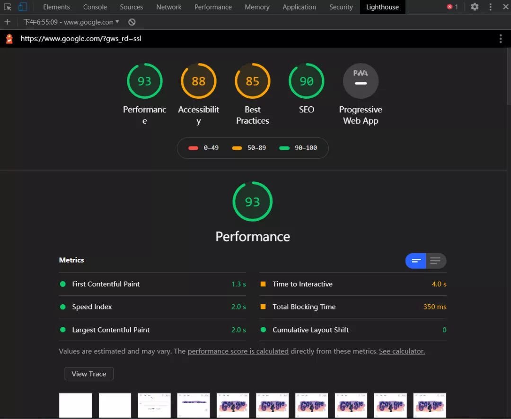

有 5 个指标:

- `Performance` 性能
- `accessibility` æ— éšœç¢ä½¿ç”¨
- `Best Practice` 用户体验
- `SEO` SEO 优化
- `Progressive Web App` é¡µå¯¹äº PWA 的兼容性

## Security é¢æ¿

> 用äºæ£€æµ‹å½“é¢é¡µé¢çš„安全性

该é¢æ¿å¯ä»¥åŒºåˆ†ä¸¤ç§ç±»å‹çš„ä¸å®‰å…¨çš„页é¢ï¼š

- 如æœè¢«è¯·æ±‚的页é¢é€šè¿‡ HTTP æä¾›æœåŠ¡ï¼Œé‚£ä¹ˆè¿™ä¸ªä¸»æºå°±ä¼šè¢«æ ‡è®°ä¸ºä¸å®‰å…¨ã€‚
- 如æœè¢«è¯·æ±‚的页é¢æ˜¯é€šè¿‡ HTTPS è·å–的，但这个页é¢æ¥ç€é€šè¿‡ HTTP 继续ä»å…¶ä»–æ¥æºæ£€ç´¢å†…容，那么这个页é¢ä»ç„¶è¢«æ ‡è®°ä¸ºä¸å®‰å…¨ã€‚这就是所谓的混åˆå†…容页é¢,æ··åˆå†…容页é¢åªæ˜¯éƒ¨åˆ†å—到ä¿æŠ¤,因为 HTTP 内容(é加密的内容通信使用æ˜æ–‡)å¯èƒ½ä¼šè¢«çªƒå¬,容易å—到中间人攻击。如 163，虽然è¯ä¹¦æ˜¯æœ‰æ•ˆçš„，但是页é¢æœ‰ä¸€éƒ¨åˆ† http 资æºï¼š
  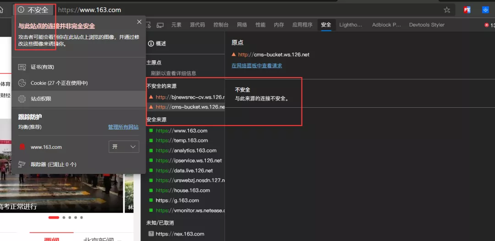

## Command 终æ大招

在æ§åˆ¶å°æ‰“开的状æ€ä¸‹ï¼Œ 组åˆæŒ‰é”® `Ctrl + Shift + P` /  `Command + Shift + P` 打开“命令â€èœå•ï¼Œæ¥ä¸‹æ¥å°±å¯ä»¥ä¸ºæ‰€æ¬²ä¸ºäº†~

### 截图

当你åªæƒ³å¯¹ä¸€ä¸ªç‰¹å®šçš„ `DOM` 节点进行截图时，å¯èƒ½éœ€è¦ä½¿ç”¨å…¶ä»–工具æ“作好久，使用æ§åˆ¶å°å¯ä»¥ç›´æ¥é€‰ä¸­æƒ³è¦æˆªå›¾çš„节点，打开 `Command` èœå•å¹¶ä¸”使用 `节点截图` å°±å¯ä»¥äº†

- 截å–特定节点： `Screenshot Capture node screenshot`
- å…¨å±æˆªå›¾ï¼š `Screenshot Capture full size screenshot`

### CSS/JS 覆盖ç‡

- 打开调试é¢æ¿ï¼Œé€šè¿‡å‘½ä»¤èœå•è¾“å…¥ `Show Coverage` 调出é¢æ¿
- 点击 `reload` 按钮开始检测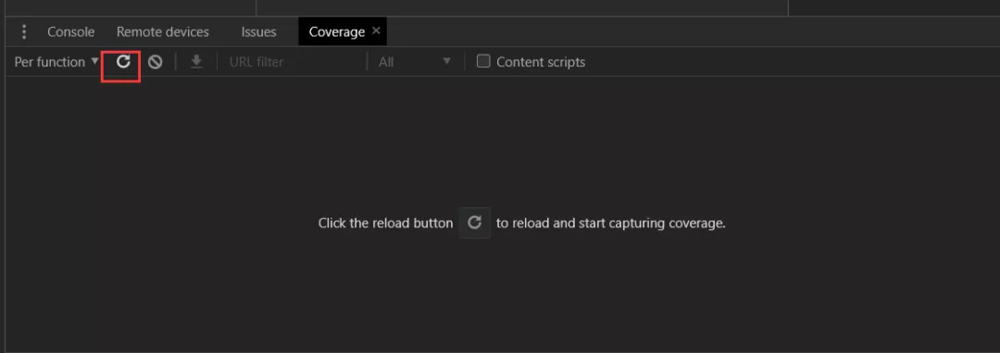
- 点击相应文件å³å¯æŸ¥çœ‹å…·ä½“的覆盖情况（è“色的为用到的代ç ï¼Œçº¢è‰²è¡¨ç¤ºæ²¡æœ‰ç”¨åˆ°çš„代ç ï¼‰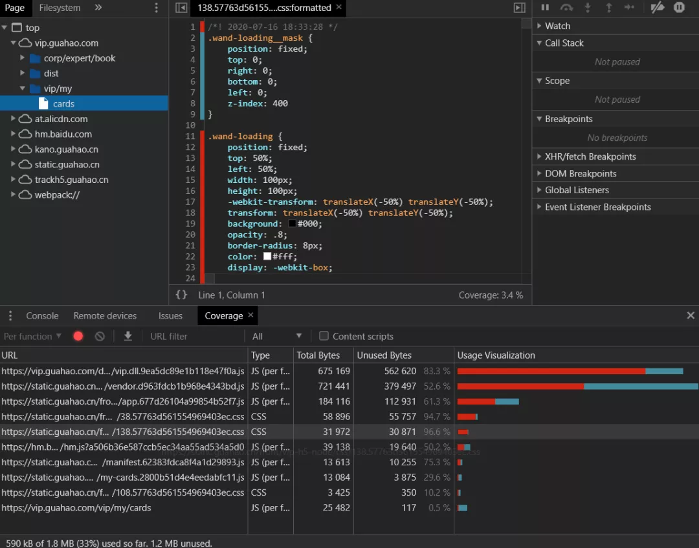

### 媒体查询

媒体查询是自适应网页设计的基本部分。 在 Chrome Devtools 中的设备模å¼ä¸‹ï¼Œåœ¨ä¸‰åœ†ç‚¹èœå•ç‚¹å‡», `Show Media queries` å³å¯å¯ç”¨ï¼š

> å³é”®ç‚¹å‡»æŸä¸ªæ¡å½¢ï¼ŒæŸ¥çœ‹åª’体查询在 CSS 中何处定义并跳到æºä»£ç ä¸­çš„定义

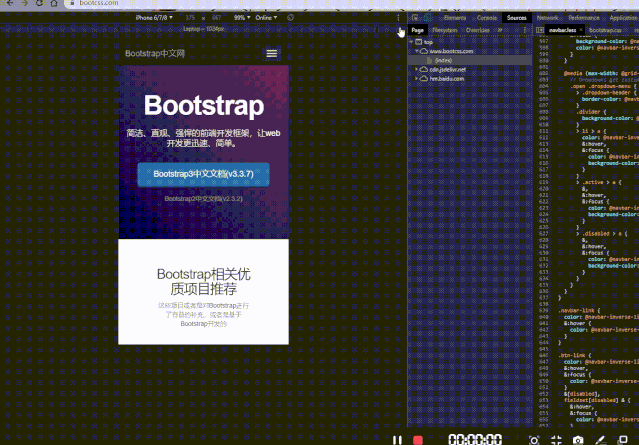

## å‚考

- Chrome Network ，Size å’Œ Time 为什么有两行å‚æ•°
- Chrome å¼€å‘者工具
- Google chrome-devtools
- Chrome devtools 使用详解——Performance
- 全新 Chrome Devtool Performance 使用指å—
- Chrome-performance 页é¢æ€§èƒ½åˆ†æ使用教程
- MDN Performance
- 网页性能检测-performance
- æµè§ˆå™¨æ¸²æŸ“详细过程
- chrome 设置断点的å„ç§å§¿åŠ¿
- Network Summary
