[TOC]

# [DevTools 实现原理与性能分析实战 (qq.com)](https://mp.weixin.qq.com/s/H8iahg5WUOHXeRzvf0R01w)

## 引言

从 2008 年 Google 释放出第一版的 Chrome 后，整个 Web 开发领域仿佛被注入了一股新鲜血液，渐渐打破了 IE 一家独大的时代。Chrome 和 Firefox 是 W3C Web 标准的坚定支持者，随着这两款开源浏览器市场份额逐渐加大，迎来了开发者的春天。这就迎来了一个新的职业分工——前端工程师 frontend-engineer，前端工程师促进了 Web 应用的繁荣，功能强大的调试工具必不可少。Google 基于开源的基础上顺势推出了 DevTools，广受网页开发者的好评，随即也推动了 Chrome 的在商业的成功。


本文通过分析 Chrome 的 DevTools 的技术实现，特别是在浏览器内核中的实现部分，来展示这款被万千开发者所喜爱的开发工具背后的秘密。本文适合阅读对象主要有前端开发者、有志于开发 Hybrid 应用调试工具或重写 webdriver 实现对 Chrome 或 WebView 控制的应用工程师。


> 注：本文所有代码分析，基于 Android Chromium 87.0.4280.141 版本分析而成。由于笔者所在团队主要从事 Android 平台的 Blink 内核开发，所以分析过程主要集中在移动端，其他平台只是数据通路的区别，实现原理差别不大。


## 网页调试工具发展史


2006 年之前，这属于 IE 时代，在 IE 时代编写 JavaScript 代码时的调试手段，主要靠 window.alert() 或将调试信息输出到网页上来分析逻辑 bug。这种硬 debug 的手段，不亚于系统底层开发，往往一个小问题要花费掉一整天时间，开发效率极低。


2006 年 1 月份，Apple 的 WebKit 团队释放出第一版本的 Web Inspector，此版本功能还比较简朴，仅可以查看 DOM 节点的继承关系，节点所应用了哪些 CSS 的规则。但此版本已经奠定了今后多年的网页调试工具的原型，具有划时代意义。


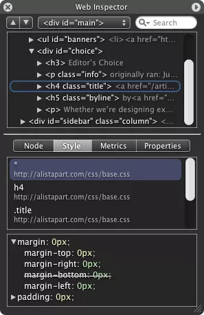


WebKit 团队的迭代速度非常快，2006 年 6 月发布了一个重量级功能，JavaScript 的断点调试功能，此时已经具备开发者神器的雏形。


同时开源阵营出现一款 Firefox 的插件 Firebug，专注于 Web 开发的调试，奠定了现代 DevTools 的 Web UI 的布局。早期版本就支持了 JavaScript 的调试，CSS Box 模型可视化展示，支持 HTTP Archive 的性能分析等优秀特性，后来的 DevTools 参考了此插件的功能和产品定位。2016 年 Firebug 整合到 Firefox 内置调试工具，2017 年 Firebug 停止更新，一代神器就此谢幕。


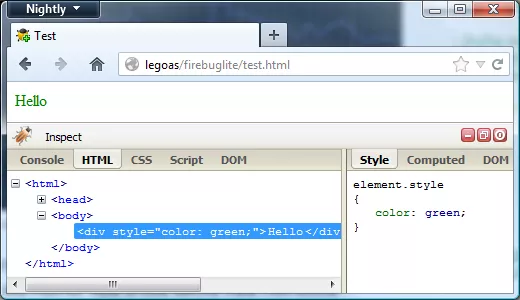


此时迎来了一个开源界的狠角色 Google 团队，基于 WebKit 加入浏览器研发，推出的 Chrome 以「安全、极速、更稳定」吸引了不少 IT 极客的关注，同时开发者工具这方面， Google 吸收多款调试工具的优秀功能，推出了今天的主角 DevTools。


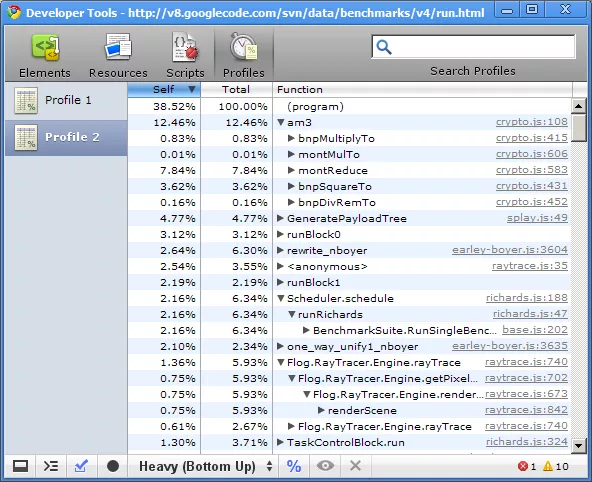


早期版本现在看起来这个布局有点简陋，但这可是十几年前的作品。支持 DOM + CSS 查看，查看资源加载分析，脚本调试以及性能调试。现在开发中常用 DevTools 的功能，基本也就这几个功能。


那个年代的 DevTools，基本是在跟随 Firebug 的功能，只是交互方式上的差异。2007 年 Steve Jobs 发布了第一代 iPhone 手机，Google 相继推出了 Android 手机，互联网的发展来到移动互联网时代。DevTools 此时开始超越同类工具，支持了远程真机调试。Chrome 是多进程架构，DOM 和 JavaScript 是运行在子进程中的，所以 DevTools 的底层实现，已与同类产品完全不同。Chrome 的架构师将 DevTools 实现架构调成在 client-server 模式，这个架构让远程真机调试成为可能。为了方便网络数据传输，Chrome 设计出了一套数据封装协议 [Chrome DevTools Protocal(CDP)](https://chromedevtools.github.io/devtools-protocol/)，接下来的几年，这个架构的调整在开源世界大放异彩。


2009 年 Ryan Dahl 基于 Chromium 的 JavaScript 虚拟机 V8 设计了 Node.js，Node.js 的面世让 JavaScript 这款 Web 脚本语言走出了浏览器，打开了服务端编程、桌面编程可以使用 JavaScript 语言的新局面。依托于 DevTools 的 client-server 架构以及 Node.js 的开发者的数量不断增加，DevTools 也迅速出圈，Chrome 团队于 2016 年开始支持 Node.js 的调试。DevTools 已从一款 Web 调试工具，演变成 JavaScript 生态中重要一员，助力更多的开发者开发更多优秀代码。Node.js 的生态都离不开 DevTools ，比如桌面开发框架 [Electron](https://www.electronjs.org/)、开发者喜爱的编辑器 [Visual Studio Code](https://code.visualstudio.com/) 、前端架构 [Vue.js](https://vuejs.org/)、Facebook 开源 Android 性能分析工具 [Stetho](http://facebook.github.io/stetho/)等。


## DevTools 架构


DevTools 是 client-server 架构，client 就是用户操作的 Web UI 界面，负责接收用户操作指令，然后将操作指令发往浏览器内核或 Node.js 中进行处理，并将处理结果数据展示在 Web UI 上。server 启动了两类服务，一种 HTTP 服务；另一种 WebSocket 服务。


> **HTTP 服务**提供内核信息查询能力。比如获取内核版本、获取调试页的列表、启动或关闭调试。
>
> 
>
> **WebSocket** 服务提供与内核进行真实数据通信的能力，负责 Web UI 传递过来的所有操作指令的分发和处理，并将结果送回 Web UI 进行展示。


下图展示出了 Android DevTools 的整体架构图，从左侧开发者通过 Web UI 的发起的操作命令，是怎么一步一步地将操作命令，传递到手机中的 Browser Core（Browser Core 运行 Chrome 浏览器内核的应用，比如 Chrome 浏览器、Android WebView、NodeJs 应用等）中执行的过程。


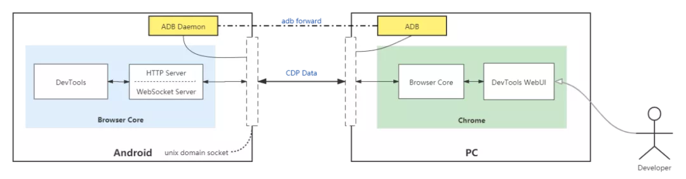


Android 平台巧妙地使用 **ADB forward** 能力，解决了 PC 上的 WebUI 与 Android 手机中的 Chrome 内核的连接问题。轻松了实现了**远程调试**的能力，不要小瞧这一实现，这对前端开发者效率提升是极大的。因为前端开发者的工作环境，目前来看基本是在 PC （Windows、Mac、Linux 统称为 PC）下，通过远程调试能力的实现，让移动端的开发实现了所见即所得。


正是 Chrome 团队基于网络通信方式，作为 DevTools 底层通信框架，才为后来的 Web 开发团队百花齐放奠定了基础。TCP/IP 是互联网的基础，没有哪种语言或平台不支持 TCP/IP 的。DevTools 选型 TCP/IP 方式直接抹平了不同平台或系统框架之间的差异。


**Chrome DevTools Protocol(简称CDP)** 这组开放协议的推出，再一次将 DevTools 的实现，真正做到了跨平台。[CDP](https://chromedevtools.github.io/devtools-protocol/) 本质就是一组 JSON 格式的数据封装协议，JSON 是轻量的文本交换协议，可以被任何平台任何语言进行解析。正因为此，官方推荐的支持 CDP 的语言库多达近十种。Google 官方推荐了 Node.js 版本 [Puppeteer](https://developers.google.com/web/tools/puppeteer) ，通过 Puppeteer 完整地实现了 CDP 协议，为 Chrome 内核通信的方式打了一个样，接着开源世界陆续推出了多个语言版本的 CDP 的使用库。关于 CDP 协议，在稍后的章节会详细介绍。


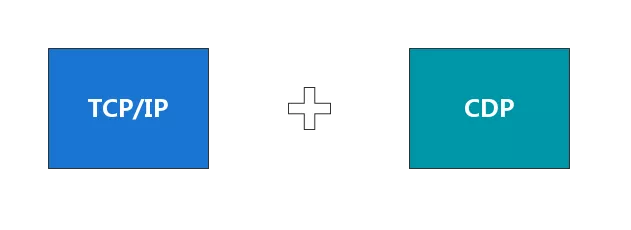


Chrome 的架构师通过高度抽象能力，将 DevTools 的底层架构抽象成 TCP/IP 和 CDP 两个部分，奠定了 DevTools 的跨平台跨终端的能力。当年 WebSocket 的实现方案还处在草案阶段，Chrome 架构师就大胆地采用 WebSocket 实现了调试协议中的主协议部分。现在看来，开发者日常使用的页面的实时截图能力，可以实时观察到远程网页中所展示的界面，这个实时性就是基于 WebSocket 来提供的。笔者还很佩服 Chrome 架构师的眼光和设计气场，正是他们优秀的能力，将网页开发者工具带到新高度。


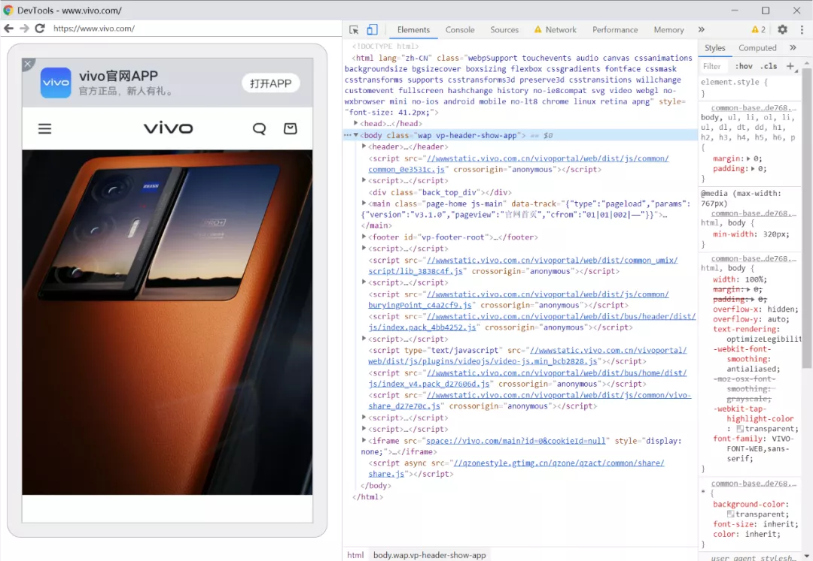


## DevTools 通信协议


[Chrome DevTools Protocol（简称CDP）](https://chromedevtools.github.io/devtools-protocol/)此协议包含两部分 HTTP 和 WebSocket，DevTools 的 Web UI 将控制命令发往浏览器内核，其中的控制命令、参数以及返回值，都是通过 CDP 来进行封装。命令的发送时，由 Web UI 进行封装后，通过 WebSocket 发往浏览器内核。接收到浏览器内核反馈回结果后，再按协议进行解包，分发给Web UI。


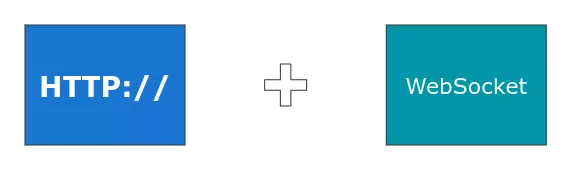


为了分析 Web UI 与 Android 浏览器内核通信过程，需要做一下环境准备。


4.1 环境准备


为了能访问到内核中数据，浏览器内核需要开启 DevTools Server ，PC Chrome 和 Android Chrome / WebView 的开启方式略有不同。


PC Chrome 启动时，增加一个启动参数 **-remote-debugging-port=9222** , 这样 DevTools Server 就会侦听本地的端口，可以向 `http://localhost:9222` 发起 HTTP / WebSocket 请求，即可获取 DevTools 中的数据。


对于 Android Chrome 与 WebView 略有差异，由于 WebView 默认是不开启调试功能的，需要在客户端手动开启，才能启动 Server。

```js
// Android 4.4 以上 WebView 才真正使用 Blink 内核，所以需要在此版本及以上系统。
if (Build.VERSION.SDK_INT >= Build.VERSION_CODES.KITKAT) {  
	WebView.setWebContentsDebuggingEnabled(true);}
```


此时 Android Chrome / WebView 在手机内已启动了 Server，但为了在 PC 上能够访问到，需要使用 ADB工具的**端口转发**能力。

```
ADB 端口转发您可以使用 forward 命令设置任意端口转发，将特定主机端口上的请求转发到设备上的其他端口。以下示例设置了主机端口 6100 到设备端口 7100 的转发：
adb forward tcp:6100 tcp:7100
通过 forward 可以打通 PC 与 Android 设备之间的网络相互访问
```


Android Chrome / WebView 使用 unix domain socket 建立的 Server 端，此 socket 的连接符为：


chrome_devtools_remote 

和 webview_devtools_remote_分别为 chrome 和 WebView 的连接符。WebView 的连接由于可能不同应用都使用了 WebView，所以采用了进程 ID（PID）作为后缀来区分。


```
adb shell cat /proc/net/unix | grep "devtools_remote"0000000000000000: 00000002 00000000 00010000 0001 01 528176 @chrome_devtools_remote0000000000000000: 00000002 00000000 00010000 0001 01 276394 @webview_devtools_remote_23119
```


通过 ADB forward ，将 PC 与 Android 设备访问打通，执行如下命令：

```
# 在 PC 上侦听 9222 端口，对 localhost:9222 的请求将会转发到 android 设备上的 webview_devtools_remote_23119 上
adb forward tcp:9222 localabstract:webview_devtools_remote_23119
```


至此，就可以在 PC 上通过 9222 来访问 Android 设备中的调试页面了。


4.2 HTTP 协议分析


**4.2.1 获取内核版本信息**


```shell
# 使用 curl 工具，GET http://localhost:9222/json/version
curl http://localhost:9222/json/version                       
{   
	"Android-Package": "com.vivo.browser",   
	"Browser": "Chrome/87.0.4280.141",   
	"Protocol-Version": "1.3",   
	"User-Agent": "Mozilla/5.0 (Linux; Android 8.1.0; vivo X20Plus A Build/OPM1.171019.011; wv) AppleWebKit/537.36 (KHTML, like Gecko) Version/4.0 Chrome/87.0.4280.141 Mobile Safari/537.36",   
	"V8-Version": "8.7.220.31",   
	"WebKit-Version": "537.36 (@9f05d1d9ee7483a73e9fe91ddcb8274ebcec9d7f)",   
	"webSocketDebuggerUrl": "ws://localhost:9222/devtools/browser"}
```


从上面返回值，可以得到如下几个信息：


- Android-Package，使用 WebView 应用的包名。
- Browser，内核的版本号。
- Protocol-Version，为 CDP 的协议版本，当前版本为 1.3，从 1.0 开始，还有 1.1、1.2 等。
- User-Agent，浏览器的 UA 信息。
- V8-Version，所使用的 JavaScript 引擎版本号。
- WebKit-Version，由于 Blink 内核是基于 WebKit 537.36 版本开发，所以会有此版本信息。
- webSocketDebuggerUrl，这是 WebSocket 的调试 URL。


**4.2.2 获取可调试页面列表**


```js
# 使用 curl 工具，GET http://localhost:9222/json/list
curl http://localhost:9222/json/list  
[ {   
	"description": "{\"attached\":true,\"empty\":false,\"height\":1812,\"never_attached\":false,\"screenX\":0,\"screenY\":72,\"visible\":true,\"width\":1080}",   
	"devtoolsFrontendUrl": "https://chrome-devtools-frontend.appspot.com/serve_rev/@9f05d1d9ee7483a73e9fe91ddcb8274ebcec9d7f/inspector.html?ws=localhost:9222/devtools/page/B86E67DEA526D5EEE83A170B1F62A72C",   
	"faviconUrl": "https://mat1.gtimg.com/www/mobi/2017/image/logo/v0/192.png",   
	"id": "B86E67DEA526D5EEE83A170B1F62A72C",   
	"title": "腾讯网-QQ.COM",   
	"type": "page",   
	"url": "https://xw.qq.com/#news",   
	"webSocketDebuggerUrl": "ws://localhost:9222/devtools/page/B86E67DEA526D5EEE83A170B1F62A72C"
}, {   
	"description": "{\"attached\":false,\"empty\":true,\"never_attached\":true,\"screenX\":0,\"screenY\":0,\"visible\":true}",   
	"devtoolsFrontendUrl": "https://chrome-devtools-frontend.appspot.com/serve_rev/@9f05d1d9ee7483a73e9fe91ddcb8274ebcec9d7f/inspector.html?ws=localhost:9222/devtools/page/3F9E05905F1919D563DF01BAEC64D2E4",  
    "id": "3F9E05905F1919D563DF01BAEC64D2E4",   
    "title": "about:blank",   
    "type": "page",   
    "url": "about:blank",   
    "webSocketDebuggerUrl": "ws://localhost:9222/devtools/page/3F9E05905F1919D563DF01BAEC64D2E4"} ]
```


返回了一个 JSON 的数组，每一个调试页占用一个数据元素，上面的返回值可以看出，笔者环境下 vivo 浏览器打开了两个页面，一个 https://xw.qq.com/#news 和 about:blank。


- description，是个 JSON 对象，展示当前页面的状态信息。比如页面宽、高、在屏幕上的偏移，WebView 是否已经 attached 到 view 上了，只有 attach 上的页面，才会被展示出来，能否被调试。
- devtoolsFrontendUrl，此值为一个 URL，就是日常使用 DevTools 的 WebUI 控制面板地址，这是个 Web APP 当访问过一次后，会就缓存一份在浏览器下。此页面托管在某个在国内无法正常访问地址，所以经常会出现打不开面板，而显示白屏的情况。Chrome 浏览器在打包时会内置一份与当前内核匹配的 WebUI 版本，所以 Chrome 可以直接调试自己的页面。
- id，这是每个打开页面随机生成的 GUID 值，用于生成 WebSocket 链接，以区分不同页面。
- title，打开网页的标题，对应网页 head 中的 title 标签内容。
- type，页面的类型，主要有以下几类 page、iframe、worker 以及 service_worker 等。
- URL，当前打开的页面 URL。
- webSocketDebuggerUrl，此参数为 WebSocket 连接的 URL。


HTTP 协议还有其他几个子命令，比如 protocol、new、activate 等，主要是页面控制类的，就不一一介绍了。


**4.2.3 WebSocket 协议分析**


WebSocket 协议由四部分组成: **Domain** 、**Method** 、 **Event** 和 **Type** 。


**1）Domain，命名空间**，类似 C++/Java 中的命名空间或包名，用于分割不同的命令。用于将众多子命令按类划分，方便使用者调用，以及防止 Method 同名冲突。以 1.3 版本的 CDP 协议，一共划分出 15 个Domain。


- **Browser**: 用于管理浏览器对象。
- **Debugger**: 用于调试 JavaScript 的分类，比如断点、调用栈等。
- **DOM**: 所有 DOM 节点操作都在此 Domain 下，DOM 节点的修改，遍历等。
- **DOMDebugger**: 管理 DOM 节点调试的 Domain，DevTools 中节点修改断点，就是通过这组 Domain 中提供的 Method 完成的。
- **Emulation**: 此是一组环境模拟器集合，DevTools 中的修改设备尺寸、UserAgent 等是由这个 Domain 实现。
- **Input**: 事件分发方法的集合。
- **IO**: I/O 流操作集合。
- **Log**: Log 控制 Method 集合。
- **Network**: 浏览器网络通信数据，可能通过此 Domain 进行捕获。
- **Page**: 基于 Blink 中的 Page 操作 Method 集合，比如刷新，打开 URL。
- **Performance**: 集成了性能分析 Method。
- **Profiler**: 采样分析器的 Method 集成在此 Domain 下。
- **Runtime**: 与 JavaScript 通信的 Method 被集成此 Domain 下，比如执行 JavaScript 代码。
- **Security**: 安全类操作，比如证书错误。
- **Target**: DevTools 连接的一些控制类 Method 在此 Domain 下。


**2）Method，方法名称**，每个 Domain 下都会有一组 Method，指明了具体操作浏览器内核的功能。有三部分组成：名称 、 参数 和 返回值 。与 C++/Java 中方法描述一致。


- **名称**：Debugger.setBreakpointByUrl；
- **参数**：lineNumber integer [，url string，urlRegex string，scriptHash string，columnNumber integer，condition string ]；
- **返回值**：breakpointId BreakpointId，actualLocation Location。


```js
// Debugger.setBreakpointByUrl 到内核，带上如下参数
{   
	"lineNumber":1,   
	"url":"snippet:///Script%20snippet%20%231",   
	"columnNumber":0,   
	"condition":""
} // 将会收到内核的返回值，返回断点成功信息
{   
	"breakpointId":"1:1:0:snippet:///Script%20snippet%20%231",   
	"locations":[]
}
```


**3）Event，通知事件**，网页会有很多状态通知，需要同步到 WebUI 或其他控制端上来。Event 就是用于通知这些事件的。比如 DOM 属性发生了变化时，将会收到 Dom.attributeModified 事件；将 JavaScript 传递到内核去执行时，将会收到内核发回来的 Debugger.scriptParsed 事件和参数，参数如下：

```js
{   
	"scriptId":"238",   
	"url":"",   
	"startLine":0,   
	"startColumn":0,   
	"endLine":0,   
	"embedderName":"",   
	"endColumn":7,   
	"endLine":0,   
	"executionContextAuxData":{      
		"isDefault":true,      
		"type":"default",      
		"frameId":"2059AA1A2C1A535CF4C480DC01E7FDEC"   
	},   
	"frameId":"2059AA1A2C1A535CF4C480DC01E7FDEC",   
	"isDefault":true,   
	"type":"default",   
	"executionContextId":5,   
	"hasSourceURL":false,   
	"hash":"035a9e1738252e22523ed8f1c52d9dbf81abe278",   
	"isLiveEdit":false,   
	"isModule":false,   
	"length":7,   
	"scriptId":"238",   
	"scriptLanguage":"JavaScript",   
	"sourceMapURL":"",   
	"startColumn":0,   
	"startLine":0,   
	"url":""
}
```


**4）Type**，是 Method 或 Event 传递参数的复杂数据类型，这些类型与内核的对象相对应。比如 DOM.Node 类型就对应着 Blink 中的 DOM 节点。主要属性如下：

- **nodeId**: NodeId 也是 Type，节点 id，根据此值可以在内核找到对应的节点。
- **parentId**: NodeId 也是 Type，父节点 id 。
- **nodeType**: integer，节点类型。
- **nodeName**: string，节点名称。
- **nodeValue**：string, 节点内容。
- **children**: array，子节点数组。
- **attributes**: array， 节点属性数组 通过 Node 上这些属性，就可以将 DOM 树的节点在内存占用描述出来。DevTools 的 Web UI 中 Element 面板，就是通过 DOM.getDocument Method 将一棵 DOM 树展现出来。


通过 CDP 的这种数据组织方式，既可以传递控制命令来操作内核，也可以接收内核状态通知（Event）。通过 CDP 可以让浏览器做任何事情，而且得到的信息远比使用 Chrome 图形界面还要多。因此， Google 推出 Chrome Headless 版本，被广泛应用于 web 自动化测试、网页爬虫以及网页沙箱等领域。


**当调试移动端浏览器时，可以实时看到移动设备上的所浏览的屏幕，这是怎么做到的呢？**


其实，就是一张一张截图通过 Page.screencastFrame 事件将 base64 后的图片发回到 Web UI 中展示的。


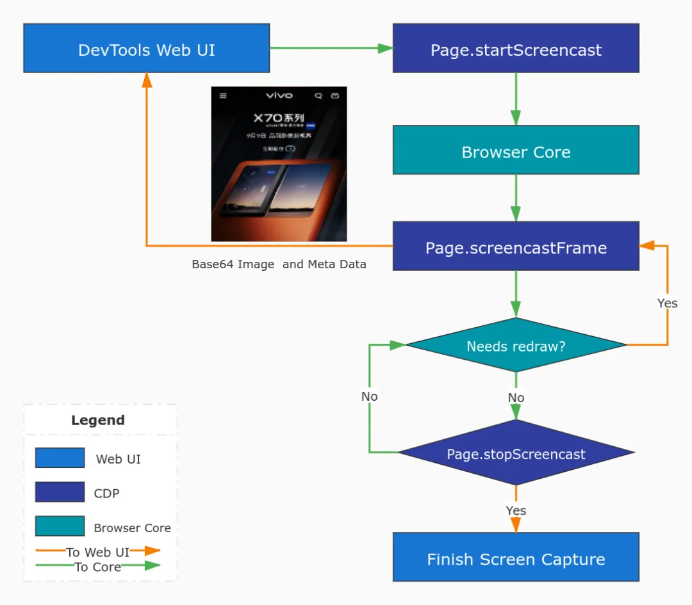


从 Page.screencastFrame 通知事件带回了图片和描述信息（Meta data）：

```json
{   
	"data":"/9j/4AAQSkZJRgABAQAAAQABAAD/2wBDAAYEBQYFBAYGBQYHBw...",   
	"metadata":{      
		"deviceHeight":604,      
		"deviceWidth":360,      
		"offsetTop":60,      
		"pageScaleFactor":1,      
		"scrollOffsetX":0,      
		"scrollOffsetY":832.6666870117188,      
		"timestamp":1631018056.565802   
	},   
	"sessionId":2
}
```


通过描述信息，即可将此图片的信息展示在 WebUI 上。一张截图近 1M 的大小，由于 DevTools 利用了 WebSocket 的双向长链接的特性，所以展示出来无比平滑和清晰。


4.3 DevTools 内核实现


以上章节，介绍了从 Web 开发者的角度出发，将操作命令传递到移动端 Browser Core 的一个整体流程，以及 CDP 通信协议相关内容。本节重点介绍在 Browser Core 中的实现过程，先介绍 DevTools 在浏览器内核中实现，后面笔者会挑选 JavaScript 如何从字符串传递到 V8 中执行过程，展开来进行详细介绍，这一行为的实现方案。


**4.3.1 内核架构介绍**


DevTools 以启动一个 Web Server 为起点，然后将调用命令发到相应处理模块，整体架构图如下：


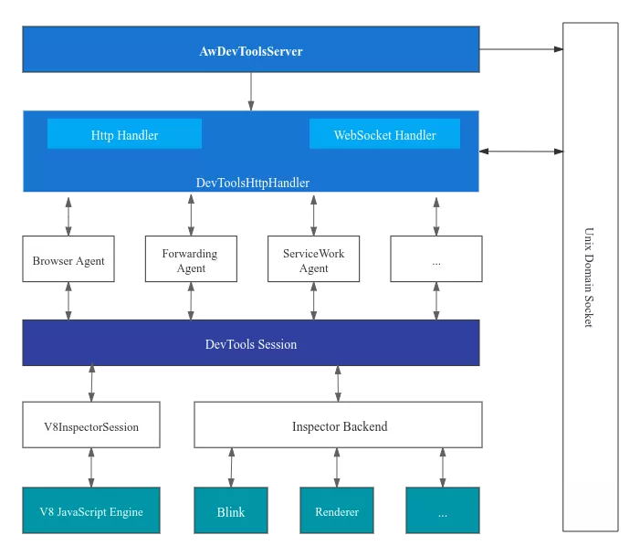


DevTools 在内核中大体上分为四层：


- Server 层，用于接收外部网络发过来的操作请求。
- Agent 层，对于 Server 层发过来的请求，进行拆解，根据操作的类型不同，再分发给不同的 Agent 来处理。
- Session 层，Session 是对不同的业务模块进行了一层抽象。过了 Session 层后，将会进入不同的业务模块，可以到达 V8， Blink 等。
- 业务层，就是具体的功能模块，比如 V8 模块，主要负责 JavaScript 的调试相关能力的支撑。


Server 层由 DevToolsManager 这个单例对象来管理，由于是单例所以一个进程只会存在一个 Manger 对象，从而防止被重复创建出多个，导致状态错乱。


**4.3.2 Web Server 数据接收入口**


Server 收到的请求都会分发给 DevToolsHttpHandler 类，此类负责网络 Client 发过来的数据请求响应和将处理结果发送回网络 Client， 此类有两个重要方法 **OnJsonRequest** 和 **OnWebSocketMessage** ，分别用来处理 HTTP 协议和 WebSocket 协议。


```
void DevToolsHttpHandler::OnJsonRequest(
    int connection_id,
    const net::HttpServerRequestInfo& info) {
  // 查询内核版本信息
  if (command == "version") {
    base::DictionaryValue version;
    version.SetString("Protocol-Version",
                      DevToolsAgentHost::GetProtocolVersion());
    // ...
    SendJson(connection_id, net::HTTP_OK, &version, std::string());
    return;
  }
  // 获取内核所支持的协议
  if (command == "protocol") {
    DecompressAndSendJsonProtocol(connection_id);
    return;
  }
  // 获取可调试页
  if (command == "list") {
    DevToolsManager* manager = DevToolsManager::GetInstance();
    DevToolsAgentHost::List list =
        manager->delegate() ? manager->delegate()->RemoteDebuggingTargets()
                            : DevToolsAgentHost::GetOrCreateAll();
    RespondToJsonList(connection_id, info.GetHeaderValue("host"),
                      std::move(list));
    return;
  }
  // 启动一个新调试
  if (command == "new") {
    // ...
    std::string host = info.GetHeaderValue("host");
    std::unique_ptr<base::DictionaryValue> dictionary(
        SerializeDescriptor(agent_host, host));
    SendJson(connection_id, net::HTTP_OK, dictionary.get(), std::string());
    return;
  }
  // 激活或关闭一个调试
  if (command == "activate" || command == "close") {
   // ...
  SendJson(connection_id, net::HTTP_NOT_FOUND, nullptr,
           "Unknown command: " + command);
}
 
void DevToolsHttpHandler::OnWebSocketRequest(
    int connection_id,
    const net::HttpServerRequestInfo& request) {
  // 创建调试的 Agent
  if (base::StartsWith(request.path, browser_guid_,
                       base::CompareCase::SENSITIVE)) {
    scoped_refptr<DevToolsAgentHost> browser_agent =
        DevToolsAgentHost::CreateForBrowser(
            thread_->task_runner(),
            base::BindRepeating(&DevToolsSocketFactory::CreateForTethering,
                                base::Unretained(socket_factory_.get())));
    connection_to_client_[connection_id] =
        std::make_unique<DevToolsAgentHostClientImpl>(
            thread_->task_runner(), server_wrapper_.get(), connection_id,
            browser_agent);
    AcceptWebSocket(connection_id, request);
    return;
  }
 
  connection_to_client_[connection_id] =
      std::make_unique<DevToolsAgentHostClientImpl>(
          thread_->task_runner(), server_wrapper_.get(), connection_id, agent);
    // Accept websocket
  AcceptWebSocket(connection_id, request);
}
 
// WebSocket 数据接收接口，所有 WebUI 的请求都通过此接口分发
void DevToolsHttpHandler::OnWebSocketMessage(int connection_id,
                                             std::string data) {
  auto it = connection_to_client_.find(connection_id);
  if (it != connection_to_client_.end()) {
    it->second->OnMessage(base::as_bytes(base::make_span(data)));
  }
}
```


- **DevToolsHttpHandler::OnJsonRequest** 用于响应 HTTP 请求，用于查询内核状态，比如内核版本、当前支持协议，将返回完整协议内容，方便开发者适配对应的支持。

  

- **DevToolsHttpHandler::OnWebSocketRequest** 用于接收 WebSocket 的连接，根据此方法对不同的 Agent 对象进行了创建。

  

- **DevToolsHttpHandler::OnWebSocketMessage** 所有调试请求数据，都经过此接口通过 Client 分发到不同的 Agent 上去。


Server 层数据响应时通过上面的三个接口来达到数据接收和分发的能力。


**4.3.3 JavaScript 执行过程**


V8 JavaScript 引擎用于解释执行网页中的 JavaScript 脚本，同时也可以通过 DevTools 接收外部传递过来的脚本，脚本在当前网页的 Context 下执行，所以可以通过 JavaScript 来操作网页行为，比如修改 DOM 节点属性。CDP 中设计了执行 JavaScript 接口 **Runtime.evaluate** ，引方法的参数如下：


```js

{
    allowUnsafeEvalBlockedByCSP: false,
    awaitPromise: false,
    contextId: 14,
    expression: "alert('hi');",
    generatePreview: true,
    includeCommandLineAPI: true,
    objectGroup: "console",
    replMode: true,
    returnByValue: false,
    silent: false
}
```


其中，最重要的一个参数就是 **expression** ，此为一个 string 类型的参数，用于存放需要执行的脚本内容。上例将会在网页中弹出一个内容为 hi 的 **alert** 确认框。


V8 中有个专门的模块，V8RuntimeAgentImpl 用于支持 CDP 中 Runtime 的这个 Domain，当然也有 V8DebuggerAgentImpl 是用来支持 Debug 这个 Domain 的具体实现。V8RuntimeAgentImpl 中 evaluate 方法，就是用于负责接收 DevTools 发过来的执行请求。


```
void V8RuntimeAgentImpl::evaluate(
    const String16& expression, Maybe<String16> objectGroup,
    Maybe<bool> includeCommandLineAPI, Maybe<bool> silent,
    Maybe<int> executionContextId, Maybe<bool> returnByValue,
    Maybe<bool> generatePreview, Maybe<bool> userGesture,
    Maybe<bool> maybeAwaitPromise, Maybe<bool> throwOnSideEffect,
    Maybe<double> timeout, Maybe<bool> disableBreaks, Maybe<bool> maybeReplMode,
    Maybe<bool> allowUnsafeEvalBlockedByCSP,
    std::unique_ptr<EvaluateCallback> callback);
```


V8RuntimeAgentImpl::evaluate 会启动一个 microtasks 来执行脚本，最终会走到 v8::internal::Execution::Call 中，Execution 模块会负责将脚本进行语法解析和编译成字节码，最终调度到虚拟机器中运行。

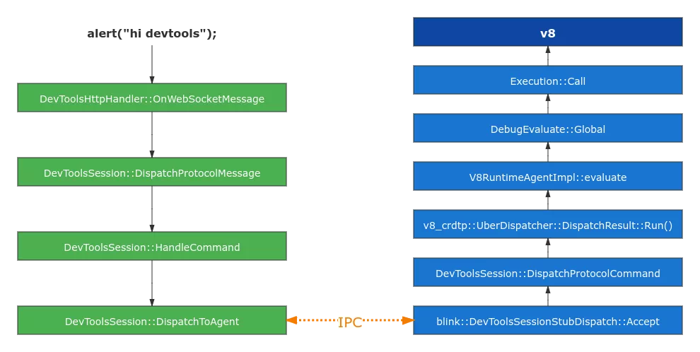


执行流程如上图所示，Web UI 发出执行脚本的字符串，WebSocket 的 OnWebSocketMessage 将会收到此命令，然后通过 DevToolsSession 逐层向 V8 分发。由于 Chrome 是多进程架构，分为Browser 进程和 Render 进程，之间通过 IPC 进行通信。上图左侧在 Browser 端执行流程，右侧为 Render 端执行流程。


Render 端的

DevToolsSession::DispatchProtocolCommand 是一个重要的分发接口，所以发到 V8 或 Blink 的控制命令，都会经过此接口。接着就会将控制命令发送到 V8RuntimeAgentImpl，根据命令功能的不同，调度到不同功能模块进行处理。


4.4 网页性能调优


**4.4.1 性能分析面板介绍**


DevTools 提供一组功能强大的性能分析工具，网络、JavaScript 调试、渲染、内存以及标准支持度检测等。下面介绍 **Performance** 面板中一些性能分析时的一些功能。主界面被划分为这几块：


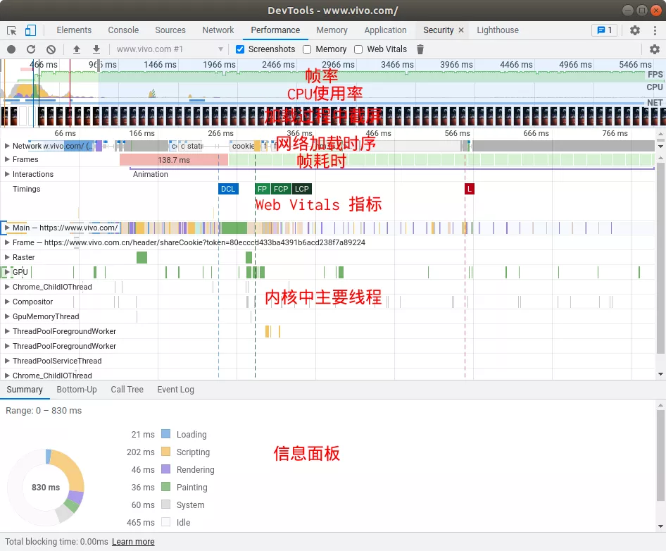


**1）帧率（FPS）**：线性展示了做 Performance 期间，网页渲染的帧率。


**2）CPU 使用率**：CPU 占用走势图


**3）加载过程中截屏**：定时采集了网页截屏性能


**4）网络加载时序**：展示网络资源加载次序及耗时情况


**5）帧耗时（Frames）**：展示了渲染每帧耗时情况，红色表示存在耗时较长的帧。


**6）Web Vitals 指标**：Google 推荐一套性能体验指标，下面会详细介绍。


**7）内核中主要线程**：浏览器内核中存在多个线程各有分工，当出现耗时较长帧时，需要在这些线程中排查，具体哪个线程在耗时。主要分为这几个：


- Main，这是 Blink 主线程，负责网页的排版、解析、JavaScript 执行等。
- Raster，光栅化线程，用于将渲染对象转化成 Bitmap。
- GPU，硬件加速渲染线程，将 Texture 绘制到屏幕上。
- Chrome_ChildIOThread，负责网络资源，文件操作。
- Compositor，合成线程，负责将渲染时各个层，合成在一起然后进行光栅化。
- ThreadPoolForegoundWorker，Worker 的工作线程池。


**8）信息面板**：用于展示选择模块详细信息，几个指标含义：


- Loading：网络请求和 HTML 解析耗时。
- Scripting：JavaSript 解析、编译、在虚拟机中执行，以及 GC 耗时。
- Rendering：Blink 排版渲染耗时。
- Painting：绘制耗时，主要包含绘制、合成、图片解码以及上屏。
- System 和 Idle：是系统调度和空闲耗时。


**4.4.2 性能分析常规思路**


性能分析基本思路从问题入手，网页常见性能问题，笔者遇到的主要有这几种情形。


- 需要的资源没有及时被请求回来。排除服务器问题，资源请求发起太晚？资源太大？
- 网页分层太多，导致 Rendering 和 Painting 时间过长。
- 内存占用过多，页面过于复杂、资源多且大、JavaScript 大块资源持有生命周期太长。
- 动画多且消失后未移除。JavaScript 的轮播动画、CSS 的动画、带有动画的图片资源，比如 GIF, SVG、WebP 等。
- 事件侦听不合理。事件侦听过多且可能被高频触达，比如节点变化、Move 事件等。


总的来说，不论是网页性能优化还是 Native 程序优化，只要协调好这两个资源占用即可：CPU + 内存。只要挖掘出问题点，性能问题都会迎刃而解，问题点的挖掘除了源码级别的审查，DevTools 可以助一臂之力。


针对上面总结的常规场景，利用 DevTools 性能分析能力，先整体上审视 Profile 图。

> 网络请求次序和时长是否合理；
>
> Main Thread 的长任务是否合理。


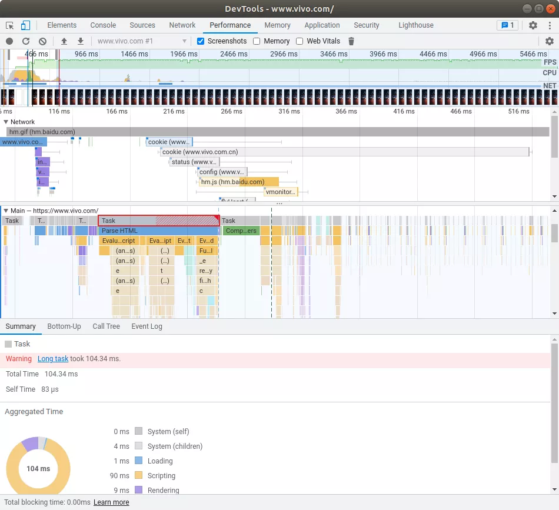


从 Network 板块观察资源请求发起的顺序，是否存在长耗时任务，阻塞着首屏展示资源加载，如果不保证需要的及时加载，就会长时间白屏。


资源问题就绪后，就需要排查哪些长耗时任务执行。先查看 Main Thread 中的 Long task，比如，上图的 Long task 就是 Scripting 的占了较长时间。通过 Bottom-Up / CallTree 查看具体的耗时点，相应地优化掉。


在排查具体优化点时，有个小技巧。通常开发环境都是在 PC 上进行模拟，当版本出去后，才能暴露出问题。由于移动设备的碎片化，很多用户的设备，性能可能并不好。那如何在开发环境优化这类低配置机器上的表现呢？DevTools 提供了限流的模拟，可以限制网络制式为 2G/3G，CPU 降速。


在右上角有个“**设置**”，展开配置项目，可以看到 Network 和 CPU 的限流选项，选择后重新录制一下 Profile。


上面提到，网页层数太多，极大地影响到网页渲染性能。“网页层数” 是什么意思呢？目前，浏览器渲染引擎为了提升网页绘制性能，绘制时会对网页进行分层。这样的好处就是，仅重绘修改过的层，其他层内容如果没有变化，就不需要重新绘制，直接取上次绘制结果，从而提升绘制效率。不同的 WEB 引擎分层的策略不同，通常会将普通网页、CSS 动画、Canvas、WebGL、Fix 标签等各分为一层。分层会带来渲染效率的提升，但也会带来内存的开销，从而会影响到性能。DevTools 能否分析网页层数吗？可以，在上面的“设置”中有一个选项 “Enable advanced paint instrumentation(slow)” 启用它，重新做一次性能录制。


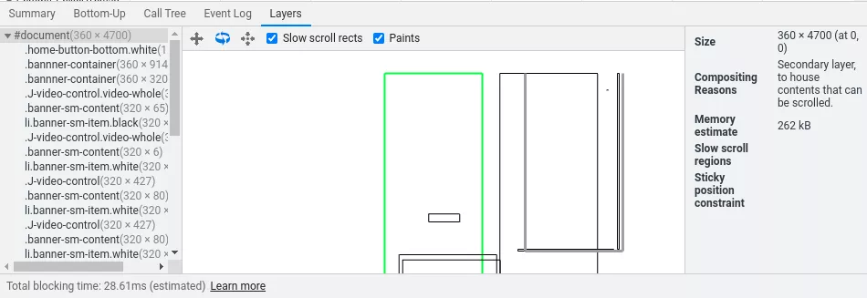


在 “信息面板” 多了一个 “Layers” 标签，选择后将会看到网页分层情况。如果存在不合理的分层，可以尝试调整方式，将分层进行合并，从而达到提升性能。


**4.4.3 Web Vitals**


Web Vitals 是 Google 推出的一套 Web 性能与体验兼顾的衡量标准。原先的衡量策略基本是基于 “首字” 和 “首屏” 来衡量，但从用户角度和技术优化角度，这两指标都存在这样那样的问题。所以， Google 推出了 Web Vitals 标准，并与 DevTools 进行配合，方便开发者在开发阶段，就识别出 Web 的性能问题。由于标准一直随着时代的发展，不断变化，开发者一直追着指标的变化有点吃不消，好在 Google 明确表示，目前推出的三个指标，短时间内不会变，笔者就不清楚这个短时间是多长时间。


**第一个指标**：Largest Contentful Paint （LCP），大面积铺满时间点，2.5 秒以内算优秀。主要是指有大面积的文字、图片被展示出来，就算达到了 LCP。


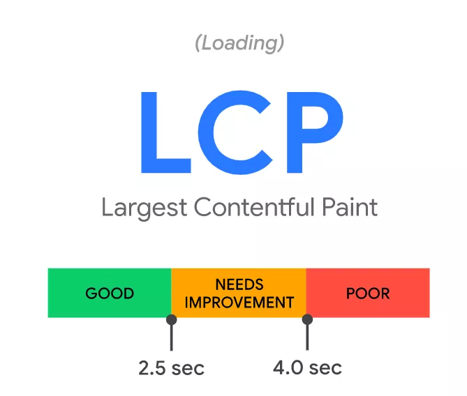


**第二个指标**：First Input Delay（FID），首次可响应外部输入事件的时间点，100 ms 内算优秀。这个指标是从用户使用角度出发，达到 FID 的时间点，意味着用户可以操作网页了。


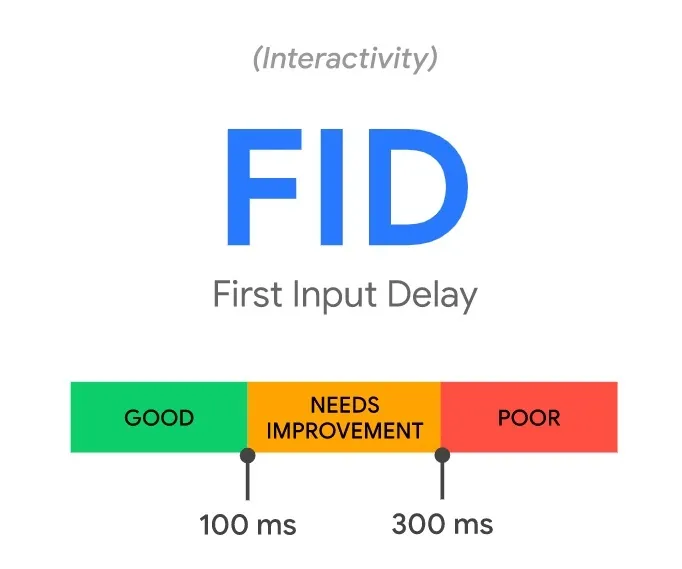


**第三个指标**：Cumulative Layout Shift（CLS），排版跳跃指标，0.1 为优秀。在网页加载过程中，如果出现排好版的元素，发现大面积的移动的话，这个指标就会很高。比如网页中 img 标签不设置宽和高，当图片加载完毕后，按图片实际大小来排版本。这样的就会触发网页重新排版，从用户角度网页被整体向下推了一个图片高度，Google 认为这个体验不好。


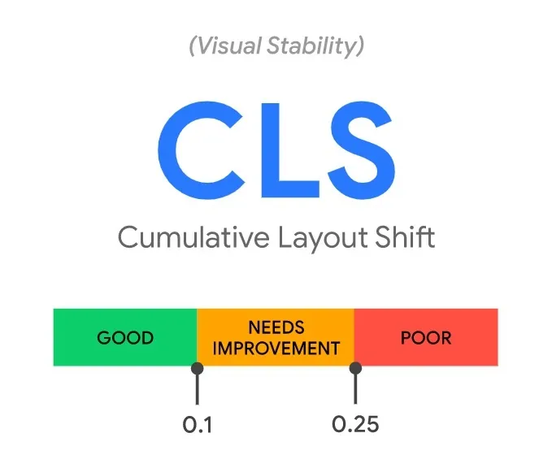


LCP / FID / CLS 这三个指标，本质上是从用户视角看网页的性能衡量指标，开发者可以看看自己作品这三个指标属于什么水平。


## 五、工具在生态构建中的重要性


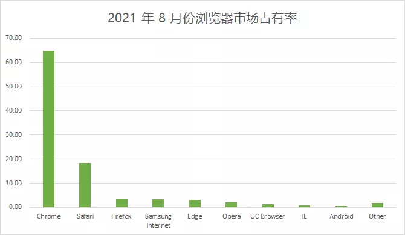


图片（数据来自 statcounter.com）


Chrome 凭借着自己优秀的产品特性，安全、快速以及稳定性，赢得了大批用户青睐。从上图 StatCounter 统计数据，可以看出 Chrome 已成为绝对的浏览器界的一哥，理所当然地取得商业上的成功。但是 Chrome 在开源以及生态的建立，DevTools 可谓首功一件。Google 通过 DevTools 的超越竞品的特性，吸引了大批前端开发者，转到 Chrome 下开发自己的产品。早期生态产品是 Chrome 插件，Chrome Store 中的插件数量就可以看出它的成功。


当 Node.js 的问世，DevTools 首款支持 Node.js 的调试工具，推动了 Node.js 的普及。然后 DevTools 依托 Node.js 迅速出圈。另一方面，开源世界也开始反哺了 DevTools 项目，目前支持 CDP 协议的开源方案多达 10 几种语言，常用的语言基本都支持上了。这个领域目前还在飞速发展中，期待这个领域可以有更好的发展。


DevTools Web UI 已经从 Chromium 仓库中独立出来，可以单独 Clone 下来进行二次开发，Web UI 本次限于篇幅，未做实现原理分析。其实，Web UI 也是个非常优秀的 Web APP，很适合前端开发者深度研究一下。


我们从优秀开源项目中学习到的不仅是代码实现与架构，也可以学习到更高维度的东西，比如产品思维以及工具思维，并落地到自己项目中。回顾一下网页调试领域发展过程，从一款 JavaScript 插件，是如何演变成今天的前端开发生态，其中有很多点值得学习。


六、结束语


笔者所在团队长期致力于 Chromium 内核的研究与学习，基于其衍生出来的产品，服务我们生态用户，为其提供优质的上网体验。同时，我们孵化出的 Web 浏览服务，也为生态内应用提供强大、快速、稳定的 Web 服务能力。如果您有兴趣于 Web 底层技术研究，欢迎加入我们，与一群志同道合的小伙伴共同成长，同时也能服务好亿级用户。


七、参考文献


[1] [Google Chrome](https://en.wikipedia.org/wiki/Google_Chrome) 

[2] [10 Years of Web Inspector](https://webkit.org/blog/5718/10-years-of-web-inspector/) 

[3] [10 years of Speed in Chrome ](https://blog.chromium.org/2018/09/10-years-of-speed-in-chrome_11.html)

[4] [Chrome DevTools ](https://developer.chrome.com/docs/devtools/)

[5] [Chrome DevTools Protocol protocol](https://chromedevtools.github.io/devtools-protocol/tot/Browser/)

[6] [Web Vitals](https://web.dev/vitals/)
