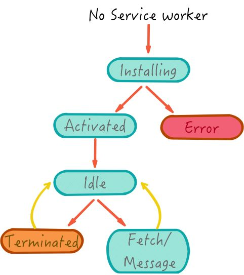
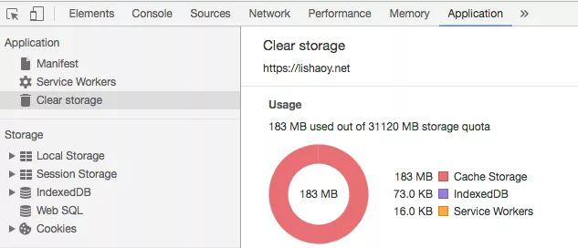
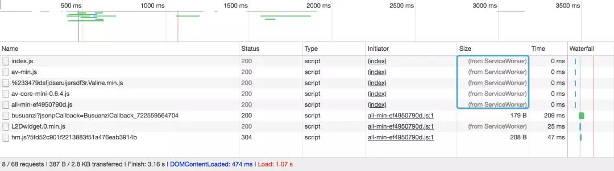
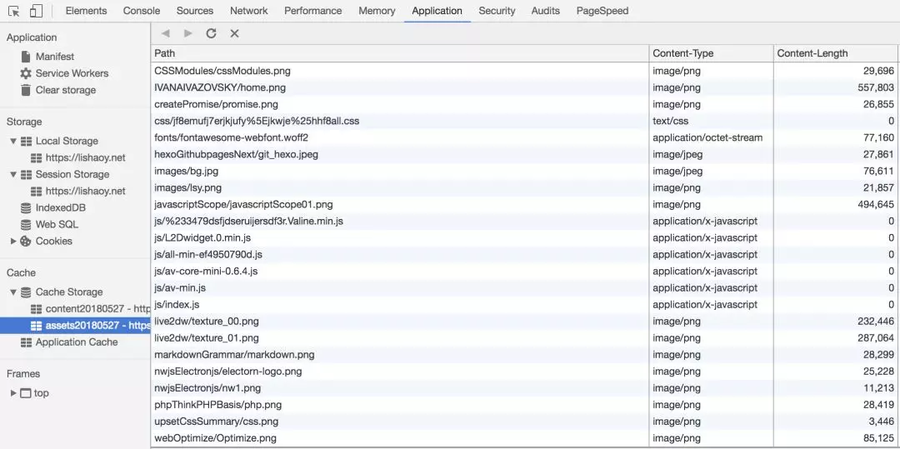

[TOC]

# **Service Worker**

## **1、什么是 Service Worker**

**Service Worker** 本质上充当Web应用程序与浏览器之间的代理服务器，也可以在网络可用时作为浏览器和网络间的代理。它们旨在（除其他之外）使得能够**创建有效的离线体验**，**拦截网络请求并基于网络是否可用以及更新的资源是否驻留在服务器上来采取适当的动作**。他们还允许访问推送通知和后台同步API。

**Service worker** 可以解决目前离线应用的问题，同时也可以做更多的事。**Service Worker** 可以使你的应用先访问本地缓存资源，所以在离线状态时，在没有通过网络接收到更多的数据前，仍可以提供基本的功能（一般称之为 Offline First）。这是原生APP 本来就支持的功能，这也是相比于 `web app` ，原生 `app` 更受青睐的主要原因。

再来看看 👀**service worker** 能做些什么：

- 后台消息传递
- 网络代理，转发请求，伪造响应
- 离线缓存
- 消息推送
- ...

> 本文主要以（lishaoy.net）资源缓存为例，阐述下 service worker如何工作。

## **2、生命周期**

**service worker** 初次安装的生命周期，如图 🌠：



从上 👆图可知，**service worker** 工作的流程：

1. **安装：** `service worker URL` 通过 `serviceWorkerContainer.register()` 来获取和注册。

2. **激活：** 当 `service worker` 安装完成后，会接收到一个激活事件(activate event)。 `onactivate` 主要用途是清理先前版本的 `service worker` 脚本中使用的资源。

3. **监听：** 两种状态

4. - 终止以节省内存；
   - 监听获取 `fetch` 和消息 `message` 事件。

5. **销毁：** 是否销毁由浏览器决定，如果一个 `service worker` 长期不使用或者机器内存有限，则可能会销毁这个 `worker` 。

> Tips：激活成功之后，在 Chrome 浏览器里，可以访问 chrome://inspect/#service-workers和 chrome://serviceworker-internals/ 可以查看到当前运行的service worker ，如图 👇：


现在，我们来写个简单的例子 🌰。

## **3、注册 service worker**

要安装 `service worker` ，你需要在你的页面上注册它。这个步骤告诉浏览器你的 `service worker` 脚本在哪里。

```js
if ('serviceWorker' in navigator) { navigator.serviceWorker.register('/sw.js').then(function(registration) {    
    // Registration was successful    
console.log(`ServiceWorker registration successful with scope: ${registration.scope}`, ); 
}).catch(function(err) {    
    // registration failed :(    
    console.log('ServiceWorker registration failed: ', err);  });}
```

上面的代码检查 `service worker API` 是否可用，如果可用， `service worker/sw.js` 被注册。如果这个 `service worker` 已经被注册过，浏览器会自动忽略上面的代码。

## **4、激活 service worker**

在你的 `service worker` 注册之后，浏览器会尝试为你的页面或站点安装并激活它。

`install` 事件会在安装完成之后触发。`install` 事件一般是被用来填充你的浏览器的离线缓存能力。你需要为 `install` 事件定义一个 `callback` ，并决定哪些文件你想要缓存.

```js
// The files we want to cachevar 
CACHE_NAME = 'my-site-cache-v1';
var urlsToCache = [  '/',  '/css/main.css', '/js/main.js'];
self.addEventListener('install', function(event) {  
    // Perform install steps  
    event.waitUntil(    
        caches.open(CACHE_NAME).then(function(cache) {        
            console.log('Opened cache');        
            return cache.addAll(urlsToCache);      })  );});
```

在我们的 `install callback` 中，我们需要执行以下步骤：

- 开启一个缓存
- 缓存我们的文件
- 决定是否所有的资源是否要被缓存

上面的代码中，我们通过 `caches.open` 打开我们指定的 `cache` 文件名，然后我们调用 `cache.addAll`并传入我们的文件数组。这是通过一连串 `promise` （caches.open 和 cache.addAll） 完成的。`event.waitUntil` 拿到一个 `promise` 并使用它来获得安装耗费的时间以及是否安装成功。

## **5、监听 service worker**

现在我们已经将你的站点资源缓存了，你需要告诉 `service worker` 让它用这些缓存内容来做点什么。有了 `fetch` 事件，这是很容易做到的。

每次任何被 `service worker` 控制的资源被请求到时，都会触发 `fetch` 事件，我们可以给 `service worker` 添加一个 `fetch` 的事件监听器，接着调用 `event` 上的 `respondWith()` 方法来劫持我们的 **HTTP** 响应，然后你用可以用自己的方法来更新他们。

```js
self.addEventListener('fetch', function(event) {  
    event.respondWith(
        caches.match(event.request);
    );
});
```

`caches.match(event.request)` 允许我们对网络请求的资源和 `cache` 里可获取的资源进行匹配，查看是否缓存中有相应的资源。这个匹配通过 `url` 和 `vary header` 进行，就像正常的 **HTTP** 请求一样。

那么，我们如何返回 `request` 呢，下面 👇 就是一个例子 🌰：

```js
self.addEventListener('fetch', function(event) {  
    event.respondWith(    
        caches.match(event.request).then(function(response) {        
            // Cache hit - return response        
            if (response) {          
                return response;        
            }        
            return fetch(event.request);     
        }    )  );});
```

上面的代码里我们定义了 `fetch` 事件，在 `event.respondWith` 里，我们传入了一个由 `caches.match`产生的 `promise.caches.match` 查找 `request` 中被 `service worker` 缓存命中的 `response` 。

如果我们有一个命中的 `response` ，我们返回被缓存的值，否则我们返回一个实时从网络请求 `fetch` 的结果。

## **6、sw-toolbox**

当然，我也可以使用第三方库，例如：lishaoy.net 使用了 **sw-toolbox**。

**sw-toolbox** 使用非常简单，下面 👇 就是 lishaoy.net 的一个例子 🌰：

```js
"serviceWorker" in navigator ? 
    navigator.serviceWorker.register('/sw.js').then(function () { 
    	navigator.serviceWorker.controller 
            ? console.log("Assets cached by the controlling service worker.") 
        	: console.log("Please reload this page to allow the service worker to handle network operations.")  
  	}).catch(function (e) {    
    	console.log("ERROR: " + e)  
}) : console.log("Service workers are not supported in the current browser.")
```

以上是 **注册** 一个 `service woker`。

```js
"use strict";
(function () {    
    var cacheVersion = "20180527";    
    var staticImageCacheName = "image" + cacheVersion;    
    var staticAssetsCacheName = "assets" + cacheVersion;    
    var contentCacheName = "content" + cacheVersion;    
    var vendorCacheName = "vendor" + cacheVersion;    
    var maxEntries = 100;    
    self.importScripts("/lib/sw-toolbox/sw-toolbox.js");    	
    self.toolbox.options.debug = false;    
    self.toolbox.options.networkTimeoutSeconds = 3;    
    self.toolbox.router.get("/images/(.*)", self.toolbox.cacheFirst, {        cache: {            name: staticImageCacheName,            maxEntries: maxEntries        }    });    self.toolbox.router.get('/js/(.*)', self.toolbox.cacheFirst, {        cache: {            name: staticAssetsCacheName,            maxEntries: maxEntries        }    });    self.toolbox.router.get('/css/(.*)', self.toolbox.cacheFirst, {        cache: {            name: staticAssetsCacheName,            maxEntries: maxEntries        }    ......    self.addEventListener("install", function (event) {        return event.waitUntil(self.skipWaiting())    });    self.addEventListener("activate", function (event) {        return event.waitUntil(self.clients.claim())    })})();
```

就这样搞定了 🍉 (具体的用法可以去 https://googlechromelabs.github.io/sw-toolbox/api.html#main 查看)。

有的同学就问， `service worker` 这么好用，这个缓存空间到底是多大？其实，在 **Chrome**可以看到，如图：



可以看到，大概有 **30G** ，我的站点只用了 **183MB** ，完全够用了 🍓。

最后，来两张图：




