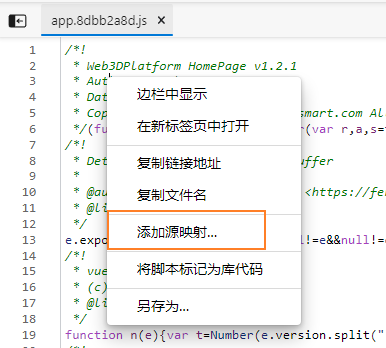
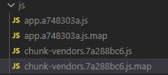

[TOC]

# [前端工程师生产环境 debugger 技巧 - 政采云前端团队 (zoo.team)](https://www.zoo.team/article/prod-debugger)

虽然生产环境 debug 是一件非常不优雅的行为，但是由于种种原因，我们又不得不这么干。

## 生产环境 debug 步骤

生产环境 debug 需要几步？这问题和“把大象装进冰箱拢共分几步”一样简单。

第一步，把冰箱门打开。F12 打开 devTools；

第二步，把大象装进冰箱。找到需要 debug 的前端**文件**，**格式化**，**打断点**，调试上下文，定位问题；

第三部，关闭冰箱门。解决问题

## 如何快速定位到问题相关的代码

### global search ，全局搜素关键字，再定位到关键的代码

chrome devTools 的 global search 是一个非常实用的一个功能，当你不知道需要调试的代码在哪个文件时，当你是一个非常大的系统，引用了很多的资源文件，你可以使用 global search 进行搜索关键字，这个操作会搜索所有加载进来的资源，点击搜索结果，就可以使用 source 面板打开对应的资源文件，然后格式化代码，再然后在当前的文件内 再次搜索关键字，打断点。

**打开 global search 快捷键：**

`⌘ + ⌥ + F` （Mac），`CTRL + SHIFT + F` （Windows）


## 如何 debug 混淆后的 js ？

生产环境的 js 基本上都是**混淆**过的，压缩混淆的优点就不赘述了，压缩混淆后随之来的是生产环境调试的难度，虽然通过打断点，勉强还能看的懂，但是已经很反人类了。

webpack-obfuscator ---- 完全混淆


## **如何在生产环境使用本地 sourceMap 调试？**

第一步：打开混淆代码

第二步：右键 -> 选择【Add source map】

第三步：输入本地 sourceMap 的地址（此处需要启用一个**静态资源服务**，可以使用 [http-server](https://www.npmjs.com/package/http-server)），完成。本地代码执行构建命令，注意需要打开 sourceMap 配置，编译产生出构建后的代码，此时构建后的结果会包含 sourceMap 文件。



不过需要webpack打包时 构建.map文件



```js
// vue.config.js
{
	// ...
	productionSourceMap: true,
}
```

[#webpack 输出 sourcemap的模式](https://webpack.docschina.org/configuration/devtool/#devtool)


关联上 sourceMap 后，我们就可以看到 sources -> page 面板上的变化了


## 如何在 chrome 中修改代码并调试？

开发环境中，我们可以直接在 IDE 中修改代码，代码的变更就直接更新到了浏览器中了。那么生产环境，我们可以直接在 chrome 中修改代码，然后立马看代码修改后的效果吗？

当然，你想要的 chrome devTools 都有。chrome devTools 提供了 local overrides 能力。


### **local overrides 如何工作的？**

指定修改后的文件的本地保存目录，当修改完代码保存的时候，就会将修改后的文件保存到你指定的目录目录下，当再次加载页面的时候，对应的文件不再读取网络上的文件，而是读取存储在本地修改过的文件。

### **local overrides 如何使用？**

首先，打开 sources 下的 overrides【覆盖】 面板；

然后，点击【select folder overrides】选择**修改后的文件存储地址**；

再然后，点击顶部的授权，确认同意；

最后，我们就可以打开文件修改，修改完成后保存，重新刷新页面后，修改后的代码就被执行到了。

> ⚠️注意，原js文件直接 format 是无法修改的；在代码 format 之前先添加无效代码进行代码变更进行保存，然后再 format 就可以修改； 就是需要现在源码中修改后保存后会直接写入到指定的目录. 之后再进行格式化 


## 参考文献

- https://developer.chrome.com/docs/devtools/