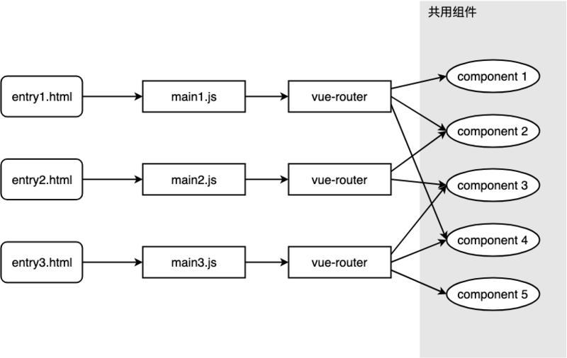
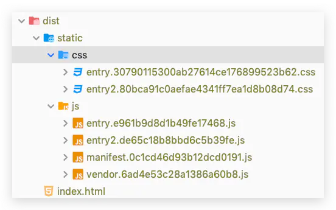
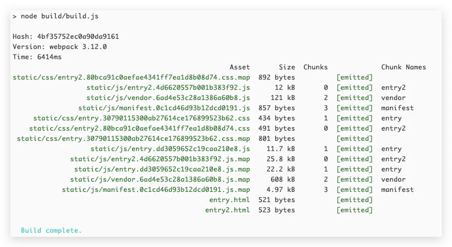
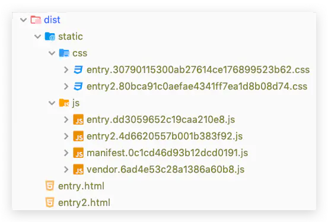
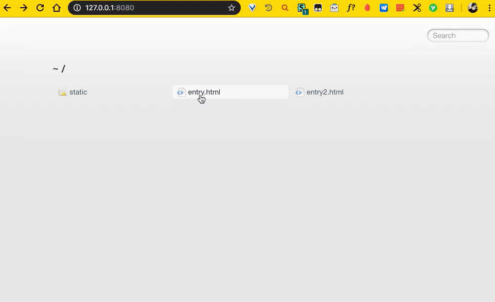

[TOC]

# 一文搞懂 Webpack 多入口配置

## [webpack-entry 配置](https://www.webpackjs.com/configuration/entry-context/#entry)

**入口起点(entry point)**指示 webpack 应该使用哪个模块，来作为构建其内部*依赖图*的开始。

进入入口起点后，webpack 会找出有哪些模块和库是入口起点（直接和间接）依赖的。

每个依赖项随即被处理，最后输出到称之为 *bundles* 的文件中。

可以通过在 [webpack 配置](https://www.webpackjs.com/configuration)中配置 `entry` 属性，来指定一个入口起点（或多个入口起点）。默认值为 `./src`。

entry 参数类型: 

- string | [string] | 
- object { `<key>`: string | [string] } |
- (function: () => string | [string] | object { `<key>`: string | [string] })

起点或是应用程序的起点入口。从这个起点开始，应用程序启动执行。

如果传递一个数组，那么数组的每一项都会执行。

动态加载的模块**不是**入口起点。

简单规则：每个 HTML 页面都有一个入口起点。

单页应用(SPA)：一个入口起点

多页应用(MPA)：多个入口起点。

```js
entry: {
  home: "./home.js",
  about: "./about.js",
  contact: "./contact.js"
}
```

如果传入一个字符串或字符串数组，chunk 会被命名为 `main`。

如果传入一个对象，则每个键(key)会是 chunk 的名称，该值描述了 chunk 的入口起点。

------

最近在做项目的时候遇到了一个场景：一个项目有多个入口，不同的入口，路由、组件、资源等有重叠部分，也有各自不同的部分。由于不同入口下的路由页面有一些是重复的，结合 `vue-router`、 `vuex`、 `ElementUI` 等进行配置, 因此我考虑使用 Webpack 多入口配置来解决这个需求。


## 目标分析

1. 一个项目中保存了多个 HTML 模版，不同的模版有不同的入口，并且有各自的 router、store 等；
2. 不仅可以打包出不同 HTML，而且开发的时候也可以顺利进行调试；
3. 不同入口的文件可以引用同一份组件、图片等资源，也可以引用不同的资源；



## 准备工作

首先我们 `vue init webpack multi-entry-vue` 使用 `vue-cli` 创建一个 webpack 模版的项。

简单介绍一下 Webpack 的相关配置项，这些配置项根据使用的 Webpack 模版不同，一般存放在 `webpack.config.js` 或 `webpack.base.conf.js` 中：

```javascript
const path = require('path')
module.exports = {
  context: path.resolve(__dirname, '../'),
  entry: {
    app: './src/main.js'
  },
  output: {
    path: path.resolve(__dirname, '../dist'),
    filename: 'output-file.js',
    publicPath: '/'
  },
  module: {},        // 文件的解析 loader 配置
  plugins: [],       // 插件，根据需要配置各种插件
  devServer: {}      // 配置 dev 服务功能
}
```

这个配置的意思是，进行 Webpack 后，会在命令的执行目录下新建 `dist` 目录（如果需要的话），并将打包 `src` 目录下的 `main.js` 和它的依赖，生成 `output-file.js` 放在 `dist` 目录中。

稍微解释一下相关配置项：

1. **entry：** 入口文件配置项，可以为字符串、对象、数组。

    以上面的对象形式为例，`app` 是入口名称，如果 `output.filename` 中有 `[name]` 的话，就会被替换成 `app`。

2. **context：** 是 webpack 编译时的基础目录，用于解析 `entry` 选项的基础目录(绝对路径)，`entry` 入口起点会相对于此目录查找，相当于公共目录，下面所有的目录都在这个公共目录下面。

3. **output：** 出口文件的配置项。

   1. **output/path：** 打包文件输出的目录，比如上面的 `dist`，那么就会将输出的文件放在当前目录同级目录的 `dist` 文件夹下，没有这个文件夹就新建一个。 

      可以配置为 `path.resolve(__dirname, './dist/${Date.now()}/')` （md 语法不方便改成模板字符串，请自行修改）方便做持续集成。

   2. **output.filename：** 输出的文件名称，`[name]` 的意为**根据入口文件的名称，打包成相同的名称**，有几个入口，就可以打包出几个文件。 

      比如入口的 `key` 为 `app`，打包出来就是 `app.js`，入口是 `my-entry`，打包出来就是 `my-entry.js`。

   3. **output.publicPath：** 静态资源的公共路径，可以记住这个公式：

      **`静态资源最终访问路径 = output.publicPath + 资源loader或插件等配置路径`**。

       举个例子，`publicPath` 配置为 `/dist/`，图片的 `url-loader` 配置项为 `name: 'img/[name].[ext]'` ，那么最终打包出来文件中图片的引用路径为 `output.publicPath + 'img/[name].[ext]' = '/dist/img/[name].[ext]'`。

本文由于是入口和出口相关的配置，所以内容主要围绕着 `entry` 、`output` 和一个重要的 webpack 插件 [html-webpack-plugin](https://webpack.js.org/plugins/html-webpack-plugin/)，这个插件是跟打包出来的 HTML 文件密切相关，主要有下面几个作用：

1. 根据模版生成 HTML 文件；
2. 给生成的 HTML 文件引入外部资源比如 `link`、`script` 等；
3. 改变每次引入的外部文件的 Hash，防止 HTML 引用缓存中的过时资源；

下面我们从头一步步配置一个多入口项目。

## 开始配置

在 `src` 目录下将 `main.js` 和 `App.vue` 两个文件各复制一下，作为不同入口，文件结构变为：

```shell
.
├── build
│   ├── build.js
│   ├── check-versions.js
│   ├── logo.png
│   ├── utils.js
│   ├── vue-loader.conf.js
│   ├── webpack.base.conf.js
│   ├── webpack.dev.conf.js    # 主要配置目标
│   └── webpack.prod.conf.js   # 主要配置目标
├── config
│   ├── dev.env.js
│   ├── index.js
│   └── prod.env.js
├── src
│   ├── assets
│   │   └── logo.png
│   ├── components
│   │   └── HelloWorld.vue
│   ├── router
│   │   └── index.js
│   ├── App.vue
│   ├── App2.vue       # 新增的入口
│   ├── main.js
│   └── main2.js       # 新增的入口
├── static
├── README.md
├── index.html
└── package.json
```

要想从不同入口，打包出不同 HTML，我们可以改变一下 `entry` 和 `output` 两个配置，

```js
// build/webpack.prod.conf.js

module.exports = {
  entry: {
    entry1: './src/main.js',
    entry2: './src/main2.js'
  },
  output: {
    filename: '[name].js', // 输出两个chunk
    publicPath: '/'
  },
    plugins: [
        new HtmlWebpackPlugin({
            template: "index.html",  // 要打包输出哪个文件，可以使用相对路径
            filename: "index.html"   // 打包输出后该html文件的名称
        })
    ]
}
```

webpack 配置里的 `output.filename` 如果有 `[name]` 意为根据入口文件的名称，打包成对应名称的 JS 文件，那么现在我们是可以根据两个入口打包出 `entry.js` 和 `entry2.js`。

打包的结果如下：



此时我们 `npm run build` 打包出一个引用了这两个文件的 `index.html`，那么如何打包出不同 HTML 文件，分别应用不同入口 JS 文件呢，此时我们需要借助于 `HtmlWebpackPlugin` 这个插件。

`HtmlWebpackPlugin` 这个插件，`new` 一个，就打包一个 HTML 页面，所以我们在 `plugins` 配置里 `new` 两个，就能打包出两个页面来。

把配置文件改成下面这样：

```js
// build/webpack.prod.conf.js

module.exports = {
  entry: {
    entry: './src/main.js',   // 打包输出的chunk名为entry
    entry2: './src/main2.js'  // 打包输出的chunk名为entry2
  },
  output: {
    filename: '[name].js',
    publicPath: '/'
  },
  plugins: [ // 增加了一个plugin(), 调整了其入口chunk
    new HtmlWebpackPlugin({
      filename: 'entry.html',  // 要打包输出的文件名
      template: 'index.html',  // 打包输出后该html文件的名称
      chunks: ['manifest', 'vendor', 'entry']  // 输出的html文件引入的入口chunk
      // 还有一些其他配置比如minify、chunksSortMode和本文无关就省略，详见github
    }),
    new HtmlWebpackPlugin({
      filename: 'entry2.html',
      template: 'index.html',
      chunks: ['manifest', 'vendor', 'entry2']
    })
  ]
}
```

上面一个配置要注意的是 `chunks`，如果没有配置，那么生成的 HTML 会引入所有入口 JS 文件，在上面的例子就是，生成的两个 HTML 文件都会引入 `entry.js` 和 `entry2.js`，所以要使用 `chunks` 配置来指定生成的 HTML 文件应该引入哪个 JS 文件。配置了 `chunks` 之后，才能达到不同的 HTML 只引入对应 `chunks` 的 JS 文件的目的。

大家可以看到除了我们打包生成的 `chunk` 文件 `entry.js` 和 `entry2.js` 之外，还有 `manifest` 和 `vendor` 这两个，这里稍微解释一下这两个 `chunk`：

1. `vendor` 是指提取涉及 `node_modules` 中的公共模块；
2. `manifest` 是对 `vendor` 模块做的缓存；

打包完的结果如下：




文件结构：



输出结果: 多entry output的chunk, HTMLPlugun使用的manifest和vendor

效果图: 



## 配置改进

### 文件结构改动

我们在前文进行了多入口的配置，要想新建一个新的入口，就复制多个文件，再手动改一下对应配置。

但是如果不同的 HTML 文件下不同的 `vue-router`、`vuex` 都放到 `src` 目录下，多个入口的内容平铺在一起，项目目录会变得凌乱不清晰，因此在下将多入口相关的文件放到一个单独的文件夹中，以后如果有多入口的内容，就到这个文件夹中处理。

下面我们进行文件结构的改造：

1. 首先我们在根目录创建一个 `entries` 文件夹，把不同入口的 `router`、`store`、`main.js` 都放这里，每个入口相关单独放在一个文件夹；
2. 在 `src` 目录下建立一个 `common` 文件夹，用来存放多入口共用的组件等；

现在的目录结构：

```shell
.
├── build    # 没有改动
├── config   # 没有改动
├── entries  # 存放不同入口的文件
│   ├── entry1
│   │   ├── router       # entry1 的 router
│   │   │   └── index.js
│   │   ├── store        # entry1 的 store
│   │   │   └── index.js
│   │   ├── App.vue      # entry1 的根组件
│   │   ├── index.html   # entry1 的页面模版
│   │   └── main.js      # entry1 的入口
│   └── entry2
│       ├── router
│       │   └── index.js
│       ├── store
│       │   └── index.js
│       ├── App.vue
│       ├── index.html
│       └── main.js
├── src
│   ├── assets
│   │   └── logo.png
│   ├── common          # 多入口通用组件
│   │   └── CommonTemplate.vue
│   └── components
│       ├── HelloWorld.vue
│       ├── test1.vue
│       └── test2.vue
├── static
├── README.md
├── index.html
├── package-lock.json
└── package.json
```

### 动态生成webpack配置

然后我们在 `build/utils` 文件中加两个函数，分别用来生成 webpack 的 `entry` 配置和 `HtmlWebpackPlugin` 插件配置，由于要使用 `node.js` 来读取文件夹结构，因此需要引入 `fs`、`glob` 等模块：

```js
// build/utils
const fs = require('fs')
const glob = require('glob')
const merge = require('webpack-merge')
const HtmlWebpackPlugin = require('html-webpack-plugin')
const ENTRY_PATH = path.resolve(__dirname, '../entries')

// 多入口配置，这个函数从 entries 文件夹中读取入口文件，装配成webpack.entry配置
exports.entries = function() {
  const entryFiles = glob.sync(ENTRY_PATH + '/*/*.js')
  const map = {}
  entryFiles.forEach(filePath => {
    const filename = filePath.replace(/.*\/(\w+)\/\w+(\.html|\.js)$/, (rs, $1) => $1)
    map[filename] = filePath
  })
  return map
}
/**
exports.entries 函数从 entries 文件夹中找到二级目录下的 JS 文件作为入口文件，
并且将二级目录的文件夹名作为 key，生成这样一个对象：
	{"entry1": "/multi-entry-vue/entries/entry1/main.js"}，
多个入口情况下会有更多键值对；
**/


/**
exports.htmlPlugin 函数和之前函数的原理类似，
不过组装的是 HtmlWebpackPlugin 插件的配置，生成这样一个数组，
可以看到和我们手动设置的配置基本一样，只不过现在是根据文件夹结构来生成的
**/
// 多页面输出模版配置 HtmlWebpackPlugin，根据环境装配html模版配置
exports.htmlPlugin = function() {
  let entryHtml = glob.sync(ENTRY_PATH + '/*/*.html')
  let arr = []
  entryHtml.forEach(filePath => {
    let filename = filePath.replace(/.*\/(\w+)\/\w+(\.html|\.js)$/, (rs, $1) => $1)
    let conf = {
      template: filePath,
      filename: filename + '.html',
      chunks: [filename],
      inject: true
    }
    
    // production 生产模式下配置
    if (process.env.NODE_ENV === 'production') {
      conf = merge(conf, {
        chunks: ['manifest', 'vendor'],
        minify: {
          removeComments: true,
          collapseWhitespace: true,
          removeAttributeQuotes: true
        },
        chunksSortMode: 'dependency'
      })
    }
    arr.push(new HtmlWebpackPlugin(conf))
  })
  return arr
}
```
