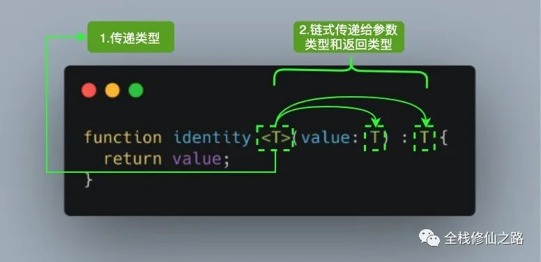

[TOC]

# 一文读懂 TypeScript 泛型及应用 [#](https://mp.weixin.qq.com/s?__biz=MzI2MjcxNTQ0Nw==&mid=2247484576&idx=1&sn=447d4d12a0c36f6935d7a89e2b6c07b9&chksm=ea47a5f8dd302cee6ac4d57367a347e8ddca5727490484b7d9deac7a6b97728bad99f99ce69c&scene=21#wechat_redirect)


### 泛型是什么

软件工程中，我们不仅要创建一致的定义良好的 API，同时也要考虑可重用性。

组件不仅能够支持当前的数据类型，同时也能支持未来的数据类型，这在创建大型系统时为你提供了十分灵活的功能。

**在像 C# 和 Java 这样的语言中，可以使用泛型来创建可重用的组件，一个组件可以支持多种类型的数据。这样用户就可以以自己的数据类型来使用组件。**


设计泛型的关键目的是**在成员之间提供有意义的约束**，这些成员可以是：**类的实例成员、类的方法、函数参数和函数返回值**。


### 示例

定义一个通用的 `identity` 函数，该函数接收一个参数并直接返回它：

```ts
function identity (value) {
  return value;
}

console.log(identity(1)) // 1
```

现在，我们将 `identity` 函数做适当的调整，以支持 TypeScript 的 Number 类型的参数：

```ts
function identity (value: Number) : Number {
  return value;
}

console.log(identity(1)) // 1
```

这里 `identity` 的问题是我们**将 `Number` 类型分配给参数和返回类型，使该函数仅可用于该原始类型。**

但该函数**并不是可扩展或通用的**，很明显这并不是我们所希望的。把 `Number` 换成 `any`，我们失去了定义应该返回哪种类型的能力，并且在这个过程中使编译器失去了类型保护的作用。


让 `identity` 函数可以适用于任何特定的类型，为了实现这个目标，我们可以使用泛型来解决这个问题，具体实现方式如下：

```ts
function identity <T>(value: T) : T {
  return value;
}

console.log(identity<Number>(1)) // 1
```

对于刚接触 TypeScript 泛型的读者来说，首次看到 `<T>` 语法会感到陌生。但这没什么可担心的，就**像传递参数一样**，我们**传递了我们想要用于特定函数调用的类型**。



调用 `identity(1)` ，**`Number` 类型就像参数 `1` 一样，它将在出现 `T` 的任何位置填充该类型。**

> 调用的方式是显示的在函数名后面加`<specific type>` 在尖括号中确定类型

图中 `<T>` 内部的 `T` 被称为类型变量，它是我们希望传递给 identity 函数的**类型占位符**，同时它被分配给 `value` 参数用来**代替它的类型** (指代了参数的类型)：此时 `T` 充当的是类型，而不是特定的 Number 类型。

其中 `T` 代表 **Type**，在定义泛型时通常用作第一个类型变量名称。但实际上 `T` 可以用任何有效名称代替。除了 `T` 之外，以下是常见泛型变量代表的意思：

- K（Key）：表示对象中的键类型；
- V（Value）：表示对象中的值类型；
- E（Element）：表示元素类型。


其实并不是只能定义一个类型变量，我们可以引入希望定义的任何数量的类型变量。比如我们引入一个新的类型变量 `U`，用于扩展我们定义的 `identity` 函数：

```ts
function identity <T, U>(value: T, message: U) : T {
  console.log(message);
  return value;
}

console.log(identity<Number, string>(68, "Semlinker"));
```

调用时指明了两个泛型的具体类型.


除了**为类型变量显式设定值**之外，一种**更常见的做法是使编译器自动选择这些类型**，从而使代码更简洁。我们可以完全**省略尖括号**，比如：

```ts
function identity <T, U>(value: T, message: U) : T {
  console.log(message);
  return value;
}

console.log(identity(68, "Semlinker"));
```

编译器足够聪明，能够知道我们的参数类型，并将它们赋值给 T 和 U，而不需要开发人员显式指定它们。

<video src="./imgs/泛型3.mp4"></video>

该函数接收你传递给它的任何类型，使得我们可以为不同类型创建可重用的组件。现在我们再来看一下 `identity` 函数：

```ts
function identity <T, U>(value: T, message: U) : T {
  console.log(message);
  return value;
}
```

相比之前定义的 `identity` 函数，新的 `identity` 函数增加了一个类型变量 `U`，但该函数的返回类型我们仍然使用 `T`。如果我们想要**返回两种类型的对象**该怎么办呢？

一种就是使用元组，即为元组设置通用的类型：

```ts
function identity <T, U>(value: T, message: U) : [T, U] {
  return [value, message];
}
```

有没有其它更好的方案呢？

### 泛型接口

为了解决上面提到的问题，首先让我们创建一个用于的 `identity` 函数通用 `Identities` 接口：

```ts
interface Identities<V, M> {
  value: V,
  message: M
}
```

上述的 `Identities` 接口中，我们引入了类型变量 `V` 和 `M`，来进一步说明有效的字母都可以用于表示类型变量

之后将 `Identities` 接口作为 `identity` 函数的返回类型：

```ts
//               泛型			 泛型					泛型接口	
function identity<T, U> (value: T, message: U): Identities<T, U> {
  console.log(value + ": " + typeof (value));
  console.log(message + ": " + typeof (message));
  let identities: Identities<T, U> = {
    value,
    message
  };
  return identities;
}

console.log(identity(68, "Semlinker"));
//68: number
//Semlinker: string
//{value: 68, message: "Semlinker"}
```

泛型除了可以应用在函数和接口之外，它也可以应用在类中，下面我们就来看一下在类中如何使用泛型。


### 泛型类

在类中使用泛型也很简单，我们只需要在类名后面，使用 `<T, ...>` 的语法定义任意多个类型变量，具体示例如下：

```ts
interface GenericInterface<U> {
  value: U
  getIdentity: () => U
}

class IdentityClass<T> implements GenericInterface<T> {
  value: T

  constructor(value: T) {
    this.value = value
  }

  getIdentity(): T {
    return this.value
  }

}

const myNumberClass = new IdentityClass<Number>(68);
console.log(myNumberClass.getIdentity()); // 68

const myStringClass = new IdentityClass<string>("Semlinker!");
console.log(myStringClass.getIdentity()); // Semlinker!
```

接下来我们以实例化 `myNumberClass` 为例，来分析一下其调用过程：

- 在实例化 `IdentityClass` 对象时，我们传入 `Number` 类型和构造函数参数值 `68`；
- 之后在 `IdentityClass` 类中，类型变量 `T` 的值变成 `Number` 类型；
- `IdentityClass` 类实现了 `GenericInterface`，而此时 `T` 表示 `Number` 类型，因此等价于该类实现了 `GenericInterface` 接口；
- 而对于 `GenericInterface` 接口来说，类型变量 `U` 也变成了 `Number`。这里我有意使用不同的变量名，以表明类型值沿链向上传播，且与变量名无关。

泛型类可确保在整个类中一致地使用指定的数据类型。比如，你可能已经注意到在使用 Typescript 的 React 项目中使用了以下约定：

```ts
type Props = {
  className?: string
   ...
};

type State = {
  submitted?: bool
   ...
};

class MyComponent extends React.Component<Props, State> {
   ...
}
```

在以上代码中，我们将泛型与 React 组件一起使用，以确保组件的 props 和 state 是类型安全的。

相信看到这里一些读者会有疑问，我们在什么时候需要使用泛型呢？通常在决定是否使用泛型时，我们有以下两个参考标准：

- 当你的函数、接口或类将处理多种数据类型时；
- 当函数、接口或类在多个地方使用该数据类型时。

很有可能你没有办法保证在项目早期就使用泛型的组件，但是随着项目的发展，组件的功能通常会被扩展。这种增加的可扩展性最终很可能会满足上述两个条件，在这种情况下，引入泛型将比复制组件来满足一系列数据类型更干净。

我们将在本文的后面探讨更多满足这两个条件的用例。不过在这样做之前，让我们先介绍一下 Typescript 泛型提供的其他功能。

### 泛型约束

可能希望**限制每个类型变量接受的类型数量**，这就是泛型约束的作用。

下面我们来举几个例子，介绍一下如何使用泛型约束。

#### 4.1 确保属性存在

有时候，我们希望类型变量对应的类型上存在某些**属性**。

这时，除非我们显式地将特定属性定义为类型变量，否则编译器不会知道它们的存在。

一个很好的例子是在处理字符串或数组时，我们会假设 `length` 属性是可用的。

让我们再次使用 `identity` 函数并尝试输出参数的长度：

```ts
function identity<T>(arg: T): T {
  console.log(arg.length); // Error
  return arg;
}
```

在这种情况下，编译器将不会知道 `T` 确实含有 `length` 属性，尤其是在可以将任何类型赋给类型变量 `T` 的情况下。我们需要做的就是让类型变量 `extends` 一个含有我们所需属性的**接口**:

```ts
// 定义接口提供给泛型T继承 用来约束
interface Length {
  length: number;
}

//					extends 继承接口 or 直接写在行间
function identity<T extends Length>(arg: T): T {
  console.log(arg.length); // 可以获取length属性
  return arg;
}
```


`T extends Length` 用于告诉编译器，我们支持已经实现 `Length` 接口的任何类型。还可以使用 `,` 号来分隔多种约束类型，比如：`<T extends Length, Type2, Type3>`。

之后，当我们使用**不含有 `length` 属性的对象**作为参数调用  `identity` 函数时，TypeScript 会提示相关的错误信息：

```
identity(68); // Error
// Argument of type '68' is not assignable to parameter of type 'Length'.(2345)
```

对于上述的 `length` 属性问题来说，如果我们显式地将变量设置为数组类型，也可以解决该问题，具体方式如下：

```ts
//                   指明参数的类型为 T[] (数组)
function identity<T>(arg: T[]): T[] {
   console.log(arg.length);  
   return arg; 
}

// or
function identity<T>(arg: Array<T>): Array<T> {      
  console.log(arg.length);
  return arg; 
}
```


#### 4.2 检查对象上的键是否存在

泛型约束的另一个常见的使用场景就是检查对象上的键是否存在。

不过在看具体示例之前，我们得来了解一下 `keyof` 操作符，**`keyof` 操作符是在 TypeScript 2.1 版本引入的，该操作符可以用于获取某种类型的所有键，其返回类型是联合类型。**

 "耳听为虚，眼见为实"，我们来举个 `keyof` 的使用示例：

```ts
interface Person {
  name: string;
  age: number;
  location: string;
}

type K1 = keyof Person; // "name" | "age" | "location"
type K2 = keyof Person[];  // number | "length" | "push" | "concat" | ...
type K3 = keyof { [x: string]: Person };  // string | number
```

通过 `keyof` 操作符，我们就可以获取指定类型的所有键，之后我们就可以结合前面介绍的 `extends` 约束，即限制输入的属性名包含在 `keyof` 返回的联合类型中。


具体的使用方式如下：

```ts
// 					妙招, 不过需要同时指明 obj 和 key 两个参数
function getProperty<T, K extends keyof T>(obj: T, key: K): T[K] {
  return obj[key];
}
```

在以上的 `getProperty` 函数中，我们通过 `K extends keyof T` 确保参数 key 一定是对象中含有的键，这样就不会发生运行时错误。

这是一个类型安全的解决方案，与简单调用 `let value = obj[key];` 不同。


下面我们来看一下如何使用 `getProperty` 函数：

```ts
enum Difficulty {
  Easy,
  Intermediate,
  Hard
}

function getProperty<T, K extends keyof T>(obj: T, key: K): T[K] {
  return obj[key];
}

let tsInfo = {
   name: "Typescript",
   supersetOf: "Javascript",
   difficulty: Difficulty.Intermediate
}
 
let difficulty: Difficulty = 
  getProperty(tsInfo, 'difficulty'); // OK

let supersetOf: string = 
  getProperty(tsInfo, 'superset_of'); // Error
```

对于 `getProperty(tsInfo, 'superset_of')` 这个表达式，TypeScript 编译器会提示以下错误信息：

`Argument of type '"superset_of"' is not assignable to parameter of type
'"difficulty" | "name" | "supersetOf"'.(2345)`

通过使用泛型约束，在编译阶段我们就可以提前发现错误，大大提高了程序的健壮性和稳定性。


### 泛型参数默认类型

todo...
