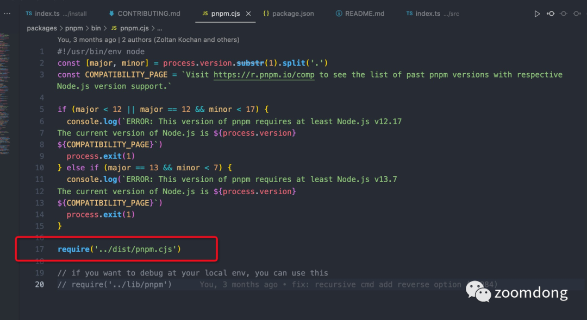
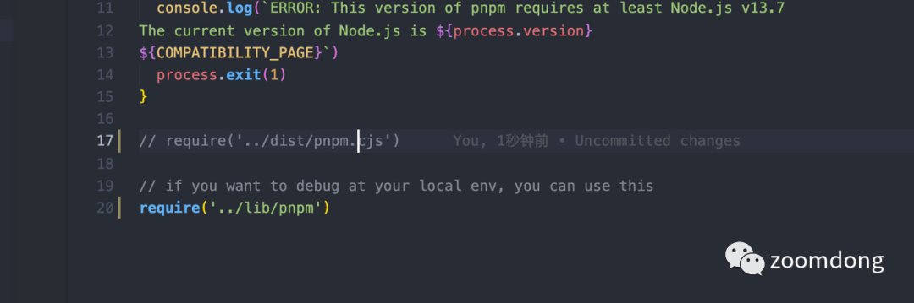
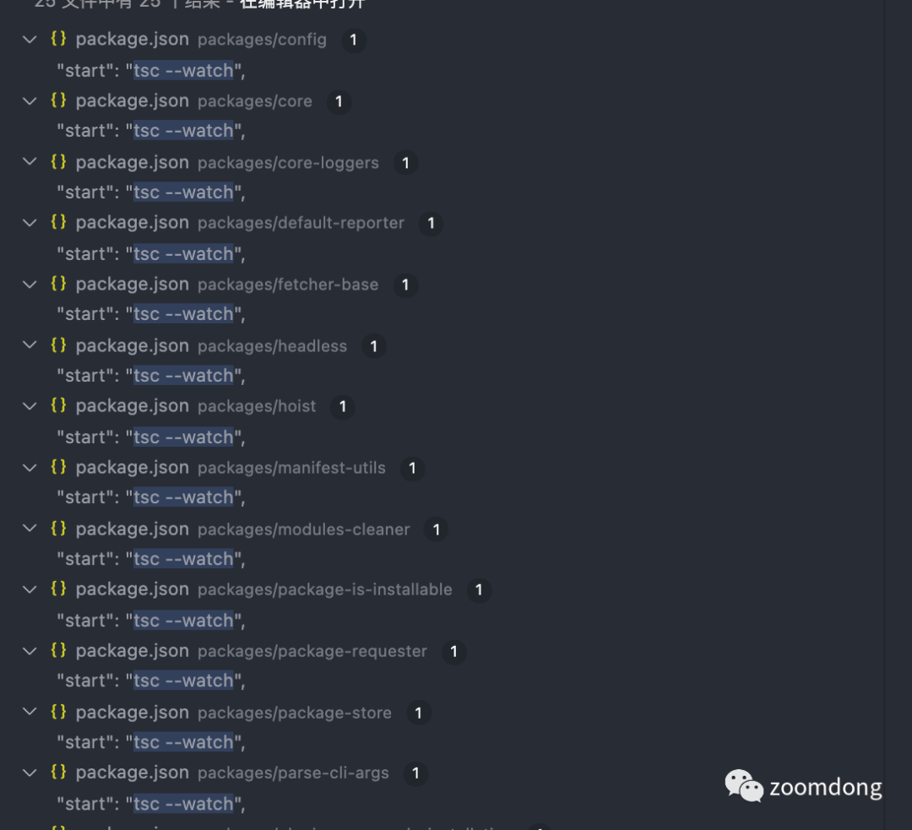
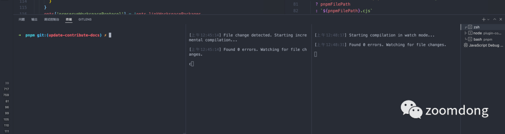
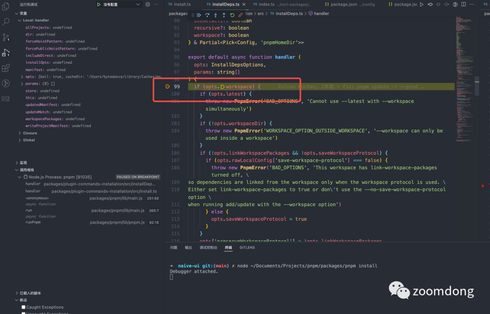
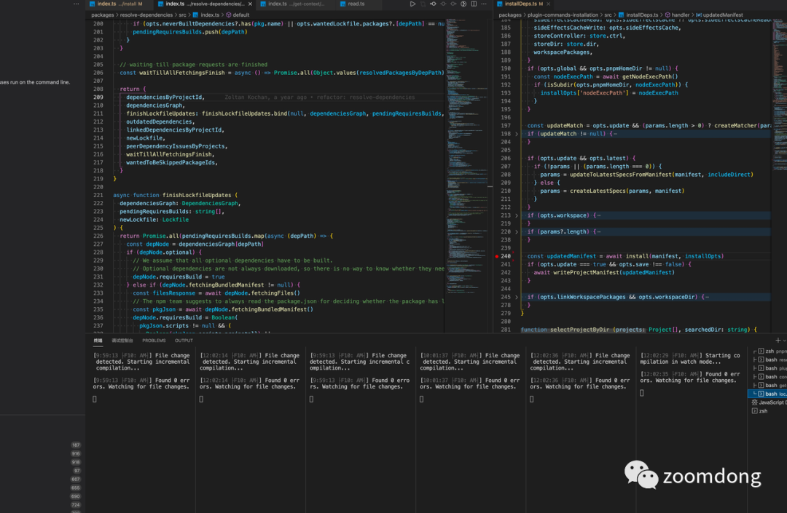

[TOC]

# [以 pnpm 为例谈谈如何调试大型项目 (qq.com)](https://mp.weixin.qq.com/s/S2Ao5eq6aRLn4oTp_GUQbQ)

## 前言

Hi～又是一段时间没有更新了。前几天 `stateof js 2021` 的调查结果发布了，今年在里面增加了关于 monorepo tools 的调查报告(参考链接: https://2021.stateofjs.com/en-US/libraries/monorepo-tools )。

其中 pnpm 一举登顶 2021 年最受欢迎的 monorepo 工具链。同时在用户使用广度以及其他方面也取得了不错的成绩。


刚好前段时间调试过一阵子 pnpm 以及贡献过一些代码，因此笔者对 pnpm 的结构也算有些了解，这篇文章将在笔者的理解范围之内给大家做一个代码结构解析，如果有问题可以直接指出来，一起探讨学习。

## 源码结构介绍

首先 pnpm 的代码主要集中在根目录下的 `packages` 目录中，pnpm 自身所采用的以 pnpm workspace 作为 monorepo 的管理工具，其里面的一些模块都是作为一个个独立的子包存在于 packages 目录下面。

因为 pnpm 本身的 monorepo 主要管理的都是一些工具库相关的子包，因此其采用的发包方案正是 changesets，具体可以参考我之前的文章: [https://mp.weixin.qq.com/s/DkXmsAGcT6_xl‍ePYgqy4Rw。](http://mp.weixin.qq.com/s?__biz=MzkyNjE5NDY5NQ==&mid=2247483749&idx=1&sn=0b7f5ab1ff2fcb0303c4191b9f3c5c6c&chksm=c23a4c0df54dc51bcf6065deee902aa94b86f31ba82b7c33704c9c1cb85accdb87660d737a45&scene=21#wechat_redirect)

packages 下各个子包的具体目录结构可以参考以下的结构:

```
.
// 依赖安装的核心逻辑代码包
├── core
// 核心包的日志输出包
├── core-loggers
// 日志打印的包
├── default-reporter
// 解析依赖包路径的包(包括软链接的情况等)
├── dependency-path
// filter 逻辑相关的包
├── filter-workspace-packages
// monorepo 下 package、workspace 相关的包
├── find-packages
├── find-workspace-dir
├── find-workspace-packages
// git 相关的工具包
├── git-fetcher
├── git-resolver
// 处理依赖提升的工具包
├── hoist
// 生命周期相关的包
├── lifecycle
// lock 文件相关的一些工具包
├── lockfile-file
├── lockfile-to-pnp
├── lockfile-types
├── lockfile-utils
├── lockfile-walker
// 处理 npm registry 相关、以及解析对应 npm 包的包
├── normalize-registries
├── npm-registry-agent
├── npm-resolver
// 处理 cli 参数相关的包
├── parse-cli-args
// 解析依赖
├── parse-wanted-dependency
// monorepo 生成依赖图相关包
├── pkgs-graph
// plugin-commands 包都是涉及对应子命令逻辑相关
├── plugin-commands-audit
├── plugin-commands-env
├── plugin-commands-installation
├── plugin-commands-listing
├── plugin-commands-outdated
├── plugin-commands-publishing
├── plugin-commands-script-runners
├── plugin-commands-server
├── plugin-commands-setup
├── plugin-commands-store
// pnpm 整个项目主包
├── pnpm
// 读项目 .pnpmfile.cjs 的包
├── pnpmfile
// 读项目的 pkg.json 工具包
├── read-project-manifest
// 用于提升 pnpm 中的项目依赖的包(类似于 yarn 的方式)
├── real-hoist
// 可视化输出依赖安装过程中的 peerDep 问题包
├── render-peer-issues
// 依赖安装过程中解析依赖使用
├── resolve-dependencies
// 
├── resolve-workspace-range
├── resolver-base
// 用于降级命令到 npm 相关逻辑的包
├── run-npm
// 根据 pkg-graph 对子包进行排序
├── sort-packages
// 硬链接 store 管理相关的包
├── store-connection-manager
├── store-controller-types
// 将依赖添软链接到 node_modules 的包
├── symlink-dependency
// npm 压缩包的抓取以及解析的包
├── tarball-fetcher
├── tarball-resolver
// 写 pkg.json 的包
├── write-project-manifest
└── ...
```

pnpm 本身内部有很多的包，上面树状架构中，我已经省略掉了一些不常用到或者说是接近废弃的包(即便如此，仍然还是存在很多很多的包...)。

这里我主要根据 pnpm 官网中的各命令行来对代码结构做个介绍，其实也有很多命令封装使用到了相同模块的代码。例如 `install` 、`update` 、`add` 等命令。

### 主入口

首先 pnpm 整个项目的主入口包文件为 `packages/pnpm` 这个包里面，这个包名称也直接叫做 `pnpm` ，其中 `main.ts` 文件是其入口文件，这个文件会处理掉用户传进来的一些参数，然后根据处理后的不同的参数对各命令做一个下发执行工作，下发后的命令参数再到各个包里面去，从而执行里面对应的逻辑。

处理参数用到的包为 `@pnpm/parse-cli-args` ，它会接收到用户传递进来的命令行参数，然后将其处理成一个 pnpm 内部的统一格式，例如用户输入如下命令:

```
pnpm add -D axios
```

这里传进来的一些参数都会被 `parseCliArgs` 这个方法处理:

例如 `add` 会被处理给 `cmd` 字段，一些裸的参数例如 `axios` 会被放进 `cliParams` 这个数组中，`-D` 这个参数在 `cliOptions` 里面去。处理后的这些变量以及参数用于主入口文件后续代码执行逻辑的判断。具体的判断逻辑可以在调试的时候遇到了，再去看对应的入口逻辑判断调试即可，这里不做具体的介绍。

入口包里还会用到的内部包有 `@pnpm/find-workspace-packages` 以及 `@pnpm/filter-workspace-packages` 。

- `findWorkspacePackages` 在入口文件中用于找到 pnpm workspace(适用于 monorepo 项目)中所有包的一些信息(例如名称、路径等)。

- `filterPackages` 相对而言来说是个比较关键的包，pnpm 官方有一篇文档专门介绍了 `--filter` 这一功能模块(参考: https://pnpm.io/filtering)，它为几乎所有的 pnpm 命令提供了一个很简单且实用的筛选功能，根据用户传递进来的筛选参数对 monorepo 下的子包进行一个筛选，会根据筛选参数(例如 `...`)输出帅选出来的对应包以及相关信息。

在 `main.ts` 中会通过调用当前包下面的 `cmd` 目录下面的方法(`pnpmCmds`)，来完成各命令的分发。

- 如果 cmd 值为 `add` 、`install` 、`update` 等这些涉及和依赖安装相关的包，则会走 `@pnpm/plugin-commands-installation` 这个包里面对应的子命令逻辑(基本上 pnpm 所有的核心模块都围绕依赖安装这一块展开)。

- 如果 cmd 值为 `pack` 、`publish` 这一类涉及到打包发布的包，则会走 `@pnpm/plugin-commands-publishing` 这个包的逻辑。

- 如果 cmd 值为 `run` 、`exec` 、 `dlx` 等这些和命令执行相关的方法，则会走 `@pnpm/plugin-commands-script-runners` 这个包的逻辑。

这里更多相关的逻辑参考 `pnpm/src/cmd` 这一块的命令挂载详情。

下面我会根据官网的 CLI commands 来对这里面涉及到的逻辑进行一个讲解。

### 依赖管理

这部分可以说是整个 pnpm 最核心的一部分了，其中涉及到了 `pnpm install`、`pnpm add ` 等依赖管理相关的核心命令。

在上一节提到这一块的逻辑主要在 pnpm 下的 `@pnpm/plugin-commands-installation` 这个包中完成，这里只是简单介绍一下这一块的逻辑以及引用到的包，并不做具体的讨论，因为关于 pnpm 的依赖安装原理真的要结合代码去介绍原理的话，是可以再去写一整篇文章的。

这一块依赖管理的核心逻辑是在对应包目录下的 `src/installDeps` 这个目录下，几乎所有依赖相关的命令最后的逻辑都会在这里中转执行，可以看到包括 `install` 、`add` 、`update` 命令的核心逻辑都会在这一块执行。具体还是根据用户传递进来的参数进行逻辑转换:

```
 const result = await mutateModules([
  {
    ...mutatedProject,
    dependencySelectors,
    manifest: updatedImporter.manifest,
    peer: false,
    targetDependenciesField: 'devDependencies',
  },
], installOpts)
```

这里简单截取一下对应的依赖安装执行逻辑调用的方法，这里的 `mutateModules` 方法来自于包 `@pnpm/core` ，该包为整个 pnpm 项目的核心包，一些关键性的核心逻辑(例如依赖安装等)都是在这里实现，具体看实现可以参考源码。

依赖管理这里还会涉及到一些其他的包:

- 用于处理 lifeCycle 方法的 `@pnpm/lifecycle`

- 输出日志(例如依赖安装过程中的日志打印)的 `@pnpm/core-loggers` 、`@pnpm/logger`

- 依赖安装过程中生成、更新 pnpm-lock.yaml 文件的 `@pnpm/lockfile-file`

- 依赖安装过程中解析依赖并拉取依赖包的 `@pnpm/resolve-dependencies`

之前笔者在调试 `pnpm update` 的一个 bug 的时候，就是从 `plugin-command-installation` 到 `resolve-dependencies` 一步步抽丝剥茧，最后找到问题出现在一个库函数的语句处理里面，具体可以参考 pr: https://github.com/pnpm/pnpm/pull/4243。

## 调试技巧

如果你想调试 pnpm 的话，其实在 pnpm 的源码仓库下面有个 `CONTRIBUTING.md` 文档，里面比较推荐的方式是使用 `pnpm run compile` 对项目子包进行一个整体的编译，然后通过 `node /packages/pnpm [command]` 的方式进行调试。

但实际上这种方式效率比较低下，很多时候代码修改了，调试的时候并不符合预期，修改完成之后又需要再次修改代码进行重新编译。

之前有一段时间调试 pnpm 的经历，这里给大家分享一下我个人的一些调试经验。

在 `packages/pnpm` 的 bin 目录下有个 `pnpm.cjs` 文件，里面的 `require` 方法指定了 pnpm 在执行的时候走那一块的逻辑:



这里默认的逻辑走的是打包后的 `dist` 目录下的代码逻辑，pnpm 的 compile 每次编译产物的默认目录都是在 dist 目录，但这里如果只是调试的话，我们其实可以完全不走 dist 目录下的产物代码逻辑。

之前笔者给 pnpm 提过一个 pr，在下面加上了一段用于走本地产物代码，在上面截图中也可以看到，这里调试的时候只需要注释掉走 `dist` 代码的那段逻辑，然后去走 `lib` 目录下的代码即可:



同时目前基本上 pnpm 下大部分正在维护的子包使用 typescipt 在开发，笔者之前还给一些库补上了 `tsc --watch` 命令:



因此如果想通过一种即时编译的方式去调试 pnpm 源码的话，可以直接到对应的子包下面将对应子包的 start 命令给 run 起来。然后针对不同的子包去进行一个调试的工作。以下为笔者的一个调试流程，可以提供来参考。

## 调试流程

例如调试 pnpm 下面的一个子包，以 `@pnpm/plugin-commands-installation` 为例子。

首先可以对整个包代码执行一次全量的编译，防止有些包代码同步之后本地产物没更新，直接在整个项目的根目录下执行一次:

```
pnpm run compile
```

这次时间可能会比较久一点，但能保证后面一些被引用到的包且我们不去调试包的产物是最新的，防止出现一些包出现 `require` 不到的问题。

然后直接 `cd` 到需要调试的包目录下面，同时主包也要 run 起来，注意这里要把上一节提到的入口代码修改好。这里笔者一般是起多个终端进程，然后将该包的 ts 编译 run 起来:

```
cd packages/pnpm && npm run start
cd packages/plugin-commands-installation && npm run start
```



接下来就可以找个真实的 pnpm 项目来进行调试了。

例如这里以 naive-ui (https://www.naiveui.com/)这个项目(使用 pnpm 作为依赖管理)作为例子，这里可以在 `plugin-commands-installation` 中需要调试的代码打上断点，然后通过 vscode 的 `debug terminal` 来进行调试:

```
# 在调试项目的目录下，例如笔者这里是 naive-ui
node ~/path/to/pnpm/packages/pnpm install
```

这样通过 node 直接到指定的 pnpm 源文件目录去进行调试，这时命令就会分发到对应代码逻辑里面去，前面设置的断点就会很快生效。参考如图:



这样就可以相对简洁且能直接针对源码进行调试了，如果有代码修改也可以在源码里面修改之后直接进行调试。

不过这样调试也有个缺点，例如调试依赖层级比较深的库的时候，会出现同时起很多进程的现象，例如下图为笔者调试 pnpm 依赖安装流程时，对各个库进行断点观察的图:



图中一共起了 6 个进程，但总的来说的话，还是要比去构建产物里面进行调试找问题要简洁明了得多。

## 总结

目前 pnpm 已经在 2021 年取得了不俗的成绩，期待 2022 年这一年同样也能带来更多惊喜的 feature。同时也期待越来越多的 contributor 能参与到 pnpm 的源码建设中来，一起共同建设可能是未来最有前景的包管理工具。

也喜欢这篇文章能给大家带来收获，期待越来越好~
