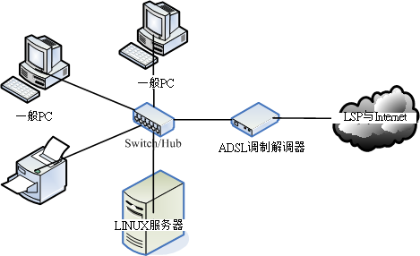
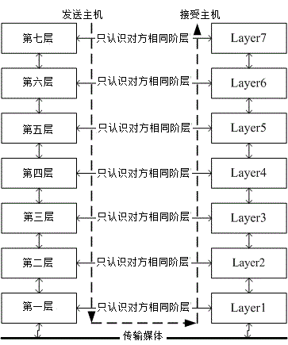
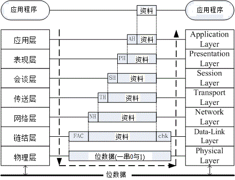
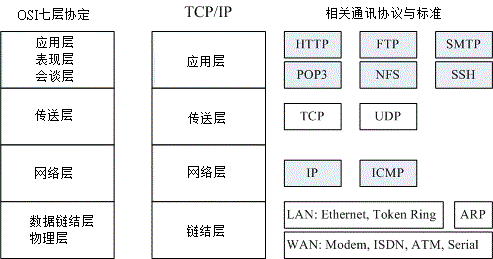

[TOC]

## 网络是个什么玩意儿

全世界的人种有很多，人类使用的语言种类也多的很。那如果你想要跟外国人沟通时，除了比手划脚之外，你要如何跟对方讲话？ 大概只有两种方式啰，一种是强迫他学中文，一种则是我们学他的语言，这样才能沟通啊。在目前世界上的强势语言还是属于英语系国家， 所以啰，不管是啥人种，只要学好英文，那么大家都讲英文，彼此就能够沟通了。希望不久的未来，咱们的中文能够成为强势语言啊！

这个观念延伸到网络上面也是行的通的，全世界的操作系统多的很，不是只有 Windows/Linux 而已，还有苹果计算机自己的操作系统， Unix like 的操作系统也非常多！那么多的操作系统 (人种) 要如何进行网络沟通 (语言) 呢？那就得要制订共同遵守的标准才行了。这个标准是由国际组织规范的，你的系统里面只要提供可以加入该标准的程序代码， 那你就能够透过这个标准与其他系统进行沟通！所以啰，网络是跨平台的，并不是只有 Linux 才这么做！因此，这部份的资料你学完后，是可以应用在所以操作系统上面的！观念都相同啊！

另外，这一个章节旨在引导网络新鲜人快速进入网络的世界，所以鸟哥写的比较浅显一些些，基本上， 还有一堆网络硬件与通讯协议并没有被包含在这篇短文里头。如果你的求知欲已经高过本章节， 那么请自行到书局寻找适合你自己的书籍来阅读！当然，你也可以在因特网上面找到你所需要的数据。 在本章最后的[参考数据](http://cn.linux.vbird.org/linux_server/0110network_basic_1.php#reference)可以瞧一瞧吶！

### 什么是网络

我们都知道，网络就是几部计算机主机或者是网络打印机之类的接口设备， 透过网络线或者是无线网络的技术，将这些主机与设备连接起来， 使得数据可以透过网络媒体(网络线以及其他网络卡等硬件)来传输的一种方式。 请你想象一下，如果你家里面只有计算机、打印机、传真机等机器，却没有网络连接这些硬件， 那么使用上会不会很麻烦？如果将这个场景移到需要工作的办公室时， 计算机的数据无法使用网络连接到打印机来打印，那是否很伤脑筋呢？ 对吧！光用想的就觉得很麻烦吧！不幸的是，这些麻烦事在 1970 年代以前，确实是存在的啊！

- **各自为政的『网络硬件与软件』技术发展： Ethernet & Token-Ring**

  在 1970 年代前后，为了解决这个烦人的数据传输问题，各主要信息相关的公司都在研究各自的网络连接技术， 以使自家的产品可以在办公室的环境底下组织起来。其中比较有名的就是全录公司的 Ethernet 技术， 以及 IBM 研发的 Token-Ring 技术了。但是这些技术有个很大的问题，那就是它们彼此不认识对方的网络技术！ 也就是说，万一你的办公室购买了整合 Ethernet 技术的计算机主机，但是其他的计算机却是使用 IBM 的机器时， 想要在这两者之间进行数据的沟通，在早期来说那是不可能的。

  

- **以『软件』技术将硬件整合： ARPANET & TCP/IP**

  为了解决上述的网络硬件整合功能，所以在 1960 年代末期美国国防部就开始研究一个可以在这些不同的网络硬件上面运作的软件技术， 使得不同公司的计算机或数据可以透过这个软件来达成数据沟通。这个研究由美国国防部尖端研究企画署 (Defense Advanced Research Project Agency, DARPA) 负责，他们将该网络系统称为 ARPANET， 这个咚咚就是目前熟知的 TCP/IP 技术的雏形了！在 1975 年左右， ARPANET 已可以在常见的 Ethernet 与 Token-Ring 等硬件平台底下互通数据了。DARPA 在 1980 年正式推出 TCP/IP 技术后， 由于想要推展此项技术，因此与柏克莱 (Berkeley) 大学合作，将 TCP/IP 植入著名的 BSD Unix 系统内， 由于大学乃是未来人才数据库的培养处，所以， TCP/IP 这项技术便吸引越来越多使用者的投入， 而这种连接网络的技术也被称之为 Internet ([注1](http://cn.linux.vbird.org/linux_server/0110network_basic_1.php#ps1))。

  

- **没有任何王法的因特网： Internet**

  现在我们知道 Internet 就是使用 TCP/IP 的网络连接技术所串联起来的一个网络世界， 而这个 Internet 在 1980 年代之后由于对 email 的需求以及浏览器图形接口的兴起，因此快速的蔓延在计算机世界中。 但是， Internet 有没有人在管理啊？很不巧的是， Internet 是一个管理相当松散的所在。 只要你能够使用任何支持 TCP/IP 技术的硬件与操作系统，并且实际连接上网络后， 你就进入 Internet 的世界了。在该世界当中，没有任何王法的保护，你的实际数据如果接上 Internet ， 在任何时刻都需要自己保护自己，免得中了『流弹』而受伤啊！

  为甚么说 Internet 没有王法呢？这是因为 Internet 仅是提供一个网络的连接接口， 所以你只要连接上 Internet 后，全世界都可以任你遨游，不过也因为如此，『跨海』而来的攻击就成了简单的事件， 简单说，台湾的法律仅适用台湾地区对吧？但是计算机怪客 (cracker) 可以在国外透过 Internet 对你的主机进行攻击， 我们的法律可管不到国外地区啊！虽然可以透过很多国际管道来寻求协助，不过，还是很难协助你缉拿凶手的啊。 因此啰，在你的主机要连上 Internet 之前，请先询问自己，真的有需要连上 Internet 吗？^_^

  

- 软硬件标准制定的成功带来的影响： IEEE 标准规范

  现在我们常常听到『你要上网啊！那你要去买网络卡喔！还得要连接到 Internet 才行啊！』 这个网络卡就是市面上随处可见的一个适配卡而已，至于 Internet 则是去向 Hinet/Seed net 或 其他网络服务提供公司 (Internet Service Provider, ISP) 申请的账号密码。 问题是，是否就只有透过网络卡与 Internet 才能上网啊？呵呵！当然不是！其他不同的网络硬件与软件可多着那！ 不过，最成功的却是以太网络 (Ethernet) 与 Internet ，这是为甚么呢？这两者的技术比较好吗？ 当然不是！这是因为这两者都被『标准』所支持的缘故(注2)。

  以太网络最初是由全录公司 (Xerox PARC) 所建构出来的，而后透过 DEC, Intel 与 Xerox 合作将以太网络标准化。 再经由 IEEE (Institute of Electrical and Electronic Engineers [注3](http://cn.linux.vbird.org/linux_server/0110network_basic_1.php#ps3)) 这个国际著名的专业组织利用一个 802 的项目制定出标准，之后有 19 家公司宣布支持 IEEE 所发布的 802.3 标准， 并且到了 1989 年国际标准化组织 ISO (International Organization for Standard) 将以太网络编入 IS88023 标准， 呵呵！这表示以太网络已经是一项公认的标准接口了，如此一来，大家都可以依据这个标准来设定与开发自己的硬件， 只要硬件符合这个标准，理论上，他就能够加入以太网络的世界，所以，购买以太网络时， 仅需要查看这个以太网络卡支持哪些标准就能够知道这个硬件的功能有哪些， 而不必知道这个以太网络卡是由哪家公司所制造的吶。

> Tips: 标准真的是个很重要的东西，真要感谢这些维护标准的专业组织。当有公司想要开发新的硬件时， 它可以参考标准组织所发布与维护的文件资料，透过这些文件数据后，该公司就知道要制作的硬件需要符合哪些标准， 同时也知道如何设计这些硬件，让它可以『兼容』于目前的机器，让使用者不会无所适从啊。 包括软件也有标准，早期 Linux 在开发时就是透过了解 POSIX 这个标准来设计核心的， 也使得 Linux 上面可以执行大多数的标准接口软件呢！你说，标准是否真的很重要啊！

  除了硬件之外，TCP/IP 这个 Internet 的通讯协议也是有标准的，这些标准大部分都以 RFC (Request For Comments, 注4) 的形式发布标准文件。 透过这些文件的辅助，任何人只要会写程序语言的话，就有可能发展出自己的 TCP/IP 软件， 并且连接上 Internet 。早期的 Linux 为了要连接上 Internet ，Linux 团队就自己撰写出 TCP/IP 的程序代码， 透过的就是这些基础文件的标准依据啊！举例来说 RFC 1122 (注5) 这个建议文件就指出一些可以联机到 Internet 的主机应该要注意的相关协议与基本需求， 让想要撰写联机程序的设计师可以有一个指引的标准方向。

------

### 计算机网络组成组件

接下来，让我们来谈谈那么组成计算机网络的组件有哪些呢？这些组件的定义为何啊？我们得要先知道有哪些硬件嘛！ 接下来才好理解啊。在这里，我们以底下这张联机示意图来解释好了：

图 2.1-1、计算机网络联机示意图

在上图中，我们主要需要注意到的硬件有哪些呢？大致有底下这些啦：

- 节点 (node)：节点主要是具有网络地址 (IP) 的设备之称， 因此上面图示中的一般PC、Linux服务器、ADSL调制解调器与网络打印机等，个别都可以称为一个 node ！ 那中间那个集线器 (hub) 是不是节点呢？因为他不具有 IP ，因此 hub 不是节点。

  

- 服务器主机 (server)：就网络联机的方向来说，提供数据以『响应』给用户的主机， 都可以被称为是一部服务器。举例来说，Yahoo 是个 WWW 服务器，昆山的 FTP (http://ftp.ksu.edu.tw/) 是个文件服务器等等。

  

- 工作站 (workstation) 或客户端 (client)：任何可以在计算机网络输入的设备都可以是工作站， 若以联机发起的方向来说，主动发起联机去『要求』数据的，就可以称为是客户端 (client)。举例来说，一般 PC 打开浏览器对 Yahoo 要求新闻数据，那一般 PC 就是客户端。

  

- 网络卡 (Network Interface Card, NIC)：内建或者是外插在主机上面的一个设备， 主要提供网络联机的卡片，目前大都使用具有 RJ-45 接头的以太网络卡。一般 node 上都具有一个以上的网络卡， 以达成网络联机的功能。

  

- 网络接口：利用软件设计出来的网络接口，主要在提供网络地址 (IP) 的任务。 一张网卡至少可以搭配一个以上的网络接口；而每部主机内部其实也都拥有一个内部的网络接口，那就是 loopback (lo) 这个循环测试接口！

  

- 网络形态或拓朴 (topology)：各个节点在网络上面的链接方式，一般讲的是物理连接方式。 举例来说，上图中显示的是一种被称为星形联机 (star) 的方式，主要是透过一个中间连接设备， 以放射状的方式连接各个节点的一种形态，这就是一种拓朴。

  

- 网关 (route) 或通讯闸 (gateway)：具有两个以上的网络接口， 可以连接两个以上不同的网段的设备，例如 IP 分享器就是一个常见的网关设备。那上面的 ADSL 调制解调器算不算网关呢？ 其实不太能算，因为调制解调器通常视为一个在主机内的网卡设备，我们可以在一般 PC 上面透过拨号软件， 将调制解调器仿真成为一张实体网卡 (ppp) ，因此他不太能算是网关设备啦！

网络设备其实非常多也非常复杂，不过如果以小型企业角度来看，我们能够了解上述图示内各设备的角色，那应该也足够啰！ 接下来，让我们继续来讨论一下网络范围的大小吧！

------

### 计算机网络区域范围

由于各个节点的距离不同，联机的线材与方式也有所差异，由于线材的差异也导致网络速度的不同，让网络的应用方向也不一样。 根据这些差异，早期我们习惯将网络的大小范围定义如下：([注6](http://cn.linux.vbird.org/linux_server/0110network_basic_1.php#ps6))

- **局域网络 (Local Area Network, LAN)**：
  节点之间的传输距离较近，例如一栋大楼内，或一个学校的校区内。可以使用较为昂贵的联机材料， 例如光纤或是高质量网络线 (CAT 6) 等。网络速度较快，联机质量较佳且可靠，因此可应用于科学运算的丛集式系统、 分布式系统、云端负荷分担系统等。

  

- **广域网 (Wide Area Network, WAN)**：
  传输距离较远，例如城市与城市之间的距离，因此使用的联机媒体需要较为便宜的设备，例如经常使用的电话线就是一例。 由于线材质量较差，因此网络速度较慢且可靠性较低一些，网络应用方面大多为类似 email, FTP, WWW 浏览等功能。

除了这两个之外，还有所谓的都会网络 (Metropolitan Area Network, MAN)，不过近来比较少提及，因此你只要知道有 LAN 及 WAN 即可。这两个名词在很多地方你都可以看的到喔！改天你回家看看你家的 ADSL 调制解调器或 IP 分享器后面的插孔看看，你就能够看到有 WAN 与 LAN 的插孔，现在你就知道为啥有这两个灯号与插孔了吧。

一般来说，LAN 指的是区域范围较小的环境，例如一栋大楼或一间学校，所以在我们生活周遭有着许许多多的 LAN 存在。 那这些 LAN 彼此串接在一起，全部的 LAN 串在一块就是一个大型的 WAN 啰！简单的说，就是这样分。

不过，现在的环境跟以前不一样了，举例来说，前几天刚刚宣布 (2011/07)，光纤的速度已经可以到达 100Mbps/10Mbps 的下载/上传带宽了！再举例来说，台湾的学术网络通通是串在一块的，鸟哥在台南昆山联机到高雄义守大学下载 CentOS 映像档时，你猜下载的速度有多快？每秒钟可高达 100Mbps 左右！这已经是一个内部区网的速度了！所以，用以前的观点来看， 其实对目前的网络环境有点不符现象了。因此，目前你可以使用『速度』作为一个网络区域范围的评量。 或许现在我们可以说，整个台湾的学术网络 (TANET, [注7](http://cn.linux.vbird.org/linux_server/0110network_basic_1.php#ps7)) 可以视为是一个局域网络呢！

------

### 计算机网络协议： OSI 七层协定

谈完了网络需要制订的标准、网络联机的组件以及网络的范围之后，接下来就是要讲到，那么各个节点之间是如何沟通讯息的呢？ 其实就是透过标准的通讯协议啦！但是，整个网络连接的过程相当复杂，包括硬件、软件数据封包与应用程序的互相链接等等， 如果想要写一支将联网全部功能都串连在一块的程序，那么当某个小环节出现问题时，整只程序都需要改写啊！真麻烦！

那怎办？没关系，我们可以将整个网络连接过程分成数个阶层 (layer)，每个阶层都有特别的独立的功能， 而且每个阶层的程序代码可以独立撰写，因为每个阶层之间的功能并不会互相干扰的。 如此一来，当某个小环节出现问题时，只要将该层级的程序代码重新撰写即可。所以程序撰写也容易，整个网络概念也就更清晰！ 那就是目前你常听到的 OSI 七层协定 (Open System Interconnection) 的概念啰！

如果以图示来说，那么这七个阶层的相关性有点像底下这样：

图 2.1-2、OSI 七层协议各阶层的相关性

依据定义来说，越接近硬件的阶层为底层 (layer 1)，越接近应用程序的则是高层 (layer 7)。 不论是接收端还是发送端，每个一阶层只认识对方的同一阶层数据。 而整个传送的过程就好像人们在玩整人游戏一般，我们透过应用程序将数据放入第七层的包裹，再将第七层的包裹放到第六层的包裹内， 依序一直放到第一层的最大的包裹内，然后传送出去给接收端。接收端的主机就得由第一个包裹开始，依序将每个包裹拆开， 然后一个一个交给对应负责的阶层来视察！这就是整人游戏...喔！是 OSI 七层协议在阶层定义方面需要注意的特色。

既然说是包裹，那我们都知道，包裹表面都会有个重要的信息，这些信息包括有来自哪里、要去哪里、接收者是谁等等， 而包裹里面才是真正的数据。同样的，在七层协议中，每层都会有自己独特的表头数据 (header)，告知对方这里面的信息是什么， 而真正的数据就附在后头啰！我们可以使用如下的图示来表示这七层每一层的名字，以及数据是如何放置到每一层的包裹内：

图 2.1-3、OSI 七层协议数据的传递方式

上图中仔细看每个数据报的部分，上层的包裹是放入下层的数据中，而数据前面则是这个数据的表头。其中比较特殊的是第二层， 因为第二层 (数据链结层) 主要是位于软件封包 (packet) 以及硬件讯框 (frame) 中间的一个阶层， 他必须要将软件包装的包裹放入到硬件能够处理的包裹中，因此这个阶层又分为两个子层在处理相对应的数据。 因为比较特殊，所以您瞧瞧，第二层的数据格式比较不一样喔，尾端还出现一个检查码哩～

每一个阶层所负责的任务是什么呢？简单的说，每一层负责的任务如下：([注6](http://cn.linux.vbird.org/linux_server/0110network_basic_1.php#ps6), [注8](http://cn.linux.vbird.org/linux_server/0110network_basic_1.php#ps8), [注9](http://cn.linux.vbird.org/linux_server/0110network_basic_1.php#ps9))

| 分层                               | 负责内容                                                     |
| ---------------------------------- | ------------------------------------------------------------ |
| Layer 1 物理层 Physical Layer      | 由于网络媒体只能传送 0 与 1 这种位串，因此物理层必须定义所使用的媒体设备之电压与讯号等， 同时还必须了解数据讯框转成位串的编码方式，最后连接实体媒体并传送/接收位串。 |
| Layer 2 数据链结层 Data-Link Layer | 这一层是比较特殊的一个阶层，因为底下是实体的定义，而上层则是软件封装的定义。因此第二层又分两个子层在进行数据的转换动作。 在偏硬件媒体部分，主要负责的是 MAC (Media Access Control) ，我们称这个数据报裹为 MAC 讯框 (frame)， MAC 是网络媒体所能处理的主要数据报裹，这也是最终被物理层编码成位串的数据。MAC 必须要经由通讯协议来取得媒体的使用权， 目前最常使用的则是 IEEE 802.3 的以太网络协议。详细的 MAC 与以太网络请参考下节说明。  至于偏向软件的部分则是由逻辑链接层 (logical link control, LLC) 所控制，主要在多任务处理来自上层的封包数据 (packet) 并转成 MAC 的格式， 负责的工作包括讯息交换、流量控制、失误问题的处理等等。 |
| Layer 3 网络层 Network Layer       | 这一层是我们最感兴趣的啰，因为我们提及的 IP (Internet Protocol) 就是在这一层定义的。 同时也定义出计算机之间的联机建立、终止与维持等，数据封包的传输路径选择等等，因此这个层级当中最重要的除了 IP 之外，就是封包能否到达目的地的路由 (route) 概念了！ |
| Layer 4 传送层 Transport Layer     | 这一个分层定义了发送端与接收端的联机技术(如 TCP, UDP 技术)， 同时包括该技术的封包格式，数据封包的传送、流程的控制、传输过程的侦测检查与复原重新传送等等， 以确保各个数据封包可以正确无误的到达目的端。 |
| Layer 5 会谈层 Session Layer       | 在这个层级当中主要定义了两个地址之间的联机信道之连接与挂断，此外，亦可建立应用程序之对谈、 提供其他加强型服务如网络管理、签到签退、对谈之控制等等。如果说传送层是在判断资料封包是否可以正确的到达目标， 那么会谈层则是在确定网络服务建立联机的确认。 |
| Layer 6 表现层 Presentation Layer  | 我们在应用程序上面所制作出来的数据格式不一定符合网络传输的标准编码格式的！ 所以，在这个层级当中，主要的动作就是：将来自本地端应用程序的数据格式转换(或者是重新编码)成为网络的标准格式， 然后再交给底下传送层等的协议来进行处理。所以，在这个层级上面主要定义的是网络服务(或程序)之间的数据格式的转换， 包括数据的加解密也是在这个分层上面处理。 |
| Layer 7 应用层 Application Layer   | 应用层本身并不属于应用程序所有，而是在定义应用程序如何进入此层的沟通接口，以将数据接收或传送给应用程序，最终展示给用户。 |

事实上， OSI 七层协议只是一个参考的模型 (model)，目前的网络社会并没有什么很知名的操作系统在使用 OSI 七层协定的联网程序代码。那...讲这么多干嘛？这是因为 OSI 所定义出来的七层协议在解释网络传输的情况来说， 可以解释的非常棒，因此大家都拿 OSI 七层协议来做为网络的教学与概念的理解。至于实际的联网程序代码，那就交给 TCP/IP 这个玩意儿吧！

------

### 计算机网络协议： TCP/IP

虽然 OSI 七层协议的架构非常严谨，是学习网络的好材料。但是也就是因为太过严谨了，因此程序撰写相当不容易， 所以造成它在发展上面些许的困扰。而由 ARPANET 发展而来的 TCP/IP 又如何呢？其实 TCP/IP 也是使用 OSI 七层协议的观念， 所以同样具有分层的架构，只是将它简化为四层，在结构上面比较没有这么严谨，程序撰写会比较容易些。后来在 1990 年代由于 email, WWW 的流行，造成 TCP/IP 这个标准为大家所接受，这也造就目前我们的网络社会啰！

既然 TCP/IP 是由 OSI 七层协议简化而来，那么这两者之间有没有什么相关性呢？它们的相关性可以图示如下， 同时这里也列出目前在这架构底下常见的通讯协议、封包格式与相关标准：

图 2.1-4、OSI 与 TCP/IP 协议之相关性

从上图中，我们可以发现 TCP/IP 将应用、表现、会谈三层整合成一个应用层，在应用层上面可以实作的程序协议有 HTTP, SMTP, DNS 等等。 传送层则没有变，不过依据传送的可靠性又将封包格式分为连接导向的 TCP 及非连接导向的 UDP 封包格式。网络层也没有变，主要内容是提供了 IP 封包，并可选择最佳路由来到达目标 IP 地址。数据链结层与物理层则整合成为一个链结层，包括定义硬件讯号、 讯框转位串的编码等等，因此主要与硬件 (不论是区网还是广域网) 有关。

那 TCP/IP 是如何运作的呢？我们就拿妳常常连上的 Yahoo 入口网站来做个说明好了，整个联机的状态可以这样看：

1. 应用程序阶段：妳打开浏览器，在浏览器上面输入网址列，按下 [Enter]。此时网址列与相关数据会被浏览器包成一个数据， 并向下传给 TCP/IP 的应用层；
2. 应用层：由应用层提供的 HTTP 通讯协议，将来自浏览器的数据报起来，并给予一个应用层表头，再向传送层丢去；
3. 传送层：由于 HTTP 为可靠联机，因此将该数据丢入 TCP 封包内，并给予一个 TCP 封包的表头，向网络层丢去；
4. 网络层：将 TCP 包裹包进 IP 封包内，再给予一个 IP 表头 (主要就是来源与目标的 IP 啰)，向链结层丢去；
5. 链结层：如果使用以太网络时，此时 IP 会依据 CSMA/CD 的标准，包裹到 MAC 讯框中，并给予 MAC 表头，再转成位串后， 利用传输媒体传送到远程主机上。

等到 Yahoo 收到你的包裹后，在依据相反方向拆解开来，然后交给对应的层级进行分析，最后就让 Yahoo 的 WWW 服务器软件得到你所想要的数据，该服务器软件再根据你的要求，取得正确的资料后，又依循上述的流程，一层一层的包装起来， 最后传送到你的手上！就是这样啰！

根据这样的流程，我们就得要知道每个分层所需要了解的基础知识，这样才算学习网络基础嘛！所以底下我们会依据 TCP/IP 的链结层、网络层、传送层来进行说明，应用层的协议则在后续章节中有对应的协定再来谈啰！同时我们也知道， 网络媒体一次传输的数据量是有限的，因此如果要被传输的数据太大时，我们在分层的包装中，就得要将数据先拆开放到不同的包裹中， 再给包裹一个序号，好让目的端的主机能够藉由这些序号再重新将数据整合回来！很有趣吧！接下来就让我们一层一层来介绍啰！

**Tips:** 一般来说，因为应用程序与程序设计师比较有关系，而网络层以下的数据则主要是操作系统提供的，因此， 我们又将 TCP/IP 当中的应用层视为使用者层，而底下的三层才是我们主要谈及的网络基础！所以这个章节主要就是介绍这三层啦！
