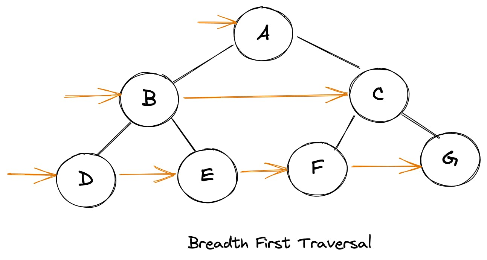
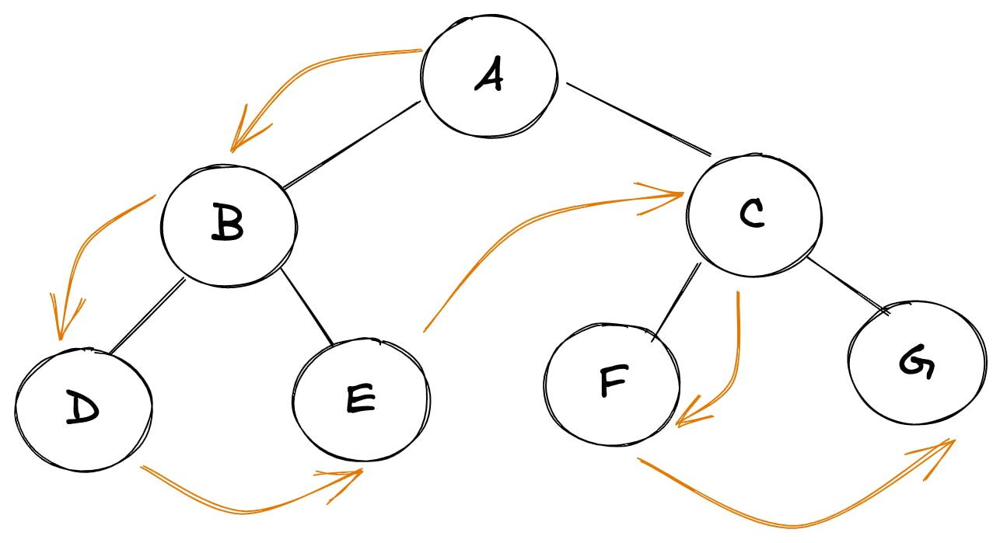
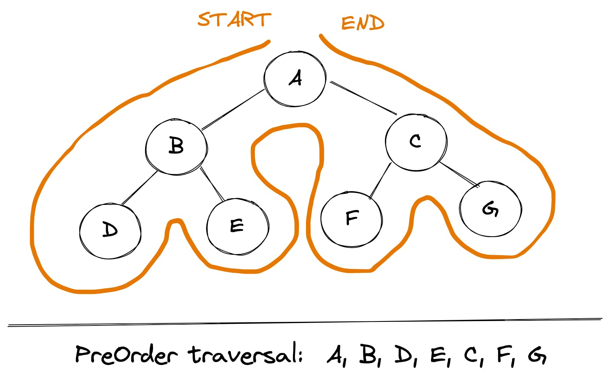
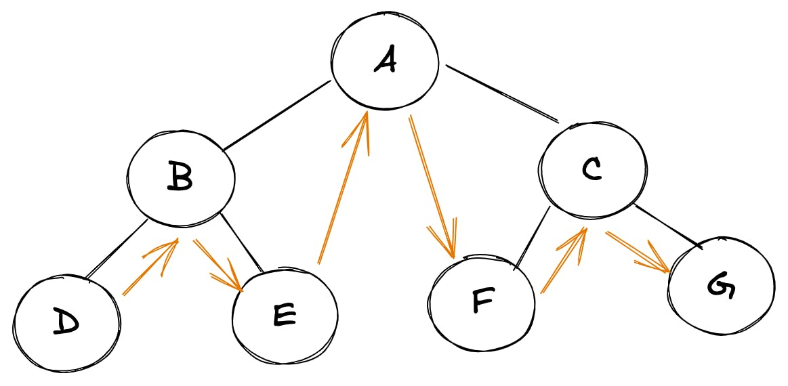
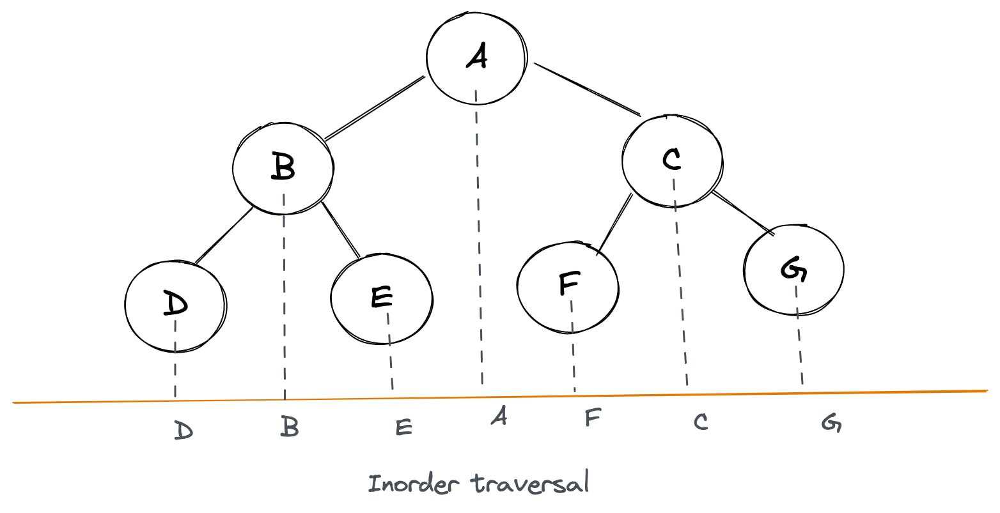
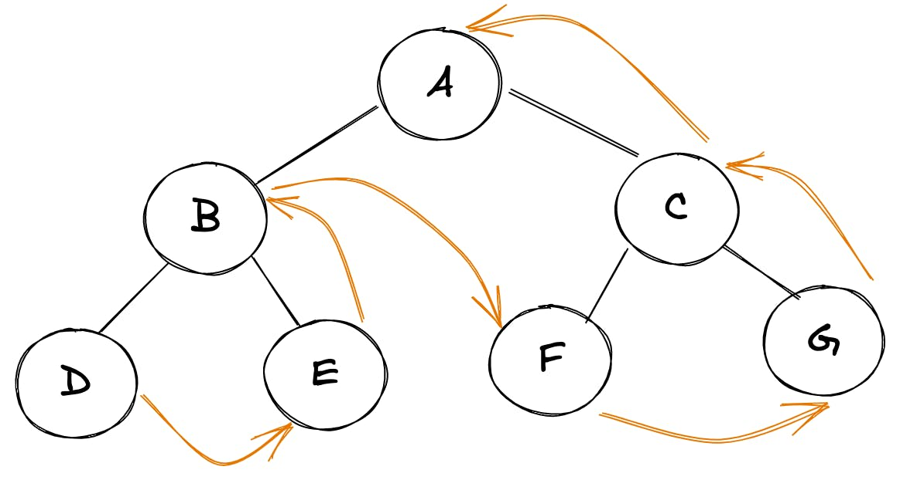
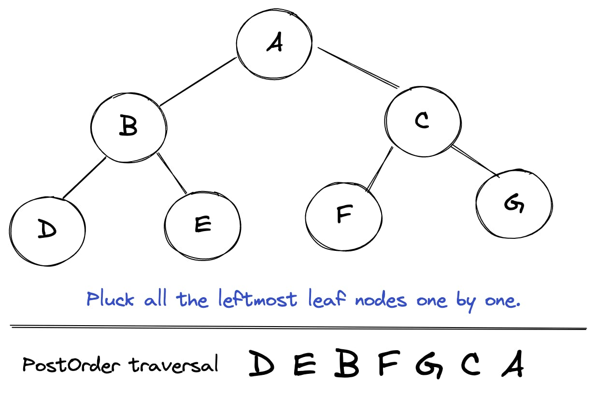

[TOC]

# [Tree data structure in JavaScript](https://stackfull.dev/tree-data-structure-in-javascript)

## Implementation and traversal techniques

Tree is an interesting data structure. It has wide variety of applications in all sorts of fields. For example:

- DOM is a tree data structure
- Directory and files in our OS can be represented as trees
- A family hierarchy can be represented as a tree.

There are bunch of variations of tree (such as heaps, BST etc.) which can be used in solving problems related to scheduling, image processing, databases etc. Many of complex problems may not seem related to tree on a quick look, but can actually be represented as one. We'll walk through such problems as well (in later parts of this series) to see how trees can make seemingly complex problems much easier to comprehend and solve.

Don't forget to subscribe to my newsletter (subscription form should be at the top of this article) if you'd like to be informed about further posts in this series.

## Introduction

Implementing a `Node` for a binary tree is pretty straightforward.

```javascript
function Node(value){
  this.value = value
  this.left = null
  this.right = null
}
// usage
const root = new Node(2)
root.left = new Node(1)
root.right = new Node(3)
```

So these few lines of code would create a binary tree for us which looks like this:

```
           2  
        /      \
       /         \
     1            3
   /   \        /    \
null  null   null   null
```

Cool! So that was easy. Now, how do we put this to use?

## Traversal

Let's start with trying to walk through these connected tree nodes (or a tree). Just as we can iterate through an array, it would be cool if we can 'iterate' through tree nodes as well. However, trees are not linear data structures like arrays, so there isn't just one way of traversing these. We can broadly classify the traversal approaches into following:

- Breadth first traversal
- Depth first traversal

## Breadth First Search/Traversal (BFS/广度优先)

[BFS（图论） - OI Wiki (oi-wiki.org)](https://oi-wiki.org/graph/bfs/)

中文名是宽度优先搜索，也叫广度优先搜索。

是图上最基础、最重要的搜索算法之一。

所谓宽度优先。就是每次都尝试访问同一层的节点。 如果同一层都访问完了，再访问下一层。

这样做的结果是，BFS 算法找到的路径是从起点开始的 **最短** 合法路径。换言之，这条路径所包含的边数最小。

在 BFS 结束时，每个节点都是通过从起点到该点的最短路径访问的。

算法过程可以看做是图上火苗传播的过程：最开始只有起点着火了，在每一时刻，有火的节点都向它相邻的所有节点传播火苗。

In this approach, we traverse the tree level by level. We would start at the root, then cover all of it's children, and we cover all of 2nd level children, so on and so forth. For example for the tree above, traversal would result in something like this:

```
2, 1, 3
```

Here's an illustration with slightly complex tree to make this even simpler to understand:



To achieve this form of traversal we can use a queue (First In First Out) data structure. Here's how the overall algorithm would look like:

1. Initiate a **queue** with root in it
2. Remove the first item out of queue
3. Push the left and right children of popped item into the queue
4. Repeat steps 2 and 3 until the queue is empty

Here's how this algorithm would look like post implementation:

```javascript
function walkBFS(root){
  if(root === null) return

  const queue = [root]
  while(queue.length){
      const item = queue.shift()
      // do something
      console.log(item)

      if(item.left) queue.push(item.left)
      if(item.right) queue.push(item.right)
   }
}
```

We can modify above algorithm slightly to return an array of arrays, where each inner array represents a level with elements within in:

```javascript
function walkBFS(root){
  if(root === null) return

  const queue = [root], ans = []

  while(queue.length){
      const len = queue.length, level = []
      for(let i = 0; i < len; i++){
          const item = queue.shift()
          level.push(item)
          if(item.left) queue.push(item.left)
          if(item.right) queue.push(item.right)
       }
       ans.push(level)
   }
  return ans
}
```

## Depth First Search/Traversal (DFS/深度优先)

In DFS, we take one node and keep exploring it's children until the depth the fully exhausted. It can be done in one of following ways:

```
 root node -> left node -> right node // pre-order traversal
 left node -> root node -> right node // in-order traversal
 left node -> right node -> root node // post-order traversal
```

All of these traversal techniques can be implemented recursively as well as iteratively. Let's jump into the implementation details:

### Pre-Order traversal

Here's how PreOrder traversal looks like for a tree:

```
 root node -> left node -> right node
```



#### Trick:

We can use this simple trick to find out the PreOrder traversal of any tree manually: traverse the entire tree starting from the root node keeping yourself to the left.



#### Implementation:

Let's dive into actual implementation for such a traversal. **Recursive approach** is fairly intuitive.

```javascript
function walkPreOrder(root){
  if(root === null) return

  // do something here
  console.log(root.val)

  // recurse through child nodes
  if(root.left) walkPreOrder(root.left)
  if(root.right) walkPreOrder(root.right)
}
```

**Iterative approach** for PreOrder traversal is very similar to BFS, except we use a `stack` instead of a `queue` and we push the right child first into the stack:

```javascript
function walkPreOrder(root){
  if(root === null) return

  const stack = [root]
  while(stack.length){
      const item = stack.pop()

      // do something
      console.log(item)

      // Left child is pushed after right one, since we want to print left child first hence it must be above right child in the stack
      if(item.right) stack.push(item.right)
      if(item.left) stack.push(item.left)
   }
}
```

### In-Order traversal

Here's how InOrder traversal looks like for a tree:

```
root node -> left node -> right node
```



#### Trick:

We can use this simple trick to find out InOrder traversal of any tree manually: keep a plane mirror horizontally at the bottom of the tree and take the projection of all the nodes.



#### Implementation:

**Recursive:**

```javascript
function walkInOrder(root){
  if(root === null) return

  if(root.left) walkInOrder(root.left)

 // do something here
  console.log(root.val)

  if(root.right) walkInOrder(root.right)
}
```

**Iterative:** This algorithm may seem a bit cryptic at first. But it's fairly intuitive. Let's look at it this way: in InOrder traversal left most child is printed first, then root and then right children. So first thought would be to come up with something like this:

```javascript
const curr = root

while(curr){
  while(curr.left){
    curr = curr.left // get to leftmost child
  }

  console.log(curr) // print it

  curr = curr.right // now move to right child
}
```

In the above approach we're not able to backtrack however i.e. go back to parent nodes which led to left most nodes. So we'll need a stack to record those. Hence our revised approach may look like:

```javascript
const stack = []
const curr = root

while(stack.length || curr){
  while(curr){
    stack.push(curr) // keep recording the trail, to backtrack
    curr = curr.left // get to leftmost child
  }
  const leftMost = stack.pop()
  console.log(leftMost) // print it

  curr = leftMost.right // now move to right child
}
```

Now we can use the above approach to lay down the final iterative algorithm:

```javascript
function walkInOrder(root){
  if(root === null) return

  const stack = []
  let current = root

  while(stack.length || current){
      while(current){
         stack.push(current)
         current = current.left
      }
      const last = stack.pop()

      // do something
      console.log(last)

      current = last.right
   }
}
```

### Post-Order traversal

Here's how postOrder traversal looks like for a tree:

```
 left node -> right node -> root node
```



#### Trick:

For quick manual PostOrder traversal of any tree: pluck all the leftmost leaf nodes one by one.



#### Implementation:

Let's dive into actual implementation for such a traversal.

**Recursive:**

```javascript
function walkPostOrder(root){
  if(root === null) return

  if(root.left) walkPostOrder(root.left)
  if(root.right) walkPostOrder(root.right)

  // do something here
  console.log(root.val)

}
```

**Iterative:** We already have iterative algorithm for preOrder traversal. Can we use that? Since PostOrder traversal seems to be just reverse of PreOrder traversal. Let's see:

```javascript
// PreOrder:
root -> left -> right

// Reverse of PreOrder:
right -> left -> root

// But PostOrder is:
left -> right -> root
```

Ah! So there's a slight difference. But we can accomodate that by modifying our PreOrder algorithm slightly and then reversing it should give the PostOrder results. Overall algorithm would be:

```javascript
// record result using 
root -> right -> left

// reverse result
left -> right -> root
```

- Use a similar approach to the iterative preOrder algorithm above, using a temporary `stack`.
  - Only exception is we go `root -> right -> left` instead of `root -> left -> right`
- Keep recording the traversal sequence in an array`result`
- Reversal of `result` gives postOrder traversal

```javascript
function walkPostOrder(root){
  if(root === null) return []

  const tempStack = [root], result = []

  while(tempStack.length){
      const last = tempStack.pop()

      result.push(last)

      if(last.left) tempStack.push(last.left)
      if(last.right) tempStack.push(last.right)
    }

    return result.reverse()
}
```

### Bonus: JavaScript tip

How nice it would be if we could traverse the tree in the following way:

```javascript
 for(let node of walkPreOrder(tree) ){
   console.log(node)
 }
```

Looks really nice and pretty simple to read, isn't it? All we've got to do is use a `walk` function, which would return an iterator.

Here's how we can modify our `walkPreOrder` function above to behave as per the example shared above:

```javascript
function* walkPreOrder(root){
   if(root === null) return

  const stack = [root]
  while(stack.length){
      const item = stack.pop()
      yield item
      if(item.right) stack.push(item.right)
      if(item.left) stack.push(item.left)
   }
}
```
