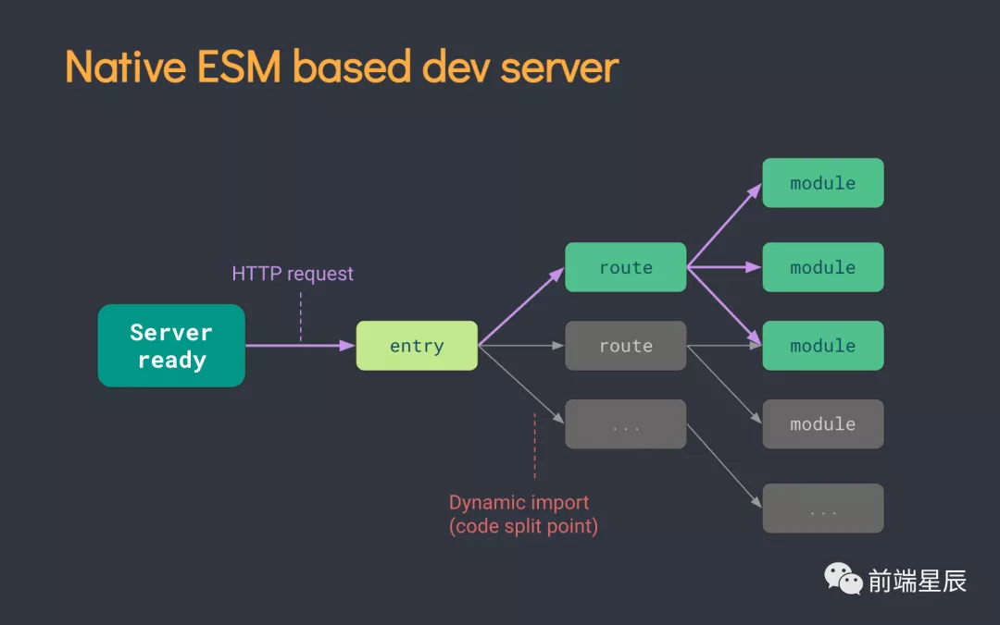

[toc]

# [我们从 UmiJS 迁移到了 Vite](https://mp.weixin.qq.com/s/-eLWnFq0yIzZkCsbmoPcwg)

我们从 `UmiJS`迁移到 `Vite` 已经上线半年多了。迁移过程中也遇到了不少问题，好在 `Vite` 足够优秀，继承自 `Rollup` 的插件系统，使我们有了自由发挥空间。目前很多人对 `Vite` 跃跃欲试，`Vite` 开发体验到底怎么样，今天来叙叙迁移到 `Vite` 的亲身经历。

先说结论，`Vite` 已经很成熟，强烈建议有条件的可以从 `webpack` 迁移过来。


## 为什么要放弃 `UmiJS`

2019 年底，在 `Webpack` 横行霸道，各种脚手架琳琅满目的时代选择了 `UmiJS`。它配置少、功能多、文档齐全、持续更新。一整套的解决方案，非常适合一个大部分非 `React` 技术栈的团队。经过不断地磨合，团队很快适应了这种 `React` 开发模式，开发效率也是水涨船高。

凡事总有个原因，为什么要迁移。2021 年初，为适应公司的发展，前端架构也需要做调整与升级。在项目日益增长的情况下，一次项目启动需要耗费一分多钟，热更新也慢得基本无法使用。差点的机器配置启动项目要么好几分钟、要么内存溢出。这种模式极大地降低了开发效率。无论是自定义修改内部 `webpack` 插件、从各种角度如多核编译、缓存等方式优化，依然是杯水车薪。虽然 `UmiJS` 提供了 `webpack5` 插件，不过在当时处于不可用的状态。

我们主要的矛盾是：

1. 启动时间长
2. 热更新慢
3. 太臃肿
4. 框架 BUG 修复不及时
5. 过度封装，自定义插件难度大
6. 约定式功能太单一

适应业务的要求，我们也需要上微前端。`UmiJS` 也提供了微前端插件 “乾坤”。但依然解决不了根本开发体验问题。因此，在基础脚手架上，我们寻求更多的是可控性及透明性。（尽管`UmiJS` 现在已经支持Module Federation 的打包提速方案）

## 为什么是 `Vite`

市面上的脚手架很多，阵营却很少，大部分是基于 `webpack` 的上层封装。`webpack` 的缺点很明显，当冷启动开发服务器时，基于打包器的方式启动必须优先抓取并构建你的整个应用，然后才能提供服务。


在浏览器 ESM 支持得很普遍得今天，`Vite` 这种可以称得上是下一代前端开发与构建工具。在 `Vite` 中，HMR 是在原生 ESM 上执行的。当编辑一个文件时，无论应用大小如何，HMR 始终能保持快速更新。



`Vite` 这种方式在我们习惯 `webpack` 的阴影下显得尤为惊艳，可以说 `Vite` 完美地解决了我们所有的痛点。不过 `Vite` 也是刚发布 2.0 不久，踩过坑的人也是相当少。我们便试试 `Vite`。

## 前期调研

迁移的必要条件是在原有的功能下找到替代方案，我们便统计用到了 `UmiJS` 中的 API 及特性

UmiJS 配置

- alias - 配置别名（对应 resolve.alias）
- base - 设置路由前缀（对应 base）
- define - 用于提供给代码中可用的变量（对应 define）
- outputPath - 指定输出路径（对应 build.outDir）
- hash - 配置是否让生成的文件包含 hash 后缀 （Vite 自带）
- antd - 整合 antd 组件库 （无需框架提供，Vite 中可自己引用）
- dva - 整合 dva 数据流（此库已经很久没有更新了，在 hooks 时代使用显得格格不入。我们没有大量使用，重写一个文件很轻松）
- locale - 国际化插件，用于解决 i18n 问题（需要自己实现国际化逻辑，都是基于 react-intl 封装，在 Vite 中实现无压力）
- fastRefresh - 快速刷新（对应 @vitejs/plugin-react-refresh 插件）
- dynamicImport - 是否启用按需加载（路由级的按需加载，在 Vite 中用 React.lazy 封装）
- targets - 配置需要兼容的浏览器最低版本（对应 @vitejs/plugin-legacy 插件）
- theme - 配置 less 变量（对应 css.preprocessorOptions.less.modifyVars 配置）
- lessLoader - 设置 less-loader 配置项（与 theme 配置相同）
- ignoreMomentLocale - 忽略 moment 的 locale 文件（可以通过 alias 设置别名方式解决）
- proxy - 配置代理能力（对应 server.proxy）
- externals - 设置哪些模块可以不被打包（对应 build.rollupOptions.external）
- copy - 设置要复制到输出目录的文件或文件夹（对应 rollup-plugin-copy）
- mock - 配置 mock 属性（对应 vite-plugin-mock）
- extraBabelPlugins - 配置额外的 babel 插件（对应 @rollup/plugin-babel）

通过配置分析，基本上所有的 `UmiJS` 配置都可以在 `Vite` 中找到替代方案。除了配置还有一些约定

UmiJS 中 `@/*` 路径，代替方式

```
defineConfig({
  resolve: {
    alias: {
      '@/': `${path.resolve(process.cwd(), 'src')}/`,
    },
  },
});
```

## 迁移

Review 现有的代码，找出可能出问题的点并统计。做前期准备。跑起来优先：

从头 `Vite` 官方模板中创建一个项目，安装所需依赖包。`UmiJS` 内置封装了 `react-router`、`antd` `react-intl`，这里我们需要手动加上 `BrowserRouter`、`ConfigProvider`、`LocaleProvider`

```
// App.tsx
exportdefaultfunction App() {
  return (
    <AppProvider>
      <BrowserRouter>
        <ConfigProvider locale={currentLocale}>
          <LocaleProvider>
            <BasicLayout>
              <Routes />
            </BasicLayout>
          </LocaleProvider>
        </ConfigProvider>
      </BrowserRouter>
    </AppProvider>
  );
}
```

根据之前约定式路由，添加相应的路由配置

```
exportconst basicRoutes = [
  {
    path: '/',
    exact: true,
    trunk: () =>import('@/pages/index'),
  },
  {
    path: '/login',
    exact: true,
    trunk: () =>import('@/pages/login'),
  },
  {
    path: '/my-app',
    trunk: () =>import('@/pages/my-app'),
  },
  // ...
];
```

路由渲染组件，通过 `React.lazy` 实现 `UmiJS` 中的 `dynamicImport`

```
const routes = basicRoutes.map(({ trunk, ...config }) => {
  const Trunk = React.lazy(() => trunk());
  return {
    ...config,
    component: (
      <React.Suspense fallback={<Spinner />}>
        <Trunk />
      </React.Suspense>
    ),
  };
});

exportdefaultfunction Routes() {
  return (
    <Switch>
      {routes.map((route) => (
        <Route key={route.key || route.path} path={route.path} exact={route.exact} render={() => route.component} />
      ))}
    </Switch>
  );
}
```

从原先的约定式路由迁移完成，项目中主要不兼容的地方就是从 `umi` 导入的成员

```
import { useIntl, history, useLocation, useSelector } from'umi';
```

我们需要将所有 umi 中导入的变量，通过编辑器的正则替换批量修改替换。

- 国际化的 `useIntl` 通过将语言文件和 `react-intl` 封装，导出一个全局的 `formatMessage` 方法
- 路由相关的 API 用 `react-router-dom` 导出替换
- `Redux` 相关的，用 `react-redux` 导出替换
- 查找项目中使用 `require` 的地方，替换为动态 `import`
- 查找项目中使用 `process.env.NODE_ENV`，替换为 `import.meta.env.DEV`，因为再 `Vite` 中不再有 `node.js` 相关的 API

将 `antd` 添加进项目后，发现 `babel-plugin-import` 对应的 `Vite` 插件似乎有问题，某些样式在 dev 模式下缺失，打包后正常。排查发现是组件包里面引用了 `antd`，在 `dev` 模式下包名被“依赖预构建” 混淆，导致插件无法正确插入 `antd` 的样式。为此，我们自己写了个插件，在 dev 模式下全量引入样式，prod 才走插件。

很轻松，第一个页面成功运行。

由于迁移之后需要使用微前端，因此我们将公共配置通过外置插件统一管理。

```
exportdefault defineConfig({
  server: {
    // 每个项目配置不同的端口号
    port: 3001,
  },
  plugins: [
    reactRefresh(),
    // 公共配置插件
    baseConfigPlugin(),
    // AntD 插件
    antdPlugin(),
  ],
});
```

迁移后发现 `Vite` 需要配置的其实很少，抽取的公共配置，封装成 `Vite` 插件。

```
import path from'path';
import LessPluginImportNodeModules from'less-plugin-import-node-modules';

exportdefaultfunction vitePluginBaseConfig(config: CustomConfig): Plugin {
  return {
    enforce: 'post',
    name: 'base-config',
    config() {
      return {
        cacheDir: '.vite',
        resolve: {
          alias: {
            '@/': `${path.resolve(process.cwd(), 'src')}/`,
            lodash: 'lodash-es',
            'lodash.debounce': 'lodash-es/debounce',
            'lodash.throttle': 'lodash-es/throttle',
          },
        },
        server: {
          host: '0.0.0.0',
        },
        css: {
          preprocessorOptions: {
            less: {
              modifyVars: {
                '@primary-color': '#f99b0b',
                ...config.theme,
                // 自定义 ant 前缀
                '@ant-prefix': config.antPrefix || 'ant',
              },
              plugins: [new LessPluginImportNodeModules()],
              javascriptEnabled: true,
            },
          },
        },
      };
    },
  };
}
```

迁移的整个过程没有想象中那么繁杂，反而相对容易。几乎常用的功能 `Vite` 都有方案支持，这也许是 `Vite` 的厉害之处吧。其实本质上的复杂度在于业务，项目的复杂度就是代码量的体现，通过 IDE 的搜索替换，很快便完成了迁移并成功的运行。

现在，我们所有的项目都基于 `Vite`，完全没有了等待而摸鱼的烦恼。

## 问题/解决

### 转换 `less` 文件 `@import '~antd/es/style/themes/default.less'` 中的 `~` 别名报错

配置 `less` 插件`less-plugin-import-node-modules`

### `SyntaxError: The requested module 'xxx' does not provide an export named 'default'`

我们将公共组件作为独立的 npm 包之后使用时遇到的错误。本想着公共组件包自己不编译，统一交给使用方编译。所以导出了 TS 源文件。而这种情况常规下没有问题，`Vite` 一旦遇到 `CommonJS` 或 `UMD` 的包才导致无法解析。虽然可以将无法解析的包放入 `optimizeDeps.include` 。但是架不住包的数量多啊，还是将它 tsc 转译为 JS 文件再发布。

### 打包提速

首次打包发现需要 70 多秒，我们来优化打包结构

- 通过 `build.minify` 改为 `esbuild`（最新版 `Vite` 已经默认 `esbuild`） 。`Esbuild` 比 `terser` 快 20-40 倍，压缩率只差 1%-2%。开启后降低到 30 多秒
- `babel-plugin-import` 的类似 `babel` 插件严重拖后腿，总共不到 40 秒的时间，它就要占 10 秒。我们通过正则的方式做了个插件，完美解决
- 通过分析 `rollup` 对 `@ant-design/icons` 、`lodash` 包的 `transform` 数量非常多。我们将这些包也加入到刚刚做的插件中

通过一顿操作下来，提速到 16 秒，先这样吧。

### 为什么将 `cacheDir` 放在根目录

`cacheDir` 作为存储缓存文件的目录。此目录下会存储预打包的依赖项或 vite 生成的某些缓存文件，使用缓存可以提高性能。在某些情况下需要联调 `node_modules` 里包，从而导致修改后未生效。这时需要使用 --force 命令行选项或手动删除目录，放在根目录便于删除。

### 兼容性问题

`Vite` 的兼容性可以通过官方的插件 `@vitejs/plugin-legacy` 解决。我们已经放弃支持 IE 11，无限制在生产使用 ESM，羡慕吗？

## 结语

如果你是新的项目，完全不必考虑 `Webpack` 了，`Vite` 及 `rollup` 的完全生态足够支撑上生产。如果你是 `Webpack` 生态老项目，不忍体验上的折磨，满足迁移条件的话，不妨试试 `Vite`，肯定会带给你惊喜。

后面我会分享 `Vite` 和自己实现的微前端搭配组合，以及`Vite` 相关的插件，请持续关注。
