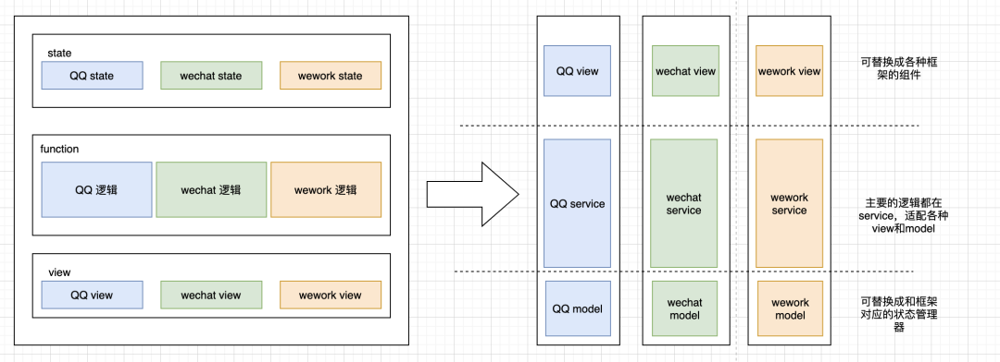
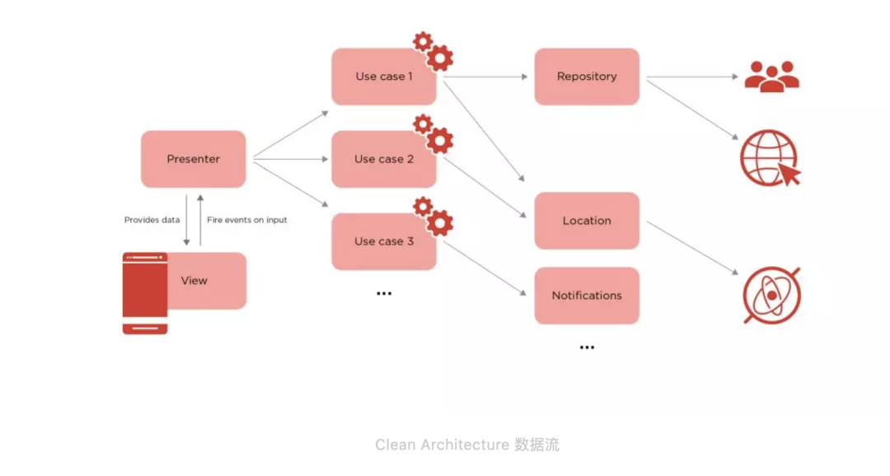
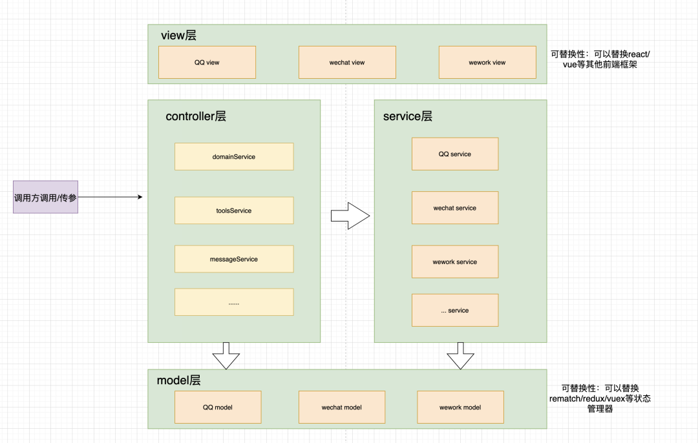

[TOC]

## [让 JS 摆脱框架的束缚 ](https://mp.weixin.qq.com/s/n65x3duoeQAtQU_fH_dJDw)


## 一. 为什么要让 JS 从框架中解脱出来？

随着前端的告诉发展，前端框架也越来越五花八门，我们在体验前端框架带给我们的快捷的开发体验的同时，但是他们同时也是“恶魔”，因为他们让我们的代码绑定在了框架里。虽然我们可以将 react 的代码快速的迁移到一个类 react 框架，但是我们很难将他迁移到 Vue 框架和 Angular 框架。可能在代码迁移合并升级的时候，我们能做的可能只有重构。

解决上面的问题，我们可能会想到使用 Web Components 或者是微服务，但是带来的可能会是，更多的浏览器限定，要看更多的框架文档去遵循更多的规范。

如果你要做一个项目这个项目是十分独立的，永远自己在运行，和其他项目的交集不是很大，那你选择 react 或者 vue，一直去基于选择的框架去迭代，这是没有任何问题的处理方法。但是如果你的项目是一个服务于其他的项目的项目，服务于 web 或者服务于小程序等不同的平台，需要去根据一些场景定制化 UI。

**要知道，无论框架如何的迭代，我们 JS 是永远不会太大的变化的，所有框架都是基于 JS 去写的，如何让我们通用 JS 代码被不同的框架去应用，让我们的通用代码去框架化，是我们应该思考的问题。**

## 二. 举例说明

既然我们要去框架化，那架构就不去用了，直接用 JS 就好了呀，那就是一种技术的倒退，我们要做的不是不用框架，而是用一种更巧妙的方式去可以适配更多的框架。

例如，目前前端的类 MVVM 架构，ViewModel 层可以取出 Model 的数据同时帮忙处理 View 中由于需要展示内容而涉及的业务逻辑。我们要去用我们不变的 JS 代码去适配更多框架的 VM。

再例如，我们用到状态管理，每一个框架都有各自的状态管理库，他们都极大的缩减了我们开发的成本，带来了方便，但是如何让我们的代码更多的去适配不同框架的不同的状态管理库？

如果我们是一个组件需要再 QQ,微信，企业微信 3 端展示，3 端的逻辑和试图都有差异，我们可能会这样去写:


```ts
type Props {    
	viewType: 'QQ' | 'WeChat' | 'WeWork'}
class Wrapper extends Component<Props> {    
    viewQQDoSomething(){}    
    viewWeChatDoSomething(){}    
    viewWeWorkDoSomething(){}    
    render(){        
        const { viewType } = this.props;        
        if ( viewType === 'QQ' ) {            
            return(                <ViewQQ>;            )        }
        // 新增viewTwo        
        if (viewType === 'WeChat') {            
            return(                <viewWeChat>;            )        }
        // 新增viewThree        
        if(viewType === 'WeWork'){            
            return(                <viewWeWork>;            )        }    
    }}
```

上面的代码，随着我们业务的增加，会使得 MVVM 中的 VM 越来越臃肿，逻辑不清，哪些函数是 QQ 逻辑用到的，哪些是 WX 逻辑用到的不是很清晰，更重要的是，跨框架的代码的迁移和适配存在很大的问题。

我们尝试调整结构：



来看看调整完结构有哪些优点：

1. 框架无关性
2. 可被测试性
3. UI 无关性
4. 可以在多个项目共享业务逻辑
5. 定义了特定功能的代码放在何处

## 三. 整洁前端

Clean Architecture 是由 Robert C. Martin 在 2012 年提出的，最早只是在 Android，Android 应用有很重的 View 层。今天，前端应用走向了 MV* 的架构方案，也有了一层很重的 View 层。

Robert C. Martin 总结了六边形架构（即端口与适配器架构）：DCI （Data-Context-Interactions，数据-场景-交互）架构、BCI（Boundary Control Entity，Boundary Control Entity）架构等多种架构，归纳出了这些架构的基本特点：

- 框架无关性。系统不依赖于框架中的某个函数，框架只是一个工具，系统不能适应于框架。
- 可被测试。业务逻辑脱离于 UI、数据库等外部元素进行测试。
- UI 无关性。不需要修改系统的其它部分，就可以变更 UI，诸如由 Web 界面替换成 CLI。
- 数据库无关性。业务逻辑与数据库之间需要进行解耦，我们可以随意切换 LocalStroage、IndexedDB、Web SQL。
- 外部机构（agency）无关性。系统的业务逻辑，不需要知道其它外部接口，诸如安全、调度、代理等。

如你所见，作为一个普通（不分前后端）的开发人员，我们关注于业务逻辑的抽离，让业务逻辑独立于框架。而在前端的实化，则是让前端的业务逻辑，可以独立于框架，只让 UI（即表现层）与框架绑定。一旦，我们更换框架的时候，只需要替换这部分的业务逻辑即可。

让我们来看一个较为直观的例子：

是一个 Android 应用的数据流示意图。

在前端应用中，我们假设以使用 Component 来表示一个组件。而这个组件中，它必然充满了一些无关于页面显示的逻辑，比如从后端获取显示数据之类的。而 Java 的写法本身是比较臃肿的，所以在 Android 的 Activity 中就会充斥大量的代码。为此，Android 的开发人员们，采用了 MVP 架构，通过 Presenter 来将与显示无关的行为，从 View 中抽离出来。

## 四. 实际应用

受到上面的启发，我在前端项目进行调整，重 Presenter 调整成重 Service，在团队在组件重构的过程中，采用了基于 DDD 领域服务驱动的设计思想，在关于组件的设计中，我们采用的就是 UI 与逻辑分离的方式。

与此同时我们不想给组件太多的权限，我们想将组件的通用逻辑，通用变量统一管理，所以在这我们引入了 controller 层，去拿到注入到组件的各种 domainService。

我们还是以上面的例子，加入 controller 去限制组件的能力，收归组件的功能，将一些 cgi 判断逻辑，localtion 和 indexDB 进行收归通过注入的方式让组件拿到：

组件结构：

```shell
- src 
	- container 
    - controller  
    - service  
    - model  
    - view  
    - index.ts
package.json
README.md
```

### 从书写细节去降低依赖

### 1. service 不依赖 dispatch

因为我们的 service 层和 controller 层是任何框架可复用，所以他的设计不应该去依赖任何库的 dispatch 去改变试图。这里的 service 应该与 model 的划分相对应的，我们可以在 createStore，引入不同的 service，这样设计的原因是，service 都是同一级，可以不存在父子嵌套，可以解决 service 逻辑金字塔的问题，但是不要在一个 model 中传入过多的 service。

### 2. controller 不依赖 store

我们的 store 也是可变的，所以我们 controller 不应该依赖 store,也就是不可 store 直接传入。

```ts
// index.ts
this.loginController = new LoginController(store, independentPasswordService);
```

```ts
// LoginController.ts
class LoginController extends Disposable implements IController {  
	public strore: RootStore;
  	public show(): void {    
        // 这是一个控制组件显示的dispatch    
        this.store.dispatch.loginMain.setIsShowLogin(false);  }}
```

改变成：

```ts
// index.ts
this.loginController = new LoginController(  
	store.dispatch.loginMain.setIsShowLogin,  
	independentPasswordService);
```

```ts
// LoginController.ts
class LoginController extends Disposable implements IController {  
	public setIsShowLogin: (value: boolean) => void;
  	public show(): void {    
  	// 这是一个控制组件显示的dispatch    
  		setIsShowLogin(false);  }}
```

这样让我们切换 store 的时候，我们只需要提供 controller 对应的接口，如：this.store.dispatch.loginMain.setIsShowLogin 转换成 setIsShowLogin。

### 3. 贫血 model

但是拥有结构是不够的，因为我们的 model 是可以替换的。所以这里面的 model 一定是贫血的 model，要有尽量少的代码，且职责单一,这样的代码迁移才可以做到代码的最小改动。

这个是在 rematch（model 层）的 effect 的方法：

```ts
const { pollingState, url, nextPollingState } =  await qrCodeService.doRunningPolling(key, state.tab);
if (pollingState === IPollingCallbackState.refresh) {
	dispatch.qrCode.setQrCodeSrc(url);
} else if (pollingState === IPollingCallbackState.timeout) {
	dispatch.qrCode.setQrCodeState(IQRCodeState.timeout);
} else if (pollingState === IPollingCallbackState.wait) {  	
    dispatch.qrCode.setQrCodeState(IQRCodeState.wait);}
```

上面的代码我们需要根据 doRunningPolling 返回的状态去调用 dispatch，去更改 model 然后触发视图改变。显然这段代码显然有比较多的逻辑，显然这个 model 不是贫血 model。但是如果我们将 dispatch 传入进去，那么 service 就变成依赖了 dispatch。

所以我们把 setQrCodeSrc 和 setQrCodeState 两个包装成回调函数，不同的状态管理库可以实现不同 setQrCodeState 和 setQrCodeSrc，他的作用就是改变 model 数据，对于 service 我不去关系你是用什么实现的，只是去调用传入的函数。

```ts
qrCodeService.switchLoginType({  
	tab: payload.tab,  
	notAutoLogin: state.qrCode.notAutoLogin,  
	setQrCodeState: dispatch.qrCode.setQrCodeState,  
	setQrCodeSrc: dispatch.qrCode.setQrCodeSrc,});
```

上面我们就看出来了，我们的 model 是几乎没有如何逻辑的，他的作用就是转发。

### 4. model 与变量的区别

model 数据应该是与视图有直接关联的数据，也就是直接要在页面上渲染的变量。

**切勿将所有可能的变量都放进 model 中**

例子：

比如页面要有一个定时器去处理逻辑，那维护这个定时器的变量则与视图无关，需要用对应 service 中去维护。

```ts
class PollingQrCodeService {  
	private pollingTimer: ReturnType<typeof setTimeout> | null;  
	private timeoutTimer: ReturnType<typeof setTimeout> | null;}
```

## 五. 总结

目前该方案，团队已经应用在实际项目中，核心思想是让我们的逻辑核心代码具有不依赖性，也可以更好的将核心代码 SDK 化。我们写的代码是 JS 代码，而不是基于框架的语言，离开框架我们的代码依然可以是有价值的。

上面架构是文档团队一起讨论实践，不断打磨，激烈讨论的共同结果。
