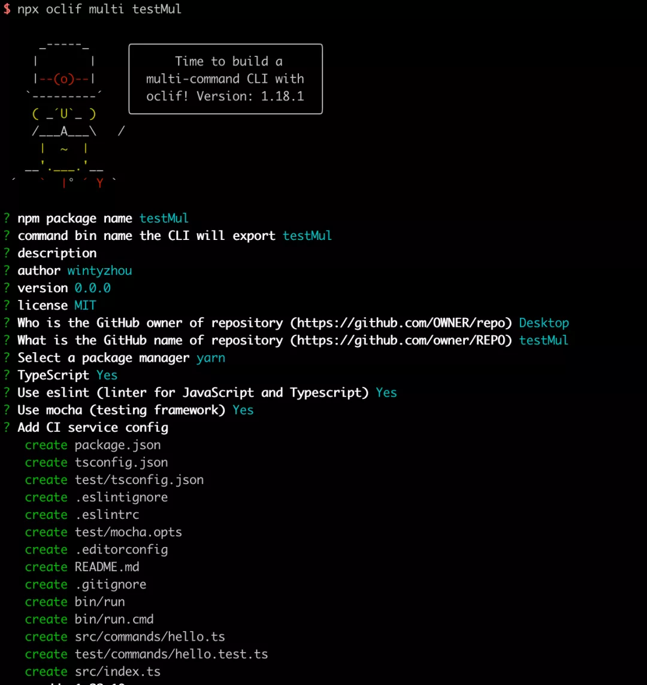
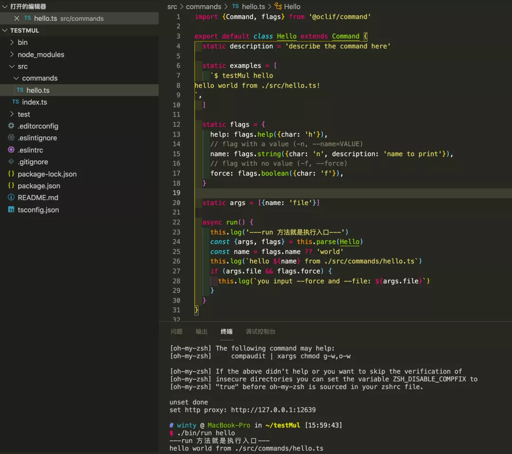

[TOC]

### 背景 

前端很多 `cli` 工具，比如著名的 `vue-cli`，这些工具大多数都是作用于快速创建对应框架的模版代码，让开发者可以不用从0开始配置项目，可以专注于项目本身的业务逻辑开发，从而快速创建项目。

那么，该如何做一个 `cli` 工具呢，我之前写过一篇文章介绍 [提高生产力--让项目配置变为自己专属的脚手架](http://mp.weixin.qq.com/s?__biz=MzI0MzIyMDM5Ng==&mid=2649825778&idx=1&sn=8893cb92c22bf456cc2affd596574205&chksm=f175eb31c6026227fafaa31e7e9029a362f3eaa67e1d7e137e96894b2c84ab7d57f455360ce2&scene=21#wechat_redirect)，大家可以回顾一下～

然而，这样的步骤走下来，虽然形成了一个 cli 工具，但是创建 cli 项目本身的过程，还是挺繁琐的。后来我发现有个 `oclif框架`，就是相当于是创建命令行工具项目的模版代码的一个脚手架，非常好用，给大家推荐一下。下面详细说一下使用过程。

### cli 类型

oclif 有2种 cli 类型，单个命令模式和多个命令模式。单个 cli 命令，例如 `ls` 、`cat`,它可以接收参数和标志符，单个命令的 cli 可以是一个单文件。它的文件目录结构为：

```
package.json
src/
└── index.ts
```

多个 cli 命令，例如 `git`，它还有子命令，而它的子命令本身就是单个的 cli 。它在 package.json 有个 oclif.commands 的字段，指向一个包含所有命令的目录。

```
package.json
  "oclif": {
    "commands": "./lib/commands",
  }

src/
└── commands/
    ├── create.ts
    └── destroy.ts
```

简言之，就是创建的命令行项目可以是单个命令的或多个命令的。

#### 使用

```
// 建议全局安装
npm i oclif -g
```

执行`npx oclif multi testMul`，创建一个多命令的项目：



得到项目后，执行对应的脚本命令，初始化时得到的是 `hello` 命令，因此执行 `./bin/run hello`:



这样，就跑起来啦。其中的`run`方法就是对应脚本的入口，你的脚本逻辑就可以直接在`run`方法中调用了。

#### 调试

1. 全局使用 当你想在其他项目中测试脚本时，可以使用`npm link`，然后就可以直接用 cli 的名字要执行对应的脚本啦，例如本例中的 `testMul hello`！
2. 静态属性 我们看下，默认的 `hello` 模版：

```ts
import {Command, flags} from '@oclif/command'

export default class Hello extends Command {
  static description = 'describe the command here'

  static examples = [
    `$ testMul hello
hello world from ./src/hello.ts!
`,
  ]

  static flags = {
    help: flags.help({char: 'h'}),
    // flag with a value (-n, --name=VALUE)
    name: flags.string({char: 'n', description: 'name to print'}),
    // flag with no value (-f, --force)
    force: flags.boolean({char: 'f'}),
  }

  static args = [{name: 'file'}]

  async run() {
    this.log('---run 方法就是执行入口---')
    const {args, flags} = this.parse(Hello)
    const name = flags.name ?? 'world'
    this.log(`hello ${name} from ./src/commands/hello.ts`)
    if (args.file && flags.force) {
      this.log(`you input --force and --file: ${args.file}`)
    }
  }
}
```

其中，有静态属性`description`,`examples`,`flags`,`args`,解释一下其中的含义：

- description：描述当前脚本的作用、用法等。什么时候能看到这个描述呢，就是运行命令`testMul--help`的时候。
- examples：它是一个数组，你可以把怎么使用这个命令的例子写在这里。
- flags：它是一个字符串，这条命令的基本使用，可以填写一条常用的命令在这里。
- args：命令参数。

### oclif 框架功能特性

- **参数解析**，没有参数解析的 cli 工具是不完整的，oclif 构建了一个自定义参数的CLI，通过简单的写法定义和参数，灵活处理用户输入，以至用户能够以他们期望的方式使用。
- **性能好**， 运行 oclif cli 命令的开销几乎没有。此外，只有仅需要执行的命令被node加载。因此，包含许多命令的大型CLI将与使用单个命令的小型CLI一样快地加载。
- **cli 模版生成器**， 快速初始化一个命令行项目模版，快速进行开发。
- **单元测试方便**，生成器将自动创建脚手架测试使命令更易于测试和模拟 stdout/stderr。
- **自动文档**，默认情况下，您可以传递--help给CLI以获取帮助，例如标志选项和参数信息。每当发布CLI的npm软件包时，此信息也将自动放置在README.md中。
- **插件**，使用插件，CLI的用户可以使用新功能对其进行扩展，CLI可以拆分为模块化组件，并且可以在多个CLI之间共享功能。
- **钩子**，使用生命周期挂钩可在CLI启动时或在自定义触发器上运行功能。每当需要在CLI的各个组件之间共享自定义功能时，可以使用。
- **TypeScript**，支持TS，在初始化项目的时候可以选择JS或者TS，oclif的框架内部代码也是使用TS。
- **自动更新**，用户可以通过使用插件自动更新。
- **可定制**，参数命令，值等一切都是可定制的。
- **自动补全**，自动不去命令的名称和参数值名称等。
- **调试方便**，不用编译，就可以在直接使用。

#### 常用命令

1. `oclif single `：在当前目录中创建一个单命令项目
2. `oclif multi `：在当前目录中创建一个多命令项目
3. `oclif command `：添加一条命令
4. `oclif hook  --event=`：新建一个钩子
5. `oclif plugin `：新建一个插件

### 参考文档

- https://oclif.io/docs/introduction
- https://github.com/oclif/oclif