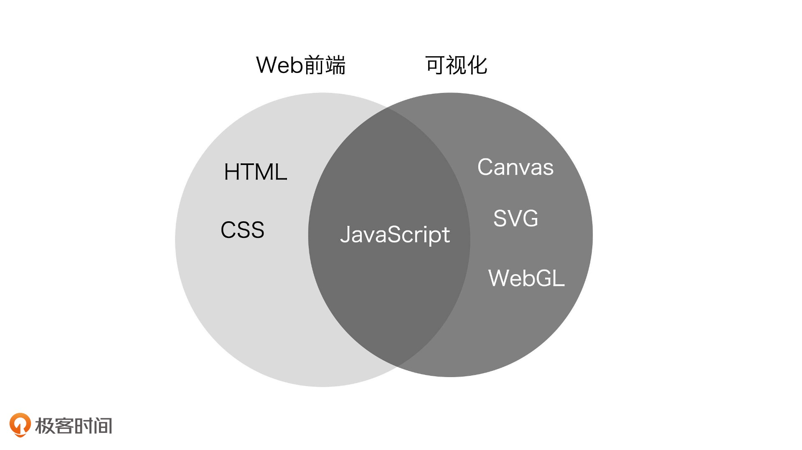

[toc]

# [Web前端与可视化到底有什么区别？](https://time.geekbang.org/column/article/252090)

如果要给可视化下一个定义，我觉得应该是这样的：**可视化是将数据组织成易于为人所理解和认知的结构，然后用图形的方式形象地呈现出来的理论、方法和技术**。实现可视化有两个关键要素，一个是**数据**，另一个是**图形**。如果要考虑在计算机上呈现，那还要加上**交互**。

## 可视化和 Web 前端究竟有什么区别呢？

我们先从工作内容来看，前端工程师主要负责处理内容呈现和用户交互。

可视化的数据呈现，尤其是在 Web 端的呈现，也属于前端工程师的范畴。

但是，与传统的前端开发相比，可视化开发的工具、思路和方法，又和 Web 有着比较大的区别。

### 首先是技术栈的不同。

Web 开发主要以 HTML 来描述结构，以 CSS 来描述表现，以 JavaScript 来描述行为。

而可视化则较少涉及 HTML 和 CSS，它更多地要同浏览器的 Canvas、SVG、WebGL 等其他图形 API 打交道。

这是因为，Web 开发以**呈现块状内容为主**，所以 HTML 是更合适的技术。

而可视化开发因为需要**呈现各种各样的形状、结构**，所以，形状更丰富的 SVG 以及更底层的 Canvas2D 和 WebGL 就是更合适的技术了。

### 处理的信息/数据不同

其次，Web 开发着重于处理**普通的文本和多媒体信息**，**渲染普通的、易于阅读的文本和多媒体内容**，而可视化开发则着重于**处理结构化数据**，渲染各种**相对复杂的图表和图形元素**。

两者针对的信息特征和对图形渲染的要求有所不同，所以，在细节处理上也有比较大的差异。

## 可视化领域的工具

把这些工具大体上分为四类，分别是：

1. 专业呈现各种类型图表的**图表库**；
2. 专业处理地图、地理位置的**可视化地理库**；
3. 专业处理视觉呈现的**渲染库**；
4. 处理数据的**数据驱动框架**。

**图表库**----可视化应用通常需要绘制大量的**图表**，比如，柱状图、折线图、饼图，还有一些简单的平面地图等等。图表库能够帮助我们快速把它们绘制出来。社区中有许多优秀的开源图表库，比如我们前面说的 ECharts，或者类似的Chartist、Chart.js等等，它们都属于图表库。

**可视化地理库**----要绘制更加复杂的地图，比如，一座城市的交通线路和建筑物三维模型，或者一个园区的立体建筑模型等等，我们可能要依赖专业的 GIS 地图库。社区中比较成熟的 GIS 库也不少，比较常见的像Mapbox、Leaflet、Deck.gl、CesiumJS等等。

**渲染库**----绘制其他更**灵活的图形、图像或者物理模型**, 3D 渲染可以选择 ThreeJS、BabylonJS

**数据驱动框架**----更专注于**处理数据的组织形式**，而将数据呈现交给更底层的图形系统（DOM、SVG、Canvas）或通用图形库（ThreeJS）去完成。

D3.js 与图表库一样，都能完成可视化项目中的各种图表展现，但是它们之间也有区别。

- ECharts 等大部分图表库会提供封装好的图表类型，我们只需要简单配置一下参数就可以使用。但正因为如此，图表能够表现的形式也会被预设的图表类型和封装好的参数所固定了。如果我们想做一些非常个性化的视觉呈现形式，用图表库来做，相对就比较困难。

- 而 D3.js 因为只关注数据的组织形式，将具体的渲染交给底层去做，所以更加灵活，扩展起来也很方便。但相对地，就不像其他的图表库一样，拥有完整的封装了，使用的门槛也就相对高一些。 (D3.js 是可视化领域一个很重要的库)

